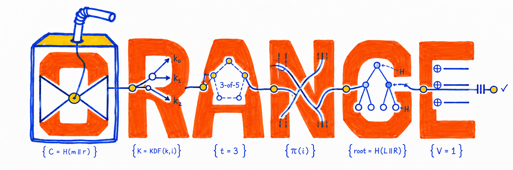

# Orange



**Orange is a language and toolchain for cryptography you can check.** You
write the mathematical specification, connect it to a fast implementation, say
exactly which properties you claim, and ship the native code together with the
evidence for each claim.

Orange is made for cryptographers, cryptologists, and cryptanalysts: people who
read mathematics for a living. Its aim is to be exact and beautiful at once, so
that Orange source reads like the definition in a standard or a paper, while
every step from that definition to machine code stays precise enough to check.

> [!IMPORTANT]
> Orange is **pre-alpha** and built by one person. Today the compiler checks
> and evaluates a small typed fragment of the language. It does not yet
> generate code, check proofs, or implement any cryptography, and nothing in
> this repository has been independently reviewed or formally verified.

## Why Orange exists

A serious cryptographic library carries several meanings at once: the
mathematics it is meant to compute, the code that runs on real machines, the
security properties it claims, and the evidence behind those claims. Today
those meanings live in different tools: a notation for the specification, C or
Rust or assembly for speed, a proof assistant for correctness, a separate
analyzer for constant-time behavior, and test vectors and build logs around the
outside. Each tool can be excellent. The trouble is at the crossings, where a
proof about one definition gets attached to a different binary, or a
source-level guarantee quietly fails to survive the compiler.

Orange aims to make those crossings part of the product:

- **One language, several semantic worlds.** Mathematical specifications,
  executable implementations, leakage-aware machine code, security games, and
  proofs live in one module system, each with semantics suited to its job.
- **Claims, not labels.** Instead of a single "verified" badge, every artifact
  carries narrowly worded claims (conformance, functional refinement, memory
  safety, leakage, compiler preservation, ABI agreement, and more), each with
  its own subject, assumptions, evidence, and outcome.
- **Evidence you can replay.** Proofs, certificates, and build records are
  machine-readable and content-addressed, so a release can be rechecked
  offline.
- **A small, published trusted base per claim.** Each claim names exactly which
  components it trusts, instead of inheriting one project-wide trust list.
- **Real native output.** The end goal is production native code with a stable
  C ABI, deterministic builds, and signed release provenance.

These are design directions, not current features. The
[Orange Book](docs/THE_ORANGE_BOOK.md) explains them in depth.

## A first look

This is Orange 2026 source that the current compiler accepts:

```orange
edition 2026;
module demo {
  spec answer() -> Int { 42 }
  spec negative() -> Int { -0x2a }
  spec mask() -> Word[8] { 0xff }
}
```

`Int` is the type of mathematical integers, with no overflow. `Word[8]` is an
unsigned 8-bit machine word that holds 0 through 255 and never wraps or
truncates silently. `orangec eval` checks the module and evaluates each
specification:

```console
$ orangec eval compiler/fixtures/typed-answer.or
demo::answer: Int = 42
demo::negative: Int = -42
demo::mask: Word[8] = 0xff
```

Out-of-range values are errors with stable codes and precise source spans. For
a file `byte.or` that declares `spec byte() -> Word[8] { 256 }` inside a module:

```console
$ orangec check byte.or
error[ORC0207]: literal is outside the range of `Word[8]`
 --> byte.or:3:28
  |
3 |   spec byte() -> Word[8] { 256 }
  |                            ^^^ expected a value from 0 through 255
  = note: fixed-width words do not truncate or wrap out-of-range integers
```

## What works today

| Area | Status |
| --- | --- |
| Source model, UTF-8 byte spans, stable diagnostic codes | Working |
| Deterministic lexer (`orangec lex`) | Working |
| Orange 2026 grammar: one edition, one module, `spec` and `impl` declarations | Working |
| Semantic checking for typed `spec` literals of type `Int` and `Word[8]` | Working |
| Typed Reference Core and reference evaluator (`orangec eval`) | Working, literals only |
| Expressions, operators, parameters, calls, control flow | Not yet |
| Typed `impl` bodies and refinement between `spec` and `impl` | Not yet |
| Proof checking, claim reports, evidence bundles | Proposed; decisions open (D-005, D-006, D-007); not built |
| Code generation, native targets, C ABI | Proposed; strategy under investigation (D-010, D-011, D-013); not built |
| Cryptography corpus (hashes, AEADs, signatures, KEMs) | Planned |
| Packages and releases | Planned; no release exists |

## Quick start

You need [rustup](https://rustup.rs). The repository pins Rust 1.96.1 in
[`rust-toolchain.toml`](rust-toolchain.toml), so rustup selects it
automatically. The compiler has no third-party dependencies.

```sh
git clone https://github.com/chasebryan/orange.git
cd orange

# Build and try the compiler
cargo run --manifest-path compiler/Cargo.toml -p orangec -- eval compiler/fixtures/typed-answer.or
cargo run --manifest-path compiler/Cargo.toml -p orangec -- check compiler/fixtures/hello.or
cargo run --manifest-path compiler/Cargo.toml -p orangec -- lex compiler/fixtures/hello.or

# Run the compiler test suite
cargo test --manifest-path compiler/Cargo.toml --workspace

# Run the local repository gate: policy checks and sandboxed compiler checks
scripts/ci/check-repository
```

The repository gate runs on Linux and needs a C compiler, Python 3, user
namespaces, and Landlock ABI 3 or newer; the [policy guide](policy/README.md)
explains the sandbox. Markdown lint, workflow audits, and link checks run only
in CI.

`orangec` reads a file path, or `-` for standard input:

```text
Usage: orangec [OPTIONS] <check|eval|lex> <FILE>...

Commands:
  check    Perform lexical, syntactic, and semantic validation
  eval     Reference-evaluate one source after complete validation
  lex      Print the deterministic token stream
```

The [compiler guide](compiler/README.md) covers the grammar, diagnostics, and
test corpora in detail.

## Roadmap

Orange is built in dependency order. Each stage adds permanent components to
the production compiler; there is no throwaway prototype.

| Stage | Delivers | Status |
| --- | --- | --- |
| S0 | Repository foundation: governance, CI, policy checks | Done |
| S1 | Compiler foundation: source model, spans, diagnostics, lexer, CLI | Done |
| S2 | Editioned grammar and bounded parser | Done |
| S3 | Name resolution, types, expressions, typed Core, reference evaluator | In progress: typed literals done |
| S4 | Proof and claim boundary | Research underway |
| S5 | Compiler IRs and one output path | Open |
| S6 | Memory, leakage, ABI, and native targets | Open |
| S7 | Cryptography corpus | Open |
| S8 | Packages, developer tools, and preview releases | Open |
| 1.0 | Stable release | Open |

Three of the ten gates are closed. That counts finished stages, not effort or
time remaining. The [roadmap](docs/ROADMAP.md) has the details, and the
[decision register](docs/DECISIONS.md) tracks every open design choice.

## Read more

- **[The Orange Book](docs/THE_ORANGE_BOOK.md)**: the reader's guide to why
  Orange exists, how it is designed, and what has been built. Start here.
- [Orange 2026 language specification](docs/LANGUAGE_2026.md) and
  [typed-literal semantics](docs/SEMANTICS_2026.md): the normative definition
  of what the compiler accepts today.
- [Compiler guide](compiler/README.md): commands, diagnostics, and tests.
- [Architecture](docs/ARCHITECTURE.md) and
  [assurance model](docs/ASSURANCE.md): the intended end state.
- [Roadmap](docs/ROADMAP.md), [decision register](docs/DECISIONS.md), and
  [project charter](docs/PROJECT_CHARTER.md): scope, sequence, and open
  questions.
- [Research and landscape](docs/RESEARCH.md): how Orange relates to existing
  verified-cryptography work.
- [Governance](GOVERNANCE.md) and
  [Orange Enhancement Proposals](docs/governance/oeps/README.md): how changes
  are decided.

## Repository layout

| Path | Contents |
| --- | --- |
| [`compiler/`](compiler/README.md) | The Rust workspace: the `orange-compiler` library and the `orangec` CLI |
| [`docs/`](docs/) | The Orange Book, language specification, architecture, assurance, roadmap, and decisions |
| [`research/decisions/`](research/decisions/) | Decision laboratories that compare design candidates |
| [`schemas/`](schemas/README.md) and [`conformance/`](conformance/foundation/README.md) | Provisional evidence schemas and their test fixtures |
| [`policy/`](policy/README.md) and [`tools/`](tools/) | Repository policy and the Python checks that enforce it |
| [`assets/brand/`](assets/brand/README.md) | Orange emblem, wordmark, and banners |

## Project status

- **Solo, pre-alpha.** One owner, Chase Bryan, designs, builds, and reviews
  Orange. Owner review is not independent review, and passing tests show only
  that the implemented slice behaves as tested.
- **No license yet.** An outbound license has not been chosen
  ([D-018](docs/DECISIONS.md#d-018--licenses)), so no right to use, copy, or
  redistribute is granted. For the same reason, outside pull requests can't be
  merged yet; issues with facts, sources, and questions are welcome. See
  [CONTRIBUTING.md](CONTRIBUTING.md).
- **Security reports stay private.** Use the process in
  [SECURITY.md](SECURITY.md), never a public issue.
- **Working name.** "Orange" is a working name until naming and trademark
  questions are settled. Other software, including an earlier systems
  language, already uses the name.
