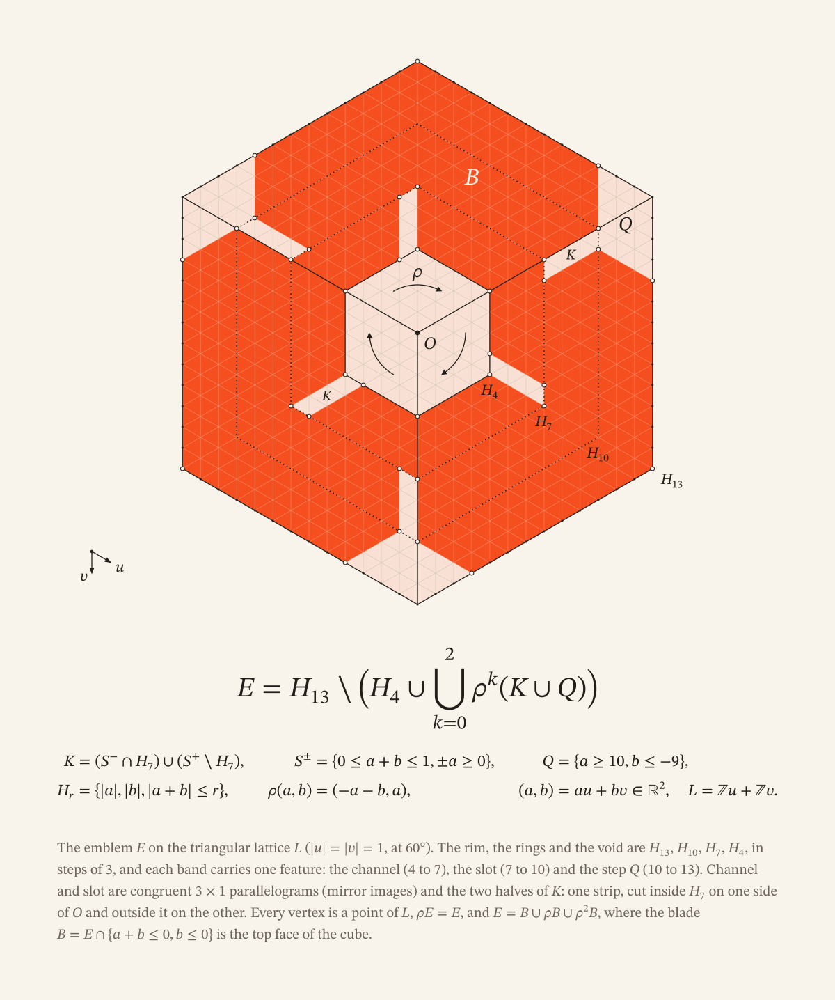

# The Orange identity


These files are the Orange emblem, wordmark, README banner and book covers,
drawn in September 2026 as the successor to the original emblem in
[`assets/brand/`](../brand/README.md). The idea is the same: a hexagonal cube
turning about a hollow centre, with a Y cut into it. What changed is the
precision. The new mark is exactly symmetric, every corner is a point of the
triangular lattice, and one short rule draws all of it.

## The emblem


The emblem is one blade and its two rotations by a third of a turn. Each blade
is one face of the cube. Every cut is one lattice cell wide. Each channel of
the Y and the notch on the opposite rim are the two halves of a single strip
across the mark, so the channels and the notches are one gesture rather than
two devices.



### The rule

Write a point of the plane as (a, b) = au + bv, with u = (√3/2, 1/2) and
v = (0, 1) in page coordinates (y pointing down) and a, b real. The lattice
L = ℤu + ℤv is the set of points with integer a and b. Then

```math
E = H_{13} \setminus \Bigl( H_4 \cup \bigcup_{k=0}^{2} \rho^k (K \cup Q) \Bigr)
```

where

```math
\begin{aligned}
H_r &= \lbrace\, |a|,\ |b|,\ |a+b| \le r \,\rbrace, &
\rho(a, b) &= (-a-b,\ a), \\
S^{\pm} &= \lbrace\, 0 \le a+b \le 1,\ \pm a \ge 0 \,\rbrace, &
K &= (S^- \cap H_7) \cup (S^+ \setminus H_7), \\
Q &= \lbrace\, a \ge 10,\ b \le -9 \,\rbrace .
\end{aligned}
```

Hᵣ is the hexagon of circumradius r about the fixed point O, and ρ is the
rotation by 2π/3 about O, clockwise on the page. K is a strip one cell wide,
cut inside H₇ on one side of O and outside it on the other. Q is the corner
step. E is meant up to boundary: the emblem is the closure of this set.

Every vertex of E lies on L and on one of ∂H₄, ∂H₇, ∂H₁₀ and ∂H₁₃. The radii
run in steps of three, and each band carries one feature: the channel (4 to 7),
the slot (7 to 10) and the step (10 to 13). The channel and the slot are
congruent 3 × 1 lattice parallelograms. E = B ∪ ρB ∪ ρ²B, where the blade
B = E ∩ {a + b ≤ 0, b ≤ 0} is the top face of the cube. In
`orange-emblem.svg` one lattice unit is 33.25 px and O sits at (512, 536.94),
so each of the 36 vertices can be checked by hand.

## Files

| File | Use |
| --- | --- |
| `orange-emblem.svg` | The primary emblem, in Orange, on any light or dark ground |
| `orange-emblem-mono.svg` | One colour; it takes the surrounding text colour (`currentColor`) |
| `orange-emblem-shaded.svg` | A secondary three-tone version that shows the cube's faces, for app icons and splash screens |
| `orange-emblem-construction.svg` | The construction sheet above |
| `orange-wordmark.svg` | ORANGE, in capitals drawn on the same lattice |
| `orange-lockup.svg` | The emblem and the wordmark together |
| `orange-readme-banner-light.svg`, `orange-readme-banner-dark.svg` | The README banner for GitHub's light and dark themes |
| `orange-readme-banner.svg` | The same banner with a mid-grey tagline that reads on either ground |
| `orange-book-cover.svg` | The cover of The Orange Book: the emblem in cream on a field of Orange |
| `orange-book-cover-construction.svg` | An alternative cover: the emblem over its construction, on cream |

Every file is vector, with its text converted to outlines, so it looks the same
everywhere and needs no fonts.

To show the right banner for each GitHub theme:

```html
<picture>
  <source media="(prefers-color-scheme: dark)" srcset="assets/identity/orange-readme-banner-dark.svg">
  <source media="(prefers-color-scheme: light)" srcset="assets/identity/orange-readme-banner-light.svg">
  
</picture>
```

## Colour

| Name | Value | Use |
| --- | --- | --- |
| Orange | `#F54F1F` | The emblem and the wordmark |
| Cream | `#F8F4EB` | Grounds, and the emblem reversed out of Orange |
| Ink | `#141210` | Type |
| Light face | `#FF8B3D` | The shaded emblem's top face |
| Deep face | `#BF3413` | The shaded emblem's right face |

## Use

- Keep clear space around the lockup of at least 6 emblem lattice units, about
  a quarter of the cap height.
- The lockup needs at least 160 px of width and the wordmark alone 100 px.
  Below that, use the emblem alone, which holds its shape down to 16 px.
- Scale the files uniformly. Do not redraw, stretch, rotate or recolour them
  beyond the colours above.
- Do not mirror the emblem. It turns clockwise, and its mirror image turns the
  other way.

## Typefaces

Titles and the tagline are set in Newsreader, mathematics in STIX Two Math,
and the source line `edition 2026;` in IBM Plex Mono. All three are licensed
under the SIL Open Font License 1.1. The files contain outlines of the glyphs
they use, not the fonts.

## Provenance and scope

Claude, an AI model made by Anthropic, drew these files in September 2026 at
the owner's request, starting from the original emblem in `assets/brand/`.
Every coordinate was computed by script from the rule above; no image generator
was used. The original assets in `assets/brand/` are unchanged.

Like those assets, these files are the working Orange identity for this
repository. They do not settle the project-name and trademark question or the
license, which remain open under D-017 and D-018 in the
[decision register](../../docs/DECISIONS.md).
