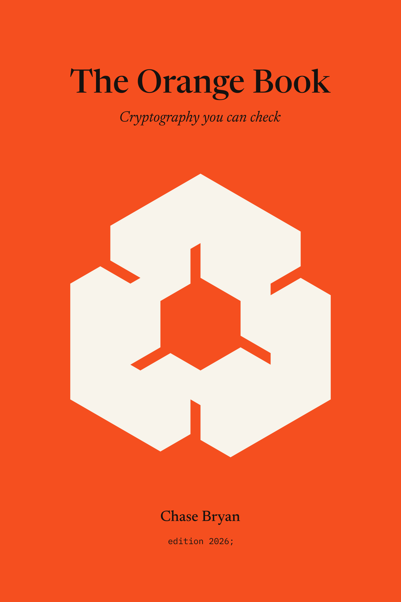

# The Orange Book



By Chase Bryan

Status: living pre-alpha reader guide

Snapshot: 2026-10-05

Manuscript version: 0.27

> The Orange Book explains why Orange exists, what it is intended to become,
> what has actually been built, and which questions remain open. It is not a
> normative language specification, proof, assurance report, license grant, or
> release claim.

## Contents

- [Preface](#preface)

Part I: Why Orange

- [Chapter 1: The Seams Are the System](#chapter-1-the-seams-are-the-system)
- [Chapter 2: Claims, Not Labels](#chapter-2-claims-not-labels)
- [Chapter 3: One Language, Several Semantic Worlds](#chapter-3-one-language-several-semantic-worlds)

Part II: Meaning and Trust

- [Chapter 4: From Surface Text to Meaning](#chapter-4-from-surface-text-to-meaning)
- [Chapter 5: Proof Search Is Not Proof Checking](#chapter-5-proof-search-is-not-proof-checking)
- [Chapter 6: Secrets Are a Semantic Concern](#chapter-6-secrets-are-a-semantic-concern)

Part III: Building the Language

- [Chapter 7: No Disposable Prototype](#chapter-7-no-disposable-prototype)
- [Chapter 8: Orange 2026: The Smallest Honest Slice](#chapter-8-orange-2026-the-smallest-honest-slice)
- [Chapter 9: From Core to Native Bytes](#chapter-9-from-core-to-native-bytes)
- [Chapter 10: The Foreign Boundary](#chapter-10-the-foreign-boundary)

Part IV: Cryptography in Practice

- [Chapter 11: Standards as Versioned Inputs](#chapter-11-standards-as-versioned-inputs)
- [Chapter 12: The Corpus as Acceptance Test](#chapter-12-the-corpus-as-acceptance-test)
- [Chapter 13: Interoperability and External Validation](#chapter-13-interoperability-and-external-validation)

Part V: Operating Orange

- [Chapter 14: Evidence That Survives the Build](#chapter-14-evidence-that-survives-the-build)
- [Chapter 15: Offline Replay and Trust Budgets](#chapter-15-offline-replay-and-trust-budgets)
- [Chapter 16: Solo Work Through Incremental Gates](#chapter-16-solo-work-through-incremental-gates)
- [Chapter 17: Releases, Updates, and Failure](#chapter-17-releases-updates-and-failure)

Appendices

- [Appendix A: Current Grammar and CLI](#appendix-a-current-grammar-and-cli)
- [Appendix B: Decision Ledger](#appendix-b-decision-ledger)
- [Appendix C: Claim Vocabulary](#appendix-c-claim-vocabulary)
- [Appendix D: Source Notes](#appendix-d-source-notes)

- [Manuscript map](#manuscript-map)
- [Sources and drafting disclosure](#sources-and-drafting-disclosure)

## Preface

Orange begins with an uncomfortable observation: high-assurance cryptography is
not one problem. It is a chain of problems whose boundaries are easy to hide.
A mathematical construction, an executable implementation, a proof, a compiler,
a test suite, a binary, and the machine that runs it can each be reasonable in
isolation while the claim connecting them remains unclear.

This book is the reader's guide to that chain. It is meant for cryptographic
implementers, verification engineers, cryptographers, standards authors,
library maintainers, integrators, auditors, and curious programmers who want to
understand the project without first reading every planning record. It will
explain the ideas in ordinary technical prose, show the permanent implementation
as it grows, and keep the boundary between aspiration and evidence visible.

Above all, Orange is written for people who read mathematics for a living:
cryptographers, cryptologists, and cryptanalysts. Its aim is to be exact and
beautiful at once. A specification should read like the clause of the standard
it transcribes, with the same words, the same rotations, and the same modular
additions, and every statement Orange makes about a piece of code should be as
precise as the mathematics behind it. That aim shapes the language and it
shapes this book. Where the prose is careful about a qualifier, it is because
the qualifier is where the truth lives.

That boundary matters because Orange is young. The repository is in solo,
pre-alpha compiler development. It has a production-lineage Rust compiler
foundation, a deterministic lexer, a bounded parser, structured diagnostics,
and a deliberately small Orange 2026 grammar. The accepted S3a slice adds
bounded semantic checking and reference evaluation for closed typed `spec`
literals. The S3b slice, implemented and awaiting the owner's acceptance of its
specification, extends them to pure functions over integers and 8- to 64-bit
words, the S3c slice, likewise implemented and in review, adds named
intermediate values and explicit conversions between those types, the S3d
slice adds fixed-length arrays, so that a cipher's whole state is one value,
the S3e slice adds loops over literal ranges, so that a standard's rounds are
one expression, and the S3f slice adds truth values, comparisons, Euclidean
division, and conditionals, so that a prime field and a key exchange can be
written as their standards write them, the S3g slice lets an index depend
on data, still proved in range, so that AES's S-box is a lookup, as FIPS 197
writes it, the S3h slice lets a program span several modules, so that
HMAC is written over SHA-256 by name, as RFC 2104 defines it, the S3i
slice puts a field in a type, so that X25519's ladder is written in the field
of 2^255 − 19 with no reduction in sight, as RFC 7748 writes it, the S3j
slice lets a round name its values inside the loop that runs it, so that a
round of SHA-256 names T1 and T2 where FIPS 180-4 does, the S3k slice adds
tuples, so that a loop carries SHA-256's eight working variables by name and
ChaCha20's quarter round gives its four words at once, the S3l slice
writes bytes as the standards print them, so that RFC 4231's key is "Jefe"
and SHA-256's padding is joined with `++`, the S3m slice lets one `spec`
stand for every length in a range, so that SHA-256 is written once for every
message from 1 through 119 bytes, the S3n slice reads and writes words in
the byte order a standard names, so that SHA-256 reads a block as sixteen
big-endian words in one conversion, the S3o slice lets one `spec` stand
for a list of types, so that exponentiation is written once for five prime
fields and SHA-256 and SHA-512 share one round, the S3p slice lets an
array hold 65,536 elements, so that RFC 8439's 375-byte and 265-byte vectors
are written as the RFC prints them, the S3q slice lets a module state its
known answers as tests beside its functions, so that RFC 8439's examples are
claims the program checks, and the S3r slice lets a shift or rotation take an
amount computed from data, so that RC6 and SHA-3 turn their words as their
designers write them. S3s adds tables of scalar rows, and S3t lets each finite
size instance compute its own exact modulus. None of them
adds typed
implementations, refinement, code generation, a standard library, a proof checker, package or release behavior,
or a verified cryptographic implementation. A passing test suite is
evidence about the implemented slice; it is not evidence that the eventual
language or compiler is sound.

The permanent source formatter now supplies one frontend tool: it lays out
parsed syntax while preserving token spellings and comment bytes and anchors.
It does not validate types or imports, accept the semantic proposals, or
complete the wider developer-tool and release stages.

The source documentation generator produces a standalone offline reference
for written declarations and an escaped source listing. Its scope is likewise
syntactic: resolved interfaces, ABI contracts and checked claim matrices must
come from the later compiler and proof paths.

The local witness replayer now decodes exact concrete values against a checked
Boolean function's parameters and evaluates that function for the supplied
arguments. `Falsified` and `HoldsForThisWitness` describe a single reference
execution. They are not a universal proof, an authoritative atomic claim or
solver-trust decision evidence.

The manuscript uses four kinds of statements:

- **Current** describes behavior or evidence present in the repository now.
- **Directed** describes an explicit project-owner decision that controls work.
- **Proposed** describes an architecture or policy recommended for a later
  decision gate.
- **Future** describes an intended capability whose design, implementation, or
  evidence is not complete.

The distinction is not decorative. A proposed architecture cannot become an
accepted one merely because a chapter speaks about it fluently. When this book
and a normative source disagree, the normative source, accepted Orange
Enhancement Proposal, and [decision register](DECISIONS.md) control. The book
must then be corrected.

The book has five parts. Part I explains why Orange exists and what kind of
language it is meant to be. Part II covers meaning and trust: semantics,
proofs, and secrets. Part III describes the compiler, from the permanent
foundation that exists today to native code and foreign interfaces. Part IV
turns to cryptography itself: standards, the corpus, and external validation.
Part V covers evidence, replay, the solo operating model, and releases. The
appendices collect the current grammar and command line, the decision ledger,
the claim vocabulary, and source notes. A cryptographer may prefer to read
Chapters 1 through 3, 6, 11, and 12 first; an implementer, Chapters 4 and 7
through 10; an auditor, Chapters 2, 14, 15, and 17.

The title **The Orange Book** and the name **Orange** are repository-local
working names. They do not assert trademark clearance or authorize publication
to a package registry, domain, or other public namespace. The manuscript is a
living part of the solo project, not a product release.

## Chapter 1: The Seams Are the System

Cryptographic software is asked to carry several different meanings at once.
It has a mathematical meaning: a function, construction, or protocol is being
described. It has an operational meaning: instructions execute on concrete
machines with finite words, memory, errors, and timing behavior. It has a
security meaning: an attacker is granted certain powers and a property is
claimed under stated assumptions. Finally, it has an evidentiary meaning: some
combination of proofs, certificates, tests, reviews, provenance, and build
records is supposed to justify what users are told.

Those meanings rarely live in one place today. A specification may be written
in a notation suited to mathematicians. A fast implementation may be C, Rust,
or assembly. Functional correctness may be argued in a proof assistant.
Constant-time behavior may be checked by a separate analysis. Game-based
security may use yet another formalism. Test vectors, compiler flags, linker
inputs, target features, and release attestations collect around the outside.

Each tool can be excellent. The difficulty is the crossings between them.

### Six questions for one artifact

Imagine receiving a native library that exports a cryptographic routine. A
serious account of that library should answer at least six questions:

1. What mathematical construction or protocol component is intended?
2. Which executable implementation is claimed to realize it?
3. Which properties are claimed, for which inputs, targets, and versions?
4. Which assumptions and leakage model limit each property?
5. Which proof object, checked certificate, test corpus, or external record
   supports each claim?
6. Which source, toolchain, dependencies, and invocation produced the shipped
   bytes?

It is possible to have good answers to several of these questions and no
reliable answer to the next one. A proof about a mathematical function does not
identify the binary loaded by an application. A correct implementation at one
intermediate representation does not establish that a later optimization kept
its behavior. Passing official vectors does not cover all inputs. Source-level
control-flow discipline does not automatically describe final machine-code
leakage. A reproducible build faithfully reproduces a bug just as readily as a
correct program.

The transition is therefore part of the claim. Serialization is not merely
plumbing when a theorem fingerprint can be attached to the wrong definition.
Foreign-function glue is not merely plumbing when buffer length, aliasing,
alignment, or error behavior can violate a proved precondition. The compiler is
not merely plumbing when the advertised property must survive to object bytes.
The release process is not merely plumbing when an attacker can replace either
the code or its evidence.

The seams are part of the system.

### The proposed vertical artifact

Orange's directed mission is to specify, implement, and verify cryptography.
The project's proposed answer to the seam problem is a claim-oriented language
and build graph. In the intended end state, a package connects standards
provenance, readable specifications, executable implementations, named target
and leakage models, checked transformations, native artifacts, foreign-interface
metadata, tests, and explicit assumptions.

The important word is *connects*. Orange is not useful merely because it can
place several kinds of text in one source file. A shared spelling is not a
semantic relationship. The system must preserve exact identities and record
which checked step supports each edge of the graph. Where a relationship has
not been established, the graph must say so.

This is why the long-term product is larger than a notation or compiler front
end. A language can make intent expressible, but an assurance claim also needs
semantics, checking rules, artifact identity, assumptions, and replay. A code
generator can produce fast bytes, but speed says nothing about whether those
bytes implement the named specification. A theorem prover can check a proof,
but the theorem may not be the property an integrator thinks it is.

Many architectural details of this vertical artifact remain proposed or under
investigation. The current Typed Reference Core for literal specifications
has no canonical encoding, proof identity, or refinement role and does not
select the complete semantic Core. Orange has also not selected its proof
foundation, proof format, solver policy, leakage baseline, native target
envelope, stable foreign boundary, package model, or flagship cryptography
corpus. This chapter describes the problem those choices must eventually solve;
it does not settle them.

### Claims, not labels

The word *verified* compresses too much. It can refer to well-formed syntax,
memory safety, functional refinement, standards conformance, termination,
constant-time behavior under a particular observation model, compiler
preservation, ABI correctness, game-based security, or simply the fact that
tests were run. These properties are related, but none is a universal substitute
for the others.

Suppose a routine passes every published vector for a standard. That is useful
conformance evidence for those cases. It is not a proof for every input, and it
does not establish memory safety. Suppose a proof establishes that a source
implementation refines a mathematical specification. That does not, by itself,
show that emitted machine code preserves the result or that its memory addresses
are independent of secret data. Suppose a binary is rebuilt byte for byte by a
second machine. That establishes a reproducibility fact, not cryptographic
correctness.

Orange therefore proposes to make the unit of assurance a scoped claim. A claim
should name its subject, property, model, target, assumptions, evidence, and
outcome. Different claims about one exported routine can have different states.
A conformance claim may be satisfied while a leakage claim is unresolved. A
platform may be unsupported even though a mathematical proof is valid. An
external validation can be recorded without being misrepresented as a theorem
checked by the Orange kernel.

The intended outcomes also need more precision than success and failure. A
claim can be satisfied, not satisfied, unresolved, or unsupported. A timeout is
not a proof failure, but it cannot become a proof success. An assumption is a
visible dependency, not evidence that proves itself. A neighboring
implementation's test result cannot silently migrate to the implementation
being shipped.

In the proposed design, this discipline would change the shape of a build.
Instead of producing a binary and then attaching a broad adjective, the build
would produce an artifact together with a graph of narrowly worded claims. Each
edge would name the authority that justifies it. Some authorities may be
machine-checked proofs. Some may be checked certificates or test runs. An owner
review may support only an explicitly scoped owner-audit or governance record;
it cannot impersonate a technical proof, external validation, certification, or
independent review. Identified external records retain their external scope and
authority. These differences would remain visible.

### Trust does not disappear

Formal methods can shrink and clarify trust, but they do not make trust vanish.
A small proof kernel is still software. The statement fed to it can be wrong.
The parser can construct the wrong syntax tree. A compiler model can omit an
instruction behavior. An assembler or linker can break the connection to final
bytes. A foreign caller can violate a buffer contract. A CPU, operating system,
or entropy source can behave outside the model. A release account can be
compromised.

Orange's intended response is to publish the trusted computing base for each
kind of claim and to keep it specific. The trusted base for a parser behavior
claim is not the same as the trusted base for a native constant-time claim. A
component appears because a claim actually depends on it, not because every
claim inherits one project-wide trust list.

Tests remain important inside this approach. They find regressions, exercise
error paths, compare implementations, and expose resource failures. They can
also provide the right basis for an empirical claim. The boundary is that a
test does not change its authority when a stronger proof is missing. Honest
evidence is useful evidence precisely because its limits are recorded.

### What exists now

The current Orange implementation is deliberately narrow. The permanent Rust
compiler lineage provides source identities and UTF-8 byte spans, deterministic
lexing, stable diagnostic codes, and the `orangec` command-line boundary. The
Orange 2026 parser recognizes exactly one edition declaration followed by one
module. Legacy empty `spec` and `impl` functions remain valid. The accepted
S3a slice adds closed typed-literal specifications, the S3b slice, whose
specification is in the owner's review, adds pure functions over integers and
machine words, the S3c slice, also in review, adds `let` bindings and
explicit `as` conversions, the S3d slice, also in review, adds fixed-length
arrays of those types, the S3e slice, also in review, adds loops over literal
ranges, indices proved in range, and updates of one element, the S3f
slice, also in review, adds `Bool`, comparisons, Euclidean division, and
conditionals, the S3g slice, also in review, lets an index depend on data
while still proving it in range, the S3h slice, also in review, lets a
module use other modules, each in its own file, and call their functions by
module name, the S3i slice, also in review, adds the integers modulo a
constant and names for types, the S3j slice, also in review, lets a loop's
step and each branch of a conditional begin with `let` bindings, the S3k
slice, also in review, adds tuples and tuple patterns, so that a function
gives several values and a loop carries several accumulators, the S3l
slice, also in review, adds byte strings, joins, and slices, so that a
program writes bytes as the standards print them, the S3m slice, also in
review, adds size parameters, so that one function stands for every length
in a range and is checked for each, the S3n slice, also in review, adds
byte orders, so that words are read from bytes, and written back, in one
conversion in the order a standard names, the S3o slice, also in review,
adds type parameters, so that one function stands for a list of types, such
as several prime fields or both of SHA-2's word widths, and is checked for
each, the S3p slice, also in review, lets arrays, array literals, and byte
strings hold up to 65,536 elements and lets `orangec eval` run under a larger
step budget, evaluate only the functions it names, and report the steps each
used, the S3q slice, also in review, adds known-answer tests and equality of
whole arrays and tuples, so that a module states what its functions must give
and `orangec test` checks it, and the S3r slice, also in review, lets the
amount of a shift or rotation be computed from data, with the value the
arithmetic gives at every amount.

PR #9 merged that bounded pre-alpha implementation and its normative records as
commit `6c0bd3021cf2df603e08808e4660724ca1e2b2a5`. The larger S3 milestone and
the D-004 architecture decision remain open. D-003 candidate PF-01 is accepted
through OEP-0004 at exact revision
`a82a5cec2ee4359dc2fe66171f17c93146747333`.

```orange
edition 2026;
module demo {
  spec identity() {}
  impl rounds() {}
  spec answer() -> Int { 42 }
  spec mask() -> Word[8] { 0xff }
  spec ch(x: Word[32], y: Word[32], z: Word[32]) -> Word[32] {
    (x & y) ^ (~x & z)
  }
  spec sample() -> Word[32] { ch(0x510e_527f, 0x9b05_688c, 0x1f83_d9ab) }
}
```

`orangec check` lexes, parses, and semantically validates that source. Function
names must be unique within separate `spec` and `impl` namespaces, so the two
kinds may share a spelling while a same-kind duplicate fails. Semantic type
acceptance is contextual and exact: `Int` denotes mathematical signed integers,
and `Word[n]`, for n of 8, 16, 32, or 64, denotes the integers modulo 2^n. A
word literal must already fit, with no wrapping, truncation, or coercion; word
arithmetic wraps because that is what arithmetic modulo 2^n means.

Successful typed specifications lower in source order to a bounded Typed
Reference Core. Running `orangec eval FILE` prints:

```text
demo::answer: Int = 42
demo::mask: Word[8] = 0xff
demo::sample: Word[32] = 0x1f85c98c
```

Empty declarations still have no type, value, or execution meaning, and a
function with parameters runs only when it is called. The Core is noncanonical
and carries no proof identity or relationship between a `spec` and an `impl`.
The fragment has no recursion, general failure values, proof terms, targets,
ABI rules, or code generation.
The reserved words `game`, `proof`, and `claim` still introduce no usable
constructs.

These absences are not disguised as a miniature finished language. The parser,
semantic analyzer, Core constructor, and evaluator are bounded components at
their intended incremental boundaries. Parse success means the source has the
recorded syntactic shape. Semantic and evaluation success means only that a
typed specification satisfied the rules and produced the displayed value. Neither result means the source is correct cryptography, a valid proof,
safe machine code, a refining implementation, or a generally executable
program.

This is the project's no-disposable-prototype rule in practice. Orange grows by
adding permanent components with explicit interfaces, deterministic behavior,
diagnostics, tests, and migration rules. The rule does not make the early system
large. It makes each small piece honest about where it belongs and what it can
show.

### The reader's habit

The central habit of this book is to ask one question whenever a strong sentence
appears: *what connects that sentence to the exact artifact under discussion?*

Sometimes the answer will be a directed project decision. Sometimes it will be
a normative rule and a conformance test. Later, it may be a proof term, a checked
translation certificate, an object-code inspection record, a standards source,
or an external validation with exact scope. Often, during pre-alpha development,
the answer will be that the connection is proposed or does not exist yet.

That last answer is not a defeat. An explicit gap is a tractable engineering
fact. A hidden gap is an unbounded trust claim.

Orange's first thesis is therefore simple: the path from intent to shipped bytes
must be part of the product. Its second thesis follows immediately: every claim
about that path must say what it covers, what supports it, and where it stops.

## Chapter 2: Claims, Not Labels

Security engineering has a vocabulary problem. Words such as *safe*,
*conformant*, *constant-time*, and *verified* sound like properties, but in
ordinary use they often behave like stickers. They are placed on a library,
package, or release after some valuable work has been done, then asked to carry
far more meaning than that work established.

The sticker may begin with a true statement. A team proved a functional theorem.
A laboratory ran a validation program. A test suite passed. A memory-safe
language rejected certain errors. A timing experiment found no signal. Trouble
begins when the subject, conditions, and evidence disappear, leaving only the
adjective. The reader can no longer tell whether *verified* means a parser
accepted the source, a proof kernel checked a theorem, a compiler preserved the
theorem, or a reviewer inspected the final object. The strongest available
interpretation tends to win, even when it is the least justified.

Orange's [proposed public assurance model](ASSURANCE.md#3-claim-model) replaces
that compression with a set of separately named claims.
[D-005](DECISIONS.md#d-005--public-assurance-model) has not yet been accepted,
so the complete claim taxonomy and product record format remain proposals. The
underlying discipline, however, already controls how the project describes its
present compiler: say exactly what happened, bind the statement to an artifact
and revision, name the evidence, and state what the result does not show.

### A claim is a proposition with coordinates

Consider the sentence, “the implementation is constant-time.” Before it can be
checked, almost every important noun in that sentence needs coordinates:

- Which implementation, source revision, exported symbol, and artifact bytes?
- For which inputs, preconditions, target, instruction set, and calling
  environment?
- What can the observer see: branches, addresses, instruction classes, timing,
  caches, speculation, power, or something else?
- Which compiler and transformations connect the reviewed program to the
  executed bytes?
- Which assumptions exclude behavior outside the model?
- What evidence supports the proposition, and which authority checked it?

Without those coordinates, the sentence may express an intention or a useful
engineering convention, but it does not yet identify one reviewable assurance
claim. Adding coordinates does not guarantee truth. It makes truth and error
arguable against the same subject.

This is why an Orange claim is intended to carry exact wording rather than only
a category name. The category says what kind of question is being asked. The
wording says which proposition must be supported. Its subject identifies a
definition, export, control set, or artifact by revision and digest. Its context
identifies such things as the language edition, toolchain, cryptographic
profile, target profile, and leakage model. Assumptions and exclusions mark the
edge of the statement instead of hiding beyond it.

The digest matters because names drift. A function called `encrypt` can change
while retaining its spelling. A standard profile can acquire errata. A compiler
flag can alter the generated object without altering the source. Human-friendly
names remain essential for reading, but a claim about exact bytes needs an
identity that changes when the bytes do.

### One artifact, several answers

A native cryptographic export does not have one assurance status. It presents a
matrix of questions whose answers may differ:

| Question | Example scope | Possible evidence |
| --- | --- | --- |
| Does it match a standard? | Named edition, profile, and input domain | Vectors, differential tests, or external validation |
| Does it realize a specification? | Named implementation and mathematical definition | Refinement proof or checked certificate |
| Does it execute safely? | Named faults, preconditions, and runtime model | Type argument, proof, analysis, and adversarial tests |
| Does it terminate? | Named inputs and environment assumptions | Variant or termination proof |
| What does it leak? | Named source or target observation model | Noninterference proof, translation evidence, and measurements |
| Did compilation preserve a property? | Exact passes, toolchain, target, and final bytes | Pass theorem or translation-validation certificate |
| Does the foreign boundary agree? | Named ABI, layout, alias, length, and error rules | Contract proof and adversarial caller tests |
| Was sensitive state erased? | Named object, lifecycle point, target, and architectural model | Erasure proof, binary analysis, and scoped measurements |
| Does it meet a security theorem? | Named game, advantage bound, and assumptions | Checked reduction or recorded external proof |
| What did empirical testing observe? | Named corpus, method, environment, and implementation/target | Vectors, differential tests, fuzzing, timing, or interoperability records |

The rows are related, but they are not interchangeable. Standard vectors can
expose a wrong answer without proving all answers. A source refinement theorem
can establish functional meaning without describing cache observations. A
leakage argument can hold for a faulty algorithm. An ABI wrapper can be
memory-safe while passing bytes in the wrong order. A security reduction can be
mathematically sound while the shipped implementation fails to realize the
construction it studies.

The purpose of a claim matrix is not to demand that every row be satisfied
before any work is useful. It is to prevent a result in one row from silently
coloring all the others. A small library with three narrow, well-supported
claims is easier to reason about than one broadly advertised as verified.

### Four outcomes, not one light

The proposed model gives each claim one of four outcomes: `satisfied`,
`not_satisfied`, `unresolved`, or `unsupported`. These are not grades on a
single scale.

`satisfied` means the claim has a basis that its policy permits and that basis
is valid for the recorded subject. It does not mean adjacent claims are
satisfied. A successful vector claim, for example, remains a successful vector
claim rather than becoming functional correctness for all inputs.

`not_satisfied` means the proposition was checked far enough to obtain a
negative result. A counterexample, failed certificate, mismatched vector, or
violated contract may justify this outcome. It is evidence about the claim, not
merely the absence of success.

`unresolved` means the system cannot presently decide the proposition. Proof
search may time out. A solver may return `unknown`. Required evidence may be
incomplete. An open design question may prevent the claim from being stated
precisely. Turning any of these conditions into success would confuse a search
procedure with an authority.

`unsupported` means the selected toolchain, model, target, operating mode, or
project capability does not offer the claim. This outcome is especially
important for honest partial systems. Orange currently has no native target
model, leakage semantics, ABI, proof checker, or release path. Claims that
depend on those facilities are not weakly satisfied by the frontend test suite;
they are outside the implemented support envelope.

The distinction affects action. A `not_satisfied` claim points toward a defect
or a false proposition. An `unresolved` claim may need more evidence, a smaller
statement, or a better procedure. An `unsupported` claim may require an explicit
product decision and new machinery. Collapsing all three into a red light loses
that information. Collapsing them into “not yet verified” is gentler wording but
has the same defect.

### Evidence keeps its authority

Evidence is useful because of what it can support, not because it can be counted.
A thousand passing tests do not add up to a proof for every input. A proof does
not become an external validation because two people read it. A reproducible
build does not become a correctness result because the reproduced bytes are
stable. Each basis retains its type and authority.

Orange's proposed records distinguish kernel proofs, checked certificates,
external proofs, test runs, audits, external validations, and assumptions. A
claim policy determines which kinds may close which claim and which complete
set is mandatory. More than one basis can support the same proposition: a
refinement claim may have a checked proof, tests that catch regressions, and an
external review record. A favorable optional basis cannot mask a failed,
expired, unavailable, missing, or mismatched mandatory basis, context, trust
component, or composition edge. Those bases can reinforce confidence and
diagnose different failures without pretending to be the same thing.

This separation is most visible around automation. A solver is excellent at
searching for proofs or counterexamples. If a proof-required claim depends on a
small checker, the solver's success must arrive as a certificate or proof object
that the checker accepts. A timeout is unresolved, not false. An unsupported
certificate step is unresolved, not true. The search tool can be large and
heuristic while the acceptance path remains small and explicit.

External authority also stays external. A laboratory certificate, audit, or
standards-body record may be exactly the right basis for a validation claim.
Recording its issuer, scope, subject, dates, and digest makes it auditable; it
does not transform that record into an Orange theorem. Conversely, a local
theorem does not impersonate a certification program with legal and procedural
requirements that the project has not performed.

### Assumptions are dependencies

Every serious claim rests on something it does not prove internally. A logical
kernel is trusted to implement its rules. A target model is assumed to describe
the processor behavior relevant to the property. A caller may be required to
provide nonoverlapping buffers of sufficient length. An operating system may be
trusted to supply pages with stated behavior. A cryptographic theorem may rely
on a named hardness assumption.

Calling these items assumptions should not make them vague. The useful form is
specific: what is assumed, why the claim needs it, and what happens if it is
false. This turns an assumption into a visible dependency in the claim closure.
Different claims over the same artifact can then have different trust bases. A
mathematical equality need not inherit the operating system assumptions of a
runtime erasure claim. A vector result need not pretend that a proof kernel was
involved.

Exclusions serve a related purpose. They state tempting interpretations that
the wording does not cover. A source-level address-trace result might exclude
power analysis, speculation, and the behavior of the final machine code. A
repository-control result might exclude compiler correctness and release
readiness. Exclusions do not repair an overbroad claim, but they help keep a
narrow one from expanding as it travels.

### Composition must be earned

The most important claims usually cross boundaries. To say that shipped object
bytes implement a specification, it is not enough to have a source proof and an
object file. The graph needs justified edges through lowering, optimization,
assembly, linking, and the foreign boundary as applicable. Each edge may use a
general preservation theorem, a per-artifact checked certificate, or another
explicit authority allowed by policy.

This creates a useful failure rule: a claim does not jump over a missing edge.
If source code refines a specification but the backend has no preservation
argument, the source claim remains available and the final-byte claim remains
unresolved or unsupported. Nothing has been taken away from the source theorem.
The system has simply declined to lend it to a different subject.

Composition also runs in the other direction. A broad release statement should
be decomposable into the narrower propositions on which it depends. A reader
ought to be able to ask why a property is reported, inspect the basis, enumerate
its assumptions, and follow identities back to exact artifacts. The eventual
Orange trust report is intended to print that closure, not a marketing summary.

### The provisional record and the current compiler

The repository contains a provisional Gate 0
[claim-record schema](../schemas/gate0/claim-record-v0.1.schema.json) and
[conformance fixtures](../conformance/foundation/README.md). They demonstrate
structural ideas: an exact subject, identified or inapplicable contexts,
assumptions, exclusions, evidence references, a typed basis, an outcome, and a
review policy. They are explicitly non-product records with synthetic fixture
data. D-005 remains proposed, so these files are not the stable public claim
format and do not authorize future syntax or assurance behavior.

The current compiler makes much smaller observations. At its recorded revisions,
the tests show that the implemented lexer, parser, S3a semantic analyzer, Typed
Reference Core constructor, evaluator, diagnostics, resource limits, and CLI
behave as asserted by those tests. The normative documents define the accepted
surface and typed-literal behavior. The conformance index maps each current S3a
rule to named executable evidence, while warning that a named test need not
exhaust its rule.

That is worthwhile evidence for a pre-alpha compiler slice. It is not a claim
that Orange has proved its semantics, verified the Rust implementation, produced
cryptography, preserved a property into machine code, met a leakage model,
passed independent review, or created a release. The honest statement is longer
than “verified,” but it is also more useful: a reader can see what is present,
what remains open, and which next result would actually change the picture.

The discipline of claims is therefore not paperwork added after verification.
It is the interface between technical work and public meaning. A proof, test,
build, review, and certificate become safer to reuse when none is forced to
masquerade as the others. Orange's ambition is not to make every box green. It
is to make every box precise enough that green, red, unresolved, and unsupported
each tell the truth.

## Chapter 3: One Language, Several Semantic Worlds

A cryptographer who writes down a hash function is doing several different
things at once, usually without naming them. There is a mathematical object: a
function from byte strings to fixed-length digests, defined by compression
rounds over words of a stated width. There is an algorithm that computes it,
with buffers, padding, and a streaming state. There may be a fast variant that
uses vector registers or a dedicated instruction. There is a security notion,
such as collision resistance, stated as a game against an adversary. And there
are arguments connecting these, some mechanical and some mathematical.

Each of those things has a natural way of being true. A mathematical function
is true when it is total and well defined. A stateful algorithm is correct when
every execution computes the function and never reads outside its buffers. A
vectorized routine is correct when its lanes, shuffles, and target features do
what the scalar algorithm does. A game is meaningful when its probabilities and
oracles are defined, and a reduction is sound when its advantage bound follows.
These are different kinds of meaning. Orange's language design begins by
refusing to pretend otherwise.

### Why a standalone language

The first question is whether Orange should be a language at all. Excellent
alternatives exist. A project could orchestrate existing tools: write the
specification in Cryptol or hacspec, the fast code in Jasmin, the security
argument in EasyCrypt, and connect them with a manifest. It could embed a
cryptographic domain-specific language inside a proof assistant such as F\*,
Lean, or Rocq, inheriting a mature kernel and library. It could accept a subset
of Rust with proof annotations and meet implementers where they already work.

Orange examined those options as candidates rather than dismissing them. The
[product-form decision](DECISIONS.md#d-003--product-form) compared four forms
against eight hard gates and accepted candidate PF-01, a standalone
domain-specific language with its own editioned semantics and canonical Core
formats. That decision is **current and accepted**: the project owner accepted
it on 2026-07-26 and
[OEP-0004](governance/oeps/OEP-0004-standalone-orange-product-form.md) binds it
to exact revision `a82a5cec2ee4359dc2fe66171f17c93146747333`.

The reasoning is the seam argument from Chapter 1 turned on the language
itself. If the surface language belongs to a host prover, every upgrade of that
prover becomes an upgrade of Orange's meaning, and ordinary cryptographic code
inherits proof-engine conventions it does not need. If Orange is only an
orchestrator, the manifest quietly becomes the real language, and the crossings
between tools remain the least specified part of the system. Interoperability
with those systems is still valuable, and later chapters return to it. But
delegating the language would preserve exactly the gaps Orange exists to close.

Accepting a standalone form does not accept a semantics. PF-01 says Orange owns
its meaning; it does not say what that meaning is. The rest of this chapter
describes the leading proposal and the discipline that any answer must obey.

### Five roles, one module system

The [project charter](PROJECT_CHARTER.md#4-product-thesis) proposes one module
system with several deliberately separated declaration roles:

- **Specification** for total mathematical functions and relations;
- **Implementation** for terminating, memory-safe executable procedures with
  contracts and typed failure;
- **Machine implementation** for explicit layout, vector operations, target
  intrinsics, and leakage-aware control flow;
- **Game** for probabilistic programs, adversary interfaces, and
  reduction-based security claims; and
- **Proof** for refinements, invariants, equivalences, noninterference, and
  security reductions.

The roles share names and types where sharing is sound. A specification of
SHA-256 and its implementation can live side by side in one module and be read
together. What the roles must not share is a single set of operational rules.
Mathematical integers do not overflow; machine words do. A pure function cannot
sample randomness; a game must. A proof may mention ghost values that must
never influence a running program. A vector intrinsic has meaning only on a
target that provides it.

A **claim** is conspicuously absent from that list. In the
[semantic-strata proposal](SEMANTIC_STRATA_DECISION_SUITE.md#31-source-declaration-roles),
a claim is a record that binds a subject, a relation, assumptions, and evidence.
It is not a sixth semantic world with its own execution rules. Foreign imports
and deliberate declassification are similar: they are cross-cutting boundaries
that must be declared, not annotations that switch off a stratum's rules.

All of this is **proposed**. The role map is a hypothesis under
[D-004](DECISIONS.md#d-004--semantic-strata), which remains open.

### The crossings are the design

If the roles were the whole story, Orange would be five small languages sharing
a parser. The interesting part is how meaning moves between them. The D-004
suite names fourteen required crossings, from `SR-01` through `SR-14`, and
requires every candidate architecture to express each one with a versioned
name, domain, codomain, definedness conditions, obligations, identity inputs,
trust role, failure behavior, and prohibited reverse inferences.

A few of those crossings show the shape of the problem:

| Crossing | What it must preserve |
| --- | --- |
| Specification source to Spec Core | Either one checked pure subject or failure without creating an identity |
| Implementation to specification | A named refinement obligation between explicit subjects, never inferred from equal names |
| Implementation to CT IR | Runtime meaning through ghost erasure and lowering, or invalidation of the dependent result |
| Game to game | A named reduction that preserves its exact bound expression |
| Claim record to subject and evidence | No upgrade of a failed, missing, unknown, or unsupported relation |

The suite also fixes a short list of invariants that every candidate must
respect. They read almost like a style guide for honesty:

- a shared source name never creates a refinement relation;
- sampling cannot enter a specification or implementation through a pure
  embedding;
- state, memory, target, and ambient effects cannot enter the pure Core;
- proof or ghost data cannot affect runtime behavior;
- machine-level source cannot bypass the checked low-level boundary;
- byte or format conversion is not semantic preservation; and
- a failed crossing invalidates its dependent result rather than producing a
  generic lower assurance level.

The first rule deserves attention because it is so tempting to break. A module
that contains `spec sha256` and `impl sha256` looks, to a human reader, as if
the second implements the first. Orange's proposal is that the matching names
mean nothing semantically. Refinement is a relation that must be stated,
checked, and bound to exact subjects. The reader's intuition is a good reason
to write the refinement obligation; it is not evidence that the obligation
holds.

### Five candidate architectures

The research recommendation behind the charter is a role-oriented family of
formally related Cores: a Spec Core, an Impl Core, and a Game Core as the
normative program semantics; CT IR and Machine IR as compilation boundaries;
and a proof-evidence interface that names judgments without choosing a proof
calculus. A small **Shared Pure** subset would let deterministic definitions be
reused across roles without importing state or randomness.

That recommendation is not a selection. The
[D-004 suite](SEMANTIC_STRATA_DECISION_SUITE.md#2-candidate-architectures)
compares it symmetrically with four alternatives:

| ID | Candidate | Idea |
| --- | --- | --- |
| ST-REL | Role-oriented related family | Separate Cores per role with named, checked relations |
| ST-UNI | Universal Core | One effect-parameterized calculus for everything |
| ST-DUAL | Pure/effect pair | One pure Core plus one general effect Core |
| ST-MIRROR | Five mirrored Cores | One Core per source role, joined by crossings |
| ST-HOST | Host-delegated strata | Local deterministic semantics; games, proofs, or machine meaning delegated to external systems |

The universal Core deserves a fair hearing. One calculus is easier to specify
once, easier to implement once, and avoids a family of translations. The
concern recorded in the decision register is that mathematical totality,
probabilistic games, stateful memory, target leakage, and concrete instructions
make conflicting demands, and that hiding those conflicts inside effect
annotations could make the semantics less honest rather than more. That is a
hypothesis to test against five fixed cases: SHA-like word code, mutable-buffer
refinement, a secret-dependent rejection, one vector intrinsic, and one game
with a reduction. The first run of all 25 candidate-case units, on 2026-09-28,
passed every case for ST-REL, ST-UNI, ST-DUAL, and ST-MIRROR and failed every
case for ST-HOST, whose delegated hosts depend on the open D-006 and D-011
decisions. The cases could not tell the four passing candidates apart, so the
run selects nothing. Its results are contributor-produced and unreviewed. A
second suite adds two cases, semantic evolution and relabeling within one
authority, and five cost measures. Its run, on the same day, closed all seven
cases for the same four candidates, and under the isolation-first rule, which
the owner chose knowing which candidate each offered rule would leave, only
ST-REL remains. That result is also contributor-produced and unreviewed. It is
not a recommendation, and D-004 remains proposed.

### What exists in the language now

The current language shows only the outline of this design. Orange 2026
reserves `spec` and `impl` as declaration keywords and gives them separate
namespaces, so a module may contain both `spec rounds` and `impl rounds`
without a conflict while two `spec rounds` declarations are an error. The words
`game`, `proof`, and `claim` are reserved and introduce nothing. Only typed
specifications have meaning: pure `spec` functions over `Int`, `Bool`,
`Word[8]` through `Word[64]`, the integers modulo a constant, fixed-length
arrays of them, and tuples of those, built from
literals, parameters, calls, operators, comparisons, `let` bindings, at the
start of a body, a loop's step, or a branch, tuple patterns, explicit
conversions, array literals, byte strings, tuples, indices, including indices
keyed by data, selections by position, joins, slices, bounded loops, updates,
and conditionals. A `spec` may declare sizes, each ranging over a finite
set of integers, and then stands for one function for each of their values,
with its array lengths and loop bounds written from them. An `impl` body must
still be empty. A
program may span several modules, one per file: a module names the modules it
uses at its head and calls their functions by module name, as in
`sha256::compress(h, block)`, and nothing is imported into its scope. A
`type` declaration names a type, such as the field of X25519, for the rest of
its module.

Even that small surface already follows the chapter's rules. `Int` and each
word width are distinct types, and a value moves between them only through a
written `as`, never implicitly. A same-named
`spec` and `impl` have no relation. Nothing in the Typed Reference Core
pretends to be a Spec Core, and the Core records no claim. The expression,
binding, array, loop, condition, lookup, module, modular, block, tuple, byte, size, byte-order, type-parameter, length, test, and amount slices were built to fit inside every candidate's
specification stratum: they are pure, total, and deterministic, so the strata decision can
place them without changing a line of source.

### Beauty as a constraint

Orange is written for cryptographers, cryptologists, and cryptanalysts, people
who read mathematics for a living. That audience sets a high bar for how the
language should look. A specification written in Orange ought to read like the
definition in a good paper: rotations where the standard rotates, addition
modulo a word size where the standard adds modulo a word size, and nothing else
in the way. The separation of worlds is what makes that possible. When the
specification stratum only has to be mathematics, it can look like
mathematics. The mess of buffers, targets, and timing belongs to the strata
built to carry it, where it can be stated precisely instead of leaking into
every definition.

The goal, then, is not five languages bolted together. It is one language
whose parts are honest about the kind of truth they express, so that the
places where those truths meet can be written down, checked, and read.

## Chapter 4: From Surface Text to Meaning

Source code is text before it is anything else, and text is easy to
misunderstand. The characters on the screen are not the bytes in the file, the
bytes are not the tokens, the tokens are not the program's structure, and the
structure is not its meaning. A compiler for high-assurance cryptography has to
keep each of those steps explicit, because each one is a place where two tools,
or two readers, can disagree about what was written.

This chapter follows one small Orange program from bytes to value. Everything
in the walk-through is **current**: it describes what the `orangec` compiler in
this repository does today, under the normative
[lexical and grammar specification](LANGUAGE_2026.md), the accepted
[typed-literal semantics](SEMANTICS_2026.md), and the
[pure expression specification](EXPRESSIONS_2026.md) now in the owner's
review. The last part of the chapter
turns to what the complete semantic Core is meant to become, which remains
open.

### Bytes with an identity

An Orange 2026 source must be valid UTF-8 and at most 16 MiB. Before any
lexing, the compiler gives the source an identity and treats every later
position as a half-open byte range `[start, end)` into that source. Line and
column numbers are computed for people, with one-based columns counted in
Unicode scalar values, but the permanent coordinates are bytes.

That choice is small and deliberate. Byte spans are unambiguous across editors,
operating systems, and normalization forms. A line feed, a carriage-return line
feed, and a bare carriage return each count as exactly one logical line ending,
so a file edited on two systems does not report two different line numbers for
the same error. Only four characters are whitespace: tab, line feed, carriage
return, and space. A non-breaking space is an error, not an invisible
separator. A reviewer who sees two identical-looking programs should not have
to wonder whether one contains a character that changes where a token ends.

### Tokens

Lexing turns bytes into a deterministic sequence of tokens, each carrying its
exact span. `orangec lex` prints that sequence:

```text
78..85   KW_EDITION   "edition"
86..90   INTEGER      "2026"
90..91   SEMICOLON    ";"
92..98   KW_MODULE    "module"
99..103  IDENTIFIER   "demo"
```

The Orange 2026 lexer recognizes ASCII identifiers, seven reserved words,
decimal, binary, and hexadecimal integers with single underscores between
digits, line-bounded strings with a fixed escape set, hex strings of digit
pairs, nested block comments, and a fixed inventory of punctuation, matched
longest first so that `<<<` is one rotation token rather than a shift and a
comparison. It reserves more than the grammar uses: several punctuation
tokens have no grammatical role yet, and strings had none until the byte
slice made them arrays of bytes. Reservation is a promise about spelling,
not about meaning.

The lexer is also bounded. It retains at most 262,144 non-trivia tokens and
emits at most 100 ordinary diagnostics before one suppression diagnostic. A
lexically invalid source is never parsed. That rule keeps error reports honest:
a malformed integer should produce a lexical diagnostic, not a cascade of
confusing parse errors downstream of a token that should never have existed.

### Structure

Parsing checks that the tokens have one of a small number of shapes. The
parser reads them in order and never backtracks: one token of lookahead decides
almost everything, and a second is consulted only in a few places, such as
telling a call from a name and a literal's sign from negation. The one longer
look is at `if` before `(`, `-`, `[`, the word `as`, or the word `with`
followed by `[`, where the parser scans ahead, without
backtracking, to see whether a brace group followed by `else` makes it a
conditional. A source is exactly one edition
declaration, `edition 2026;`, followed by exactly one module. A module begins
with its `use` declarations, each naming one module it uses, then its `type`
declarations, each naming one type, and then contains `spec` and `impl`
declarations. An `impl` has an empty parameter list and an
empty body. A `spec` body may be empty, or the `spec` may declare parameters
and a result type and contain `let` bindings and then exactly one expression.
A loop's step and each branch of a conditional have the same shape: bindings,
if any, and then a value. A binding or a loop's accumulator names one value or,
with a tuple pattern, each element of a tuple.

Parsing produces a syntax tree that records spelling and source structure
only. It is easy to overlook what that excludes. The grammar accepts any
identifier as a type, any integer as a width, and any expression as a
modulus, so `spec x() -> Word[12] { 1 }`, `spec y() -> Banana { 7 }`, and
`spec z() -> Mod[q] { 0 }` all parse. The parser also accepts two
declarations with the same name, because deciding whether names collide is not
a syntactic question. Parse success means only that the source has a recorded
shape. It is not validation, and the specification forbids describing it as
such.

### Meaning

Semantic analysis is where the program first acquires meaning, and in the
current slices that meaning is intentionally small. The analyzer works through
the syntax tree in source order and does five things:

1. It checks that every declaration key is unique, where a key is the pair of
   declaration kind and exact name. `spec mix` and `impl mix` are different
   keys; two `spec mix` declarations are a duplicate.
2. It resolves each typed specification's signature. The scalar types are
   `Int` and `Bool`, with no width; `Word[8]`, `Word[16]`, `Word[32]`, and
   `Word[64]`, with the width written as a plain decimal token; and `Mod[m]`,
   whose modulus is a constant. `T^n` is an array of any of them, and a name
   declared by `type` stands for its type. `Word[08]`, `Word[0x8]`,
   `Word[12]`, `Int[8]`, and every other form are errors. Parameter names must
   be distinct within one function.
3. It checks each body against its declared result type, from the root of the
   expression down. Every expression has an expected type and nothing is
   inferred: a literal takes the type expected of it and must fit, a name must
   be a parameter of that type, a call must name a typed `spec` whose result is
   that type, and an operator must be defined on it. Literals are decoded
   exactly, in base 2, 10, or 16. An index is the one expression whose type
   comes from what it contains: it is checked as the word type of its first
   name, call, conversion, or element, or as an `Int` when that is not a
   word, and it must be proved to select an element.
4. It checks that the call graph is acyclic, so that every accepted program
   terminates.
5. If no semantic diagnostic occurred, it constructs the Typed Reference Core.

A program of several modules is analyzed one module at a time. Before any
module is checked, the analyzer examines the uses: each must name a module of
the program, and no module may use itself, use another twice, or be reached
again along a cycle of uses. It then checks each module once, after every
module it uses, against the declarations of those modules only. A call
`sha256::compress(h, m)` is resolved in the module `sha256` and then checked
like any other call, and because uses have no cycle, the call graph of the
whole program is acyclic when each module's own is.

Within a module, types come before functions. The analyzer first evaluates
every modulus the module writes, once each: a modulus is built from integer
literals with `+`, `-`, `*`, `<<`, and parentheses, and must lie from 2
through 2^521 − 1. It then resolves the `type` declarations in source order,
each against the names declared before it, and only then the signatures. A
declared name is another spelling of its type, so a module that writes `F`
and one that writes `Mod[(1 << 255) - 19]` mean the same thing, and the name
stays in its module.

The types are where the language's character first shows. `Int` is the
type of mathematical integers. It has no maximum and does not overflow. The
analyzer does limit the size of a literal's magnitude to 16,384 significant
bits, but that limit is a boundary on source representation, not a secret width
for `Int`. `Word[8]` is the type of eight-bit machine words, with values from
0 through 255, and the wider words follow the same rule at their own widths. A
negative word literal is an error even when it is `-0`, and 256 is an error
rather than zero:

```text
error[ORC0207]: literal is outside the range of `Word[8]`
 --> compiler/fixtures/s3a/invalid-word-range.or:5:31
  |
5 |   spec decimal() -> Word[8] { 256 }
  |                               ^^^ expected a value from 0 through 255
  = note: fixed-width words do not truncate or wrap out-of-range integers
```

No literal wraps, truncates, saturates, or coerces, and no value ever changes
type. Every mature cryptographic codebase has at least one bug that came from
an integer silently changing its width or sign. Orange's first semantic rule is
that such changes are never silent.

Arithmetic on words is the one place where values do wrap, and there wrapping
is the meaning rather than an accident. `Word[32]` is not a bounded integer
that overflows; it is the ring of integers modulo 2^32, the structure SHA-256
and ChaCha20 are written over. `a + b` on words is addition in that ring, `~a`
is the complement, and `a <<< 7` is the rotation: the word operations of
FIPS 180-4 and RFC 8439, defined the way those documents define them. `Int` has the operators that make sense
for mathematical integers, `+`, `-`, `*`, and negation, with their exact
meaning. The bitwise operators are not defined on `Int`, and using one is an
error rather than a guess about representation.

`Mod[m]` generalizes the word types to any modulus a standard names.
`Mod[(1 << 255) - 19]` is the field of X25519 and `Mod[3329]` the ring of
ML-KEM. Its values are the least residues 0 through m − 1, its `+`, `-`, and
`*` reduce by themselves, and its `/` multiplies by an inverse and gives 0
when there is none. It has no order and no bits, because a residue's order
and bits are those of a chosen representative, and a program that means the
least residue says so with `as`.

### The Typed Reference Core

A successful analysis produces one Typed Reference Core module. Its grammar is
short enough to quote whole:

```text
core_module    = module_name core_function* ;
core_function  = function_id function_name parameter_type* core_type body ;
core_type      = Int | Word8 | Word16 | Word32 | Word64 ;
body           = core_node+ ;
core_node      = core_type node_kind ;
node_kind      = literal value
               | parameter index
               | call function_id argument_count
               | unary (negate | complement)
               | binary (add | subtract | multiply | and | or | xor)
               | shift (shl | shr | rotl | rotr) amount ;
```

Only typed specifications enter the Core. Empty `spec` and `impl` declarations
remain valid syntax but gain no type, value, or execution meaning, and they do
not appear. Functions keep source order and receive contiguous identifiers from
zero. The Core of a program of several modules lists the functions of the
modules used first and the root's last, each recording its module, with
identifiers contiguous across the whole program. A literal written `-0x2a` becomes the mathematical integer −42, and every
spelling of negative zero becomes zero. A body is stored in postorder, each
node after its operands and each call after its arguments, and every node
carries its type. Parentheses leave no trace, because grouping is already the
shape of the tree. A residue type records its modulus exactly, and a `type`
declaration leaves no trace either: every declared name is replaced by the
type it names. A loop records the bindings of its step, and a conditional
those of its branches, each with the point in the step's or branch's
postorder where its value ends, so the evaluator knows when a name takes its
value. A tuple pattern is one binding of a tuple type, and a read of one of
its names reads the whole and selects the element, so tuples add only two
nodes to the Core: one that builds a tuple and one that selects from it. A
byte string is an array literal like any other, and the byte slice adds three
nodes: one joins two arrays, one takes a run of elements, and one replaces a
run, the last two with their bounds as `Int` operands. Each instance of a
sized function is one Core function that records its sizes, and a size's
name in an expression is an `Int` literal, so sizes add no node at all. A
conversion in a byte order is one node that records its operand's type and
its order. Each instance of a function with type parameters is likewise one
Core function that records its types, each as its position in its list, and
every type in its body is concrete, so type parameters add no node either.

The Core is bounded in the same spirit as the lexer and parser: at most
262,144 Core nodes, 1,048,576 semantic events, and 100 ordinary semantic
diagnostics. Exhausting a budget fails closed with a stable resource
diagnostic. There is no partial Core. An error in one declaration does not
authorize the others; the analyzer may keep going to report more errors, but
the result is unsuccessful.

Evaluation is the last step. `orangec eval` visits each of the root module's
Core functions in order and prints one line for each function without
parameters, decimal for `Int`
and residues, which print as their least residues, and fixed-width lowercase
hexadecimal for words, from two digits for `Word[8]`
to sixteen for `Word[64]`:

```text
demo::answer: Int = 42
demo::negative: Int = -42
demo::mask: Word[8] = 0xff
```

That output format is precise down to its bytes, including the absence of a
plus sign and the leading zero in `0x0a`. The precision is not decoration. A
reference evaluator is useful only if another implementation can be compared
against it byte for byte.

Evaluation is bounded too. Every function of one program shares a budget of
1,048,576 steps, the call stack holds at most 256 frames, and no `Int` result
may exceed 16,384 significant bits. An acyclic program can still ask for an
exponential amount of work, a function that calls another twice, twenty levels
deep; the step budget is what stops it, with a diagnostic rather than a hang.
The reader chooses a larger budget, up to 1,073,741,824 steps, with
`orangec eval --steps`, and a program's steps are the same wherever it runs,
so `--stats` reports them as exactly as the values.

### What the Core is not

The Typed Reference Core is an internal compiler boundary. It has no canonical
encoding, serialization, content digest, theorem fingerprint, proof identity,
refinement relation, or promise that identifiers stay stable across
revisions. It is noncanonical on purpose. Freezing an encoding before the
semantic strata are decided would make a proof-bearing choice by accident,
which is exactly the kind of hidden decision the project forbids.

The **proposed** end state is a family of canonical Cores: a Spec Core for pure
mathematics, an Impl Core for stateful procedures with contracts and typed
failure, a Game Core for probabilistic experiments, and a Proof IR checked by
a small authoritative checker. A canonical Core would have a deterministic
encoding, so that two tools, or two revisions, can agree on exactly which
definition a theorem is about. The
[architecture](ARCHITECTURE.md#4-core-semantic-family) describes those
proposals in detail; [D-004](DECISIONS.md#d-004--semantic-strata) decides their
number and relationships.

### The next steps of meaning

The eighteen current slices complete bounded parts of the roadmap's S3 stage:
literals first, then pure expressions with parameters, calls, and operators
over integers and words, then `let` bindings and explicit conversions, then
fixed-length arrays, then loops over literal ranges with indices proved in
range, then truth values, comparisons, Euclidean division, and conditionals,
then indices keyed by data, proved in range from their types, then programs
of several modules, each checked once, after the modules it uses, then the
integers modulo a constant, with names for types, then `let` bindings inside
a loop's step and a branch, then tuples, so that a loop carries several
values, then byte strings, joins, and slices at bounds proved in range,
then size parameters, so that one function serves every length in a range
and is checked once for each, then byte orders, so that words are read from
bytes and written back in the order a standard names, then type parameters,
so that one function serves a list of fields or word widths and is checked
once for each, then arrays of up to 65,536 elements, so that a standard's long
vectors are written whole, then known-answer tests and equality of whole
arrays and tuples, so that a standard's examples are claims inside the
program, then shift and rotation amounts computed from data, each with the
value the arithmetic gives.
The rest of S3 adds the remaining substance of a language: records with named
fields, functions generic over any modulus rather than a listed few, and
explicit failure
semantics,
together with one conformance case per normative rule. Each addition follows the same
pattern as the slices before it: a normative rule, a diagnostic for
every way to break it, a bound on the work it can cause, and a reference result
that can be printed and compared.

Meaning is where Orange's promises start to cost something. A lexer can be
made deterministic with care. A semantics has to be right about arithmetic,
about failure, and about what a name refers to, and every later proof inherits
whatever it gets wrong. That is why the first semantic slice is small, and why
each later slice is meant to be small enough to state completely.

## Chapter 5: Proof Search Is Not Proof Checking

Modern verification tools are astonishingly good at finding proofs. SAT
solvers settle bit-level equivalences over millions of clauses. SMT solvers
discharge the routine arithmetic side conditions that once filled pages of
hand-written lemmas. Tactic languages turn a two-line user hint into a large
derivation. For a language that wants cryptographers to state and prove real
properties without becoming full-time proof engineers, that automation is
indispensable.

It is also the wrong thing to trust. A search procedure is large, heuristic,
fast-moving, and optimized for finding answers rather than for being right
about them. The question Orange asks is not whether automation should be used.
It is where authority lives once automation has done its work.

### Two jobs, two sizes

Finding a proof and checking a proof are different jobs with different natural
sizes. Search explores a vast space with clever strategies, caches, and
heuristics; its code grows as it gets better. Checking confirms that a
completed derivation follows the rules of a fixed logic; its code can stay
small, because it never has to be clever.

The project's charter turns that asymmetry into a principle: *soundness before
automation*. Solvers are search engines. Their answer is accepted only through a
checked certificate or through an explicitly disclosed external-trust claim.
The [research analysis](RESEARCH.md#43-the-solver-should-search-not-legislate)
states the same idea more bluntly: the solver should search, not legislate.

F\* is a useful point of comparison because it is both successful and candid.
Its SMT automation removes a great deal of routine proof burden, and its
documentation is clear that the combination of F\* and Z3 is trusted for those
results. That is a legitimate design with a known trusted base. Lean and Rocq
take the other path: tactics may do anything they like, but the final proof
term is checked by a small kernel. Orange's **proposal** is to follow the second
path for claims that require proof, while treating any exception as a visible,
named part of the trusted base rather than a silent convenience.

### The proposed checker

The [architecture](ARCHITECTURE.md#22-orange-check) describes an authoritative
offline checker, `orange-check`, with a deliberately austere feature list. It
has no network access, no package resolution, no tactics, no plugins, and no
code generation. Its behavior is deterministic and resource bounded. It
supports one explicit set of format versions, and it can print every axiom and
trusted model in a claim's closure.

The checker would read **Orange Proof IR**, a stable evidence language of fully
elaborated terms with explicit universe and type arguments, references by
theorem fingerprint, and no tactic syntax. The proposed requirements read like
a security specification because they are one: canonical deterministic
encoding, streaming and bounded validation, stable rejection of malformed
input, no unknown fields in a security-critical version, no cyclic or
exponential expansion, and theorem fingerprints that include definitions,
axioms, semantics edition, and relevant target model.

That last requirement matters more than it first appears. A theorem about
`sha256` is only useful if it is about the `sha256` being shipped. A
fingerprint that changes whenever the definition, axioms, semantic edition, or
target model changes is what keeps a proof from quietly migrating to a
different subject.

[D-007](DECISIONS.md#d-007--orange-owned-proof-format-and-checker) proposes that
Orange own this proof format and checker rather than making a host prover's
compiled environment the permanent public artifact. The register is plain about
the risk: a custom kernel is a major soundness and schedule risk, and its logic
must be smaller than the surface language. The recommended mitigation is to
specify the checker in a proof assistant, prove it sound there, distribute an
extracted authoritative checker, and maintain an implementation-diverse checker
in safe Rust for differential testing. Because both would come from the same
owner, the second checker is described as implementation-diverse, never as
independent.

### Choosing a foundation

The logic that the checker implements has to be defined and proved sound in
something. [D-006](DECISIONS.md#d-006--proof-foundation) compares two
candidates, Rocq and Lean 4, and selects neither. Rocq brings the closest
existing ecosystem of verified compilers, cryptographic synthesis, and
extraction. Lean 4 brings an integrated implementation, kernel, and tooling
model. The register treats both strengths as hypotheses to measure, not reasons
to preselect a winner.

The [proof-foundation suite](PROOF_FOUNDATION_DECISION_SUITE.md) asks each
candidate to do the same concrete work: define and check a proposed Core
fragment, mechanize progress and preservation plus a leakage lemma, validate a
canonical serialization, produce and replay an LRAT-backed bit-vector proof,
distribute the checker on supported hosts, and survive the same seeded
maintenance tasks. The draft defines 14 candidate-case runs. None has been
executed. D-006 is marked **investigate**, and no proof toolchain is admitted.

### What counts as a checked answer

Automation produces many kinds of output, and only some of them should be able
to close a claim. The [proposed automation portfolio](ARCHITECTURE.md#7-proof-automation)
sorts them:

- **Bit-vector and finite equivalence** goes through verified bit-blasting to
  SAT, with an LRAT-family certificate required for a claim-closing success.
  Counterexamples are decoded back into source values so that a failure is
  something a cryptographer can read.
- **Ring and field identities, modular reasoning, and ranges** use
  kernel-checked reflective procedures, which compute inside the logic and
  therefore need no external trust.
- **Supported SMT fragments** use proof-producing solvers with a ratified
  certificate format such as Alethe, checked before acceptance.
- **Quantified and inductive properties** use explicit induction and user
  lemmas.
- **External proofs** from EasyCrypt or SSProve remain labeled external until
  their evidence is reconstructed in Orange's own format.

Everything else is search. A timeout, an `unknown`, resource exhaustion,
missing proof output, or a certificate that fails to check leaves the claim
**unresolved**, with the precise reason recorded. Developer profiles may
display a solver's unchecked opinion, but that opinion cannot satisfy a claim
or be cached under a status that suggests it did.

### Three policies for solver trust

How strict should that rule be? [D-009](DECISIONS.md#d-009--solver-trust) frames
the choice as three candidates, compared symmetrically in the
[solver-trust suite](SOLVER_TRUST_DECISION_SUITE.md):

| ID | Policy | Where authority lives |
| --- | --- | --- |
| SP-01 | Checked-artifact portfolio | An accepted certificate or Orange proof term |
| SP-02 | Kernel-only reconstruction | Only a kernel-accepted Orange proof term |
| SP-03 | Direct trusted-solver authority | An exact admitted solver, version, and fragment, listed in the logical trusted base |

SP-03 is not a strawman. Some organizations deliberately trust a particular
solver version for a narrow fragment because the alternative is unaffordable.
What the suite forbids is the confusion of categories: a direct solver result
may never be presented as a checked certificate or kernel proof. The frozen
matrix has 24 candidate-case runs across eight cases; none has been executed,
and no policy is selected.

### Caching without laundering

Proof replay is expensive, so real systems cache. A cache is also a place where
an old answer can quietly survive a change that should have invalidated it. The
proposed cache key for a proof result therefore includes the normalized
obligation, imported theorem fingerprints, source and core-semantics editions,
checker and decision-procedure versions, and the target and leakage policy
where relevant. A separate search cache may key on the solver binary, its
arguments, seed, and limits, but the certificate it hopes to find cannot be
part of the key for the result being searched for. The command-line tools are
meant to explain which component invalidated a cached proof, because an
unexplained cache miss teaches nothing and an unexplained hit should worry
everyone.

### Where things stand

Today Orange has no proof syntax, no Proof IR, no checker, and no admitted
solver. The word `proof` is reserved and does nothing. The current compiler's
semantic analyzer and evaluator are engineering trust dependencies. No logical
checker exists, so they are not outside any trusted base by virtue of being
checked, and their test results are implementation evidence, not proofs.

That emptiness is a feature of the order of work, not an oversight. Proof
components are gated on decisions that are still open, and the proof-neutral
frontend has been built first because it does not depend on them. When proofs
do arrive, one principle is already directed: search wherever it helps, and
accept a solver's answer only through a checked certificate or an explicitly
disclosed external-trust claim. Which checker and which solver policy carry
that authority remain open under D-006, D-007, and D-009.

## Chapter 6: Secrets Are a Semantic Concern

Side channels are the part of cryptographic engineering that most resists
being written down. A routine can compute exactly the right answer and still
betray its key through the time it takes, the cache lines it touches, or the
branch it chooses. Engineers have developed good habits in response: avoid
secret-dependent branches, avoid secret-dependent table lookups, prefer
arithmetic masks to conditionals. In most languages those habits live in
comments, code review, and the memory of whoever wrote the routine.

Orange's charter takes the opposite position in one short sentence: *secrets
are a semantic concern*. Secrecy labels are meant to affect typing, permitted
control flow and addresses, leakage traces, diagnostics, and review of the
foreign interface. They are not comments. This chapter describes what that
would mean and why the details are still open.

### What "constant time" actually says

The phrase *constant time* is itself a label of the kind Chapter 2 warned
about. Literally, it is false for almost all real code, which takes different
amounts of time on different machines and different days. What engineers mean
is narrower and more useful: what an attacker can observe does not depend on
the secret.

That can be made precise as **two-run noninterference**. Take two executions
with the same public inputs and possibly different secret inputs. Record what
an observer could see in each: the sequence of branch decisions, the memory
addresses accessed, and so on. The program satisfies the property if the two
observation traces are always equal. A difference in the secret produces no
difference the observer can detect.

The definition immediately raises the question the label hides: *what does the
observer see?* The answer is a model, and different models make different
claims. Orange's [assurance model](ASSURANCE.md#41-baseline-model) proposes a
baseline observation trace containing at least:

- branch decisions and targets;
- memory addresses, widths, and access classes;
- indirect call and return targets;
- traps, exceptions, and termination; and
- use of instructions classified as variable-latency on the target.

A claim under that model names its public-input relation and any permitted
declassification. It says nothing about power consumption, electromagnetic
emanation, faults, speculation, or unspecified microarchitectural behavior.
Those are excluded unless a separate profile models them.

### Versioned policies instead of a Boolean

Because the observation model is part of the claim, Orange proposes to replace
a single `constant_time` flag with versioned leakage policies. The
[architecture](ARCHITECTURE.md#45-ct-ir) sketches a family:

| Policy | What it constrains |
| --- | --- |
| `ct-architectural-v1` | Branches, call targets, memory addresses and widths, traps, and termination are secret-independent |
| `ct-variable-latency-v1` | Additionally keeps secret operands away from instructions the target profile classifies as variable-latency |
| `ct-speculative-v1` | Uses a named speculative-execution model or a proved hardening transformation |

Later profiles could tie claims to documented hardware modes such as
data-independent timing. Masked implementations, power, electromagnetic
emanation, and fault resistance would each need their own semantics, target
assumptions, and evidence. None extends the baseline by implication. A reader
who sees `ct-architectural-v1` satisfied learns exactly that, and nothing about
Spectre.

### Secrecy in the type system

For those claims to be checkable, secrecy has to be visible to the compiler.
The proposal is for public and secret to be semantic labels on values and
types. A branch on a secret value, or an array index computed from one, would
be a type error in a claim-bearing kernel rather than a lint. Secret values
would be non-copy by default, so every duplicate is explicit and tracked.
Formatting and debug output would refuse to print them. The foreign-interface
contract would record which arguments carry secrets.

Deliberate release of secret-derived information is sometimes necessary. A MAC
comparison eventually reveals whether the tag matched; a rejection-sampling
loop reveals how many attempts it took. The proposal is that every such release
names a declassification policy, visible in the claim graph, rather than an
annotation that switches the checker off. The difference is between a program
that says "this bit is intentionally public, under this policy" and one that
says "trust me here."

Erasure follows the same discipline. An `erase` obligation, or a zeroization
claim, concerns architecturally modeled storage and the copies the compiler
itself creates. It does not promise physical destruction, cache clearing, or
resistance to remanence unless a stronger target policy says so.

### A selection, two ways

Consider choosing between two words, `x` and `y`, according to a secret bit
`b`. The obvious code branches: if `b` is one, return `x`, otherwise return
`y`. Under the baseline observation model the branch decision is part of the
trace, so two runs that differ only in `b` produce different traces. The
property fails, and a type system that knows `b` is secret can reject the
branch where it is written.

The familiar alternative computes a mask. Negating the bit in w-bit
two's-complement arithmetic, that is modulo 2^w, gives either all ones or all
zeros, and the result is `(x AND mask) OR (y AND
NOT mask)`. Every run performs the same operations on the same addresses, the
traces agree, and the property holds at the source. This is code cryptographers
already write by hand. Orange's contribution would be to check it, and to
record that the check covered this function, under this model, at this layer,
and nothing further. The next section explains why the last clause matters.

### Why the source is not the binary

A routine can be perfectly constant-time as written and leak once compiled. An
optimizer may turn a carefully masked selection back into a branch, because a
branch is faster and, as far as ordinary semantics is concerned, equivalent.
Research on a modified CompCert showed that preserving cryptographic
constant-time is a distinct compiler proof, not a free consequence of ordinary
semantic preservation.

So a leakage claim about shipped bytes needs more than a source-level argument.
The [proposed evidence stack](ASSURANCE.md#43-evidence-stack) for a target
leakage claim runs through seven layers: source or CT IR noninterference;
pass-by-pass leakage preservation or checked translation validation;
correspondence between final object bytes and the accepted final semantics;
target instruction classification and ABI assumptions; binary static
inspection; empirical timing tests on named hardware as defense in depth; and
specialist laboratory work for release profiles that require it. While that
last kind of work is unavailable, those stronger profiles remain `unsupported`
rather than blocking everything else.

The proposed CT IR is the intermediate language built for this job. It is
first-order, monomorphized, fixed-width, and free of undefined behavior, and it
carries secret and public domains alongside an executable leakage trace. It is
where the compiler would check that its own transformations did not introduce
a leak.

### A lookup, two ways

Tables raise the same question as branches. FIPS 197 defines AES's SubBytes as
a lookup: each byte of the state selects one of the 256 entries of the S-box.
Written directly, the lookup reads memory at an address that depends on the
state, and so on the key. Under the baseline observation model that address
is part of the trace, and on a machine with a cache it is part of the time as
well. Table-driven AES was broken this way in practice: Bernstein's 2005
cache-timing attack, and the cache attacks of Osvik, Shamir, and Tromer,
recovered AES keys from the cache behavior of its table lookups.

The constant-time alternative reads every entry. For each position j of the
table it compares j with the index, turns the comparison into a mask, and
accumulates the entry under that mask, so every run touches all 256 entries in
the same order and the addresses no longer depend on the secret. The price is
256 reads for one lookup. Bitsliced implementations go further and compute the
S-box as a circuit of Boolean operations, with no table at all.

Orange 2026 states the first form, because it is the form the standard
states: since the [lookup slice](#tables-keyed-by-data), a specification may
write `s[a[i]]`. That is the right place for it. A lookup in a specification
is a function from a table and a position to an element. It has no addresses,
so it has no trace, and a specification that had to write the scan would ask
every reviewer to recognize SubBytes inside it. Which form a machine should
run is this chapter's question, and it belongs to the implementation and
target strata. There, as proposed above, an index computed from a secret
would be a type error in a claim-bearing kernel, unless the lookup is lowered
to a scan of the whole table and the claim says so. Until those strata exist
Orange claims neither: a lookup
in an Orange specification says which value results, never how a machine
would find it.

### Testing finds; it does not prove

Statistical timing tools such as `dudect` run code on real hardware and look
for input-dependent timing. They can find leaks that the formal model in use
does not capture, which makes them valuable. But the absence of a detected signal is
not evidence of absence. A clean timing run is recorded as a test result about
a named corpus, method, and machine. It does not become a noninterference proof
because it came back clean, and it does not cover a different target.

Cryptanalysts will recognize the asymmetry. A distinguisher that succeeds is a
result. A distinguisher that fails is, at most, a data point about that
distinguisher.

### Where things stand

The leakage baseline is [D-012](DECISIONS.md#d-012--baseline-leakage-claim),
marked **investigate**. Its acceptance evidence includes a formal trace
semantics, a target instruction-classification process, positive and negative
examples, and a preservation plan through final bytes. The initial target
envelope is [D-011](DECISIONS.md#d-011--initial-native-target-envelope),
**proposed** as x86-64 Linux and AArch64 Linux, possibly only one of them if
solo capacity requires it.

The current compiler has no secrecy labels, no leakage semantics, no target
model, and no code generation. It therefore makes no constant-time claim of any
kind, and any such claim is outside its support envelope, which the claim model
would record as `unsupported`. Its language can now state a lookup keyed by
data, and so by a secret, and it neither rejects such a lookup nor claims
anything about how one would run. What exists is the commitment that when Orange
does say something about leakage, it will say which observer, which layer,
which target, and which evidence, and it will say nothing more.

## Chapter 7: No Disposable Prototype

Most languages begin with a prototype. Someone writes a quick interpreter to
see whether an idea feels right, then a second, better implementation replaces
it once the design settles. For many projects that is exactly right. It is
cheap, it teaches quickly, and the prototype's shortcuts never matter because
nobody relies on it.

Orange rejects that path on purpose. [D-002](DECISIONS.md#d-002--no-disposable-prototype)
is a **directed** decision from the project owner: build the end product
through permanent, production-lineage components. There is no
prototype-to-rewrite phase and no minimum viable product that postpones the
core assurance claim. This chapter explains why a project about evidence makes
that choice, what it costs, and what it does not mean.

### Why prototypes are dangerous here

A prototype's defining property is that its internal decisions do not matter.
For an assurance-oriented toolchain, that property is the problem. Evidence
attaches to exact artifacts. A test run, a conformance result, or eventually a
proof says something about a particular implementation at a particular
revision. If that implementation is a prototype destined to be replaced, the
evidence goes with it, and the replacement starts with none.

Worse, prototypes tend not to die cleanly. Their conventions leak into the
successor: an error format that became familiar, a numeric shortcut that tests
came to rely on, a parse that was "temporarily" permissive. In an ordinary
product such residue is an annoyance. In a toolchain whose job is to say
precisely what was checked, residue is an undocumented semantic decision.

There is also a subtler risk. A prototype makes design choices by being
written. Once a syntax works in the prototype, it acquires momentum that has
nothing to do with whether it was the right choice. Orange's
[contribution rules](../CONTRIBUTING.md#solo-development-scope) name this
directly: do not add syntax or architecture selected merely by implementing it
first.

### What the doctrine requires

The [project charter](PROJECT_CHARTER.md#7-engineering-doctrine-build-the-end-product-directly)
turns D-002 into eight working rules. Paraphrased, they say:

1. Normative semantics precede convenience syntax and optimization.
2. Every committed component occupies its intended final boundary, with
   production error handling, deterministic output, tests, and versioned
   formats.
3. Early algorithms are permanent conformance fixtures, not demonstrations.
4. Automation may propose proofs; a proof-required claim closes only with
   replayable evidence accepted by the checker.
5. A backend cannot inherit a source property by assertion.
6. Performance work starts with the IR and cost model and stays subordinate to
   semantics and evidence.
7. Unimplemented claims fail closed.
8. No phase may create a second informal language inside build scripts,
   macros, or backend annotations.

The last rule is easy to underestimate. Many verification pipelines end up
with an unofficial language in their glue: a shell script that decides which
proof applies to which file, a macro convention that encodes a precondition, a
naming pattern that tells a tool what to trust. That glue has semantics, but
nobody specified them. Orange's rule is that anything with meaning belongs in
the language or in a checked record, not in the scaffolding around it.

### Small is not the same as temporary

The doctrine does not require the early system to be large. It requires each
small piece to be permanent. The current compiler shows what that looks like in
practice.

The first slice, under [D-024](DECISIONS.md#d-024--initial-compiler-foundation),
contained only source identities, byte spans, a deterministic lexer, structured
diagnostics, and the `orangec` command-line boundary. That is a tiny amount of
language. But each piece was built as the permanent version of itself:

- **Diagnostics have stable codes.** Lexical errors are `ORC0001` through
  `ORC0008`, parse errors `ORC0101` through `ORC0107`, semantic errors
  `ORC0201` through `ORC0210`, and evaluation resource exhaustion `ORC0301`.
  A code, once assigned, keeps its meaning, so tests, documentation, and users
  can refer to it.
- **Every phase is bounded.** Tokens, syntax nodes, parser events, Core nodes,
  semantic events, evaluation steps, and diagnostics each have a fixed ceiling,
  and exhausting one produces a stable resource diagnostic rather than a hang
  or a crash. Hostile input is a design case from the first commit.
- **Output is deterministic.** For the same bytes, edition, and compiler
  revision, the token stream, syntax tree, diagnostics, and evaluation output
  are identical, byte for byte.
- **The compiler has no third-party dependencies.** It uses the pinned Rust
  toolchain and the standard library only, so its trusted build inputs are
  short and explicit.
- **Public API boundaries are tested as boundaries.** The library's
  documentation tests include compile-fail examples showing, for instance,
  that a caller cannot rewrite a parse result or forge the type of an
  evaluated value after the fact.

The typed-literal slice showed what permanence means when a language grows.
S3a did not replace the S2 parser. It extended the same grammar with one new
tail for `spec` declarations, kept legacy empty `spec` and `impl`
declarations syntactically valid, and kept every earlier diagnostic code. Where
it did change behavior, it said so: same-kind duplicate names, which S2's
`check` accepted, now fail semantic checking with `ORC0201`, and OEP-0003
records that as a migration. The S2 conformance runner still runs beside the S3a runner. Where S3a
deliberately declined to extend the language, it said so in the grammar: a
typed `impl` is a syntax error, not a silently ignored annotation, because
implementation semantics have not been decided.

None of that makes the compiler impressive. It makes it extensible without
apology. When expressions arrive, they arrive in the same lexer, the same
parser, the same diagnostic system, and the same bounded analyzer, and the
evidence for the earlier slices still describes the code that runs.

### Research is not a parallel product

Some decisions cannot be made by argument alone. Choosing between a universal
Core and a family of related Cores, or between Rocq and Lean as a proof
foundation, benefits from running the candidates against the same cases. Orange
calls those experiments decision laboratories, and they live under
`research/decisions/` and in the compiler's integration tests.

D-002 is careful about their status. A decision case is research evidence, not
an unreviewed parallel implementation. The losing candidate never becomes a
second product, and the winning candidate's case graduates into the permanent
test suite rather than shipping as-is. The laboratories are instruments for
making a choice, not early versions of the thing chosen.

### What the doctrine costs

The costs are real, and the project does not pretend otherwise. Building
permanent components means writing error handling, budgets, and tests for
features that are still tiny. It means the language grows slower in breadth
than a prototype would, and that a reader browsing the repository finds a
great deal of rigor around a small amount of syntax.

The compensation is that nothing has to be thrown away and nothing has to be
re-earned. A diagnostic introduced in the first slice is still correct. A
conformance fixture written for the typed-literal slice is still a fixture. When
Orange eventually makes a claim about a compiled artifact, the claim will be
about code that grew continuously from the first commit, not about a successor
that inherited a prototype's reputation.

### What the doctrine does not mean

"No disposable prototype" is sometimes misread as "no change." It is not.
Pre-alpha syntax may evolve, and the roadmap says so. Components can be
refactored, generalized, and rewritten internally when their boundaries
improve. What the doctrine forbids is a change in *status*: shipping something
as a stand-in with the plan of replacing it, or letting a stand-in's behavior
become the definition by default.

Nor does it mean waiting. The project owner has been explicit that development
should keep moving: on 2026-09-28 the owner directed that Orange should not
freeze development unless the owner specifically asks for it. The permanent
lineage is a rule about quality and continuity, not a reason to pause. The
fastest honest path is to build the real thing in small, finished pieces, and
to keep building.

## Chapter 8: Orange 2026: The Smallest Honest Slice

Every language has a first edition that is embarrassingly small. Orange's is
smaller than most, and it is small on purpose. This chapter is a guided tour of
Orange 2026 as it exists: every construct it accepts, every value it can
compute, and the precise places where it stops. It is **current** throughout,
and every example in it was run against the compiler in this repository. The
normative sources are the [lexical and grammar specification](LANGUAGE_2026.md),
the accepted [typed-literal semantics](SEMANTICS_2026.md) of S3a, the
[pure expression specification](EXPRESSIONS_2026.md) of S3b, the
[bindings and conversions specification](BINDINGS_2026.md) of S3c, the
[arrays specification](ARRAYS_2026.md) of S3d, the
[loops specification](LOOPS_2026.md) of S3e, the
[conditions specification](CONDITIONS_2026.md) of S3f, the
[lookups specification](LOOKUPS_2026.md) of S3g, the
[modules specification](MODULES_2026.md) of S3h, the
[modular arithmetic specification](MODULAR_2026.md) of S3i, the
[blocks specification](BLOCKS_2026.md) of S3j, the
[tuples specification](TUPLES_2026.md) of S3k, the
[bytes specification](BYTES_2026.md) of S3l, the
[sizes specification](SIZES_2026.md) of S3m, the
[byte order specification](ORDER_2026.md) of S3n, the
[type parameters specification](TYPE_PARAMETERS_2026.md) of S3o, the
[lengths specification](LENGTHS_2026.md) of S3p, the
[tests specification](TESTS_2026.md) of S3q, and the
[computed amounts specification](AMOUNTS_2026.md) of S3r, the
[nested arrays specification](NESTED_ARRAYS_2026.md) of S3s, and the
[static moduli specification](STATIC_MODULI_2026.md) of S3t. S3b through
S3t are implemented and tested, but their specifications are **proposed**:
[OEP-0005](governance/oeps/OEP-0005-orange-2026-pure-spec-expressions.md),
[OEP-0006](governance/oeps/OEP-0006-orange-2026-bindings-and-conversions.md),
[OEP-0007](governance/oeps/OEP-0007-orange-2026-fixed-length-arrays.md),
[OEP-0008](governance/oeps/OEP-0008-orange-2026-bounded-loops.md),
[OEP-0009](governance/oeps/OEP-0009-orange-2026-conditions.md),
[OEP-0010](governance/oeps/OEP-0010-orange-2026-lookups.md),
[OEP-0011](governance/oeps/OEP-0011-orange-2026-modules.md),
[OEP-0012](governance/oeps/OEP-0012-orange-2026-modular-arithmetic.md),
[OEP-0013](governance/oeps/OEP-0013-orange-2026-blocks.md),
[OEP-0014](governance/oeps/OEP-0014-orange-2026-tuples.md),
[OEP-0015](governance/oeps/OEP-0015-orange-2026-bytes.md),
[OEP-0016](governance/oeps/OEP-0016-orange-2026-sizes.md),
[OEP-0017](governance/oeps/OEP-0017-orange-2026-byte-order.md),
[OEP-0018](governance/oeps/OEP-0018-orange-2026-type-parameters.md),
[OEP-0019](governance/oeps/OEP-0019-orange-2026-lengths.md),
[OEP-0020](governance/oeps/OEP-0020-orange-2026-tests.md),
[OEP-0021](governance/oeps/OEP-0021-orange-2026-computed-amounts.md),
[OEP-0023](governance/oeps/OEP-0023-orange-2026-nested-arrays.md), and
[OEP-0024](governance/oeps/OEP-0024-orange-2026-static-moduli.md) are in
the owner's review and have not been accepted. Where this chapter and
those documents disagree, they win.

The edition name matters. `2026` is not a version number that will be bumped
with every release. It names a language edition, in the same sense that Rust
editions do: a named interpretation of source text. During pre-alpha it
carries no stability promise and has already been extended in place, but every
change must say whether it extends 2026 or introduces a new edition and must
give an explicit source migration boundary, so meaning never changes silently.
Every Orange source begins by saying which edition it is written in, and today
exactly one exists.

### A complete program

Here is a program that touches most of what Orange 2026 accepts:

```orange
// A tour of Orange 2026.
edition 2026;
module tour {
  spec identity() {}
  impl rounds() {}

  spec answer() -> Int { 42 }
  spec negative() -> Int { -0x2a }
  spec mask() -> Word[8] { 0xff }

  spec square(n: Int) -> Int { n * n }
  spec two_to_the_64() -> Int { square(square(square(square(square(square(2)))))) }
  spec wraps() -> Word[64] { 0xffff_ffff_ffff_ffff + 1 }
  spec high_nibble() -> Word[8] { ~0x0f & mask() }
  spec rotated() -> Word[16] { 0x8001 <<< 4 }
}
```

Running `orangec check` on it prints nothing and exits with status 0. Running
`orangec eval` prints one line for each typed specification without
parameters, in source order:

```text
tour::answer: Int = 42
tour::negative: Int = -42
tour::mask: Word[8] = 0xff
tour::two_to_the_64: Int = 18446744073709551616
tour::wraps: Word[64] = 0x0000000000000000
tour::high_nibble: Word[8] = 0xf0
tour::rotated: Word[16] = 0x0018
```

The empty `identity` and `rounds` declarations are valid and print nothing:
they have no type, value, or execution meaning. `square` has a parameter, so it
prints nothing either; it runs only when another function calls it.
`two_to_the_64` shows that `Int` is not a machine integer: six nested squarings
of 2 reach 2^64 exactly, with nothing lost. `wraps` shows the other discipline.
`Word[64]` is the ring of integers modulo 2^64, and adding one to its largest
element gives zero, because that is what addition in the ring means.

### The lexical layer

Orange 2026 source is UTF-8, at most 16 MiB. Whitespace is exactly tab, line
feed, carriage return, and space. Comments come in two forms, `//` to the end
of the line and `/* ... */`, and block comments nest, so commenting out a
region that already contains a comment works as a reader expects.

Identifiers are ASCII: a letter or underscore followed by letters, digits, and
underscores. Seven words are reserved:

```text
edition  module  spec  impl  game  proof  claim
```

The first four have grammatical roles. `game`, `proof`, and `claim` are
reserved so that future editions can give them meaning without breaking
programs that used them as names; today they cannot be used at all.

Integer tokens are decimal, binary with `0b`, or hexadecimal with `0x`. A
single underscore may separate two digits, which keeps long constants
readable: `0x6a09_e667` rather than `0x6a09e667`. Leading, trailing, or doubled underscores are errors.

The expression slice gives grammatical roles to `,`, `:`, `+`, `-`, `*`, `&`,
`|`, `^`, and `~`, and adds four tokens of its own, `<<`, `>>`, `<<<`, and
`>>>`, matched longest first, so `<<<<` is `<<<` followed by `<`. The
condition slice gives roles to `==`, `!=`, `<`, `<=`, `>`, `>=`, `&&`, `||`,
`!`, `/`, and `%`, which the lexer has always produced. The byte slice gives
strings their role, as byte strings, and adds two tokens, `++` and the hex
string `hex"..."`, whose `hex` touches its opening quote. The size,
byte-order, type-parameter, length, test, and amount slices add no token, and
the test slice reserves no word: `test` followed by a string begins a test only
where a module member may begin. The remaining punctuation is lexically reserved but has no
grammatical role yet.
`orangec lex` shows how any source
tokenizes, with exact byte spans.

### The grammar

The whole Orange 2026 grammar fits on a page:

```text
source_file     = edition_decl module_decl EOF ;
edition_decl    = "edition" "2026" ";" ;
module_decl     = "module" IDENTIFIER "{" use_decl* type_decl* member* "}" ;
member          = function_decl | test_decl ;
use_decl        = "use" IDENTIFIER ";" ;
type_decl       = "type" IDENTIFIER "=" declared_type ";" ;
function_decl   = "spec" IDENTIFIER "(" ")" spec_tail
                | "spec" IDENTIFIER size_params? "(" parameters? ")" typed_tail
                | "impl" IDENTIFIER "(" ")" empty_body ;
test_decl       = "test" STRING "{" binding* expression "}" ;
size_params     = "[" size_param ("," size_param)* "]" ;
size_param      = IDENTIFIER "in" (INTEGER ".." INTEGER | type_list) ;
type_list       = "{" declared_type ("," declared_type)* "}" ;
spec_tail       = empty_body | typed_tail ;
typed_tail      = "->" declared_type "{" binding* expression "}" ;
binding         = "let" pattern "=" expression ";" ;
pattern         = typed_name | "(" typed_name ("," typed_name)+ ","? ")" ;
typed_name      = IDENTIFIER ":" declared_type ;
empty_body      = "{" "}" ;
parameters      = parameter ("," parameter)* ","? ;
parameter       = IDENTIFIER ":" declared_type ;
declared_type   = element_type | tuple_type ;
tuple_type      = "(" element_type ("," element_type)+ ","? ")" ;
element_type    = parsed_type ("^" size)? ;
size            = INTEGER | IDENTIFIER | "(" expression ")" ;
parsed_type     = "Mod" "[" expression "]" | IDENTIFIER ("[" INTEGER "]")? ;

expression      = arithmetic | chain("&") | chain("|") | chain("^") | shift
                | comparison | chain("&&") | chain("||") | division
                | chain("++") | conversion | update ;
conversion      = prefixed "as" (parsed_type | tuple_type | order declared_type) ;
order           = "big" | "little" ;
update          = prefixed "with" "[" (expression | range) "]" "=" expression ;
arithmetic      = product (("+" | "-") product)* ;
product         = prefixed ("*" prefixed)* ;
chain(op)       = prefixed (op prefixed)+ ;
shift           = prefixed shift_operator prefixed ;
shift_operator  = "<<" | ">>" | "<<<" | ">>>" ;
comparison      = prefixed compare_op prefixed ;
compare_op      = "==" | "!=" | "<" | "<=" | ">" | ">=" ;
division        = prefixed ("/" | "%") prefixed ;
prefixed        = literal | ("-" | "~" | "!") prefixed | primary ;
literal         = "-"? INTEGER ;
primary         = IDENTIFIER suffix? | call suffix? | "(" expression ")"
                | byte_string | tuple | array | fill | loop | conditional ;
byte_string     = STRING | HEX_STRING ;
suffix          = "." INTEGER (index | slice)? | index | slice ;
tuple           = "(" expression ("," expression)+ ","? ")" ;
index           = "[" INTEGER "]" | "[" expression "]" ;
slice           = "[" range "]" ;
range           = expression ".." expression? | ".." expression ;
array           = "[" expression ("," expression)* ","? "]" ;
fill            = "[" expression ";" size "]" ;
loop            = "for" IDENTIFIER "in" size ".." size
                  "with" pattern "=" expression block ;
conditional     = "if" expression block "else" (block | conditional) ;
block           = "{" binding* expression "}" ;
call            = (IDENTIFIER "::")? IDENTIFIER sizes? "(" arguments? ")" ;
sizes           = "[" expression ("," expression)* "]" ;
arguments       = expression ("," expression)* ","? ;
```

It has no implicit semicolons. The edition declaration must be first and
must spell `2026` exactly. `let`, `as`, `for`, `in`, and `with` are contextual
words: `let` starts a binding only at the start of a body, step, or branch
item and before a name or a tuple pattern, `as` converts only directly after a complete operand, `for` starts a loop
only before a name, `in` and `with` are words only inside a loop's header,
`in` also between a size's or a type parameter's name and its bounds or
list, and `with` updates only
directly after a complete operand and before `[`. In the
same way, `if` starts a conditional only where a condition can follow it,
`else` is a word only after a conditional's value, `use` and `type` start
declarations only at the head of a module, before its first function, `Mod`
takes a modulus only before `[`, `hex` begins a hex string only directly
before a quote, `big` and `little` are byte orders only directly after `as`
and before `(` or a name other than `as` and `with`, and `true` and `false`
are values only where no name of that spelling is in scope. Anywhere else
they are
ordinary names, so no program that used them as names changed meaning when
they gained a role. After a declared type, `^` and a length make it an array
type; everywhere else `^` is exclusive or. One source holds one module, and a
program joins several sources through their `use` declarations. A name
qualified by its module, as in `sha256::initial()`, is always called. A
name followed by square brackets and then `(` is a call with sizes or types
when the brackets hold only integers, names, a name's `[n]`, `+`, `-`, `*`,
`/`, `%`, `^`, commas, and parentheses, as in `sha256[2](m)` or
`ch[Word[32]](e, f, g)`; any other brackets are an index or a slice, as
before. A typed `impl` is a syntax error, not a feature waiting to be switched
on, and a `spec` with parameters must declare a result type and a body. A `-`
written directly before an integer is that literal's sign, so the S3a body
`{ -42 }` is still one literal and means what it always meant.

### Grouping you can see

Most languages inherit a precedence table from C, and few programmers can
recite it. In C, `a + b ^ c` means `(a + b) ^ c` and `a & b == c` means
`a & (b == c)`, and cryptographic code is exactly where those rules bite.
Orange 2026 keeps only the precedence every reader already knows: prefix
operators bind first, and `*` binds more tightly than `+` and `-`. Beyond that,
operators fall into nine groups: arithmetic, `&`, `|`, `^`, the shifts and
rotations, the comparisons, `&&`, `||`, and division with remainder. Two
operators from different groups may not share a level without parentheses:

```text
error[ORC0108]: `^` follows `+` without grouping parentheses
 --> <stdin>:4:11
  |
4 |     a + b ^ b <<< 7
  |           ^ ungrouped operator
  = note: operators from different groups have no relative precedence in Orange; parenthesize the part that applies first
```

The rule costs a pair of parentheses and buys an expression that means what it
looks like. It also matches the standards. FIPS 180-4 writes the choice
function as `(x ∧ y) ⊕ (¬x ∧ z)`, with its grouping visible, and the Orange
transcription is `(x & y) ^ (~x & z)`, the same shape symbol for symbol. A
shift or rotation takes exactly two operands, and an amount written as a
literal must fit the width, so `x >>> 32` on a `Word[32]` is an error rather
than a question about what some processor does; an amount computed from data
has the value the arithmetic gives at every amount (see
[Amounts the data choose](#amounts-the-data-choose)). A comparison also takes exactly two
operands, so `a < b < c` is an error whose note says to join two comparisons
with `&&` or `||`. Division is deliberately not grouped with multiplication:
with integer division, `(a * b) / c` and `a * (b / c)` differ, so `a * b / c`
must say which it means.

### The types

Six types, and one family of types, have meaning:

| Source form | Meaning | Values |
| --- | --- | --- |
| `Int` | Mathematical integers | Every integer, positive or negative |
| `Bool` | Truth values | `true` and `false` |
| `Word[8]` | The integers modulo 2^8 | 0 through 255 |
| `Word[16]` | The integers modulo 2^16 | 0 through 65,535 |
| `Word[32]` | The integers modulo 2^32 | 0 through 4,294,967,295 |
| `Word[64]` | The integers modulo 2^64 | 0 through 2^64 − 1 |
| `Mod[m]` | The integers modulo m, for each constant m from 2 through 2^521 − 1 | 0 through m − 1 |

The distinction is the seed of everything Orange will later say about
arithmetic. A specification over `Int` is mathematics and does not overflow. A
specification over a word type is about machine words, and its arithmetic is
modular by definition, the way the standards write it. A literal is different:
a value outside a word's range is an error rather than a wrapped value, because
a constant that does not fit is almost always a transcription mistake. No
value changes type implicitly, and nothing is inferred. `Word` with any width
other than the exact decimal tokens `8`, `16`, `32`, and `64` is rejected, and
so is `Int` with a width. `Bool`, added by the condition slice, is the type of
comparisons and conditions, and it is not a number: no arithmetic applies to
it, and nothing converts to or from it. `Mod[m]`, added by the modular slice,
is one type for each modulus, and
[Fields as types](#fields-as-types) describes it. `type F = Mod[7];` gives a
type a second name, never a new type.

### Naming steps and changing types

Standards are written as sequences of named steps, and they move values
between bytes, words, and integers constantly. The S3c slice gives Orange
both. A typed body may begin with `let` bindings, each with a name, a stated
type, and a value, and each ended by a semicolon; the last expression is still
the body's result. Here is the ChaCha20 quarter round of RFC 8439, as far as
its first output word:

```orange
spec quarter_a(a: Word[32], b: Word[32], c: Word[32], d: Word[32]) -> Word[32] {
  let a1: Word[32] = a + b;
  let d1: Word[32] = (d ^ a1) <<< 16;
  let c1: Word[32] = c + d1;
  let b1: Word[32] = (b ^ c1) <<< 12;
  a1 + b1
}
```

Where the RFC updates `a` in place, the Orange text writes `a1` and then `a2`.
A binding never shadows a parameter or another binding, so every name in a
body refers to exactly one thing, and a name is in scope only after its own
semicolon. Each binding is evaluated once, in order, before the result. The
same form opens a loop's step or a branch, as
[Rounds in the words of their standard](#rounds-in-the-words-of-their-standard)
shows. The stated type is not decoration. It is the one fact a reader checking a
transcription most needs, so Orange does not infer it.

A conversion, written `e as T`, is the only way a value changes type, and its
meaning is one rule: take the operand's integer value and, for `Word[n]`, its
residue modulo 2^n. Widening keeps a value, narrowing keeps the low bits, and
an `Int` holding -1 becomes `0xff` as a `Word[8]`. That single rule, with
shifts, is enough to build a word from its bytes:

```orange
spec load_le32(b0: Word[8], b1: Word[8], b2: Word[8], b3: Word[8]) -> Word[32] {
  (b0 as Word[32]) | ((b1 as Word[32]) << 8) | ((b2 as Word[32]) << 16)
    | ((b3 as Word[32]) << 24)
}
```

Applied to the bytes `00 01 02 03`, it gives `0x03020100`, the first ChaCha20
key word of RFC 8439 section 2.3.2. The same function with its arguments
reversed reads SHA-256's big-endian message words. Since the S3n slice, the
body is one conversion, `[b0, b1, b2, b3] as little Word[32]`, as
[Words in either byte order](#words-in-either-byte-order) shows.

A conversion applies to exactly one operand and forms a group of its own, under
the grouping rule above. `x + y as Word[32]` is `ORC0108`, because its two
readings differ: for bytes `x` and `y`, `(x + y) as Word[32]` adds modulo 2^8
and then widens, while `(x as Word[32]) + (y as Word[32])` adds modulo 2^32.
The parentheses say which one the standard means.

### A state as one value

A cipher does not work on loose words. It works on a state: ChaCha20 on
sixteen 32-bit words laid out as a 4 by 4 matrix, SHA-256 on eight working
variables and a sixteen-word message block. The S3d slice lets a specification
hold such a state as one value. `Word[32]^16` is sixteen 32-bit words, written
the way the mathematics writes (Z/2^32 Z)^16. An array literal lists every
element, and an index selects one. With both, the quarter round returns all
four of its words, and the double round of RFC 8439 section 2.3 reads as the
RFC describes it, four column rounds and then four diagonal rounds:

```orange
spec quarter_round(a: Word[32], b: Word[32], c: Word[32], d: Word[32]) -> Word[32]^4 {
  let a1: Word[32] = a + b;
  let d1: Word[32] = (d ^ a1) <<< 16;
  let c1: Word[32] = c + d1;
  let b1: Word[32] = (b ^ c1) <<< 12;
  let a2: Word[32] = a1 + b1;
  let d2: Word[32] = (d1 ^ a2) <<< 8;
  let c2: Word[32] = c1 + d2;
  let b2: Word[32] = (b1 ^ c2) <<< 7;
  [a2, b2, c2, d2]
}

spec double_round(x: Word[32]^16) -> Word[32]^16 {
  let q0: Word[32]^4 = quarter_round(x[0], x[4], x[8], x[12]);
  let q1: Word[32]^4 = quarter_round(x[1], x[5], x[9], x[13]);
  let q2: Word[32]^4 = quarter_round(x[2], x[6], x[10], x[14]);
  let q3: Word[32]^4 = quarter_round(x[3], x[7], x[11], x[15]);
  let d0: Word[32]^4 = quarter_round(q0[0], q1[1], q2[2], q3[3]);
  let d1: Word[32]^4 = quarter_round(q1[0], q2[1], q3[2], q0[3]);
  let d2: Word[32]^4 = quarter_round(q2[0], q3[1], q0[2], q1[3]);
  let d3: Word[32]^4 = quarter_round(q3[0], q0[1], q1[2], q2[3]);
  [
    d0[0], d1[0], d2[0], d3[0],
    d3[1], d0[1], d1[1], d2[1],
    d2[2], d3[2], d0[2], d1[2],
    d1[3], d2[3], d3[3], d0[3],
  ]
}
```

The last literal is the one place the text asks for care: it puts each
diagonal round's four words back where the state keeps them, and a reader can
check every position against the RFC's matrix. The
[ChaCha20 fixture](../compiler/fixtures/s3d/valid-chacha20-block.or) adds the
rest of the block function, the constants, the key and nonce read as
little-endian words, ten double rounds, and the final addition, and
`orangec eval` prints the serialized block of section 2.3.2 word for word:

```text
chacha20::test_vector: Word[32]^16 = [0xe4e7f110, 0x15593bd1, 0x1fdd0f50, 0xc47120a3, 0xc7f4d1c7, 0x0368c033, 0x9aaa2204, 0x4e6cd4c3, 0x466482d2, 0x09aa9f07, 0x05d7c214, 0xa2028bd9, 0xd19c12b5, 0xb94e16de, 0xe883d0cb, 0x4e3c50a2]
```

Three rules keep arrays as plain as the words inside them. Every length is
written: a type states it, from 1 through 65,536 (256 until S3p), and a
literal lists exactly that many elements. Every position is visible: in the array slice an index is a
literal, checked against the length before anything runs, so there is no
out-of-range read at run time:

```text
error[ORC0223]: index `16` is out of range for `Word[32]^16`
 --> <stdin>:4:7
  |
4 |     x[16]
  |       ^^ indices run from 0 through 15
  = note: a literal index must be less than the array's length
```

And operators act on elements: `x ^ y` on two arrays is `ORC0215`, so an
operator always means one ring operation on one pair of values. There are no
arrays of arrays and no empty arrays. With arrays alone, the fixture's ten
double rounds are ten bindings, one after another. The next section removes
that repetition.

### Rounds as one expression

A standard says how many times. FIPS 180-4 prepares the SHA-256 message
schedule "for t = 16 to 63" and then applies sixty-four rounds; RFC 8439 runs
"10 iterations of the double round". The S3e slice, proposed in the
[loops specification](LOOPS_2026.md), writes those sentences directly. A loop
names its index and its range, both given by literals, then an accumulator
with a stated type and a first value, then a step that gives the
accumulator's next value:

```orange
spec rounds(initial: Word[32]^16) -> Word[32]^16 {
  for i in 0..10 with s: Word[32]^16 = initial { double_round(s) }
}
```

Read it as "for i from 0 up to 10, with s starting at `initial`, replace s by
`double_round(s)`". Its value is s after the last step. Mathematically it is a
fold, s_(k+1) = f(k, s_k), over a range written in the text, so a reader knows
that the loop runs exactly ten times without running it. A loop always takes
at least one step, and its bounds satisfy 0 ≤ a < b ≤ 65536. There is no
`while`, no `break`, and no loop whose length depends on data. The index and
the accumulator are new names, visible only in the step, and like every other
name in Orange they never shadow one already in scope.

Two small forms make loops useful on a state. `w with [t] = v` is the array
`w` with the element at position `t` replaced by `v`; `w` itself is unchanged,
because arrays are values and nothing in Orange is mutated. `[0; 64]` is
sixty-four zeros. Together they write the SHA-256 message schedule of section
6.2.2 the way the standard prints it:

```orange
spec schedule(m: Word[32]^16) -> Word[32]^64 {
  let head: Word[32]^64 = for t in 0..16 with w: Word[32]^64 = [0; 64] { w with [t] = m[t] };
  for t in 16..64 with w: Word[32]^64 = head {
    w with [t] = small_sigma1(w[t - 2]) + w[t - 7] + small_sigma0(w[t - 15]) + w[t - 16]
  }
}
```

The indices `t - 2`, `t - 7`, `t - 15`, and `t - 16` are expressions, and this
is where Orange asks something of its checker. These use only integer
literals and the indices of enclosing loops, joined by `+`, `-`, and `*`. The
checker computes the least and the greatest value each index can take over its
loops' ranges and rejects the program unless every one selects an element. For
`w[t - 16]`, with t from 16 through 63, that range is 0 through 47, well inside
`Word[32]^64`. Written one position too far back, the error says exactly why:

```text
error[ORC0223]: this index runs from -1 through 46, out of range for `Word[32]^64`
 --> <stdin>:4:62
  |
4 | ... ith v: Word[32]^64 = w { v with [t] = w[t - 17] }
  |                                             ^^^^^^ indices run from 0 through 63
  = note: every value an index can take, over every loop index and word in it, must select an element
```

The check is deliberately simple. It bounds each side of an operator
separately, so `x[i - i]`, which is always 0, is rejected over a range of i
because its computed range reaches below 0. A rule that a reader can apply in
their head is worth more here than a cleverer one that only the compiler
understands.

The consequence matters to a cryptographer: no index is ever out of range
while a program runs, so evaluation has no failure to report and no hidden
check to trust. The price is that an index must have a bound the checker can
see. An `Int` parameter has none, so a lookup keyed by one is refused:

```text
error[ORC0226]: an `Int` index may use only integer literals, loop indices, and words converted with `as Int`
 --> <stdin>:4:10
  |
4 |     sbox[k]
  |          ^ this `Int` has no bound
  = note: every index is proved in range when the program is checked: a word index ranges over its type, and an `Int` index is built from integer literals, loop indices, and words converted with `as Int`, using `+`, `-`, `*`, `/`, `%`, and conditionals
```

A byte does have a bound, 0 through 255, and a lookup keyed by a byte is how
[Tables keyed by data](#tables-keyed-by-data) writes AES.

With loops, a whole primitive fits in one short module. The
[SHA-256 fixture](../compiler/fixtures/s3e/valid-sha256.or) computes the
message schedule, runs the sixty-four rounds as
`for t in 0..64 with v: Word[32]^8 = h { round(v, k[t], w[t]) }`, adds the
result back into the hash value, and prints the digests FIPS 180-4 publishes
for "abc" and for the two-block message of the NIST examples:

```text
sha256::abc_digest: Word[32]^8 = [0xba7816bf, 0x8f01cfea, 0x414140de, 0x5dae2223, 0xb00361a3, 0x96177a9c, 0xb410ff61, 0xf20015ad]
sha256::long_digest: Word[32]^8 = [0x248d6a61, 0xd20638b8, 0xe5c02693, 0x0c3e6039, 0xa33ce459, 0x64ff2167, 0xf6ecedd4, 0x19db06c1]
```

The [ChaCha20 fixture](../compiler/fixtures/s3e/valid-chacha20.or) does the
same for RFC 8439. Loops load the key and the nonce as little-endian words, the
ten double rounds are one loop, and two nested loops serialize the state as
sixty-four bytes with `b with [4 * i + j] = le_bytes(s[i])[j]`, an index the
checker proves lies between 0 and 63. The encryption of the "sunscreen"
plaintext of section 2.4.2 then matches the RFC's 114-byte ciphertext, byte for
byte.

One seam still shows. The quarter round names its four positions literally. A
position passed as an `Int` has no bound, and one passed as a word must be
masked to the state's size, as in `s[a & 15]`, a mask the RFC does not print.
Positions known at every call, such as a quarter round over columns 0,
4, 8, and 12, are the natural next step.

### Choices and prime fields

Public-key cryptography lives in prime fields. RFC 7748 defines X25519 over
the integers modulo p = 2^255 − 19, and RFC 8439 defines Poly1305 over
p = 2^130 − 5. Their algorithms reduce "mod p" after every product, read one
bit of a secret scalar at a time, and swap two values when the bit is set. The
S3f slice, proposed in the [conditions specification](CONDITIONS_2026.md),
adds exactly what those sentences need: a remainder, a truth value, and a
choice.

`Int` already holds any integer exactly, so a field element is an `Int` and
its reduction is `%`. Here is the step of Poly1305 section 2.5.1, which adds
a block to the accumulator, multiplies by r, and reduces:

```orange
spec absorb(a: Int, r: Int, block: Int) -> Int { ((a + block) * r) % prime() }
```

Division in Orange is Euclidean: `a % b` is never negative, whatever the signs
of a and b, so `a % p` is always the representative from 0 through p − 1 that
a cryptographer writes. `-7 % 2` is 1 in Orange; in C and Rust it is −1.
Division is also total. `x / 0` is 0 and `x % 0` is x, so no division fails,
and the identity a = b · (a / b) + a % b holds for every a and every b.

A comparison gives a value of the sixth type, `Bool`. Its values are `true`
and `false`, and its only operators are `!`, `&&`, `||`, `==`, and `!=`.
`true + 1` is an error, and so is `b as Int`; a number becomes a truth value
only through a comparison such as `x != 0`, and a truth value becomes a
number only through a choice. Integers compare by value, and words as the
unsigned numbers they denote. Whole arrays do not compare at all; a program
compares their elements, so that a reader sees what is compared.

A choice is a conditional, and it always has both branches:

```orange
spec sign(x: Int) -> Int { if x < 0 { -1 } else if x == 0 { 0 } else { 1 } }
```

Both branches have the conditional's type, and only the chosen one is
evaluated. An `if` without an `else` would have no value when its condition is
false, so Orange rejects it:

```text
error[ORC0101]: expected `else` and the value when the condition is false
 --> <stdin>:3:42
  |
3 | ...  spec pick(c: Bool) -> Int { if c { 1 } }
  |                                             ^ found RIGHT_BRACE
  = note: every `if` has an `else`, so that a conditional always has a value
```

A conditional is also the only way to skip work. `&&` and `||` always evaluate
both operands, so every choice a program makes is written where a reader can
see it.

The Montgomery ladder of RFC 7748 is 255 such choices. The fixture writes one
rung as the RFC's conditional swap around one step of the ladder, and the
ladder as a loop over the scalar's bits from 254 down to 0:

```orange
spec rung(x1: Int, s: Int^4, set: Bool) -> Int^4 {
  if set { swap(ladder(x1, swap(s))) } else { ladder(x1, s) }
}

spec x25519(scalar: Word[8]^32, u: Word[8]^32) -> Word[8]^32 {
  let k: Word[8]^32 = clamp(scalar);
  let masks: Word[8]^8 = [1, 2, 4, 8, 16, 32, 64, 128];
  let x1: Int = decode_u(u);
  let s: Int^4 = for i in 0..255 with s: Int^4 = [1, 0, x1, 1] {
    rung(x1, s, (k[(254 - i) / 8] & masks[(254 - i) % 8]) != 0)
  };
  encode((s[0] * power(s[1], prime() - 2)) % prime())
}
```

The indices divide a loop index, and the checker still proves them in range
before anything runs: `(254 - i) / 8` takes values from 0 through 31, and
`(254 - i) % 8` from 0 through 7. The proof follows Euclidean division
exactly, including its rule for zero, so an index such as `k[i % 0]` over
`0..8` has the range of `i` itself:

```text
error[ORC0223]: this index runs from 0 through 7, out of range for `Word[8]^4`
 --> <stdin>:4:47
  |
4 | ... r i in 0..8 with s: Word[8] = 0 { s ^ k[i % 0] }
  |                                             ^^^^^ indices run from 0 through 3
  = note: every value an index can take, over every loop index and word in it, must select an element
```

The [X25519 fixture](../compiler/fixtures/s3f/valid-x25519.or) computes the
first test vector of RFC 7748 section 5.2, byte for byte:

```text
x25519::test_vector: Word[8]^32 = [0xc3, 0xda, 0x55, 0x37, 0x9d, 0xe9, 0xc6, 0x90, 0x8e, 0x94, 0xea, 0x4d, 0xf2, 0x8d, 0x08, 0x4f, 0x32, 0xec, 0xcf, 0x03, 0x49, 0x1c, 0x71, 0xf7, 0x54, 0xb4, 0x07, 0x55, 0x77, 0xa2, 0x85, 0x52]
```

The [Poly1305 fixture](../compiler/fixtures/s3f/valid-poly1305.or)
reproduces the tag of RFC 8439 section 2.5.2, and the
[AEAD fixture](../compiler/fixtures/s3f/valid-aead.or) seals the "sunscreen"
message of section 2.8.2 with ChaCha20-Poly1305: ChaCha20 with counter 0 makes
the one-time Poly1305 key, the plaintext is encrypted from counter 1, and
Poly1305 authenticates the additional data, the ciphertext, and both lengths.
The result matches the RFC's 114 bytes of ciphertext and its 16-byte tag.

Two seams show. The first is timing. A conditional is a choice between two
mathematical values, not a machine branch. RFC 7748 asks implementations to
swap in constant time, and the fixture's `if` says only which value results,
not how long a machine would take to decide. That question belongs to the
implementation stratum and to
[Chapter 6](#chapter-6-secrets-are-a-semantic-concern), where Orange means to
answer it with a claim rather than a keyword. The second is the field itself:
every `%` in these modules is written by hand. A type of integers modulo a
prime, whose arithmetic reduces on its own and whose values cannot leave the
field, was the natural next step, and [Fields as types](#fields-as-types)
takes it.

### Tables keyed by data

Much of symmetric cryptography is written with tables. FIPS 197 defines AES's
SubBytes by the S-box, and each byte of the state selects one of its 256
entries. DES has eight S-boxes, Camellia, ARIA, and SM4 are specified with
tables, and the table-driven CRC reads one entry per input byte. The S3g slice,
proposed in the [lookups specification](LOOKUPS_2026.md), lets an index depend
on data and keeps the rule that every index is proved in range before anything
runs. SubBytes is then one line:

```orange
spec sub_bytes(s: Word[8]^256, a: Word[8]^16) -> Word[8]^16 {
  for i in 0..16 with b: Word[8]^16 = a { b with [i] = s[a[i]] }
}
```

The proof is the index's type. An index whose first name, call, conversion, or
element is a word is checked as that word, and a word has a range: a byte runs
from 0 through 255, so `a[i]` may select from any table of 256 entries.
Operators narrow the range, each by one rule a reader can apply in their head.
For a byte x, `x & 15` and `x >> 4` each run from 0 through 15, so either may
index a table of 16, and `(x & 15) + 16` runs from 16 through 31. A remainder
stays below its divisor, a conversion from a narrower word keeps its range,
and a conditional takes the widest bounds of its values. `(x & 15) - 1` could
wrap, because `x & 15` may be 0, so like every operator that could wrap it
ranges over its whole type. When the range does not fit, the error names it:

```text
error[ORC0223]: this index runs from 1 through 16, out of range for `Word[8]^16`
 --> <stdin>:4:7
  |
4 |     t[(x & 15) + 1]
  |       ^^^^^^^^^^^^ indices run from 0 through 15
  = note: every value an index can take, over every loop index and word in it, must select an element
```

An `Int` index is still built from literals and loop indices, and it may now
also convert a word with `as Int` and choose with a conditional. That is how
the S-box itself is written. Section 5.1.1 of FIPS 197 defines it as the
multiplicative inverse in GF(2^8) followed by an affine map, and the inverse
of g^k, for a generator g, is g^(255 − k), read off tables of powers and
logarithms:

```orange
spec substitute(exp: Word[8]^256, log: Word[8]^256, a: Word[8]) -> Word[8] {
  let b: Word[8] = if a == 0 { 0 } else { exp[(255 - (log[a] as Int)) % 255] };
  b ^ (b <<< 1) ^ (b <<< 2) ^ (b <<< 3) ^ (b <<< 4) ^ 0x63
}
```

`log[a]` is a word index, and `(255 - (log[a] as Int)) % 255` is an `Int`
index that runs from 0 through 254. The
[AES-128 fixture](../compiler/fixtures/s3g/valid-aes128.or) builds the tables
themselves with updates keyed by data: `t with [exp[i]] = i as Word[8]` stores
each logarithm where its power points, and the inverse S-box is the S-box read
backwards, `t with [s[i]] = i as Word[8]`. It derives all 256 entries, checks
the example of section 5.1.1, where 0x53 becomes 0xed, encrypts the examples of
Appendices B and C.1 to their published ciphertexts, and decrypts C.1 back to
its plaintext:

```text
aes::example_substitution: Word[8] = 0xed
aes::example_c1: Word[8]^16 = [0x69, 0xc4, 0xe0, 0xd8, 0x6a, 0x7b, 0x04, 0x30, 0xd8, 0xcd, 0xb7, 0x80, 0x70, 0xb4, 0xc5, 0x5a]
aes::example_c1_inverse: Word[8]^16 = [0x00, 0x11, 0x22, 0x33, 0x44, 0x55, 0x66, 0x77, 0x88, 0x99, 0xaa, 0xbb, 0xcc, 0xdd, 0xee, 0xff]
```

Tables built this way take many updates, and the loop slice charged one
evaluation step for every element an update copied. The lookup slice charges
one step per 64 elements, or part of 64: changing one entry of a 256-entry
table costs 4 steps rather than 256, and no update costs more than before.

Two seams show. The first is timing again, and it is the sharpest yet. A lookup
keyed by a secret byte is the pattern that made table-driven AES a textbook
cache-timing leak, and through S3f an Orange specification could not state one
at all. S3g states it, because it is what the standard states, and leaves the
question where [a lookup, two ways](#a-lookup-two-ways) puts it: a
specification's lookup has no addresses, and whether compiled code may perform
it, must scan the whole table, or must be rejected is a decision for the
implementation and target strata. Meanwhile a reviewer can still find every
lookup, because every index not built from literals and loop indices is one.
The second seam is the range rule itself. It reads only the syntax of the
index, so `if x < 16 { t[x] } else { 0 }` is rejected for a table of 16 even
though it never selects outside it. The same choice is written `t[x & 15]`,
whose range a reader can see.

### Standards built on standards

Cryptographic standards are written in layers, and each cites the one beneath
it. RFC 2104 defines HMAC over any iterated hash function, RFC 5869 defines
HKDF over HMAC, and an AEAD is built from a cipher and an authenticator.
Through S3g an Orange program was one module, so every construction carried
its own copy of every primitive beneath it. The S3h slice, proposed in the
[modules specification](MODULES_2026.md), lets a module name the modules it
uses at its head and call their functions by module name:

```orange
module hkdf {
  use hmac;

  spec extract(salt: Word[8]^64, ikm: Word[8]^64, length: Int) -> Word[8]^32 {
    hmac::mac(salt, ikm, length)
  }
}
```

That is section 2.2 of RFC 5869, PRK = HMAC-Hash(salt, IKM), in one line, and
three rules keep its meaning plain. Nothing is imported into scope: `extract`
may call `hmac::mac`, but not `mac`, and not `sha256::compress`, which `hmac`
uses and `hkdf` does not. A call into another module always names it, and a
module declares every module it uses, so a reader sees where each function
comes from without searching, and two modules may each declare a function
named `block` without either noticing. A module means what it meant alone: it
is checked once, against the declarations of the modules it uses, and gives
the same Core whoever uses it. And the uses of a program form no cycle, so
every module is checked after the modules it uses, and the call graph stays
acyclic without any analysis across modules. A cycle is reported at the `use`
that closes it:

```text
error[ORC0230]: module cycle `ring_a` -> `ring_b` -> `ring_a`
 --> ring_b.or:4:3
  |
4 |   use ring_a;
  |   ^^^^^^^^^^^ this `use` closes the cycle
  = note: modules may not depend on each other in a cycle; move the functions they share into a module that both use
```

`orangec` finds a module by its name: `use hmac;` reads `hmac.or` from the
directory of the file that names it, or from the current directory when the
source comes from standard input. A module name is an ASCII identifier, so it
names one file in that directory and no path outside it, and each module is
read once, however many modules use it. That is a rule of the command line,
not of the language. A program is a root module and the modules it reaches
among those supplied with it, and another host may supply them another way.

The [module fixtures](../compiler/fixtures/s3h/) write SHA-256, HMAC, and HKDF
as three files. The program that uses them holds four modules, `hkdf` using
`hmac` and `hmac` using `sha256`, and `orangec eval` prints only the root's
values: the SHA-256 digest of "abc" from FIPS 180-4, test cases 1 and 2 of RFC
4231, and the pseudorandom key and output key material of RFC 5869's first
test case:

```text
vectors::prk: Word[8]^32 = [0x07, 0x77, 0x09, 0x36, 0x2c, 0x2e, 0x32, 0xdf, 0x0d, 0xdc, 0x3f, 0x0d, 0xc4, 0x7b, 0xba, 0x63, 0x90, 0xb6, 0xc7, 0x3b, 0xb5, 0x0f, 0x9c, 0x31, 0x22, 0xec, 0x84, 0x4a, 0xd7, 0xc2, 0xb3, 0xe5]
vectors::okm: Word[8]^42 = [0x3c, 0xb2, 0x5f, 0x25, 0xfa, 0xac, 0xd5, 0x7a, 0x90, 0x43, 0x4f, 0x64, 0xd0, 0x36, 0x2f, 0x2a, 0x2d, 0x2d, 0x0a, 0x90, 0xcf, 0x1a, 0x5a, 0x4c, 0x5d, 0xb0, 0x2d, 0x56, 0xec, 0xc4, 0xc5, 0xbf, 0x34, 0x00, 0x72, 0x08, 0xd5, 0xb8, 0x87, 0x18, 0x58, 0x65]
```

The seam this slice shows lies between a module and the file that holds it. A
file placed beside a program under a used module's name changes the
program's meaning exactly as editing the program would, and S3h pins nothing:
no digest, signature, or lock records which bytes a program's modules had. A
program is only as trustworthy as its directory until the evidence bundles of
[Chapter 14](#chapter-14-evidence-that-survives-the-build) record every module
by digest. The slice also stops short of generic modules. The `hmac` module is
HMAC-SHA-256, not HMAC over any hash, because a module cannot yet take another
module as a parameter.

### Fields as types

[Choices and prime fields](#choices-and-prime-fields) ended on a seam: every
reduction in X25519 and Poly1305 was a `%` written by hand. RFC 7748 writes
`AA = A^2` and means the square in the field of 2^255 − 19 elements. A
transcription that multiplies and forgets to reduce is still a valid program,
merely a wrong one, and only a test vector notices. The S3i slice, proposed in
the [modular arithmetic specification](MODULAR_2026.md), puts the field in the
type. `Mod[m]` is the ring of integers modulo m, and a `type` declaration
names it once for the rest of its module:

```orange
module x25519 {
  // RFC 7748 section 4.1: the field of p = 2^255 - 19 elements.
  type F = Mod[(1 << 255) - 19];
  // [x_2, z_2, x_3, z_3].
  type Ladder = F^4;

  spec ladder(x1: F, s: Ladder) -> Ladder {
    let a: F = s[0] + s[1];
    let aa: F = a * a;
    let b: F = s[0] - s[1];
    let bb: F = b * b;
    let e: F = aa - bb;
    let c: F = s[2] + s[3];
    let d: F = s[2] - s[3];
    let da: F = d * a;
    let cb: F = c * b;
    [aa * bb, e * (aa + 121665 * e), (da + cb) * (da + cb), x1 * ((da - cb) * (da - cb))]
  }
}
```

Each line is the RFC's line. The values of `Mod[m]` are the least residues 0
through m − 1, and `+`, `-`, and `*` give the least residue of the exact
result, so no value leaves the field and no reduction can be forgotten. The
modulus is a constant, written as the standard writes it with integer
literals, `+`, `-`, `*`, `<<`, and parentheses, and two moduli are one type
exactly when they are equal, however they are written: `Mod[7]`,
`Mod[0b111]`, and `Mod[3 + 4]` are one type. A type is displayed the way its
standard names it: the field of X25519 is `Mod[(1 << 255) - 19]`, and a
modulus that is not within a small distance of a power of two, like P-256's,
is displayed in hexadecimal. A modulus may be as wide as 2^521 − 1, the prime
of P-521.

Division is where a field differs from the integers, and Orange keeps it
total. `x / y` multiplies x by the inverse of y when y has one and gives 0
when it has none. In a prime field only 0 has no inverse, so `x / 0` is 0,
which is exactly what the RFC's `x_2 * (z_2^(p - 2))` computes for a zero
denominator, and the fixture's ladder ends in `s[0] / s[1]`, as the RFC does.
Constants that the standards define by division are written the same way:

```orange
module fields {
  // FIPS 203: q = 3329.
  type Zq = Mod[3329];
  // RFC 8032 section 5.1: p = 2^255 - 19.
  type F = Mod[(1 << 255) - 19];

  // 17 is a primitive 256th root of unity modulo q, so 17^128 = -1.
  spec zeta_128() -> Zq { for i in 0..7 with z: Zq = 17 { z * z } }
  // The inverse NTT scales by 128^-1 modulo q.
  spec scale() -> Zq { 1 / 128 }
  // RFC 8032 section 5.1: d = -121665/121666.
  spec d() -> F { -121665 / 121666 }
}
```

```text
fields::zeta_128: Mod[3329] = 3328
fields::scale: Mod[3329] = 3303
fields::d: Mod[(1 << 255) - 19] = 37095705934669439343138083508754565189542113879843219016388785533085940283555
```

Literals follow the rule of the word types, adapted to a ring. A literal of
`Mod[m]` has a magnitude less than m, and `-n` stands for m − n, so `-1` is
the largest residue and `-121665` above is p − 121665. A literal is never
reduced: `7` is an error as a `Mod[7]`, as `256` is as a `Word[8]`, because a
constant that does not fit is almost always a transcription mistake.

Two moduli are two types, and nothing crosses between them silently:

```text
error[ORC0214]: `y` has type `Mod[11]`, but `Mod[7]` is required here
 --> <stdin>:3:53
  |
3 | ... (x: Mod[7], y: Mod[11]) -> Mod[7] { x + y }
  |                                             ^ expected `Mod[7]`
  = note: Orange has no implicit conversions between types
```

`as` is the only crossing. Into a ring, it takes the least residue of the
operand's integer value; out of one, it gives the least residue as an `Int`,
or that residue modulo 2^n as a word. So `t[x as Int]` looks a table up by a
residue, and the range rules of the lookup slice prove it in range: `x as Int`
for x of `Mod[7]` runs from 0 through 6. Residues have no order, no
remainder, and no bits. An order on a ring is a property of the
representatives one chooses, and the standards that compare field elements,
as RFC 8032 does when it checks that a scalar is less than L, compare those
representatives explicitly:

```text
error[ORC0215]: `<` is not defined for `Mod[(1 << 255) - 19]`
 --> <stdin>:4:37
  |
4 |   spec less(x: F, y: F) -> Bool { x < y }
  |                                     ^ the operands have type `Mod[(1 << 255) - 19]`
  = note: residues are compared with `==` and `!=`; they have no order, so compare least residues, such as `(x as Int) < (y as Int)`
```

The [modular fixtures](../compiler/fixtures/s3i/) write X25519 over `F` with
no `%` anywhere and reproduce the first test vector of RFC 7748 section 5.2,
keep Poly1305's accumulator in `Mod[(1 << 130) - 5]` and reproduce the tag of
RFC 8439 section 2.5.2, and compute constants in the rings their standards
define: the three above, Ed25519's square root of −1, and a check, made in
P-256's own field, that its generator lies on its curve:

```text
fields::p256_generator_on_curve: Bool = true
```

Two seams show. The first is that `Mod[m]` is a ring for every m, and nothing
checks that m is prime. For a composite modulus, dividing by a residue that
shares a factor with m gives 0: in `Mod[256]`, `1 / 2` is 0 and `1 / 3` is
171. A program over a composite modulus must expect that, and one that must
know can test `(y * (1 / y)) == 1`. The second is timing again. The reference
evaluator finds an inverse with the extended Euclidean algorithm, whose running
time depends on the value, and nothing here says how a field operation on a
secret is to be compiled; that belongs, like the conditional swap, to
[Chapter 6](#chapter-6-secrets-are-a-semantic-concern) and code generation.
The slice also stops short of generic fields: `ladder` is written for one `F`,
because a function cannot yet take its modulus as a parameter.

### Rounds in the words of their standard

A loop's step was one expression, and a standard's round is not. FIPS 180-4
section 6.2.2 writes a round of SHA-256 as a short list of named values: the
temporary words T1 and T2, and then the new working variables h through a.
RFC 7748 writes each step of the Montgomery ladder as nine named values, A,
AA, B, BB, E, C, D, DA, and CB, before the new coordinates. Through S3i, a
`let` could stand only at the start of a function's body, so those names had
to live in a helper function, apart from the loop that runs it. The
[SHA-256 fixture](../compiler/fixtures/s3e/valid-sha256.or) of
[Rounds as one expression](#rounds-as-one-expression) calls a `round`
function with the state, the round's constant, and its message word, and reads
a through h as `v[0]` through `v[7]`; the ladder of
[Fields as types](#fields-as-types) is three functions where the RFC writes
one loop.

The S3j slice, proposed in the [blocks specification](BLOCKS_2026.md), lets a
loop's step and each branch of a conditional begin with `let` bindings,
exactly as a body does. The specification calls a step or a branch written
this way a block. The round then stands where it runs, in the standard's own
words:

```orange
spec compress(hash: Word[32]^8, m: Word[32]^16) -> Word[32]^8 {
  let w: Word[32]^64 = schedule(m);
  let k: Word[32]^64 = round_constants();
  let v: Word[32]^8 = for t in 0..64 with v: Word[32]^8 = hash {
    let a: Word[32] = v[0];
    let b: Word[32] = v[1];
    let c: Word[32] = v[2];
    let d: Word[32] = v[3];
    let e: Word[32] = v[4];
    let f: Word[32] = v[5];
    let g: Word[32] = v[6];
    let h: Word[32] = v[7];
    let t1: Word[32] = h + big_sigma1(e) + ch(e, f, g) + k[t] + w[t];
    let t2: Word[32] = big_sigma0(a) + maj(a, b, c);
    [t1 + t2, a, b, c, d + t1, e, f, g]
  };
  for i in 0..8 with out: Word[32]^8 = v { out with [i] = out[i] + hash[i] }
}
```

The last line of the step is the standard's step 3, read left to right: the
new a is T1 + T2, the new e is d + T1, and every other variable moves down one
place. A reviewer comparing this text with FIPS 180-4 compares names with
names. The [block fixtures](../compiler/fixtures/s3j/) hash the same two
messages to the same digests as before:

```text
sha256::abc_digest: Word[32]^8 = [0xba7816bf, 0x8f01cfea, 0x414140de, 0x5dae2223, 0xb00361a3, 0x96177a9c, 0xb410ff61, 0xf20015ad]
```

A step's bindings are evaluated afresh at every step, in order, each seeing
the ones before it, and then the step's value becomes the next accumulator.
Nothing a step binds survives into the next step; only the accumulator
carries. A branch's bindings are evaluated only when the branch is chosen, as
its value is, so a branch that is not chosen costs nothing, however much work
its bindings describe:

```orange
spec pick(c: Bool, x: Int) -> Int {
  if c { let t: Int = x + 1; t * t } else { x }
}
```

`pick(true, 6)` is 49 and `pick(false, 6)` is 6. A binding costs the steps of
its value each time its block runs, and one step each time it is read, so a
name costs what writing its value in place would cost, and less when the value
is read more than once.

Scope is where blocks keep Orange's promise that a name means one thing. A
block's binding is in scope from its own semicolon to the end of its block:
in the bindings after it, in the block's value, and in every loop and
conditional nested there, and nowhere else. Read outside, it is an error that
points at the binding it might have meant:

```text
error[ORC0211]: `t` is not in scope here
 --> <stdin>:4:47
  |
4 | ...  c { let t: Int = x + 1; t * t } else { t }
  |                                             ^ unknown name
 ::: <stdin>:4:16
  |
4 |     if c { let t: Int = x + 1; t * t } else { t }
  |                - a binding of this name is here
  = note: a binding of a loop's step or a branch is in scope only within that step or branch
```

A block still cannot shadow. A binding that repeats a parameter, a binding of
the body, a loop's index or accumulator, or a binding of an enclosing block
is rejected, and the error names what it would have hidden:

```text
error[ORC0219]: duplicate name `t`
 --> <stdin>:4:49
  |
4 | ... t in 0..64 with v: Word[32]^8 = h { let t: Word[32] = v[7]; v }
  |                                             ^ this name repeats a name in scope
 ::: <stdin>:4:9
  |
4 |     for t in 0..64 with v: Word[32]^8 = h { let t: Word[32] = v[7]; v }
  |         - the loop index is here
  = note: each parameter, binding, loop index, and accumulator in scope has its own name; Orange has no shadowing
```

Names whose scopes do not overlap may repeat. Two branches of one conditional
may each bind `t`, and so may two loops, one after the other. That is what
lets the [X25519 fixture](../compiler/fixtures/s3j/valid-x25519.or) write the
whole ladder as the RFC does, with the conditional swap and every one of the
RFC's names inside one loop, and still bind `x_2` and `z_2` again after it for
the last swap:

```orange
let ladder: Ladder = for i in 0..255 with s: Ladder = [1, 0, x_1, 1] {
  let k_t: Bool = (k[(254 - i) / 8] & masks[(254 - i) % 8]) != 0;
  // swap ^= k_t, where swap holds bit t + 1; clamping clears bit 255.
  let swap: Bool = k_t != ((k[(255 - i) / 8] & masks[(255 - i) % 8]) != 0);
  let x_2: F = if swap { s[2] } else { s[0] };
  let z_2: F = if swap { s[3] } else { s[1] };
  let x_3: F = if swap { s[0] } else { s[2] };
  let z_3: F = if swap { s[1] } else { s[3] };
  let A: F = x_2 + z_2;
  let AA: F = A * A;
  let B: F = x_2 - z_2;
  let BB: F = B * B;
  let E: F = AA - BB;
  let C: F = x_3 + z_3;
  let D: F = x_3 - z_3;
  let DA: F = D * A;
  let CB: F = C * B;
  [AA * BB, E * (AA + 121665 * E), (DA + CB) * (DA + CB), x_1 * ((DA - CB) * (DA - CB))]
};
```

It reproduces the first test vector of RFC 7748 section 5.2, as the fixtures
of the two earlier slices do. The RFC carries `swap` from one bit to the next
in a variable; a step cannot, so the step reads bit t + 1 of the scalar again,
which is the value the RFC's variable holds.

That is the seam this slice leaves. A loop carries exactly one accumulator,
so a round whose state is eight words keeps them in an array and names them
again at the top of every step, as `let a: Word[32] = v[0]` does above. The
next section closes it. A block is also not yet an expression of its own:
bindings stand only at the start of a body, a step, or a branch, where braces
already mark where their scope ends.

### Several values at once

Standards speak of several values at once. FIPS 180-4 carries eight working
variables, a through h, from one round of SHA-256 to the next and assigns all
eight at the end of every round. RFC 8439 defines the ChaCha20 quarter round
on four words, a, b, c, and d, and gives four words back. NIST SP 800-232
keeps the 320-bit state of Ascon as five 64-bit words. Through S3j, a function
gave one value and a loop carried one accumulator, so each of those states had
to become an array, and each round began by reading its words back out by
index.

The S3k slice, proposed in the [tuples specification](TUPLES_2026.md), adds
tuples. A tuple type lists its element types in parentheses, as
`(Word[64], Bool)`; a tuple lists its values the same way; `p.0` selects the
first element of `p`; and a tuple pattern, written where a binding or a loop's
accumulator names its value, names every element at once. One limb of a
multi-precision addition gives its sum and its carry together:

```orange
type Limb = Word[64];
type Carried = (Limb, Limb);

spec add_carry(a: Limb, b: Limb, carry: Limb) -> Carried {
  let s: Limb = a + b;
  let t: Limb = s + carry;
  let out: Limb = if s < a { 1 } else { 0 };
  (t, if t < s { out + 1 } else { out })
}

spec add256(x: Limb^4, y: Limb^4) -> (Limb^4, Limb) {
  for i in 0..4 with (sum: Limb^4, carry: Limb) = ([0; 4], 0) {
    let (limb: Limb, out: Limb) = add_carry(x[i], y[i], carry);
    (sum with [i] = limb, out)
  }
}
```

The loop's accumulator is a pattern. It carries the sum and the carry by name
from one limb to the next, and each step gives the next pair. Adding one to
the largest 256-bit number wraps every limb to zero and carries one out, and
the evaluator prints the result as its type is written:

```text
tuples::wraps: (Word[64]^4, Word[64]) = ([0x0000000000000000, 0x0000000000000000, 0x0000000000000000, 0x0000000000000000], 0x0000000000000001)
```

With a pattern for its accumulator, the round of SHA-256 from the previous
section needs no array at all. The [tuple fixtures](../compiler/fixtures/s3k/)
carry a through h themselves:

```orange
let (a: Word[32], b: Word[32], c: Word[32], d: Word[32],
     e: Word[32], f: Word[32], g: Word[32], h: Word[32]) =
  for t in 0..64 with (a: Word[32], b: Word[32], c: Word[32], d: Word[32],
                       e: Word[32], f: Word[32], g: Word[32], h: Word[32]) =
    (hash[0], hash[1], hash[2], hash[3], hash[4], hash[5], hash[6], hash[7]) {
    let t1: Word[32] = h + big_sigma1(e) + ch(e, f, g) + k[t] + w[t];
    let t2: Word[32] = big_sigma0(a) + maj(a, b, c);
    (t1 + t2, a, b, c, d + t1, e, f, g)
  };
```

The loop's first value is the standard's step 2, which sets a through h to the
previous hash value; its step is step 3; and the line after it is step 4,
which adds each variable to its word of the hash, as `a + hash[0]`. The eight
names appear twice, and that is not shadowing. The loop's names are in scope
only in its step, and the body's names only after the binding's semicolon, so
the two scopes never meet. The digests of "abc" and of the two-block message
are the published ones, as they were.

The ChaCha20 quarter round becomes a function of four words that gives four:

```orange
type Quad = (Word[32], Word[32], Word[32], Word[32]);

spec quarter_round(a: Word[32], b: Word[32], c: Word[32], d: Word[32]) -> Quad {
  let a1: Word[32] = a + b;
  let d1: Word[32] = (d ^ a1) <<< 16;
  let c1: Word[32] = c + d1;
  let b1: Word[32] = (b ^ c1) <<< 12;
  let a2: Word[32] = a1 + b1;
  let d2: Word[32] = (d1 ^ a2) <<< 8;
  let c2: Word[32] = c1 + d2;
  let b2: Word[32] = (b1 ^ c2) <<< 7;
  (a2, b2, c2, d2)
}
```

The block function's loop carries the sixteen words of the state, s0 through
s15, as one pattern, and a double round is eight lines: the column round and
then the diagonal round, in the order of RFC 8439 section 2.3, each line naming
the words it takes and the words it gives:

```orange
let (c0: Word[32], c4: Word[32], c8: Word[32], c12: Word[32]) = quarter_round(s0, s4, s8, s12);
let (c1: Word[32], c5: Word[32], c9: Word[32], c13: Word[32]) = quarter_round(s1, s5, s9, s13);
let (c2: Word[32], c6: Word[32], c10: Word[32], c14: Word[32]) = quarter_round(s2, s6, s10, s14);
let (c3: Word[32], c7: Word[32], c11: Word[32], c15: Word[32]) = quarter_round(s3, s7, s11, s15);
let (d0: Word[32], d5: Word[32], d10: Word[32], d15: Word[32]) = quarter_round(c0, c5, c10, c15);
let (d1: Word[32], d6: Word[32], d11: Word[32], d12: Word[32]) = quarter_round(c1, c6, c11, c12);
let (d2: Word[32], d7: Word[32], d8: Word[32], d13: Word[32]) = quarter_round(c2, c7, c8, c13);
let (d3: Word[32], d4: Word[32], d9: Word[32], d14: Word[32]) = quarter_round(c3, c4, c9, c14);
```

A reader checks the diagonals against the RFC's list, 0, 5, 10, 15 and then
1, 6, 11, 12, by reading the names. The quarter round's test vector of section
2.1.1 comes out as the RFC prints it, and the block function reproduces
section 2.3.2:

```text
chacha20::quarter_round_vector: (Word[32], Word[32], Word[32], Word[32]) = (0xea2a92f4, 0xcb1cf8ce, 0x4581472e, 0x5881c4bb)
```

Ascon-Hash256 takes the same shape. Its state is a declared type of five
words, `type State = (Word[64], Word[64], Word[64], Word[64], Word[64]);`. A
round opens with a pattern, `let (x0: Word[64], x1: Word[64], x2: Word[64],
x3: Word[64], x4: Word[64]) = s;`, and names every word of its constant
addition, substitution, and linear layers before it gives the next state. The
sponge absorbs a block into the first word by rebuilding the state around it,
as `p12((s.0 ^ blocks[i], s.1, s.2, s.3, s.4))`. The digests of the empty
message, of the byte 00, and of the eight bytes 00 through 07 match entries 1,
2, and 9 of the designers' known-answer file.

The rules are few, and each keeps a tuple a value rather than a place. A tuple
has 2 through 16 elements, each `Int`, `Bool`, a word, a residue, or an array
of one of them, and neither a tuple nor an array ever holds a tuple. `.k`
follows a name or a call, and k is written in decimal, counted from zero. No
operator, order, conversion, index, or update applies to a whole tuple,
because each would have to choose a meaning, element by element or all at
once, that a cryptographer should see written out. Equality is the one
exception, since S3q: two tuples are equal when every element is, the only
meaning it could have (see
[Known answers beside the algorithm](#known-answers-beside-the-algorithm)).
So the compiler points at the operator, and at a position that is not there:

```text
error[ORC0215]: `<` is not defined for `(Word[64], Word[64])`
 --> <stdin>:4:45
  |
4 | ... ec before(p: Pair, q: Pair) -> Bool { p < q }
  |                                             ^ the operands have type `(Word[64], Word[64])`
  = note: tuples are compared whole with `==` and `!=`; they have no order, so compare elements, such as `p.0 < q.0`
```

```text
error[ORC0223]: `(Word[64], Word[64])` has no element 2
 --> <stdin>:4:39
  |
4 |   spec third(p: Pair) -> Word[64] { p.2 }
  |                                       ^ its elements are numbered 0 through 1
  = note: a tuple's elements are counted from zero
```

A tuple costs what its elements cost and one step for each element, `.k` costs
one step beyond its base, and a name bound by a pattern costs two steps to
read: the read of the tuple and the selection from it. That is also how the
Core stays small. A pattern is one binding of a tuple type, and each of its
names is a read of that binding followed by a selection, so tuples add only
two kinds of node. A tuple is shared, not copied, where it is read more than
once, as an array is, and every source S3j accepted has the same Core, values,
and output under S3k, since it writes no tuple.

That leaves seams. A pattern names every element, with no wildcard for one it
does not need, and a step that changes one element of a tuple rebuilds the
whole, as Ascon's absorption does. Nothing yet takes a size or a modulus as a
parameter, so `add256` is written for four limbs rather than for n. The next
section closes a third seam: through S3k, arrays could not be joined or
sliced, and a message was written as a list of numbers rather than as the
bytes a standard prints.

### Bytes as the standards print them

Standards print their inputs as text and hex. RFC 4231 keys its second HMAC
test case with "Jefe" and authenticates "what do ya want for nothing?"; RFC
8439 seals a sentence about sunscreen under a key printed as 32 hex bytes. And
their algorithms move runs of bytes. FIPS 180-4 pads a message by appending
the byte 80, zeros, and the message's length, then reads each block's words
four bytes at a time; RFC 8439 takes the first 32 bytes of a block as a
one-time key. Through S3k, each of those inputs was a list of numbers typed
by hand, and each run of bytes was copied one element at a time by a loop.

The S3l slice, proposed in the [bytes specification](BYTES_2026.md), writes
them as the standards do. A byte string `"..."` is the array `Word[8]^n` of
the ASCII codes of its characters; a hex string `hex"..."` is the array of its
hex digit pairs, spaced wherever the reader likes between bytes; `a ++ b`
joins two arrays of one element type; `x[a..b]` is the array of the elements
of `x` from index a up to, but not including, index b, with a bound left out
meaning the start or the end; and `x with [a..b] = v` is `x` with that run
replaced by `v`:

```orange
spec key() -> Word[8]^4 { "Jefe" }
spec nonce() -> Word[8]^12 { hex"07000000 40414243 44454647" }
spec iv() -> Word[8]^8 { nonce()[4..] }
spec padded() -> Word[8]^16 { "abc" ++ hex"80" ++ [0; 8] ++ hex"00 00 00 18" }
```

```text
bytes::key: Word[8]^4 = [0x4a, 0x65, 0x66, 0x65]
bytes::nonce: Word[8]^12 = [0x07, 0x00, 0x00, 0x00, 0x40, 0x41, 0x42, 0x43, 0x44, 0x45, 0x46, 0x47]
bytes::iv: Word[8]^8 = [0x40, 0x41, 0x42, 0x43, 0x44, 0x45, 0x46, 0x47]
bytes::padded: Word[8]^16 = [0x61, 0x62, 0x63, 0x80, 0x00, 0x00, 0x00, 0x00, 0x00, 0x00, 0x00, 0x00, 0x00, 0x00, 0x00, 0x18]
```

A byte string's length is part of its type, so `"Jefe"` is a `Word[8]^4` and
is an error where five bytes are required, exactly as an array literal of four
elements would be. Its characters are printable ASCII, space through tilde, so
that what a reader sees is exactly what the bytes are, and any other byte is
written with an escape, `\"`, `\\`, `\n`, `\r`, `\t`, `\0`, or `\xNN`, or in
hex. `hex` is not reserved: it begins a hex string only when a quote follows it
directly, and a parameter named `hex` keeps its meaning. `++` is an operator
group of its own, so it never shares a level with `+` or `^` without
parentheses.

The [HMAC fixture](../compiler/fixtures/s3l/valid-hmac.or) pads its messages
as FIPS 180-4 section 5.1.1 says and reads the sixteen words of each block
through slices, so the schedule of section 6.2.2 is written over bytes:

```orange
spec schedule(block: Word[8]^64) -> Word[32]^64 {
  let head: Word[32]^64 = for t in 0..16 with w: Word[32]^64 = [0; 64] {
    w with [t] = word(block[4 * t..4 * t + 4])
  };
  for t in 16..64 with w: Word[32]^64 = head {
    w with [t] = small_sigma1(w[t - 2]) + w[t - 7] + small_sigma0(w[t - 15]) + w[t - 16]
  }
}
```

Here `word` is section 3.1's reading of four bytes, most significant first,
as one word. The digest goes the other way, and a slice update writes each
word of the hash as four bytes:

```orange
spec digest(hash: Word[32]^8) -> Word[8]^32 {
  for i in 0..8 with out: Word[8]^32 = [0; 32] {
    out with [4 * i..4 * i + 4] = [
      (hash[i] >> 24) as Word[8], (hash[i] >> 16) as Word[8],
      (hash[i] >> 8) as Word[8], hash[i] as Word[8],
    ]
  }
}
```

HMAC is then RFC 2104 with RFC 4231's inputs as that RFC prints them. The key
is padded with zeros to one block, exclusive-ored with the inner pad, and
joined to the text and to SHA-256's padding: the byte 80, 27 zeros, and the
length of the 92-byte inner message in bits, 0x2e0:

```orange
spec case2() -> Word[8]^32 {
  let k0: Word[8]^64 = "Jefe" ++ [0; 60];
  let text: Word[8]^28 = "what do ya want for nothing?";
  outer(k0, hash128(keyed(k0, 0x36) ++ text ++ hex"80" ++ [0; 27] ++ hex"00000000 000002e0"))
}
```

```text
hmac::case2: Word[8]^32 = [0x5b, 0xdc, 0xc1, 0x46, 0xbf, 0x60, 0x75, 0x4e, 0x6a, 0x04, 0x24, 0x26, 0x08, 0x95, 0x75, 0xc7, 0x5a, 0x00, 0x3f, 0x08, 0x9d, 0x27, 0x39, 0x83, 0x9d, 0xec, 0x58, 0xb9, 0x64, 0xec, 0x38, 0x43]
```

That is the MAC of RFC 4231 section 4.3, and the same fixture reproduces
test case 1 and FIPS 180-4's digest of "abc". The arithmetic of the padding
is still the writer's: each join's lengths must sum to the declared length,
and the analyzer says so, with both lengths, when they do not.

The [AEAD fixture](../compiler/fixtures/s3l/valid-aead.or) writes
ChaCha20-Poly1305 as RFC 8439 section 2.8 does. Its plaintext is the
sentence of section 2.8.2, as text:

```orange
spec sunscreen() -> Word[8]^114 {
  "Ladies and Gentlemen of the class of '99: " ++
    "If I could offer you only one tip for the future, " ++
    "sunscreen would be it."
}
```

Poly1305 reads one message joined from the additional data padded with zeros
to sixteen bytes, the ciphertext padded the same way, and the two lengths, 12
and 114, as 64-bit little-endian numbers; the one-time key is the first 32
bytes of block 0, which is section 2.6's key generation read as a slice of a
call:

```orange
spec mac_data(aad: Word[8]^12, ciphertext: Word[8]^114) -> Word[8]^160 {
  aad ++ [0; 4] ++ ciphertext ++ [0; 14] ++ hex"0c00000000000000" ++ hex"7200000000000000"
}

spec seal(key: Word[8]^32, nonce: Word[8]^12, aad: Word[8]^12, plaintext: Word[8]^114)
  -> Word[8]^130 {
  let ciphertext: Word[8]^114 = encrypt(key, nonce, plaintext);
  ciphertext ++ mac(block(key, 0, nonce)[..32], mac_data(aad, ciphertext))
}
```

Poly1305 itself takes its sixteen-byte blocks as `m[16 * j..16 * j + 16]`,
and even its clamp is written as bytes:
`hex"ffffff0f fcffff0f fcffff0f fcffff0f"` is the mask
0ffffffc0ffffffc0ffffffc0fffffff of section 2.5 in little-endian order. The
sealed message ends in the RFC's tag, and the receiver's check, which
recomputes the tag and compares it byte by byte, accepts it:

```text
aead::tag: Word[8]^16 = [0x1a, 0xe1, 0x0b, 0x59, 0x4f, 0x09, 0xe2, 0x6a, 0x7e, 0x90, 0x2e, 0xcb, 0xd0, 0x60, 0x06, 0x91]
aead::verified: Bool = true
```

Here `tag` is `sealed()[114..]`, the last sixteen bytes.

A slice's position never depends on data. Its bounds are built from integer
literals and loop indices, with `+`, `-`, and `*` by a constant, and the
analyzer proves, before anything runs, that the distance between them is the
same positive number at every step, because that number is the slice's
length and so part of its type, and that every element the slice can take,
at every step, exists. A slice therefore needs no check when it runs, and the
compiler points at the part it cannot prove:

```orange
spec window(x: Word[8]^8, n: Int) -> Word[8]^4 { x[n..n + 4] }
spec words(x: Word[8]^8) -> Word[8]^4 {
  for i in 0..2 with w: Word[8]^4 = [0; 4] { x[4 * i + 2..4 * i + 6] }
}
spec accent() -> Word[8]^5 { "café" }
```

```text
error[ORC0226]: a slice's bounds may use only integer literals and loop indices
 --> <stdin>:3:54
  |
3 | ... (x: Word[8]^8, n: Int) -> Word[8]^4 { x[n..n + 4] }
  |                                             ^ this is neither
  = note: a slice's position never depends on data: its bounds are built from integer literals and loop indices with `+`, `-`, and `*` by a constant
```

```text
error[ORC0223]: this slice reaches elements 2 through 9, out of range for `Word[8]^8`
 --> <stdin>:5:50
  |
5 | ...  in 0..2 with w: Word[8]^4 = [0; 4] { x[4 * i + 2..4 * i + 6] }
  |                                             ^^^^^^^^^^^^^^^^^^^^ indices run from 0 through 7
  = note: every element a slice can take, over every loop index in its bounds, must be an element of the array
```

```text
error[ORC0235]: U+00E9 is not a printable ASCII character
 --> <stdin>:7:36
  |
7 |   spec accent() -> Word[8]^5 { "caf\u{e9}" }
  |                                    ^^^^^^ its UTF-8 bytes are written `hex"c3 a9"`
  = note: a byte string's characters are its bytes, so each is printable ASCII, from ` ` through `~`; write any other byte as an escape, or in a hex string joined with `++`
```

The second error names the whole range the slice sweeps: its last step, i =
1, would take elements 6 through 9 of an array of eight. The third writes the
source line with the character escaped, and its label gives the bytes a
program would write in its place.

A byte string costs one evaluation step, whatever its length, because the
evaluator builds its array once, before evaluation, and shares it, as it
shares an integer literal. A join, a slice, and a slice update cost one step
for each 64 elements, or part of 64, of the array they build, as an update or
a fill does. In the Core, a byte string is one array literal, and joins,
slices, and slice updates are three new kinds of node, each after its
operands, with a bound left out recorded as the literal it stands for. Every
source S3k accepted has the same Core, values, and output under S3l, since it
writes no string, `++`, or range in brackets.

That leaves new seams. A slice's position never depends on data, so a message
of variable length, or a format that reads a length and then that many bytes,
cannot be written yet. A byte string holds printable ASCII, so text in
another script is written in hex, and until S3p an array held at most 256
elements, so a longer message was several values. Bytes and words are converted by functions a
program writes, such as `word` above, one for each byte order. The next
section closes one more seam: through S3l, nothing took a size as a
parameter, so `hash64` and `hash128` were two functions where SHA-256 is one.

### One algorithm for every length

A standard defines each algorithm once, for inputs of many lengths. FIPS
180-4 pads a message of any length to whole 64-byte blocks and absorbs them
one at a time; RFC 2104 hashes a padded key followed by a message of any
length; RFC 8439 feeds Poly1305 sixteen bytes at a time, the last block
holding what is left. Through S3l every length in an Orange program was an
integer written in its source, so a program could hash a message of 3 bytes
or of 56, but a function for both had to be written twice.

The S3m slice, proposed in the [sizes specification](SIZES_2026.md), writes
it once. A `spec` declares **size parameters** in square brackets before its
parameters, each with a finite range, and writes them wherever a length or a
loop bound is written:

```orange
spec sum[n in 1..9](x: Int^n) -> Int {
  for i in 0..n with s: Int = 0 { s + x[i] }
}
spec zeros[n in 1..4]() -> Word[8]^n { [0; n] }
spec code[a in 1..3, b in 7..9]() -> Int { (a * 10) + b }
spec total() -> Int { sum([1, 2, 3]) + sum[1]([10]) }
```

```text
sizes::zeros[1]: Word[8]^1 = [0x00]
sizes::zeros[2]: Word[8]^2 = [0x00, 0x00]
sizes::zeros[3]: Word[8]^3 = [0x00, 0x00, 0x00]
sizes::code[1, 7]: Int = 17
sizes::code[1, 8]: Int = 18
sizes::code[2, 7]: Int = 27
sizes::code[2, 8]: Int = 28
sizes::total: Int = 16
```

`sum` stands for eight functions, `sum[1]` through `sum[8]`, one for each
value of `n` from 1 up to, but not including, 9. Each is an **instance**: the
function with its sizes replaced by their values. The compiler checks every
instance before anything runs, exactly as it would check the same function
written out by hand, so in each of the eight the loop's bound is a number and
`x[i]` is proved in range. A call names its instance by its sizes in
brackets, as `sum[1]([10])`, or by the lengths of its arguments:
`sum([1, 2, 3])` calls `sum[3]`, the one instance whose parameter has three
elements. `orangec eval` evaluates every instance of a `spec` without value
parameters and names it as a call would, the first size changing slowest.

Nothing is symbolic. A size is not a variable that the checker reasons about;
it is a number, different in each instance, and the instances are finite: a
size's range, like a loop's, lies within 0 through 65536, and a function has
at most four sizes and 256 instances. What is proved for `sum` is proved for
each of its eight instances separately, which is all a finite family of
functions needs, and each instance is checked by the rules every function
already obeyed, with no new rule of type or of range.

A size is built from integer literals and size parameters with `+`, `-`,
`*`, `/`, `%`, and parentheses, and computed exactly, with `/` and `%`
Euclidean and total, as for `Int`. A length computed from sizes is written in
parentheses. That is enough for SHA-256. The
[SHA-256 fixture](../compiler/fixtures/s3m/sha256.or) writes the padding of
FIPS 180-4 section 5.1.1 once for every message of 1 through 119 bytes: the
message, the byte 80, zeros, and the message's length in bits fill
((len + 8) / 64) + 1 blocks, and that length, 8 · len, is under 2^16, so all
but its last two bytes are zeros:

```orange
spec pad[len in 1..120](m: Word[8]^len) -> Word[8]^(64 * (((len + 8) / 64) + 1)) {
  m ++ hex"80" ++ [0; ((64 * (((len + 8) / 64) + 1)) - len - 3)]
    ++ [((8 * len) / 256) as Word[8], (8 * len) as Word[8]]
}
```

The digest absorbs one block in each turn of a loop whose bound is a size,
and SHA-256 is the one composed with the other:

```orange
spec absorb[blocks in 1..4](p: Word[8]^(64 * blocks)) -> Word[8]^32 {
  digest(for b in 0..blocks with h: Word[32]^8 = initial_hash() {
    compress(h, p[64 * b..64 * b + 64])
  })
}

spec sha256[len in 1..120](m: Word[8]^len) -> Word[8]^32 { absorb(pad(m)) }

spec abc() -> Word[8]^32 { sha256("abc") }
```

`sha256("abc")` calls `sha256[3]`. Inside it, `pad(m)` calls `pad[3]`, whose
result has 64 bytes, and `absorb(pad(m))` calls `absorb[1]`, the instance
whose parameter has that length: a call without sizes has the result type of
the instance it calls, so lengths pass through calls. The 56-byte message of
FIPS 180-4's second example needs a second block, and the same three
functions take it there, through `pad[56]`, which gives 128 bytes, and
`absorb[2]`:

```text
sha256::abc: Word[8]^32 = [0xba, 0x78, 0x16, 0xbf, 0x8f, 0x01, 0xcf, 0xea, 0x41, 0x41, 0x40, 0xde, 0x5d, 0xae, 0x22, 0x23, 0xb0, 0x03, 0x61, 0xa3, 0x96, 0x17, 0x7a, 0x9c, 0xb4, 0x10, 0xff, 0x61, 0xf2, 0x00, 0x15, 0xad]
sha256::two_blocks: Word[8]^32 = [0x24, 0x8d, 0x6a, 0x61, 0xd2, 0x06, 0x38, 0xb8, 0xe5, 0xc0, 0x26, 0x93, 0x0c, 0x3e, 0x60, 0x39, 0xa3, 0x3c, 0xe4, 0x59, 0x64, 0xff, 0x21, 0x67, 0xf6, 0xec, 0xed, 0xd4, 0x19, 0xdb, 0x06, 0xc1]
```

Those are the digests FIPS 180-4's examples print. `compress`, `schedule`,
and `digest` are the functions of the byte slice, unchanged: a function
without sizes has one instance, and it is the function it always was.

HMAC is now RFC 2104's formula and nothing else. The
[HMAC fixture](../compiler/fixtures/s3m/valid-hmac.or) uses the sized SHA-256
as a module, pads any key of 1 through 63 bytes with zeros to one block, and
authenticates any message of 1 through 55 bytes:

```orange
spec padded[klen in 1..64](key: Word[8]^klen) -> Word[8]^64 { key ++ [0; (64 - klen)] }

spec hmac[len in 1..56](k0: Word[8]^64, m: Word[8]^len) -> Word[8]^32 {
  sha256::sha256(keyed(k0, 0x5c) ++ sha256::sha256(keyed(k0, 0x36) ++ m))
}

spec case2() -> Word[8]^32 { hmac(padded("Jefe"), "what do ya want for nothing?") }
```

```text
hmac::case2: Word[8]^32 = [0x5b, 0xdc, 0xc1, 0x46, 0xbf, 0x60, 0x75, 0x4e, 0x6a, 0x04, 0x24, 0x26, 0x08, 0x95, 0x75, 0xc7, 0x5a, 0x00, 0x3f, 0x08, 0x9d, 0x27, 0x39, 0x83, 0x9d, 0xec, 0x58, 0xb9, 0x64, 0xec, 0x38, 0x43]
```

The byte slice wrote SHA-256's padding, and the inner message's length of
0x2e0 bits, into `case2` by hand. Here the inner hash reads 64 + 28 = 92
bytes and calls `sha256[92]`, the outer reads 96 and calls `sha256[96]`, and
each pads its own message; the longest message, 55 bytes, gives an inner
hash of 119, the last length `sha256` takes. The MAC is RFC 4231's, and so
is that of test case 1, whose key is twenty bytes 0b.

Where an expression stands, a size's name is an `Int` constant: its value in
the instance. The [Poly1305 fixture](../compiler/fixtures/s3m/valid-poly1305.or)
writes RFC 8439 section 2.5 once for every message of 1 through 255 bytes,
over the type `P` of the integers modulo 2^130 − 5. Its loop runs over the
message's sixteen-byte blocks, and the byte 01 that each block carries above
its bytes sits, in the last block, just above the message's own last byte:

```orange
spec mac[len in 1..256](key: Word[8]^32, m: Word[8]^len) -> Word[8]^16 {
  let padded: Word[8]^(16 * ((len / 16) + 1)) = m ++ [0; (16 - (len % 16))];
  let r: P = number(clamp(key[..16]));
  let s: Int = number(key[16..]) as Int;
  let a: P = for j in 0..((len + 15) / 16) with a: P = 0 {
    let held: Int = if j == (((len + 15) / 16) - 1) { len - (16 * j) } else { 16 };
    (a + number(padded[16 * j..16 * j + 16]) + weight(held)) * r
  };
  tag((a as Int) + s)
}
```

Here `weight(k)` is 256^k in the field, so `weight(held)` is that byte 01. In
each instance the loop's bound is a number, so `padded[16 * j..16 * j + 16]`
is proved in range for every j the loop takes. Called with the key of section
2.5.2 and "Cryptographic Forum Research Group", 34 bytes, `mac` takes the
instance `mac[34]` and gives the RFC's tag:

```text
poly1305::example: Word[8]^16 = [0xa8, 0x06, 0x1d, 0xc1, 0x30, 0x51, 0x36, 0xc6, 0xc2, 0x2b, 0x8b, 0xaf, 0x0c, 0x01, 0x27, 0xa9]
```

A mistake is reported in the first instance that makes it:

```orange
spec last[n in 1..5](x: Word[8]^n) -> Word[8] { x[3] }
spec count[n in 1..3]() -> Int { n }
spec unclear() -> Int { count() }
spec first[n in 1..4](x: Word[8]^n) -> Word[8] { x[0] }
spec unfit() -> Word[8] { first([0; 9]) }
```

```text
error[ORC0223]: index `3` is out of range for `Word[8]^1`
 --> <stdin>:3:53
  |
3 | ... n in 1..5](x: Word[8]^n) -> Word[8] { x[3] }
  |                                             ^ indices run from 0 through 0
  = note: a literal index must be less than the array's length
  = note: in the instance `last[1]`, the first of `last` in error: a sized function is checked once for each value of its sizes
```

```text
error[ORC0239]: this call fits more than one instance of `count`, among them `count[1]` and `count[2]`
 --> <stdin>:5:27
  |
5 |   spec unclear() -> Int { count() }
  |                           ^^^^^^^ write the sizes in brackets
  = note: a call that writes no sizes calls the one instance of its function whose array parameters have the lengths of its arguments; any other call writes its sizes in brackets, as in `absorb[2](p)`
```

```text
error[ORC0238]: no instance of `first` takes arguments of these lengths
 --> <stdin>:7:29
  |
7 |   spec unfit() -> Word[8] { first([0; 9]) }
  |                             ^^^^^^^^^^^^^ an array of length 9 is given
  = note: `first` is defined for `n` in 1..4
  = note: a call that writes no sizes calls the one instance of its function whose array parameters have the lengths of its arguments; any other call writes its sizes in brackets, as in `absorb[2](p)`
```

`last` is wrong in `last[1]`, `last[2]`, and `last[3]`, where the array has
no element 3, but it is reported once, in its first instance in error, which
the note names, and the instances after it are not checked. `count` has no
array parameter, so a call without sizes fits every instance and must say
which it means; `[0; 9]` fits no instance of `first`, and the error says
which sizes `first` takes.

Sizes cost nothing when a program runs. A length, a fill, or a loop bound
written with sizes costs what the same integer costs, and a size's name in an
expression costs one step, as an integer literal does. Checking pays instead:
every instance is checked in full, each part of a size costs one semantic
event each time it is computed, and the per-source budgets of 1,048,576
semantic events and 262,144 Core nodes bound all the instances together. In
the Core, each instance is one Core function that records its sizes, a size's
name is an `Int` literal, and a call refers to the instance it names; the
Core gains no kind of node. Every source S3l accepted has the same Core,
values, and output under S3m, since it declares no size parameter and writes
every length and bound as an integer.

That leaves seams. Nothing is proved for every value of a size at once, only
for each value in its range, one instance at a time, so a family is finite,
and, until S3p, an array still held at most 256 elements. No modulus is written with a
parameter, so one `spec` cannot yet serve every field, and no position is a
parameter, so one quarter round cannot act on four positions of a whole
state. And a size is fixed in each instance, as a slice's position is, so a
format that reads a length and then that many bytes still cannot be written.
The roadmap lists those next. The next section closes one more seam: through
S3m, bytes and words were converted by functions a program writes, one for
each width and each order.

### Words in either byte order

A standard prints bytes and computes on words, and it says in a few words how
one becomes the other. FIPS 180-4 section 3.1 fixes big-endian order for the
whole standard, so SHA-256 reads each 64-byte block as sixteen 32-bit words,
the first byte of each most significant, and writes its digest the same way.
RFC 8439 reads ChaCha20's key, counter, and nonce as little-endian words,
serializes the state as little-endian bytes, and reads each Poly1305 block as
a little-endian number, and RFC 7748 decodes and encodes an X25519
coordinate as a little-endian number. Through S3m, Orange said each of these
in code. `load_le32`, earlier in this chapter, builds a word with three shifts
and three ors, its inverse was four shifts called in another loop, and
Poly1305 read a block with a loop of sixteen multiplications. A reader checked every index against
the standard's few words, and the evaluator ran every step.

The S3n slice, proposed in the [byte order specification](ORDER_2026.md),
says it as the standards do. A conversion may name a **byte order**, `big`
or `little`, between `as` and its type, and the type may then be an array:

```orange
spec big_word() -> Word[32] { hex"01020304" as big Word[32] }
spec little_word() -> Word[32] { hex"01020304" as little Word[32] }
spec text() -> Word[32] { "abcd" as big Word[32] }
spec bytes() -> Word[8]^4 { let w: Word[32] = 0xdeadbeef; w as big Word[8]^4 }
spec round_trip() -> Word[32] {
  let w: Word[32] = 0xdeadbeef;
  (w as little Word[8]^4) as little Word[32]
}
spec joined() -> Word[64] {
  let high: Word[32] = 0x01234567;
  let low: Word[32] = 0x89abcdef;
  [high, low] as big Word[64]
}
spec quarters() -> Word[16]^4 { let w: Word[64] = 0x0123456789abcdef; w as little Word[16]^4 }
```

```text
order::big_word: Word[32] = 0x01020304
order::little_word: Word[32] = 0x04030201
order::text: Word[32] = 0x61626364
order::bytes: Word[8]^4 = [0xde, 0xad, 0xbe, 0xef]
order::round_trip: Word[32] = 0xdeadbeef
order::joined: Word[64] = 0x0123456789abcdef
order::quarters: Word[16]^4 = [0xcdef, 0x89ab, 0x4567, 0x0123]
```

The meaning is one piece of arithmetic. Words x_0 through x_(k−1), each of n
bits, **spell** a number N, the first word most significant in `big` order and
least significant in `little`:

```text
big:     N = x_0 · 2^(n(k−1)) + x_1 · 2^(n(k−2)) + … + x_(k−1)
little:  N = x_0 + x_1 · 2^n + … + x_(k−1) · 2^(n(k−1))
```

A conversion in a byte order goes through that number. Words become the words
of another width that spell N in the same order, so `joined` puts `high`
above `low`, and `quarters` gives the low sixteen bits first. A single word is
an array of one, so `hex"01020304" as big Word[32]` and `w as big Word[8]^4`
are one rule read in two directions. Words convert only to words of the same
number of bits, so no conversion between words loses a bit or invents one:
writing words in the order they were read gives them back, as `round_trip`
shows, and writing them in the other order reverses the bytes of a word.

Words convert to a number, and a number to words:

```orange
spec number() -> Int { hex"0100" as big Int }
spec little_number() -> Int { hex"0100" as little Int }
spec minus_one() -> Word[8]^4 { let n: Int = -1; n as big Word[8]^4 }
spec wraps() -> Word[8]^2 { let n: Int = 65539; n as big Word[8]^2 }
spec residue() -> Mod[251] { hex"0100" as big Mod[251] }
spec residue_bytes() -> Word[8]^2 { let x: Mod[65521] = -1; x as big Word[8]^2 }
```

```text
order::number: Int = 256
order::little_number: Int = 1
order::minus_one: Word[8]^4 = [0xff, 0xff, 0xff, 0xff]
order::wraps: Word[8]^2 = [0x00, 0x03]
order::residue: Mod[251] = 5
order::residue_bytes: Word[8]^2 = [0xff, 0xf0]
```

As an `Int`, words are N itself, and as a `Mod[m]`, N modulo m, as
`N as Mod[m]` would give. In the other direction a number becomes the words
that spell its residue modulo 2^(nk), the width of the words, and a residue
first becomes its least residue. That is the rule of `as Word[n]` stretched
across an array: one word keeps a value's residue modulo 2^n, so −1 is `0xff`
as one byte and four bytes `0xff` as four, 65539 keeps its low sixteen bits,
which are 3, and the residue −1 of `Mod[65521]`, which is 65520, is the two
bytes that spell it. Two numbers convert to each other without a byte order,
as before, and `Bool`, tuples, and arrays of anything but words convert in
none.

SHA-256 then reads and writes its words where FIPS 180-4 says to. The
[SHA-256 fixture](../compiler/fixtures/s3n/valid-sha256.or) is the sized
SHA-256 of [One algorithm for every length](#one-algorithm-for-every-length)
with its byte functions gone. The first sixteen words of the message schedule
are the block, read as big-endian words, and the padding ends in the
message's length in bits as a big-endian 64-bit number, all eight of its
bytes, as the standard writes it:

```orange
spec schedule(block: Word[8]^64) -> Word[32]^64 {
  let head: Word[32]^16 = block as big Word[32]^16;
  for t in 16..64 with w: Word[32]^64 = head ++ [0; 48] {
    w with [t] = small_sigma1(w[t - 2]) + w[t - 7] + small_sigma0(w[t - 15]) + w[t - 16]
  }
}

spec absorb[blocks in 1..4](p: Word[8]^(64 * blocks)) -> Word[8]^32 {
  let hash: Word[32]^8 = for b in 0..blocks with h: Word[32]^8 = initial_hash() {
    compress(h, p[64 * b..64 * b + 64])
  };
  hash as big Word[8]^32
}

spec pad[len in 1..120](m: Word[8]^len) -> Word[8]^(64 * (((len + 8) / 64) + 1)) {
  m ++ ([0; ((64 * (((len + 8) / 64) + 1)) - len - 8)] with [0] = 0x80)
    ++ ((8 * len) as big Word[8]^8)
}
```

The S3m fixture wrote a function `word` of four bytes and called it sixteen
times in a loop, wrote the digest one word at a time in another, and wrote
only the length's last two bytes, all that a message of at most 119 bytes
needs. Here each of those is one conversion. The
[SHA-512 fixture](../compiler/fixtures/s3n/valid-sha512.or) is the same
program over 64-bit words, reading `block as big Word[64]^16` and writing its
length as `(8 * len) as big Word[8]^16`, sixteen bytes, and both hash FIPS
180-4's examples, a message that fills its last block exactly, and the
longest message each takes to their digests.

ChaCha20 reads the other way. The 64 bytes of its constant, key, counter,
and nonce are its initial state as sixteen little-endian words, and the state
it gives is those words as little-endian bytes:

```orange
let initial: Word[32]^16 =
  ("expand 32-byte k" ++ key ++ (counter as little Word[8]^4) ++ nonce) as little Word[32]^16;
```

```orange
state as little Word[8]^64
```

The constant is text, as RFC 8439 prints it, "expand 32-byte k", and the
[ChaCha20 fixture](../compiler/fixtures/s3n/valid-chacha20.or) gives the
serialized block of section 2.3.2 byte for byte and encrypts the sunscreen
sentence of section 2.4.2 to its ciphertext:

```text
chacha20::block_vector: Word[8]^64 = [0x10, 0xf1, 0xe7, 0xe4, 0xd1, 0x3b, 0x59, 0x15, 0x50, 0x0f, 0xdd, 0x1f, 0xa3, 0x20, 0x71, 0xc4, 0xc7, 0xd1, 0xf4, 0xc7, 0x33, 0xc0, 0x68, 0x03, 0x04, 0x22, 0xaa, 0x9a, 0xc3, 0xd4, 0x6c, 0x4e, 0xd2, 0x82, 0x64, 0x46, 0x07, 0x9f, 0xaa, 0x09, 0x14, 0xc2, 0xd7, 0x05, 0xd9, 0x8b, 0x02, 0xa2, 0xb5, 0x12, 0x9c, 0xd1, 0xde, 0x16, 0x4e, 0xb9, 0xcb, 0xd0, 0x83, 0xe8, 0xa2, 0x50, 0x3c, 0x4e]
```

A number in a field is where a byte order earns the most. RFC 8439 section
2.5 reads Poly1305's key as two little-endian numbers, r and s, clamps r,
reads each block of the message as a little-endian number with a byte 01
above it, and writes the low 128 bits of the accumulator plus s as sixteen
little-endian bytes. The
[Poly1305 fixture](../compiler/fixtures/s3n/valid-poly1305.or) says so, over
the type `P` of the integers modulo 2^130 − 5:

```orange
spec mac[len in 1..256](key: Word[8]^32, m: Word[8]^len) -> Word[8]^16 {
  // r &= 0x0ffffffc0ffffffc0ffffffc0fffffff, on its two 64-bit halves.
  let half: Word[64]^2 = key[..16] as little Word[64]^2;
  let r: P = [half[0] & 0x0ffffffc0fffffff, half[1] & 0x0ffffffc0ffffffc] as little P;
  let s: Int = key[16..] as little Int;
  let padded: Word[8]^(16 * ((len / 16) + 1)) = m ++ [0; (16 - (len % 16))];
  let a: P = for j in 0..((len + 15) / 16) with a: P = 0 {
    let held: Int = if j == (((len + 15) / 16) - 1) { len - (16 * j) } else { 16 };
    (a + (padded[16 * j..16 * j + 16] as little P) + weight(held)) * r
  };
  ((a as Int) + s) as little Word[8]^16
}
```

The clamp is the RFC's mask, written on two 64-bit halves where the byte
slice wrote it as bytes in little-endian order. A block goes straight into
the field, since sixteen bytes spell a number below 2^128, which is its own
residue. The tag needs no reduction of its own: a number becomes words by
its residue, so writing the sum as sixteen bytes keeps exactly its low 128
bits. The example of section 2.5.2 gives the RFC's tag, and two vectors of
Appendix A.3, one whose sum passes 2^128, give theirs:

```text
poly1305::example: Word[8]^16 = [0xa8, 0x06, 0x1d, 0xc1, 0x30, 0x51, 0x36, 0xc6, 0xc2, 0x2b, 0x8b, 0xaf, 0x0c, 0x01, 0x27, 0xa9]
```

X25519 decodes a coordinate as RFC 7748's decodeUCoordinate does, the top bit
masked and the 32 bytes read as a little-endian number modulo 2^255 − 19,
and encodes its result as encodeUCoordinate does, the least residue as 32
little-endian bytes. In the
[X25519 fixture](../compiler/fixtures/s3n/valid-x25519.or) each is one line
around the ladder of
[Rounds in the words of their standard](#rounds-in-the-words-of-their-standard):

```orange
let x_1: F = (u with [31] = u[31] & 127) as little F;
```

```orange
(x_2 / z_2) as little Word[8]^32
```

```text
x25519::test_vector: Word[8]^32 = [0xc3, 0xda, 0x55, 0x37, 0x9d, 0xe9, 0xc6, 0x90, 0x8e, 0x94, 0xea, 0x4d, 0xf2, 0x8d, 0x08, 0x4f, 0x32, 0xec, 0xcf, 0x03, 0x49, 0x1c, 0x71, 0xf7, 0x54, 0xb4, 0x07, 0x55, 0x77, 0xa2, 0x85, 0x52]
```

That is the result of the first test vector of section 5.2.

A conversion that would lose a bit, or that has no words to order, is an
error:

```orange
spec w(b: Word[8]^3) -> Word[32] { b as big Word[32] }
spec m(x: Int) -> Mod[7] { x as big Mod[7] }
spec n(x: Word[8]^4) -> Int { x as Int }
```

```text
error[ORC0240]: `Word[8]^3` and `Word[32]` have different widths
 --> <stdin>:3:47
  |
3 | ...  w(b: Word[8]^3) -> Word[32] { b as big Word[32] }
  |                                             ^^^^^^^^ `Word[32]` has 32 bits
 ::: <stdin>:3:38
  |
3 |   spec w(b: Word[8]^3) -> Word[32] { b as big Word[32] }
  |                                      - `Word[8]^3` has 24 bits
  = note: a byte order keeps every bit of the words it converts, so words convert only to words of the same number of bits
```

```text
error[ORC0215]: `big` orders words, but this converts `Int` to `Mod[7]`
 --> <stdin>:4:35
  |
4 |   spec m(x: Int) -> Mod[7] { x as big Mod[7] }
  |                                   ^^^ neither side is a word or an array of words
  = note: a number converts to another without a byte order, as `x as Mod[7]`
```

```text
error[ORC0215]: `as` is not defined for `Word[8]^4`
 --> <stdin>:5:35
  |
5 |   spec n(x: Word[8]^4) -> Int { x as Int }
  |                                   ^^ `as` converts one `Int`, word, or residue value
  = note: name a byte order to read the words as one number or as words of another width, as in `x as big Int`, or convert each element, such as `x[0] as Int`
```

Three bytes are 24 bits and a word is 32, and the error counts both sides.
Between two numbers there is nothing to order. An array of words converts to
a number only in a byte order, since without one there is no telling which
end is the most significant, and the note names the byte order. `big` and
`little` are byte orders only directly after `as` and before `(` or a name
other than `as` and `with`, and anywhere else they are names, so a program
that calls a function `big` or a type `little` means what it meant; without
a byte order, an array type after `as` is still the ungrouped `^` of
`ORC0108`, whose note now names the byte order too.

A conversion in a byte order costs one evaluation step for each 64 bits of
its width, or part of 64: 8 steps for a SHA-256 block read as sixteen words,
and 256 for `Word[64]^256`, whose 16,384 bits are also the most an `Int`
holds; since S3p an array may be wider, and a conversion of one to a number
stops at run time if the number passes that limit. A conversion to `Mod[m]` also costs what
`as Mod[m]` costs. In the Core it is one `pack` node that records its
operand's type and its order. The three schemes of `orangec enc` read and
write their words this way, the ChaCha20 state, the key stream, the exclusive
or of a chunk eight bytes at a time, each Poly1305 block, the tag, and
Ascon's blocks, and sealing one chunk takes 24,152 through 28,325 steps where
it took 43,805 through 55,096; a megabyte seals in about a third of the time,
and every file sealed before the change opens after it, and every file sealed
after opens before. Every source S3m accepted has the same Core, values, and
output under S3n, since `big` or `little` after `as` was a type's name only
where S3n still reads it as one.

That leaves seams. A byte order reads a whole value, never words at a
position computed from data, so a format that reads a length and then that
many bytes still cannot be written. An array of residues, such as field
elements serialized one after another, converts one element at a time. A bit
order within a word, as some hash functions and ciphers number their bits,
is not defined, and a word has no byte order of its own: a word is a number,
and only a sequence of words spells a number in an order. The roadmap lists
moduli written with parameters, positions given as parameters, and slices
and words at positions computed from data next. The next section closes a
seam that S3m named another way: through S3n, one function could not serve
several fields, or words of several widths, and was written again for each.

### One function for several types

Cryptography computes the same way in many types. Square-and-multiply raises
an element to a power in any field, Fermat's little theorem inverts in any
field of prime order, and Euler's criterion tells squares from nonsquares in
any of them. RFC 7748 computes modulo 2^255 − 19, RFC 8032 also modulo the
order of the Curve25519 subgroup, RFC 8439 modulo 2^130 − 5, and FIPS 203 and
FIPS 204 modulo 3329 and 8380417. FIPS 180-4 defines Ch, Maj, and the round
of SHA-256 and SHA-512 by the same formulas, once on 32-bit words and once on
64-bit ones. Through S3n, each had to be written once for each type, word for
word the same, and a reader compared the copies by eye.

The S3o slice, proposed in the
[type parameters specification](TYPE_PARAMETERS_2026.md), writes each once.
Beside its sizes, or instead of them, a `spec` may declare a **type
parameter**, a name and the list of types the function is written for, and
write that name wherever a type is written:

```orange
type P = Mod[65521];

spec seven[K in {Int, Word[16], P}]() -> K {
  let x: K = 3;
  x + 4
}
spec minus_one[K in {Word[16], P}]() -> K {
  let n: Int = -1;
  n as K
}
spec square[K in {Word[16], P}](x: K) -> K { x * x }
spec squares() -> (Word[16], P) { (square[Word[16]](300), square[P](300)) }
```

```text
kinds::seven[Int]: Int = 7
kinds::seven[Word[16]]: Word[16] = 0x0007
kinds::seven[P]: Mod[65521] = 7
kinds::minus_one[Word[16]]: Word[16] = 0xffff
kinds::minus_one[P]: Mod[65521] = 65520
kinds::squares: (Word[16], Mod[65521]) = (0x5f90, 24479)
```

`seven` stands for three functions, `seven[Int]`, `seven[Word[16]]`, and
`seven[P]`, one for each listed type, and each is an **instance**, as each
value of a size gives one in [One algorithm for every length](#one-algorithm-for-every-length):
the function with `K` replaced by its type. The compiler checks every
instance before anything runs, exactly as it would check the function
written out with that type, so `let x: K = 3` is checked as an `Int`, as a
word, and as a residue, and `n as K` is the conversion to a word in one
instance and to a residue in the other. The same −1 is `0xffff`, sixteen bits
of ones, and 65520, the least residue of −1 modulo 65521, and the same
square of 300 is 90000 modulo 2^16 in one instance and modulo 65521 in the
other. `orangec eval` evaluates every instance of a `spec` without value
parameters and names it by its types, as a call names it.

Nothing is generic at run time. A type parameter is not a type variable that
the checker reasons about for all types; it is a type, different in each
instance, and the list is finite and written in the source, so the source
says which types a function was checked for. That is exactly what a size
already is, and the two mix: a function has at most four parameters in
brackets, sizes and types together, and one instance for each combination of
their values, the first parameter changing slowest, at most 256 in all.

A call names its instance in brackets, as `square[P](300)`, with one entry
for each of the callee's parameters in brackets: `Int`, `Bool`, a word, an
array of them, a `type` declaration's name, or a type parameter of the
caller. Without brackets, its arguments choose: the instance whose
parameters have the arguments' types. Where they do not decide, because an
argument is a literal that fits several types, the type the call's place
expects does:

```orange
spec zero[K in {Int, Word[16], P}]() -> K { 0 }
spec total[K in {Int, Word[16], P}, n in 1..4](xs: K^n) -> K {
  for i in 0..n with sum: K = 0 { sum + xs[i] }
}
spec chosen() -> (Word[16], P, Int) {
  let w: Word[16] = 40000;
  let r: P = 40000;
  (square(w), total([r, r, r]), total([1, 2, 3]) + zero())
}
```

```text
fit::chosen: (Word[16], Mod[65521], Int) = (0x1000, 54479, 6)
```

`square(w)` is `square[Word[16]]`, since `w` is a word. `total([r, r, r])`
is `total[P, 3]`: its argument's elements are residues and there are three
of them, so one call chooses a type and a size at once. `total([1, 2, 3])`
has an argument whose elements are literals, which could be any of the three
types, and so could `zero()`, which has no argument at all; each sits where
an `Int` is expected, and each is its `Int` instance.

That is enough for the fields. The
[field fixture](../compiler/fixtures/s3o/valid-fields.or) writes
exponentiation, inversion, and Euler's criterion once, for the five prime
fields of Curve25519, its subgroup, Poly1305, ML-KEM, and ML-DSA:

```orange
type F = Mod[(1 << 255) - 19];
type L = Mod[(1 << 252) + 27742317777372353535851937790883648493];
type P = Mod[(1 << 130) - 5];
type Q = Mod[3329];
type D = Mod[8380417];

// x^e for 0 <= e < 2^256, squaring x once for each bit of e and
// multiplying the bits that are set into the power.
spec pow[K in {F, L, P, Q, D}](x: K, e: Int) -> K {
  let (square: K, power: K, rest: Int) =
    for i in 0..256 with (square: K, power: K, rest: Int) = (x, 1, e) {
      (square * square, if (rest % 2) == 1 { power * square } else { power }, rest / 2)
    };
  power
}

// Fermat's little theorem: in a field of prime order m, x^(m - 2) is the
// inverse of x, for x not 0.
spec inverse[K in {F, L, P, Q, D}](x: K) -> K { pow(x, modulus[K]() - 2) }

// Euler's criterion: 1 for a nonzero square, -1 for a nonsquare, 0 for 0.
spec legendre[K in {F, L, P, Q, D}](x: K) -> Int {
  let t: K = pow(x, (modulus[K]() - 1) / 2);
  if t == 0 { 0 } else if t == 1 { 1 } else { -1 }
}

// RFC 8032 section 5.1.3 takes square roots in F with 2^((m - 1) / 4),
// a square root of -1.
spec sqrt_minus_one() -> F { pow(2, (modulus[F]() - 1) / 4) }

// ML-KEM's number-theoretic transform is built on 17, a primitive 256th
// root of unity modulo 3329, and ML-DSA's on 1753, a primitive 512th root
// of unity modulo 8380417: 17^128 and 1753^256 are both -1.
spec kem_root() -> Q { pow(17, 128) }

spec dsa_root() -> D { pow(1753, 256) }
```

```text
fields::two_is_square[F]: Int = -1
fields::two_is_square[L]: Int = -1
fields::two_is_square[P]: Int = -1
fields::two_is_square[Q]: Int = 1
fields::two_is_square[D]: Int = 1
fields::sqrt_minus_one: Mod[(1 << 255) - 19] = 19681161376707505956807079304988542015446066515923890162744021073123829784752
fields::squares_to_minus_one: Bool = true
fields::kem_root: Mod[3329] = 3328
fields::dsa_root: Mod[8380417] = 8380416
```

Inside `inverse`, `modulus[K]()` passes the caller's own type parameter on,
so each instance of `inverse` calls the instance of `modulus` for its own
field, and `pow(x, ...)` takes the instance of `pow` that `x`'s type chooses.
In `sqrt_minus_one`, `pow(2, ...)` has only literals for arguments, and the
result `F` chooses. The five instances of `two_is_square`, a call of
`legendre` on 2, give −1 where the modulus is 3 or 5 modulo 8 and 1 where it
is 1 modulo 8, as the second supplement to quadratic reciprocity says, and
the constant RFC 8032 takes square roots with squares to −1. 17^128 is 3328
and 1753^256 is 8380416, both −1: 17 and 1753 are the roots of unity FIPS
203 and FIPS 204 build their transforms on, and −1 shows that each has
exactly the order its standard names, since a root of smaller order would
divide 128 or 256 and give 1.

SHA-256 and SHA-512 share their round. The
[SHA-2 fixture](../compiler/fixtures/s3o/valid-sha2.or) writes Ch, Maj, the
round that updates the eight working variables, and their addition to the
hash value once, over `W in {Word[32], Word[64]}`, and each compression
function calls them without brackets, on its own words:

```orange
// Sections 4.1.2 and 4.1.3: the same Ch and Maj on words of either width.
spec ch[W in {Word[32], Word[64]}](x: W, y: W, z: W) -> W { (x & y) ^ (~x & z) }
spec maj[W in {Word[32], Word[64]}](x: W, y: W, z: W) -> W { (x & y) ^ (x & z) ^ (y & z) }

// Step 3 of sections 6.2.2 and 6.4.2: one round on the working variables,
// given the round's two Sigma values and its constant plus schedule word.
spec round[W in {Word[32], Word[64]}](
  v: (W, W, W, W, W, W, W, W),
  sigma0: W,
  sigma1: W,
  kw: W,
) -> (W, W, W, W, W, W, W, W) {
  let (a: W, b: W, c: W, d: W, e: W, f: W, g: W, h: W) = v;
  let t1: W = h + sigma1 + ch(e, f, g) + kw;
  let t2: W = sigma0 + maj(a, b, c);
  (t1 + t2, a, b, c, d + t1, e, f, g)
}
```

```orange
round(v, big_sigma0_256(v.0), big_sigma1_256(v.4), k[t] + w[t])
```

```orange
round(v, big_sigma0_512(v.0), big_sigma1_512(v.4), k[t] + w[t])
```

The rotations, the schedules, the constants, and the padding differ, and
each hash keeps its own; what the standard writes once, the fixture writes
once. Both reproduce FIPS 180-4's digests of "abc" and of the messages whose
padding takes a second block:

```text
sha2::sha256_abc: Word[8]^32 = [0xba, 0x78, 0x16, 0xbf, 0x8f, 0x01, 0xcf, 0xea, 0x41, 0x41, 0x40, 0xde, 0x5d, 0xae, 0x22, 0x23, 0xb0, 0x03, 0x61, 0xa3, 0x96, 0x17, 0x7a, 0x9c, 0xb4, 0x10, 0xff, 0x61, 0xf2, 0x00, 0x15, 0xad]
sha2::sha512_abc: Word[8]^64 = [0xdd, 0xaf, 0x35, 0xa1, 0x93, 0x61, 0x7a, 0xba, 0xcc, 0x41, 0x73, 0x49, 0xae, 0x20, 0x41, 0x31, 0x12, 0xe6, 0xfa, 0x4e, 0x89, 0xa9, 0x7e, 0xa2, 0x0a, 0x9e, 0xee, 0xe6, 0x4b, 0x55, 0xd3, 0x9a, 0x21, 0x92, 0x99, 0x2a, 0x27, 0x4f, 0xc1, 0xa8, 0x36, 0xba, 0x3c, 0x23, 0xa3, 0xfe, 0xeb, 0xbd, 0x45, 0x4d, 0x44, 0x23, 0x64, 0x3c, 0xe8, 0x0e, 0x2a, 0x9a, 0xc9, 0x4f, 0xa5, 0x4c, 0xa4, 0x9f]
```

An instance in error is reported by its name, the first of its function, as
for sizes, and a call that its arguments and place cannot place is an error
that says what it was given:

```orange
edition 2026;
module errors {
  type Q = Mod[3329];
  spec twice[K in {Q, Mod[3329]}](x: K) -> K { x + x }
  spec double[K in {Word[32], Q}](x: K) -> K { x + x }
  spec unfit(x: Int) -> Int { double(x) }
  spec unclear() -> Int { double(3) as Int }
}
```

```text
error[ORC0241]: `K` lists the type `Mod[3329]` twice
 --> <stdin>:4:23
  |
4 |   spec twice[K in {Q, Mod[3329]}](x: K) -> K { x + x }
  |                       ^^^^^^^^^ this is the same type as an earlier one
 ::: <stdin>:4:20
  |
4 |   spec twice[K in {Q, Mod[3329]}](x: K) -> K { x + x }
  |                    - first listed here
  = note: a type parameter lists each type once, so that each instance has a type of its own
```

```text
error[ORC0241]: no instance of `double` takes arguments of these types
 --> <stdin>:6:31
  |
6 |   spec unfit(x: Int) -> Int { double(x) }
  |                               ^^^^^^^^^ an argument of type `Int` is given
  = note: `double` is defined for `K` in {Word[32], Q}
  = note: a call that writes no brackets calls the one instance of its function whose parameters have its arguments' types, and among several, the one whose result has the type its place expects; any other call writes its types in brackets, as in `pow[F](x, e)`
```

```text
error[ORC0239]: this call fits more than one instance of `double`, among them `double[Word[32]]` and `double[Q]`
 --> <stdin>:7:27
  |
7 |   spec unclear() -> Int { double(3) as Int }
  |                           ^^^^^^^^^ write the types in brackets
  = note: a call that writes no brackets calls the one instance of its function whose parameters have its arguments' types, and among several, the one whose result has the type its place expects; any other call writes its types in brackets, as in `pow[F](x, e)`
```

`Q` and `Mod[3329]` are one type under two spellings, and a list names each
type once, so that no two instances are the same function. `Int` is not
among `double`'s types, and the error lists the ones that are. In
`unclear`, the literal 3 fits a word and a residue, and `as Int` expects no
type of its operand, so nothing chooses, and the error says to write the
types in brackets. The listed types are resolved once, before any size has a
value, so their lengths are written without sizes; a type parameter's name
is no built-in type's, no declared type's, and no other bracket parameter's;
and it names a type, not a value, so `K` in an expression names no value,
while a parameter or a binding may share its spelling.

Types cost nothing when a program runs: each instance is one Core function,
as for sizes, that records its parameters' values, a type as its position in
its list, and its name, and every type in its body is concrete. Checking
pays, as it does for sizes: every instance is checked in full, within the
same per-source budgets. Finding the instance of a call reads each of its
arguments once, so calls nested in each other's arguments cost work in
proportion to their depth. The same change removed a cost that S3m had left:
a sized call whose argument was a conditional read that argument twice when
its first branch gave no length, so each level of nesting doubled the work of
checking, and a source of 31 levels and 1,248 bytes did not finish in two
minutes. Every source S3n accepted has the same Core, values, and output
under S3o, since no source it accepted wrote braces after a size's `in`.

That leaves seams. A list is written in each function, so several functions
over the same fields repeat it, and nothing yet names a list once. A `type`
declaration takes no type parameter, so a field element cannot carry its
modulus's name, and a residue type is written in a call's brackets only
through a declaration's name. Nothing is known of all types at once, only of
each listed one, and no bound or class of types exists. The roadmap lists
positions given as parameters and slices and words at positions computed
from data next.

### Vectors at full length

The objects of cryptography are long. An ML-KEM-512 encapsulation key is 800
bytes and its ciphertext 768; an ML-DSA-44 public key is 1,312 bytes and its
signature 2,420; an RSA-2048 modulus, and every OAEP block under it, is 256
bytes, and RSA-4096's are 512. Even RFC 8439 prints test vectors of 375 and
265 bytes. Through S3o an array held at most 256 elements, so each of these
was cut into a head and a tail, and a reader had to reassemble the RFC's
vector from pieces. The S3p slice, proposed in the
[lengths specification](LENGTHS_2026.md) and in the owner's review under
[OEP-0019](governance/oeps/OEP-0019-orange-2026-lengths.md), lets an array,
an array literal, and a byte string hold up to 65,536 elements, and the
vectors are written as printed. The text that RFC 8439 encrypts in
appendix A.2 and authenticates in appendix A.3 is one byte string of 375
bytes, and ChaCha20 and Poly1305 are each written once for every message of
1 through 256 whole blocks:

```orange
// The text of test vectors A.2 #2, A.3 #2 and A.3 #3: 375 bytes.
spec ietf() -> Word[8]^375 {
  "Any submission to the IETF intended by the Contributor for publication as all " ++
    "or part of an IETF Internet-Draft or RFC and any statement made within the " ++
    "context of an IETF activity is considered an \"IETF Contribution\". Such " ++
    "statements include oral statements in IETF sessions, as well as written and " ++
    "electronic communications made at any time or place, which are addressed to"
}

spec mac[blocks in 1..257](key: Word[8]^32, m: Word[8]^(16 * blocks), held: Int) -> Word[8]^16 {
  let half: Word[64]^2 = key[..16] as little Word[64]^2;
  let r: P = [half[0] & 0x0ffffffc0fffffff, half[1] & 0x0ffffffc0ffffffc] as little P;
  let s: Int = key[16..] as little Int;
  let a: P = for j in 0..blocks with a: P = 0 {
    let k: Int = if j == (blocks - 1) { held } else { 16 };
    (a + (m[16 * j..16 * j + 16] as little P) + weight(k)) * r
  };
  ((a as Int) + s) as little Word[8]^16
}

spec a3_2() -> Word[8]^16 {
  mac(
    hex"00000000 00000000 00000000 00000000 36e5f6b5 c5e06070 f0efca96 227a863e",
    ietf() ++ [0; 9],
    7,
  )
}
```

The text is 23 blocks and 7 bytes, so the message is padded with nine zeros
to 24 blocks, the call fits `mac[24]` by that length, and the last block is
told that 7 of its bytes are the message's. Each tag is the RFC's:

```text
rfc8439::a3_2: Word[8]^16 = [0x36, 0xe5, 0xf6, 0xb5, 0xc5, 0xe0, 0x60, 0x70, 0xf0, 0xef, 0xca, 0x96, 0x22, 0x7a, 0x86, 0x3e]
rfc8439::a3_3: Word[8]^16 = [0xf3, 0x47, 0x7e, 0x7c, 0xd9, 0x54, 0x17, 0xaf, 0x89, 0xa6, 0xb8, 0x79, 0x4c, 0x31, 0x0c, 0xf0]
```

The limit is not arbitrary. 65,536 is 2^16: the most iterations a loop has
always had, and exactly the values of a 16-bit word. The index proofs of S3g
are unchanged, and at the new limit they say that a `Word[16]` indexes an
array of 65,536 elements with no check at run time, while an index into an
array one element shorter is rejected before anything runs. A table of 16-bit
entries is therefore as safe to read as an S-box of 256 always was.
The lengths fixture fills a table with the powers of 3 modulo the Fermat
prime F4 = 2^16 + 1 and reads it with Pepin's test, which says that F4 is
prime exactly when 3^((F4 − 1)/2) is −1:

```orange
type F4 = Mod[(1 << 16) + 1];

spec powers(g: F4) -> F4^65536 {
  let (table: F4^65536, next: F4) =
    for k in 0..256 with (t: F4^65536, x: F4) = ([0; 65536], 1) {
      let r: F4^256 = row(x, g);
      (t with [256 * k..256 * k + 256] = r, r[255] * g)
    };
  table
}

spec at(table: F4^65536, i: Word[16]) -> F4 { table[i] }

spec pepin() -> (F4, F4, Bool) {
  let table: F4^65536 = powers(3);
  let half: F4 = at(table, 0x8000);
  let last: F4 = at(table, 0xffff);
  (half, last, (half == -1) && ((last * 3) == 1))
}
```

Costs do not change with length. An update, a fill, a join, a slice, and a
slice update of an array of n elements cost ceil(n / 64) steps, as they did,
so every operation that makes an array makes at most 64 elements for each
step it costs, and an evaluation's memory stays bounded by its steps. The
price is visible in the program's shape. Updating one element of an array of
65,536 costs 1,024 steps, so filling the table one element at a time would
cost 65,536 × 1,024, about 67 million steps. `powers` fills each row of 256
in an array of its own, at 4 steps an element, and places it with one slice
update of 1,024 steps: 524,288 steps for the updates, and about 1.45 million
for the whole test.

That is more than the 1,048,576 steps a source has always had, and the
evaluator says so, and says what to do:

```text
error[ORC0301]: reference evaluation step limit exceeded
 --> compiler/fixtures/s3p/valid-lengths.or:38:8
   |
38 |   spec pepin() -> (F4, F4, Bool) {
   |        ^^^^^ evaluation stopped while evaluating this function
  = note: at most 1048576 evaluation steps are permitted
  = note: no partial value set is returned
  = note: `orangec eval --steps N` sets the budget, up to 1073741824 steps
```

`orangec eval` takes three options. `--steps N` sets the budget of the whole
evaluation, from 1 through 1,073,741,824, a thousand and twenty-four times the
default. `--spec NAME`, repeatable, evaluates only the named functions without
parameters, every instance of a sized one, in source order, and checks the
rest; a name that matches none is `ORC1016`, and nothing runs. `--stats`
writes to standard error, after the values, the steps each function used and
their total against the budget:

```console
$ orangec eval --steps 2097152 --spec pepin --stats compiler/fixtures/s3p/valid-lengths.or
lengths::pepin: (Mod[65537], Mod[65537], Bool) = (65536, 21846, true)
lengths::pepin: 1452583 steps
total: 1452583 of 2097152 steps
```

3^32768 is 65536, which is −1 modulo F4, so F4 is prime and 3 generates its
multiplicative group; 3^65535 is 21846, the inverse of 3. The steps are the
cost table's and are deterministic, so the report is as reproducible as the
values: the same source, options, and edition give the same numbers on every
machine. They are not time, and they say nothing about a native
implementation or about side channels.

One consequence reaches back to S3n. Through S3o no array held more than
16,384 bits, so a conversion to a number could never exceed the evaluator's
exact-integer limit. Now 8,192 words of 64 bits are 65,536 bytes, and back,
in one conversion each; but words convert to `Int` or `Mod[m]` only while the
number they spell has at most 16,384 significant bits, and a larger number
stops the evaluation at the conversion with `ORC0301`, as every exact integer
past the limit does. The limit is on the value, not the type: 2,048 bytes of
`0xff` spell 2^16384 − 1, which converts, and which F4 divides, since
2^16 = −1 modulo F4:

```orange
spec widest() -> Int {
  let ones: Word[8]^2048 = [0xff; 2048];
  (ones as big Int) % 65537
}
```

```text
lengths::widest: Int = 0
```

S3p adds no syntax, no token, no reserved word, and no node to the Core. Every
source S3o accepted has arrays of at most 256 elements and keeps its Core,
values, output, and steps; every message that named the limit 256 now names
65536. A sealing scheme of `orangec enc` may now seal chunks of up to 65,536
bytes with their tag, with the file format unchanged.

That leaves seams. A size still covers at most 256 instances, so one function
covers every message of up to 256 whole blocks, not every length byte by
byte; a message that ends inside a block is padded and cut back, as above. No
length is known only at run time, so a format that reads a length and then
that many bytes still cannot be written. The budget belongs to the command
line, not the source, so a program cannot say what it expects to cost, and
checking has its own fixed budgets, which long literals spend like any others.

### Known answers beside the algorithm

Every cryptographic standard ends in numbers: a key, a nonce, a message, and
the bytes an implementation must produce from them. RFC 8439 prints them in
every section and again in an appendix, and FIPS 197 walks through a whole AES
encryption round by round. They are how an implementer knows the code is the
algorithm and not something near it. Through S3p an Orange program could
compute a known answer and print it, but the claim that the answer matched
the standard lived outside the program, in a runner that compared text. The
S3q slice, proposed in the [tests specification](TESTS_2026.md) and in the
owner's review under
[OEP-0020](governance/oeps/OEP-0020-orange-2026-tests.md), puts the claim in
the program, beside the functions it is about:

```orange
test "2.1.1: the quarter round" {
  quarter_round(0x11111111, 0x01020304, 0x9b8d6f43, 0x01234567)
    == (0xea2a92f4, 0xcb1cf8ce, 0x4581472e, 0x5881c4bb)
}

test "2.3.2: the block function" {
  let key: Word[8]^32 =
    hex"00010203 04050607 08090a0b 0c0d0e0f 10111213 14151617 18191a1b 1c1d1e1f";
  let serialized: Word[8]^64 =
    hex"10 f1 e7 e4 d1 3b 59 15 50 0f dd 1f a3 20 71 c4" ++
      hex"c7 d1 f4 c7 33 c0 68 03 04 22 aa 9a c3 d4 6c 4e" ++
      hex"d2 82 64 46 07 9f aa 09 14 c2 d7 05 d9 8b 02 a2" ++
      hex"b5 12 9c d1 de 16 4e b9 cb d0 83 e8 a2 50 3c 4e";
  block(key, 1, hex"00 00 00 09 00 00 00 4a 00 00 00 00") == serialized
}
```

A test is a title and a claim. The title is a quoted string that says where
the claim comes from, here the RFC's section numbers, and it names the test in
every report, so it is held to what a report can print: 1 through 128
characters of printable ASCII, no backslash, and no title twice in a module.
Each break of that rule is `ORC0242` at the title. The claim is a `Bool`
expression, with its own `let` bindings, over the module's functions and the
functions of the modules it uses: the test is checked as a function without
parameters that gives a `Bool`, and a claim of any other type is the error an
expected `Bool` gives. The word `test` is not reserved. It begins a test only
where a module member may begin, followed by a string, so a function named
`test` is still called as `test()`.

The claims above compare a tuple of four words and an array of 64 bytes,
which no earlier slice allowed. S3q defines `==` and `!=` for every type: two
arrays are equal when every pair of elements at the same index is, and two
tuples when every pair of parts at the same position is. An array, a fill,
or a tuple written out takes its type from the other side, so neither
`x == [1, 2, 9, 4]` nor the appendix A.1 test's `zero_key_stream() ==
(hex"76 b8 ..." ++ ...)` needs a type written; two written out have no type
between them and are `ORC0227`. Arrays
and tuples have equality but no order: `<` on them is `ORC0215`, with a note
that says to compare elements.

The cost of a comparison is chosen with a cryptographer's suspicion. It
compares every part, whether or not an earlier part differs: one step for each
64 words or truth values of an array, what each pair costs for numbers and
residues, and the sum of its parts for a tuple. The
[equality fixture](../compiler/fixtures/s3q/valid-equality.or) builds two
arrays of 256 bytes that differ in their first byte and two that differ in
their last, and both functions cost 17 steps; two arrays of 65,536 bytes cost
1,024 steps to compare wherever they differ. The equality a tag check needs is
the one that does not stop early. The reference evaluator is not
constant-time, and steps are not time, but the language no longer offers the
early exit that a native implementation would then have to be talked out of.

`orangec test` checks the program as `orangec check` does and runs the root
module's tests in source order, under one step budget:

```console
$ orangec test compiler/fixtures/s3q/valid-rfc8439-tests.or
test "2.1.1: the quarter round" ... ok
test "2.3.2: the block function" ... ok
test "A.1 #1: the zero key's key stream, block 0" ... ok
test "A.1 #2: the zero key's key stream, block 1" ... ok
test "the nonce changes every block" ... ok
test "2.5.2: Poly1305 of the Forum's name" ... ok
test "A.3 #1: Poly1305 of zeros under the zero key" ... ok
7 tests: 7 passed, 0 failed
```

A failed claim is a result, not an error. It goes to standard output, and the
exit status says whether every claim held: 0 when all did, 1 when any did not.
When the claim is a single `left == right`, the report shows both values and,
for arrays and tuples, where they first differ, as an index or a part followed
into its elements, so a wrong byte deep in a block is found at once. The
[failing fixture](../compiler/fixtures/s3q/failing-tests.or) shows each shape:

```text
test "an array" ... FAILED
    left:  [0x01, 0x02, 0x03, 0x04]
    right: [0x01, 0x02, 0x09, 0x04]
    first difference at [2]
test "a tuple holding an array" ... FAILED
    left:  (0x01, [0x02, 0x03, 0x04])
    right: (0x01, [0x02, 0x03, 0x05])
    first difference at .1[2]
```

`--steps` and `--stats` work as they do for `eval`: the tests share one
budget, and `--stats` writes each test's steps after the report. A test that
exceeds the budget stops the whole run with `ORC0301` at its title and the
note "no test outcome is reported". A claim that could not be decided is
neither kept nor failed, so nothing else is written, and the status is 1.

Only the root module's tests run. A program is checked from the file given to
`orangec`; the modules it uses are checked for what it can call, and their
tests are neither checked nor run until that module is the root, as in
`orangec test sha256.or`. A module carries its own known answers, and a
program that uses it pays nothing for them. `orangec eval` runs no test, and
in the Core the root's tests follow its functions, each a function of result
`Bool` that keeps its title, so the evaluator runs them with no new
machinery.

S3q adds one declaration form and one language diagnostic code, and no token,
reserved word, type, or Core node. Every source S3p accepted keeps its Core,
values, output, and steps, since none began a member with `test` and none
compared arrays or tuples, which S3p rejected.

That leaves seams. A test states one claim about one computation. It takes no
parameters, so a table of vectors is several tests, and no test can claim
that a call stops or that a source is rejected, so negative vectors still
live in the conformance runners. A module's user cannot run the tests of the
modules it uses. And a passing test is evidence about the reference evaluator
at one revision, not a proof that a function meets its standard for every
input.

### Amounts the data choose

A rotation by a fixed amount is a wire in a circuit diagram. SHA-256 turns
its words by 2, 13, and 22 bits, and every one of those numbers is printed in
the standard. Some designs turn words by amounts printed nowhere, because the
data choose them. RC5 and its successor RC6 made rotations by data their
central operation. SHA-3's rho step turns each of its 24 lanes by a triangular
number, (t + 1)(t + 2)/2 modulo 64, where t counts the steps of a walk over
the state. A Montgomery ladder or a square-and-multiply reads bit i of a
scalar, `(k >> i) & 1`, and ML-KEM orders the constants of its transform by
moving bit i of an index to bit 6 − i. Through S3q an amount was a literal,
so each of these was a table that a reader had to check against the one line
the standard prints. The S3r slice, proposed in the
[computed amounts specification](AMOUNTS_2026.md) and in the owner's review
under
[OEP-0021](governance/oeps/OEP-0021-orange-2026-computed-amounts.md), writes
the line:

```orange
// FIPS 202 Algorithm 2, rho: from (x, y) = (1, 0), step t turns lane (x, y)
// by (t + 1)(t + 2)/2 and moves to (y, 2x + 3y), coordinates modulo 5.
spec rho_walk(a: State) -> (State, Z5, Z5) {
  for t in 0..24 with (b: State, x: Z5, y: Z5) = (a, 1, 0) {
    (
      b with [(x as Int) + 5 * (y as Int)] =
        a[(x as Int) + 5 * (y as Int)] <<< (((t + 1) * (t + 2)) / 2),
      y,
      2 * x + 3 * y,
    )
  }
}
```

The walk's coordinates are residues modulo 5, and the offset is an `Int`
computed from the loop index. Nothing in the program says "modulo 64",
because a rotation already means it: `a <<< k` turns a word of n bits by k
modulo n, whatever k is. The standard's table of offsets, whose first row
reads 0, 1, 62, 28, 27, is written nowhere in the
[SHA3-256 fixture](../compiler/fixtures/s3r/valid-sha3.or). The fixture
computes it, and its tests of NIST's examples pass only if every offset is
right.

An amount is any expression of type `Int` or a word, and its type is found
as an index's is, from its first typed leaf. In `x <<< r` with a byte r the
amount is a `Word[8]`, and the word it turns may be a `Word[64]`; in
`x >> (i % 8)` with a loop index i it is an `Int`. A truth value, a residue,
or an array is not an amount, and is reported with the error an expected
`Int` gives. A residue becomes an amount with `as Int`.

What gives the slice its character is that every amount has a value, the one
the arithmetic gives. For a word a of n bits:

| Amount k | `a << k` | `a >> k` | `a <<< k` | `a >>> k` |
| --- | --- | --- | --- | --- |
| 0 through n − 1 | as in S3b | as in S3b | as in S3b | as in S3b |
| n or more | 0 | 0 | turns left by k mod n | turns right by k mod n |
| negative | `a >> −k` | `a << −k` | `a >>> −k` | `a <<< −k` |

`a << k` is floor(a · 2^k) and `a >> k` is floor(a · 2^−k), each kept to the
word, so a shift by the width or more pushes every bit out and a negative
amount shifts the other way. A rotation is periodic, so it turns by k modulo
n. This is a choice, and not the common one. C leaves a shift by the width or
more undefined, and Java and x86 reduce a 32-bit shift's amount modulo 32, so
there `x << 32` gives back x while two shifts by 16 give 0. A specification
cannot inherit either answer: undefined behavior is not a meaning, and the
machine's answer breaks the identity that two shifts by 16 are one shift by
32. Orange gives the arithmetic's answer at every amount, and a backend that
compiles a shift to an instruction that reduces its amount must add the
comparison that makes the answer come out right.

RC6 shows what that buys. Its paper defines `a <<< b` as a rotation to the
left by the amount in the least significant lg w bits of b, which for 32-bit
words is b modulo 32, exactly Orange's rotation by a word. So the key
schedule and the rounds are written as the paper writes them, with no mask:

```orange
// Key schedule, v = 132 steps of mixing:
//   A = S[i] = (S[i] + A + B) <<< 3
//   B = L[j] = (L[j] + A + B) <<< (A + B)
let a1: Word[32] = (s[k % 44] + a + b) <<< 3;
let b1: Word[32] = (l[k % 4] + a1 + b) <<< (a1 + b);

// Encryption, twenty rounds of
//   A = ((A ^ t) <<< u) + S[2i]; C = ((C ^ u) <<< t) + S[2i + 1]
(b, ((c ^ u) <<< t) + s[2 * i + 1], d, ((a ^ t) <<< u) + s[2 * i])
```

The [RC6 fixture](../compiler/fixtures/s3r/valid-rc6.or) states the paper's
test vectors for 128-bit keys as tests, each run both ways:

```console
$ orangec test compiler/fixtures/s3r/valid-rc6.or
test "RC6 paper, 128-bit key 1: encryption" ... ok
test "RC6 paper, 128-bit key 1: decryption" ... ok
test "RC6 paper, 128-bit key 2: encryption" ... ok
test "RC6 paper, 128-bit key 2: decryption" ... ok
4 tests: 4 passed, 0 failed
```

A third program reads bits at positions a loop computes. BitRev7, in FIPS
203 section 4.3, reverses the seven bits of an index, and ML-KEM's
transform takes its constants as powers of 17 in that order:

```orange
spec bit_rev7(r: Word[8]) -> Word[8] {
  for i in 0..7 with b: Word[8] = 0 { b | (((r >> i) & 1) << (6 - i)) }
}
```

The [zetas fixture](../compiler/fixtures/s3r/valid-zetas.or) derives all 128
constants of the transform and all 128 of its multiplication this way, and
its tests reproduce the start of both tables in FIPS 203's Appendix A.

A literal amount keeps its old rule. `x >>> 32` written on a `Word[32]` is
still `ORC0216`, now labeled "a literal amount is from 0 through 31", because
a literal names a fixed bit position, and one past the width is far more
often a slip than a wish for 0. So is a literal with a sign. Written in any
other way, as `x << (32)` or through a name, the same number is computed and
shifts every bit out. As an index, a shift by a computed amount ranges over
its whole type, since the range analysis of S3g never follows an amount, so a
table read by a nibble at a computed position masks it:
`ones[(x >> (4 * i)) & 15]`.

A computed amount costs one step, whatever its size. The evaluator reads
only its sign, whether its magnitude has more than 64 bits, and its low 64
bits, which settle every width, so `x <<< k` costs the same with k of 16,384
bits as with k = 3. That is a statement about steps, not time. A rotation by
a secret amount is where RC5 and RC6 drew the attention of timing analysis:
on a processor without a barrel shifter a shift takes time that grows with
its amount. What a backend makes of a shift by a possibly secret amount, a
fixed ladder of conditional rotations by 1, 2, 4, 8, and 16 or a refusal
under a constant-time profile, belongs to its leakage model, as a lookup at a
secret index does since S3g.

S3r adds one Core node, `shift-by`, and no token, reserved word, diagnostic
code, or command. Every source S3q accepted keeps its Core, values, output,
and steps, since each of its amounts was a literal below the width.

### From bytes to a value

It is worth following one line through the compiler, because each step is a
permanent phase rather than a shortcut. Take `spec negative() -> Int { -0x2a }`.

The lexer reads bytes and produces tokens with exact spans: the reserved word
`spec`, the identifier `negative`, two parentheses, the arrow, the identifier
`Int`, a brace, a minus sign, the integer token `0x2a`, and a closing brace. It
assigns no numeric value; `0x2a` is still only a spelling. The parser
recognizes the typed `spec` tail and builds a syntax node that records the
sign, the integer token, and the type syntax, each with its span. Semantic
analysis then does three separate things: it resolves `Int` to the
mathematical integer type, decodes the hexadecimal magnitude 42, and applies
the sign to obtain -42, checking the magnitude bound along the way. The result
is lowered into the Typed Reference Core, a small typed representation that
knows nothing about spelling. Finally the evaluator reads the Core and prints
`tour::negative: Int = -42`.

A call follows the same chain with more work in the middle. In
`square(square(2))`, the parser builds a call node around a call node around a
literal. Semantic analysis finds that `square` names a typed `spec` in the
module, checks that it takes one argument, checks that argument against `Int`,
and records an edge in the call graph, which must stay acyclic. The Core stores
the body in postorder: the literal, then the inner call, then the outer call,
each tagged with its type. The evaluator runs that sequence under a step budget
and a limit of 256 call frames.

Nothing in that chain is a stand-in. Each phase is bounded, deterministic, and
tested on its own, and each is the phase that later slices will extend.

### Diagnostics

Errors carry stable codes, precise spans, and a note explaining the rule. A
duplicate declaration points at both places:

```text
error[ORC0201]: duplicate spec function `same`
 --> <stdin>:4:8
  |
4 |   spec same() {}
  |        ^^^^ this declaration repeats a name in the same namespace
 ::: <stdin>:3:8
  |
3 |   spec same() {}
  |        ---- first declaration is here
  = note: `spec` and `impl` use separate declaration namespaces
```

The code families follow the phases. `ORC00xx` codes are lexical, `ORC01xx`
parse, `ORC02xx` semantic, and `ORC0301` evaluation resource exhaustion.
`ORC10xx` codes belong to the command line itself: unreadable files, invalid
UTF-8, oversized input, and similar. Once a code is assigned, it keeps its
meaning; wording can improve, but a code is never reused for a different error.
[Appendix A](#appendix-a-current-grammar-and-cli) lists them all.

A few rules show how the phases divide the work. `spec x() -> Word[12] { 1 }`
parses, then fails semantic analysis with `ORC0204` because only widths 8, 16,
32, and 64 are supported. `spec x() -> Word[8] { -1 }` fails with `ORC0206`, a
negative word literal. Two declarations named `spec x` fail with `ORC0201`,
while `spec x` and `impl x` together are fine. A stray `@` fails lexing with
`ORC0001` and is never parsed at all.

The expression slice adds codes in the same families: `ORC0108` for ungrouped
operators, and `ORC0211` through `ORC0218` for unknown names and functions,
wrong argument counts, type mismatches, undefined operators, bad shift and
rotation amounts, call cycles, and repeated parameter names. A cycle is
reported once, at the call that closes it:

```text
error[ORC0217]: call cycle `even` -> `odd` -> `even`
 --> <stdin>:4:29
  |
4 |   spec odd(n: Int) -> Int { even(n) }
  |                             ^^^^^^^ this call closes the cycle
  = note: a `spec` may not depend on itself; recursion is not part of Orange 2026
```

The binding slice adds `ORC0219` for a name bound twice and `ORC0220` for a
conversion whose operand has no type of its own, such as `(1 + 2) as Word[8]`,
where nothing says which ring the addition belongs to. A name used before its
binding is `ORC0211`, and the error also points at the binding that comes
too late. The array slice adds `ORC0221` for an unsupported length, `ORC0222`
for a literal with the wrong number of elements, `ORC0223` for an index past
the end, and `ORC0224` for an index on a value that is not an array. The loop
slice adds `ORC0225` for a loop range that is empty or reaches past 65536 and
`ORC0226` for an index built from anything but literals and loop indices, and
it reuses `ORC0219` for a loop name that repeats a name in scope and `ORC0223`
for a computed index whose range leaves the array. The condition slice adds
`ORC0227` for a comparison whose operands have no type of their own, such as
`1 < 2`, and reuses `ORC0214` for a condition that is not a `Bool` and
`ORC0215` for an operator that a type does not have, such as `<` on `Bool`
values or `&&` on words. The lookup slice adds no code. It narrows `ORC0226` to
an `Int` index without a bound and reports a word index whose range leaves its
array as `ORC0223`, naming the range. The module slice adds `ORC0228` for a
`use` that names no module of the program, `ORC0229` for a call qualified by
a module its module does not use, `ORC0230` for a module that uses itself or
a cycle of uses, and `ORC0231` for two modules of one name or a module used
twice. The modular slice adds `ORC0232` for a modulus that is not a constant
from 2 through 2^521 − 1, or a `Mod` without one, and `ORC0233` for a `type`
declaration that names a built-in type or repeats a name, and it reuses
`ORC0207` for a residue literal out of range, `ORC0214` for a residue of
another modulus, and `ORC0215` for an order, remainder, or bitwise operator
on residues. The block slice adds no code: a malformed block is `ORC0101`
with a note that describes a block, a block of more than 256 bindings is
`ORC0106`, a binding that repeats a name in scope is `ORC0219`, and a name
read outside its block is `ORC0211`, pointing at the binding it might mean.
The tuple slice adds `ORC0234` for `.k` on a value that is not a tuple, and
reuses `ORC0203` for a tuple of tuples or an array of tuples, `ORC0214` for a
tuple of the wrong length or where no tuple is wanted, `ORC0223` for a
position the tuple lacks, `ORC0215` for an operator on a whole tuple,
`ORC0224` for an index into a tuple or an update of one, and `ORC0101` and
`ORC0106` for a malformed or oversized tuple, tuple type, or pattern.
The byte slice adds `ORC0009` for a malformed hex string, `ORC0235` for a
character in a byte string that is not printable ASCII, and `ORC0236` for a
slice whose length is not the same positive number at every step, and it
reuses `ORC0003` for an unterminated hex string, `ORC0221` for an empty or
oversized byte string, `ORC0222` for a byte string, join, or slice of the
wrong length, `ORC0224` for a join, slice, or slice update of a value that is
not an array, `ORC0226` for a slice bound that is neither a literal nor a
loop index, `ORC0223` for a slice that leaves its array, `ORC0214` where no
array is wanted, `ORC0108` for `++` beside another operator, and `ORC0101`
for a slice with no bounds or with a step. The size slice adds `ORC0237` for a
size built from anything but integer literals and size parameters, `ORC0238`
for a size's range that is empty or has a bound over 65536, a function of
more than 256 instances, a size outside its range, and a call that fits no
instance, and `ORC0239` for a call with the wrong number of sizes or one that
fits more than one instance, and it reuses `ORC0218` and `ORC0219` for a name
that repeats a size parameter's, `ORC0221` and `ORC0225` for a length or a
loop bound whose value in an instance is out of range, `ORC0205` for a part
of a size that is too large, `ORC0217` for a cycle between instances,
`ORC0232` for a modulus written with a size, and `ORC0101` for a malformed
size parameter, size, or sized call. The byte-order slice adds `ORC0240` for
words converted to words of a different number of bits, and it reuses
`ORC0215` for a byte order between two numbers or on a type that is neither
words nor a number, `ORC0220` for an operand with no type of its own,
`ORC0214` for a target other than the type expected, `ORC0221` for a target
of more than 256 words, and `ORC0108` for an array type after `as` without a
byte order. The type-parameter slice adds `ORC0241` for a type listed twice,
a type entry that is not listed or not a type, and a call that fits no
instance by its arguments' types, and it reuses `ORC0233` for a type
parameter named like a built-in or declared type, `ORC0218` for one named
like another parameter in brackets, `ORC0237` for a size inside a listed
type, `ORC0238` for more than 256 instances, `ORC0239` for a wrong number of
entries or a call that several instances fit, `ORC0211` for a type
parameter's name used as a value, and `ORC0101` for a malformed list. The
length slice adds no language code: its limits are the old codes with 65536
in their messages, a number too wide for the evaluator is the `ORC0301` of
every exact integer, and `orangec` adds `ORC1016` for a `--spec` name that
matches no function without parameters. The test slice adds `ORC0242` for a
test's title that is empty, longer than 128 bytes, not printable ASCII,
holding a backslash, or repeating another's, and it reuses `ORC0101` for a
test without a quoted title or a body, `ORC0214` for a claim that is not a
`Bool`, `ORC0227` for a comparison of two arrays or tuples both written out,
and `ORC0215` for an order on arrays or tuples. The amount slice adds no code:
a literal amount past the width or with a sign is still `ORC0216`, labeled
with the amounts a literal may be, and a computed amount of another type is
the `ORC0214` of an expected `Int`.

One mistake is never reported twice through its consequences. A call to an
unknown function stops there, without complaints about its arguments, and a
parameter or binding whose type was already rejected is not rejected again at
each use.

### The command line

`orangec` has eleven commands:

```text
orangec [OPTIONS] <check|eval|lex> <FILE>...
orangec eval [--steps <N>] [--spec <NAME>]... [--stats] <FILE>
orangec test [--steps <N>] [--stats] <FILE>
orangec fmt <FILE>
orangec fmt --check <FILE>...
orangec doc <FILE>
orangec replay --function <MODULE::NAME> [--instance <N[,N...]>]
               --witness <FILE> [--steps <N>] [--stats] <SOURCE>
orangec keygen [--scheme <NAME>] [-o <FILE>]
orangec <enc|dec> [--key <FILE>] [--scheme <NAME>] [-o <FILE>] <FILE>
orangec schemes [<NAME>...]
```

- `check` performs lexical, syntactic, and semantic validation of one or more
  sources and is silent on success.
- `eval` validates exactly one program and prints the value of each typed
  `spec` without parameters of its root module. `--steps N` sets its step
  budget, from 1 through 1,073,741,824; `--spec NAME`, repeatable, evaluates
  only the functions named; and `--stats` reports on standard error the
  steps each function used, as
  [Vectors at full length](#vectors-at-full-length) shows. It runs no test.
- `test` validates exactly one program and runs its root module's
  known-answer tests in source order, printing `ok` or `FAILED` for each on
  standard output and exiting with status 1 when any fails; it takes
  `--steps` and `--stats` as `eval` does, as
  [Known answers beside the algorithm](#known-answers-beside-the-algorithm)
  shows.
- `lex` prints the deterministic token stream.
- `fmt FILE` prints one complete formatted source; `fmt --check FILE...`
  checks sources without printing formatted text or changing files.
- `doc FILE` prints a standalone offline HTML reference for one parsed source.
- `replay` validates one program and reference-evaluates one selected Boolean
  function/instance for a typed local witness file; both completed Boolean
  outcomes use status 0.
- `keygen`, `enc`, `dec`, and `schemes` seal files with authenticated ciphers
  written in Orange. `orangec keygen` makes a key, `orangec enc FILE` writes
  `FILE.orange`, and `orangec dec FILE.orange` writes the file back only when
  every chunk is authentic. A scheme is any Orange program with the
  specifications `seal`, `open`, and `authentic`, and it may use other
  modules; XChaCha20-Poly1305, the default, ChaCha20-Poly1305, and
  Ascon-AEAD128 are built in. The [scheme guide](../compiler/schemes/README.md)
  gives the interface and the sealed-file format, and states the limits: the
  ciphers run on the reference evaluator, which is not constant-time, nothing
  about them is verified, and keys are stored unencrypted.

`check`, `eval`, `test` and `replay` treat each source as the root of a
program and read the modules it uses from beside it, as
[Standards built on standards](#standards-built-on-standards) describes; `lex`,
`fmt` and `doc` read only the source they are given.

The [formatter contract](FORMATTER_2026.md) defines a syntax-only tool. It uses
the parsed structure to lay out whitespace between tokens, preserving every
token's spelling and each comment's bytes, order and anchor. Before returning
text it re-lexes and re-parses the bounded result; formatting that result again
must leave it byte-identical. Generated layout whitespace uses LF, while bytes
inside strings and comments are retained. Formatting does not load imports or
check types. It changes source bytes, spans and digests and does not preserve
or migrate source-bound proof/evidence identities. It adds no proof claim and
leaves the S3t language marker unchanged.

The [documentation generator](DOCUMENTATION_2026.md) describes the module's
imports, aliases, specifications, implementation declarations and tests in
source order, with written signatures, finite domains, unique ordinal anchors
and source locations. It includes a full escaped source listing with comments;
source-derived text cannot introduce HTML, scripts or external assets. Output
is bounded and deterministic and adds no ambient filename, host path or date.
It describes parsed source, with no type checking, imported-module loading,
evaluation or test pass status. It provides no proof/evidence identity or
checked claim matrix. The remaining product documentation and complete 1.0
obligations stay explicit in the [execution record](RELEASE_1_0_EXECUTION.md).

The [local witness contract](WITNESS_REPLAY_2026.md) defines a complete outer
argument list using exact current value spellings. Checked parameter types
supply widths, shapes and residue moduli; no expression or implicit reduction
is accepted. `--function MODULE::NAME` selects a Boolean specification and
`--instance N[,N...]` names its numeric finite-instance vector. The command
prints `falsified` or `holds_for_this_witness`, actual arguments and parameter
types; it runs within bounded decoding and evaluation budgets. It establishes
no universal property, selected solver format, authoritative atomic claim or
source/proof/evidence identity. D-009 remains without actual candidate runs.

`-` reads UTF-8 source from standard input. `--edition 2026` selects the
edition explicitly. `--version` prints
`orangec 0.0.1 (Orange edition 2026; implemented slice S3v)`. The slice
identifies implemented behavior, not its proposal's acceptance or a release.
The exit status is 0 on success, 1 when compilation or I/O fails, and 2 for a
usage error. Output streams are bounded like everything else. A compiler-phase
failure makes `eval` print no values at all; if writing the output itself
fails, `eval` exits with status 1, although a prefix the stream already
accepted may remain, and that prefix is never reported as a result.

A separate workbench, [Tabula](../tabula/README.md), puts `orangec` beside an
editor in the browser. It runs `check`, `eval`, and `lex` as you write and
shows their diagnostics, values, and tokens next to the source and this book.
It is a tool for writing Orange, not part of the language, and it reports only
what `orangec` reports.

### Conformance

The specifications are backed by executable conformance. The lexical and
grammar document defines thirteen rule identifiers, `S2-SOURCE-01` through
`S2-DETERMINISM-01`, each mapped to named tests that a conformance runner
checks. The typed-literal semantics adds its own rule index and an external
black-box corpus: three valid and seven invalid sources that the runner feeds
through `check` and `eval` twice each, comparing exact codes, messages, and
locations. The expression specification does the same with 28 rule
identifiers and fourteen sources, five valid and nine invalid. Two of the
valid sources are the SHA-256 round functions and the ChaCha20 quarter round,
checked against the values published with the standards, and generated
sources pin every resource limit at its exact boundary. The binding and
conversion specification adds 17 rule identifiers and ten sources, five valid
and five invalid, including SHA-256 message words and round 0 of the "abc"
example and the ChaCha20 quarter round written with named steps. The array
specification adds 17 rule identifiers and eight sources, three valid and five
invalid, including the whole ChaCha20 block function, checked against the
serialized block of RFC 8439 section 2.3.2, and the SHA-256 message schedule and
first two rounds of the "abc" example over a `Word[32]^8` state. The loop
specification adds 18 rule identifiers and seven sources, three valid and four
invalid, including the whole SHA-256 hash of both FIPS 180-4 examples and the
ChaCha20 encryption of RFC 8439 section 2.4.2, and generated sources pin the
65536 loop bound and show two nested maximal loops stopped by the evaluation
step budget. The condition specification adds 18 rule identifiers and eight
sources, four valid and four invalid, including X25519 against the first test
vector of RFC 7748, Poly1305 against RFC 8439 section 2.5.2, and the
ChaCha20-Poly1305 seal of section 2.8.2; generated sources run a conditional
of 4096 arms and show that a branch the step budget could never finish costs
nothing unless it is chosen. The lookup specification adds 10 rule identifiers
and four sources, two valid and two invalid, including AES-128 against FIPS 197
and a table-driven CRC-32 against its check value; generated sources spend the
step budget exactly and invert a permutation of 256 bytes by updates keyed by
its own values. The module specification adds 10 rule identifiers and four
programs over six modules, one valid and three invalid, in which SHA-256,
HMAC, and HKDF are three modules that reproduce the examples of FIPS 180-4,
RFC 4231, and RFC 5869; generated programs read a diamond of uses once each
and link a chain of 64 modules. The modular arithmetic specification adds 13
rule identifiers and seven sources, three valid and four invalid, including
X25519 and Poly1305 over their fields against RFC 7748 and RFC 8439 and
constants of ML-KEM, Ed25519, and P-256; generated sources pin 64 `type`
declarations, the widest modulus, 2^521 − 1, and residue literals and indices
at the edges of their ranges. The blocks specification adds 8 rule
identifiers and six sources, three valid and three invalid, including SHA-256
and X25519 whose rounds name their values inside their loops, against FIPS
180-4 and RFC 7748; generated sources pin a step and a branch of 256 bindings
and of 257. The tuples specification adds 8 rule identifiers and seven
sources, four valid and three invalid, including SHA-256 with a through h as
eight named accumulators, the ChaCha20 quarter round and block, and
Ascon-Hash256, against FIPS 180-4, RFC 8439, and the Ascon designers' known
answers; generated sources pin tuple types, tuples, and patterns of 16 parts
and of 17. The bytes specification adds 10 rule identifiers and six sources,
three valid and three invalid, including HMAC-SHA-256 with RFC 4231's keys
and messages as that RFC prints them and ChaCha20-Poly1305 with RFC 8439's
plaintext as text, against FIPS 180-4, RFC 4231, and RFC 8439; generated
sources pin byte strings and hex strings of 256 bytes and of 257. The sizes
specification adds 10 rule identifiers and six sources, four valid and two
invalid, including SHA-256 written once for every message of 1 through 119
bytes, HMAC-SHA-256 over it, and Poly1305 written once for every message of 1
through 255 bytes, against FIPS 180-4, RFC 4231, and RFC 8439; generated
sources pin functions of 256 instances and of 257 and 320, and a size's bound
of 65536 and of 65537. The byte order specification adds 8 rule identifiers
and eight sources, six valid and two invalid, including SHA-256, SHA-512,
ChaCha20, Poly1305, and X25519 reading and writing their words in the orders
their standards name, against FIPS 180-4, RFC 8439, and RFC 7748; a generated
source converts words of every width in both orders to words of every width
and to `Int` against a reference computed in the runner, and converts the
widest array to an `Int` and back, and an array one element longer is no
type. The type parameters specification adds 10 rule identifiers and five
sources, three valid and two invalid, including exponentiation, inversion,
and Euler's criterion written once for five prime fields and SHA-256 and
SHA-512 sharing one round, against RFC 7748, RFC 8032, RFC 8439, FIPS 203,
FIPS 204, and FIPS 180-4; a generated source evaluates the 256 instances of
one function over 64 residue types and four sizes, and one type more is 260
instances and an error. The lengths specification adds 11 rule identifiers
and three sources, two valid and one invalid, including RFC 8439's 375-byte
and 265-byte vectors written as the RFC prints them and a table of all 65,536
powers of 3 modulo 2^16 + 1 read by 16-bit words, against the vectors of
RFC 8439 pinned in the D-011 suite; generated sources pin literals and byte
strings of 65,536 elements and of 65,537, and every step budget, selection,
report, and usage error of the three new options. The tests specification
adds 12 rule identifiers and five sources, two valid, one whose tests fail,
and two invalid, including seven of RFC 8439's examples and test vectors
written as tests, with inputs and expected bytes as the RFC prints them;
generated sources pin titles at and past their limits, that only the root's
tests run, a test that stops, every option and usage error of `orangec test`,
and comparisons of 65,536 bytes that cost the same wherever they differ. The
computed amounts specification adds 10 rule identifiers and six sources, four
valid and two invalid, including RC6 with its paper's 128-bit-key vectors run
both ways, SHA3-256 with NIST's examples, and ML-KEM's transform constants
derived as FIPS 203 defines them; generated sources compare every shift and
rotation at every width with its definition for amounts of every sign and
size and of every word width, show amounts of 2 through 16,384 bits costing
the same steps, and refuse every literal amount at the width or with a sign.
The complete test suite covers the lexer, parser, semantic analyzer, Core, evaluator,
diagnostics, resource limits, and command-line behavior.

The documents are careful about what those tests mean. A named test is evidence
for the recorded implementation revision; it does not prove that a rule is
complete or that the parser is correct. That caution is not modesty. It is the
same discipline Chapter 2 applied to claims, applied to the project's own
compiler.

### Arrays of rows

A cryptographic state or polynomial vector often has two dimensions. S3s
makes that shape a type, using the aliases Orange already has:

```orange
edition 2026;
module rows {
  type Row = Word[32]^4;
  type Matrix = Row^4;
  spec diagonal(m: Matrix) -> Row {
    for i in 0..4 with out: Row = [0; 4] { out with [i] = m[i][i] }
  }
  test "diagonal" { diagonal([[1, 2, 3, 4]; 4]) == [1, 2, 3, 4] }
}
```

The outer index chooses a row; the inner index chooses its scalar. Each is
proved in range on its own axis. The rows have one exact type, so a short row,
a different word width, or another residue modulus is rejected. A matrix
holds at most 65,536 scalars, including the product of both dimensions. A
third dimension and arrays of tuples remain outside this bounded slice.

Rows are immutable values. Updating one row can share every other row, and
slices and joins preserve the row type. Equality visits every row and every
scalar with deterministic interpreter costs; those costs are not a timing
guarantee. A byte-order conversion must select a row explicitly, because a
matrix has no implicit flattening order.

The [nested-array specification](NESTED_ARRAYS_2026.md) and
[OEP-0023](governance/oeps/OEP-0023-orange-2026-nested-arrays.md) record S3s as
implemented and in owner review. It supplies vocabulary for the polynomial
vectors of the development plan, without accepting a ring transformation,
proof rule, machine layout, or backend. The conformance corpus includes
quadratic-pair arithmetic with hand-derived answers; it makes no complete
ML-KEM claim.

### A modulus for each finite size

A size can now describe a residue domain as well as an array length:

```orange
edition 2026;
module rings {
  spec add[m in 2..8](a: Mod[m], b: Mod[m]) -> Mod[m] { a + b }
  spec result() -> (Mod[3], Mod[4]) { (add[3](2, 2), add[4](2, 2)) }
  test "distinct domains" { (add[3](2, 2) == 1) && (add[4](2, 2) == 0) }
}
```

The size range is finite and excludes its upper endpoint. The analyzer checks
every declared instance, including those no call selects. Each has a concrete
modulus from 2 through 2^521 − 1, and that exact integer remains part of its
type. An invalid unused instance rejects the definition. The function's own
sizes may also occur in expressions such as `Mod[(1 << bits) - 19]`, in body
annotations and conversions, and in direct explicit type arguments. Global
aliases and finite type lists remain concrete; this is finite specialization,
not universal dependent typing. The [static-modulus specification](STATIC_MODULI_2026.md)
and [OEP-0024](governance/oeps/OEP-0024-orange-2026-static-moduli.md) remain
in owner review.

### One definition for every word width

A lane width does not have to be chosen from a written list. S3v checks one
parameter at every word width Orange already has:

```orange
edition 2026;
module words {
  spec inc[W: Word](x: W) -> W { x + 1 }
  spec result() -> (Word[8], Word[64]) {
    (inc[Word[8]](254), inc[Word[64]](256))
  }
  test "both widths" { result() == (255, 257) }
}
```

`W: Word` means `Word[8]`, `Word[16]`, `Word[32]`, and `Word[64]`. The body is
checked at each of them, including when nothing calls the narrow widths, so a
literal that fits only a wider word is rejected. A size written beside that
parameter is checked for every affine value, by checking the corners of its
range. A length that would change with the size, and an index that divides or
multiplies two sizes, are rejected. A call names the one specialization it
uses, and only those specializations are lowered.

The same form writes Keccak-p once. Theta, rho, pi, chi, and iota take the
lane type `W`, the state is twenty-five lanes, and the round count is a size
from 1 up to but not including 25. That one source reproduces SHA3-256 of
`abc`, the width-64 case already in the S3r corpus, and Keccak-f[200] on the
all-zero state, checked against XKCP's published intermediate values at a
recorded commit. Those two answers are the tested inputs. They are not a
complete SHA-3 implementation and not a constant-time or native-code result.

The [universal-word specification](UNIVERSAL_2026.md) and
[OEP-0026](governance/oeps/OEP-0026-orange-2026-universal-words.md) record S3v
as implemented and in owner review. Listed type parameters and finite size
instances keep the meanings of their own slices.

The [five-limb field definitions](../algorithms/x25519/field25519-limbs.or)
implement OEP-0022 P2: reconstruction, abstraction and tight/loose/canonical
predicates, followed by addition, carrying and canonicalization. Partial P4
mathematical preparation adds multiplication. Five exact `Int` accumulators hold the
folded products, and three normalization passes expose each digit array and
top carry before canonicalization. Boundary and generated binary-reference
tests check coefficients and every carry stage; the third pass can be needed
to keep every output digit below 2^51. These definitions supply no native wide
multiplication primitive and do not complete P4. Transparent type aliases do
not enforce the predicates, and these tests are not P3 checked refinement proofs.
The [complete 1.0 execution record](RELEASE_1_0_EXECUTION.md) keeps those
later proof, compiler, corpus and release obligations explicit.

### What Orange 2026 does not have

The list of absences is long, and it is printed in the specifications rather
than hidden: imports of names into scope, module paths and packages, modules
that take modules as parameters, attributes, visibility, type parameters of
`type` declarations, bounds or classes of types, types other than the word
widths reasoned about for every value, sizes of a function without a word
parameter reasoned about for every value, lists of types named once for several
functions, sizes fitted outside the finite argument and expected-result
types, contracts, effects, statements other than `let`, mutation,
shadowing, type inference, arrays of rank three or more, tuples of tuples, arrays of
tuples, operators other than `==` and `!=` on whole tuples, records with named fields, indices
narrowed by conditions, slices at positions computed from data, empty arrays,
arrays of more than 65,536 elements, step budgets written in a source,
an order on arrays or tuples, tests with parameters or expected failures,
text beyond printable ASCII, conversions of
arrays other than words, bit orders, loops over ranges computed at run time, early exit, short-circuit
operators, conditionals without `else`, blocks as expressions of their own,
moduli computed at run time,
unbounded modulus parameters, sizes on `type` declarations, distinct types by declaration, extension
fields, signed words, shifts of `Int`, arithmetic shifts, recursion, typed
implementations,
failure values, secrecy labels, proof terms, claims, games, targets, layout,
ABI, leakage behavior, lowering, optimization, code generation, packaging, and
releases.

That is not a finished language in miniature, and it does not pretend to be.
It is the smallest language whose every behavior is specified, bounded,
tested, and deterministic, built as the permanent foundation that later slices
extend. S3b is its first step past literals. It was built before the semantic
strata decision described in
[Chapter 3](#chapter-3-one-language-several-semantic-worlds), and it assumes
only what every candidate gives the specification stratum: pure, total,
deterministic meaning over mathematical values. Accepting it is the owner's
decision, through OEP-0005, S3c's, which builds on it, through OEP-0006,
S3d's, which builds on S3c, through OEP-0007, S3e's, which builds on S3d,
through OEP-0008, S3f's, which builds on S3e, through OEP-0009, S3g's, which
builds on S3f, through OEP-0010, S3h's, which builds on S3g, through
OEP-0011, S3i's, which builds on S3h, through OEP-0012, S3j's, which builds
on S3i, through OEP-0013, S3k's, which builds on S3j, through OEP-0014,
S3l's, which builds on S3k, through OEP-0015, S3m's, which builds on S3l,
through OEP-0016, S3n's, which builds on S3m, through OEP-0017, S3o's,
which builds on S3n, through OEP-0018, S3p's, which builds on S3o,
through OEP-0019, S3q's, which builds on S3p, through OEP-0020, and S3r's,
which builds on S3q, through OEP-0021, and S3s's, which builds on S3r,
through OEP-0023, and S3t's, which builds on S3s, through OEP-0024, and
S3v's, which builds on S3t, through OEP-0026.
Orange 2026 is pre-alpha and makes no compatibility promise, but any change to
what the programs in this chapter mean has to arrive with an explicit,
documented migration. All nineteen migrations so far are small: every source
that S3a accepted still has the same values and prints the same bytes under
S3b, every source S3b accepted does the same under S3c, every source S3c
accepted does the same under S3d, every source S3d accepted does the same
under S3e, every source S3e accepted does the same under S3f, every source
S3f accepted does the same under S3g, where it costs no more steps, every
source S3g accepted does the same under S3h, as a program of one module,
every source S3h accepted does the same under S3i, since it declares no type
and writes no modulus, every source S3i accepted does the same under S3j,
since it binds nothing in a step or a branch, every source S3j accepted does
the same under S3k, since it writes no tuple, every source S3k accepted
does the same under S3l, since it writes no string, `++`, or range in
brackets, every source S3l accepted does the same under S3m, since it
declares no size parameter and writes every length and bound as an integer,
every source S3m accepted does the same under S3n, since `big` or
`little` after `as` was a type's name only where S3n still reads it as one,
every source S3n accepted does the same under S3o, since it wrote no
braces after a size's `in`, every source S3o accepted does the same under
S3p, in the same steps, since its arrays hold at most 256 elements, every
source S3p accepted does the same under S3q, since none began a member with
`test` or compared arrays or tuples, and every source S3q accepted does the
same under S3r, in the same steps, since each of its amounts was a literal
below the width. Every source S3r accepted retains its values and costs
under S3s; rank-two type aliases and chained indices are newly admitted.
S3t retains S3s values and costs and admits own finite size names in modulus
expressions, while rejecting invalid concrete instances before evaluation.
S3v retains S3t values and costs and admits one parameter `W: Word`, checked
at every word width, with that function's sizes checked for every affine value.

## Chapter 9: From Core to Native Bytes

A specification that cannot run fast is a reference, not a product. The
cryptography that protects real systems runs on real processors, often inside
tight loops that have been tuned instruction by instruction. If Orange is to
matter to the engineers who write that code, it has to produce native output
that competes with hand-tuned C and assembly. And if Orange is to matter to
everyone else, the properties established upstream have to survive the trip.

This chapter describes that trip. Almost all of it is **proposed**. Orange
currently generates no code, has selected no compiler strategy, and supports no
target. What exists is a precise account of what any strategy would have to
prove, and a comparison designed to choose among five of them.

### Every arrow needs a reason

The [architecture](ARCHITECTURE.md#1-architecture-objective) draws the
direct-native path as a chain: source modules elaborate into Spec, Impl, and
Game Cores; the implementation lowers into CT IR; verified or validated passes
transform CT IR; the result lowers into Machine IR; checked encoding produces
an object or library together with a generated C interface. Beside that chain
runs a second one: every Core and every transition relation feeds a claim graph,
whose obligations are discharged by automation that produces certificates,
checked by an authoritative checker, and packaged into an evidence bundle.

The most important sentence in that part of the architecture is a rule about
arrows. Every formal-preservation arrow is justified in exactly one of four
ways:

1. it is part of the normative semantics;
2. it is justified by a kernel-checked theorem;
3. it is accompanied by a checked per-artifact certificate; or
4. it is recorded as an explicit external assumption.

There is no fifth category called "obvious glue." Tests, audits, and external
validations remain valuable, but they attach to scoped claims as separate
evidence. They do not close a formal preservation obligation. A compiler that
cannot say which of the four justifies a given step has not preserved anything;
it has merely produced output.

### Two ways to trust a compiler

There are two classic answers to the question of how a compiler can preserve a
property. The first is to prove the compiler correct once: each pass carries a
theorem saying that, for every input, its output behaves as its input did.
CompCert is the famous example. The cost is a large proof, but every later
compilation inherits it for free.

The second is **translation validation**: let the compiler do whatever it likes,
and check each particular output against its input. The pass can be a heuristic
optimizer, a scheduler, or a register allocator that nobody would want to
verify. What gets checked is the certificate it emits for this one artifact.
The cost moves from the compiler's authors to every build, but the trusted base
shrinks to the checker.

Orange's proposals use both. A stable structural pass might carry a reusable
theorem. An aggressive optimization might emit a per-artifact certificate
covering both functional behavior and leakage. The charter's rule is that
evidence survives optimization or the optimization does not run: a pass that
can offer neither a mechanized preservation theorem nor a checked certificate is
excluded from an assurance-preserving build.

### The claim frontier

Not every strategy has to carry its claims all the way to machine code. The
useful concept is the **claim frontier**: the exact point in the pipeline where
a compiler claim stops. A strategy that emits portable C can make honest claims
about the C it emits. It cannot claim anything about what a C compiler then does
with that output unless a checked relation for that C toolchain is separately
accepted.

Seen this way, "Orange compiles to C" and "Orange compiles to native code" are
not two implementations of the same promise. They are two different promises,
and a report must show which one was made.

### Five candidate strategies

[D-010](DECISIONS.md#d-010--compiler-strategy) compares five compiler strategies
symmetrically in the
[compiler-strategy suite](COMPILER_STRATEGY_DECISION_SUITE.md):

| ID | Strategy | Where the claim frontier ends |
| --- | --- | --- |
| CP-01 | Theorem and certificate hybrid, direct to native code | Final bytes, with per-artifact certificates for optimization |
| CP-02 | Mechanized proof for every pass, direct to native code | Final bytes, with a reusable theorem per pass |
| CP-03 | Versioned Jasmin backend boundary | Exact Jasmin input, unless a downstream relation is accepted |
| CP-04 | Portable C11 interoperability boundary | Deterministic C11 output, unless a C-toolchain relation is accepted |
| CP-05 | Versioned LLVM IR interoperability boundary | Exact LLVM IR, unless an LLVM-pipeline relation is accepted |

The suite insists that CP-04 and CP-05 are separate candidates. A C source
boundary and an LLVM IR boundary have different semantics, different undefined
behavior, different toolchains, and different target assumptions. Results for
one may not be reused for the other, and "C or LLVM" is not a strategy.

Each candidate must work through the same eight cases: freezing the pipeline
and its authorities; preserving functional meaning through structural lowering;
handling optimization, scheduling, vectorization, and allocation; preserving
one named leakage model; exercising the endpoint and, when claimed, the final
object; failing closed under corruption, substitution, failure, and fallback;
binding replay identities and comparing against the reference semantics; and
measuring what one owner can actually audit and maintain. That makes 40
candidate-case runs. None has been executed, and D-010 cannot be accepted before
the product-form, semantic-strata, assurance-model, proof-foundation, and
solver-trust decisions it depends on.

One constraint in the suite is aimed squarely at wishful thinking. A
direct-native candidate may not shrink its promised frontier to relabel missing
final-byte evidence as unsupported. If a strategy promises native code, the
last mile is part of its exam.

### The last mile

The last mile is where many end-to-end stories quietly stop. A compiler can be
proved correct down to an assembly-like representation and still hand its
output to an assembler, a linker, and a loader whose behavior is merely
assumed. For a direct-native candidate that carries a claim to final objects,
Orange's architecture lists what must be bound and validated: instruction bytes
against the final internal semantics, section placement and permissions,
constants and tables, relocations and symbol bindings, stack and call behavior
at the ABI boundary, CPU-feature dispatch, and final exported-symbol digests.
Any tool that remains in that path either appears in the claim closure or is
covered by an accepted checked relation.

### Several implementations, one specification

Real libraries ship more than one implementation of the same primitive: a
portable version and one or more accelerated versions for particular
instruction-set extensions. Orange's proposal treats each as a separate
implementation with its own claims, and treats the dispatcher that chooses
among them as an implementation too. The dispatcher needs its own proof: that
feature detection is correct under the platform's contract, that it selects
only an implementation whose preconditions hold, that every candidate refines
the same specification, and that fallback never silently lowers assurance.

### The reference evaluator's role

Today's reference evaluator runs pure functions over integers and words. It is
small, but its role in this chapter is permanent. The architecture keeps the reference semantics as a
common differential oracle, independent of whichever strategy D-010 selects.
Every future output path can be run against it on the same inputs. A mismatch
is not a proof of anything, but it is a cheap, early, and very loud alarm.

### Where things stand

Orange has no intermediate representation beyond the Typed Reference Core, no
lowering, no optimization, no code generation, no object output, and no target.
The initial target envelope is proposed under
[D-011](DECISIONS.md#d-011--initial-native-target-envelope) as x86-64 and
AArch64 on Linux, with host tools on Linux, macOS, and Windows. None of it is
implemented.

That is the honest state of a project that decided to settle meaning before
speed. The payoff is that when Orange does emit its first byte of machine code,
the question "what does this byte have to do with the specification?" will
already have a required answer, and a place in the evidence to record it.

## Chapter 10: The Foreign Boundary

Most cryptographic code is ultimately called by code that is not
cryptographic. A key
exchange is called by a TLS stack; a signature routine is called by a package
manager; a hash is called by a database, a file system, or a browser. The
caller is ordinary software, written in C, Rust, Go, Python, or something else,
by people who have never seen the proofs behind the routine and should not have
to.

That makes the foreign interface the place where assurance is most often lost.
A proof that a routine is memory-safe assumes its buffers are as long as the
proof says. A proof that it is correct assumes its inputs do not overlap its
outputs, or does not, and the difference matters. A constant-time argument
assumes that the caller has not copied the secret somewhere the routine cannot
see. None of those assumptions is visible in a C prototype such as
`int encrypt(unsigned char *out, const unsigned char *in, size_t len)`. The
declaration says what types flow across the boundary. It says almost nothing
about what must be true of them.

This chapter describes Orange's **proposed** answer. The foreign boundary is
[D-013](DECISIONS.md#d-013--stable-foreign-boundary), and nothing in it is
implemented.

### A header is not a contract

A C header is a remarkably thin description of a function. It gives the
number and types of arguments, the return type, and sometimes a comment. It
does not state that `out` must have room for `len` bytes, whether `out` may
equal `in`, whether either may be null when `len` is zero, what alignment is
required, which error values are possible and what the output buffer contains
after an error, whether the function allocates, whether it may panic or abort,
whether it reads thread-local state or a global random-number generator, and
whether it leaves secret material behind in memory it does not own.

Every one of those questions has a correct answer for a particular routine, and
every one is a place where an integrator can go wrong. Mature libraries answer
them in documentation. Orange's proposal is to answer them in a machine-readable
contract that is generated from the same definition as the code, checked
against the implementation, and carried in the evidence.

### The proposed contract

The [architecture's foreign-interface section](ARCHITECTURE.md#13-foreign-interface)
lists what the stable integration boundary would state for every export:

- exact scalar and aggregate layout;
- buffer lengths, alignment, overlap, mutability, and initialization;
- typed error and failure behavior;
- no hidden allocator, exception, panic, thread-local state, or random-number
  generator;
- a stable symbol and version policy;
- explicit zeroization and ownership-transfer rules; and
- target-feature and dispatcher requirements.

The boundary itself is a generated C ABI, because C is the lingua franca that
every other language can call. Rust wrappers sit above it and enforce whatever
Rust's type system can represent: lengths tied to slices, exclusive borrows
where overlap is forbidden, and typed errors instead of integer codes. Whatever
the wrapper cannot express, it checks at run time. Bindings for other languages
would sit on the same C contract.

The single most important property is that the header, the wrapper, the
contract, and the object all derive from one definition. Hand-maintained
headers are a quiet source of disagreement between what a library does and
what its users believe it does. Generating them removes the disagreement at
its source.

Consider authenticated decryption. Its most dangerous question is what the
output buffer holds when the tag does not verify. A routine that decrypts in
place before checking the tag can leave unauthenticated plaintext in the
caller's memory, and a caller that ignores the error code will use it. A
contract would state the answer, for example that the output is left unwritten
or is overwritten before the error is returned, and the adversarial callers
described later in this chapter would check that the implementation keeps the
promise.

### Imports are assumptions

The boundary runs in both directions. Sometimes Orange code must call out: to
an operating-system entropy source, to a platform's secure-memory facility, or
to an existing library that nobody is going to rewrite. The proposal is simple
and strict. Every foreign import names its ABI, preconditions, effects, alias
rules, failure behavior, and any claims it is assumed to satisfy. Until those
claims are separately proved, the import is an assumption, and the assumption is
attached to every dependent claim.

That rule changes how a claim report reads. A routine that is proved correct
except for one imported call does not report "proved." It reports its claim
together with the named assumption about that call, and a reader can decide
whether that assumption is acceptable in their setting. The trust budget of
[Chapter 15](#chapter-15-offline-replay-and-trust-budgets) is where those
assumptions accumulate and become visible.

### Secrets across the line

The foreign boundary is also where secrecy leaves Orange's type system. Inside
a claim-bearing kernel, the compiler can track which values are secret and
where they flow. Outside, the caller holds the key in whatever memory it
chooses. The proposed contract therefore records which arguments carry secret
material, what the routine guarantees about erasing its own copies, and what it
cannot guarantee about the caller's. An erasure claim covers architecturally
modeled storage that the routine controls. It never promises that the caller's
buffers, swap space, or crash dumps are clean.

The claim model gives these properties a home. An `abi` claim asks whether the
object and its wrapper satisfy a named calling, layout, alias, and error
contract. An `erases` claim asks whether named secret storage is overwritten
under a stated machine model. Both are separate from functional correctness and
from leakage, and each can be satisfied, not satisfied, unresolved, or
unsupported on its own.

### Testing the boundary as an adversary would

A contract is only as good as the evidence that the implementation honors it.
D-013's acceptance evidence calls for an ABI model and adversarial callers for
each supported target tuple. In practice that means callers written to break
the rules: for example, callers that pass short buffers, overlapping buffers,
misaligned pointers, null pointers with zero lengths, or maximal lengths. Each
such case should either be rejected in the way the contract says or be shown to
fall outside what the contract promises, never silently accepted.

### Primitives are not protocols

One more boundary deserves mention because it is so easy to blur. A primitive
standard defines mathematics and core algorithms. A deployment profile defines
bytes on the wire: identifiers, encodings, negotiation, error handling, and
state. The [research analysis](RESEARCH.md#410-primitive-correctness-is-not-protocol-interoperability)
uses post-quantum key encapsulation as the example. FIPS 203 defines ML-KEM;
RFC 9935 specifies its use and key encodings in X.509; RFC 9936 specifies CMS
integration and warns about compatibility boundaries with pre-standard Kyber.

A proof about ML-KEM's arithmetic does not imply correct object identifiers,
correct ASN.1 encoding, correct TLS negotiation, or a correct host API. In
Orange's proposal, those are separately specified and separately proved
serialization and adapter modules, each with its own claims. The boundary
between a primitive and its protocol profile is a foreign boundary of a
different kind, and it receives the same treatment.

### Where things stand

Orange has no foreign interface today. It emits no objects, generates no
headers or wrappers, and makes no ABI or erasure claim. The current `orangec`
command line is a boundary of a humbler kind: it reads UTF-8 source, bounds its
input and output, and reports failures through stable codes and exit statuses.
That discipline, small as it is, is the same one the foreign boundary will
need. Every input is hostile until checked, every limit is explicit, and every
failure is reported rather than absorbed.

## Chapter 11: Standards as Versioned Inputs

Cryptographers cite standards the way mathematicians cite theorems: by name,
as if the name fixed the content forever. "Implements ML-KEM." "Conforms to
FIPS 180-4." "RFC 8439 ChaCha20-Poly1305." In conversation that is fine. In an
assurance claim it is not, because standards change after publication, and the
change is often exactly the part that matters.

This chapter explains why Orange treats a standard as a versioned input with
provenance rather than a timeless citation. The discipline is **directed** for
any future cryptography package and **proposed** in its exact record format.
No standard has yet been imported into Orange.

### Standards move

The [research analysis](RESEARCH.md#46-standards-are-versioned-inputs-not-timeless-citations)
gives current examples. FIPS 203 and FIPS 204, the post-quantum key
encapsulation and signature standards, published planning notes and errata
after their final publication. The set of algorithms and schemas supported by
NIST's Automated Cryptographic Validation Protocol evolves. Protocol profiles
that build on a primitive may remain Internet-Drafts, as
[section 4.10](RESEARCH.md#410-primitive-correctness-is-not-protocol-interoperability)
notes, and must not be represented as finalized standards.

None of that reflects badly on the standards process. It is what careful
standardization looks like. But it means that "implements ML-KEM" is an
incomplete sentence. Which publication? Which errata were applied? Which
clauses does this definition transcribe? Which vector set was it tested
against? Did the implementer deliberately deviate anywhere, and why? Without
those answers the claim cannot be audited, only believed.

### What provenance records

For every standard that becomes a decision input, Orange's provisional
[reproducibility contract](REPRODUCIBILITY.md#6-external-source-and-standards-capture)
requires capturing the following, and the roadmap requires the same exactness
before any cryptographic claim:

- the issuing organization, exact document identifier, edition, and date;
- the primary publisher or an authorized mirror;
- the retrieval time and an exact byte digest;
- an archive path, or digest-verifying instructions for reacquiring the bytes;
- redistribution terms and their review status;
- applicable errata and the rationale for applying them;
- the clause or vector locators that the work depends on;
- the path, digest, and review state of any transcription; and
- any unresolved patent, export, certification, or access question, recorded
  without turning a technical inventory into legal advice.

A provisional
[standards-provenance schema](../schemas/gate0/standards-provenance-v0.1.schema.json)
gives those fields a concrete shape: a standard with its issuer, identifier,
edition, and publication date; a source with retrieval time, digest, and
archive state; rights, patent, export, and technical review records; errata
with applicability; normative clauses with transcriptions; and vector sources
with scope and expected interpretation. The schema is explicitly historical
and non-product. It shows the shape of the idea, not the final format.

### Clauses, not documents

The most useful granularity is not the document but the clause. A definition
of SHA-256's message schedule transcribes a specific section of FIPS 180-4. A
definition of ML-KEM's `Decaps` transcribes a specific algorithm in FIPS 203,
possibly as corrected by a specific erratum. When the transcription is linked
to its clause, a reviewer can put the two side by side. When an erratum
changes that clause, every definition that depends on it can be found.

Orange's specification stratum is meant to make those side-by-side readings
pleasant. A cryptographer comparing a standard's pseudocode with an Orange
specification should see the same structure: the same names where the
standard names things, the same word sizes, the same rotations and additions,
the same loop over the same indices. The intended style is that of a careful
transcription, not a clever re-derivation. Clever re-derivations belong in the
implementation stratum, where a refinement proof connects them back to the
plain version.

### A clause, read closely

FIPS 180-4 defines six logical functions for SHA-224 and SHA-256 in its
section 4.1.2. Four of them look almost alike:

```text
Σ0(x) = ROTR^2(x)  ⊕ ROTR^13(x) ⊕ ROTR^22(x)
Σ1(x) = ROTR^6(x)  ⊕ ROTR^11(x) ⊕ ROTR^25(x)
σ0(x) = ROTR^7(x)  ⊕ ROTR^18(x) ⊕ SHR^3(x)
σ1(x) = ROTR^17(x) ⊕ ROTR^19(x) ⊕ SHR^10(x)
```

A faithful transcription has to preserve more than it first appears. The
operands are 32-bit words. `ROTR` is a rotation and `SHR` is a shift, and the
last term of each lowercase function is a shift, not a rotation. Addition
elsewhere in the algorithm is modulo 2^32. The uppercase functions belong to
the compression function and the lowercase ones to the message schedule. A
transcription that swapped one rotation amount, or wrote a rotation where the
standard has a shift, would still produce a plausible-looking hash function.
It would fail the official vectors, which is why vectors matter, but a
reviewer comparing the text side by side should be able to see the mistake
before running anything.

That is the standard Orange sets for its specification stratum: a reviewer
should be able to hold the clause in one hand and the definition in the other
and check them symbol by symbol. With the expression slice, Orange can write
these four lines, and they read like this:

```orange
spec big_sigma0(x: Word[32]) -> Word[32] { (x >>> 2) ^ (x >>> 13) ^ (x >>> 22) }
spec big_sigma1(x: Word[32]) -> Word[32] { (x >>> 6) ^ (x >>> 11) ^ (x >>> 25) }
spec small_sigma0(x: Word[32]) -> Word[32] { (x >>> 7) ^ (x >>> 18) ^ (x >> 3) }
spec small_sigma1(x: Word[32]) -> Word[32] { (x >>> 17) ^ (x >>> 19) ^ (x >> 10) }
```

`>>>` is `ROTR`, `>>` is `SHR`, and `^` is `⊕`. The last term of each
lowercase function is visibly a shift, and every amount is a literal that the
compiler checks against the width. These definitions live in the compiler's
conformance fixtures, where Σ0 and Σ1, with the choice and majority functions,
reproduce the working variables `a` and `e` after round 0 of NIST's "abc"
example. That
is still not a transcription in this chapter's sense. The fixture records no
exact edition, errata state, or provenance, and a function that evaluates to a
published value is not thereby a verified reading of the standard.

### The intent boundary

There is a limit that no amount of formalism removes. A proof checker can
establish that an implementation refines an Orange specification. It cannot
establish that the Orange specification says what the standard's authors meant.
That link runs through human reading, and the architecture says so plainly:
the checker can prove a formal specification, while humans, standards
provenance, independent implementations, and test vectors establish that the
formal specification is the intended algorithm.

Orange's proposed response is to make that human link as small, explicit, and
checkable as possible. Transcriptions would be linked to clauses. Official
vectors would be imported with their provenance and run against the executable
specification itself, not only against the fast implementation. Differential
tests would compare against mature implementations of the same standard. And
the transcription's review status would be recorded honestly. In solo mode that means
the record says the owner cross-checked it and that external cryptographer
review is unavailable. A claim whose policy requires external review remains
unsupported rather than silently satisfied.

### Vectors are versioned too

Test vectors deserve the same treatment as the prose. A vector set has a
source, a version, and an interpretation: which fields are inputs, which are
expected outputs, and which cases are expected to fail. Wycheproof-style
adversarial suites include deliberately invalid inputs whose correct outcome is
rejection. If the interpretation is wrong, a passing test proves nothing, or
worse, proves the wrong thing. The provenance schema therefore records each
vector source with its scope and expected interpretation, not just its bytes.

A conformance claim then becomes precise. It names the standard edition and
errata, the profile, the vector set and its digest, and the implementation and
target it was run against. That claim can be satisfied while a functional
refinement claim about all inputs remains unresolved, and the report will show
both.

### Rights are an input

Standards and vectors come with terms. Some may be redistributed freely; some
may be quoted but not copied wholesale; some must be fetched from their
publisher. The reproducibility contract archives exact bytes only when the terms
permit, and otherwise records instructions for reacquiring and verifying them.
A screenshot is never a normative input, and a generated transcription never
replaces its source.

Orange's own licensing is part of this picture.
[D-018](DECISIONS.md#d-018--licenses) leaves the repository's outbound license
open, which is one reason no cryptographic package has been published. The
working recommendation preserves vector and standards provenance according to
each source's terms, whatever license Orange eventually adopts.

### Where things stand

Orange has imported no standard and transcribed no clause with recorded
provenance. Its compiler fixtures evaluate the SHA-256 round functions and the
ChaCha20 quarter round against values published with the standards, but those
fixtures test the compiler; they are not corpus entries and make no claim
about the standards. The first cryptography package will require exact standards and errata
provenance, vectors, negative cases, and complete assumptions before it makes a
claim. When it arrives, the plan is that a reader will be able to point at any
line of an Orange specification and ask which sentence of which edition of
which standard it came from, and get an exact answer.

## Chapter 12: The Corpus as Acceptance Test

Every new language ships with examples. They are usually chosen to flatter it:
short programs that show off the syntax, avoid the awkward corners, and run
quickly. Orange intends something more demanding. Its first-party cryptography
packages are not examples. They are the acceptance test for the entire
toolchain.

The [project charter](PROJECT_CHARTER.md#8-product-principles) puts it as a
principle: *the standard library proves the product*. The flagship corpus is not
a marketing sample. It is the end-to-end acceptance suite for expressiveness,
proof ergonomics, generated code, interoperability, documentation, and
maintenance. If Orange cannot express, prove, compile, and ship real
cryptography with a complete claim matrix, then it has not succeeded, however
elegant its smaller programs look.

### Why real algorithms, early

It is tempting to postpone real cryptography until the compiler is finished.
Orange's architecture argues the opposite: the corpus is developed with the
compiler, not after it. Real algorithms surface requirements that toy programs
never do. SHA-256 forces precise word semantics and streaming state. AES-GCM
forces a decision about table lookups in a constant-time profile, because the
classic table-driven AES is a textbook cache-timing leak. ML-KEM forces
rejection sampling, polynomial arithmetic, and a careful account of which
failures may be observable. A language designed without those pressures tends
to discover them late, when changing the design is expensive.

The same reasoning explains the no-disposable-prototype rule of
[Chapter 7](#chapter-7-no-disposable-prototype). Early algorithms become
permanent conformance fixtures. They are not throwaway demonstrations that a
later compiler must re-earn.

### A corpus chosen for coverage

The proposed corpus is chosen for the capabilities each family exercises, not
for breadth or popularity. The
[assurance model's corpus plan](ASSURANCE.md#6-flagship-corpus-plan) pairs each
family with its architectural purpose:

| Family | What it exercises |
| --- | --- |
| SHA-256 and SHA-512 | Bit and word semantics, streaming state, vectors |
| ChaCha20-Poly1305 | Add-rotate-xor code, field arithmetic, AEAD API and failure behavior |
| AES-GCM | Hardware intrinsics, forbidden tables in a constant-time profile, dispatch |
| HKDF and HMAC | Generic modules and composition |
| X25519 and Ed25519 | Finite fields, encodings, scalar handling |
| ML-KEM | Polynomials, matrices, rejection and failure behavior, post-quantum standards |
| ML-DSA or SLH-DSA | Larger state, performance pressure, randomized signatures |

Read as a curriculum, the list is deliberate. SHA-2 is where the language first
meets fixed-width words and the rotations and additions of a compression
function. ChaCha20 adds the add-rotate-xor style that is beautiful precisely
because it is so regular, and Poly1305 adds arithmetic modulo a prime. AES-GCM
brings the first real pressure from hardware: an implementation that uses AES
and carry-less multiplication instructions must coexist with a portable one,
behind a dispatcher that is itself proved. The curve families bring field
arithmetic and canonical encodings, where many historical bugs lived. ML-KEM
and the signature family bring post-quantum standards whose errata are still
recent.

[D-015](DECISIONS.md#d-015--flagship-10-corpus) records this as a **proposed
set**. Exact membership is decided before the S7 stage admits the corpus.

### What admission requires

A corpus package is admitted only with a complete record. The
[package-admission rules](ASSURANCE.md#54-cryptography-package-admission) list
what every stable algorithm, construction, and profile needs:

- the exact normative publication, edition, errata snapshot, and source digest;
- clause-to-definition traceability and an honest transcription-review status;
- intellectual-property and transition or deprecation status;
- the mathematical specification and implementation-refinement evidence;
- a statement that separates implementation correctness from assumed hardness
  and game-based theorems;
- known-answer and intermediate-value vectors where available;
- negative, malformed, boundary, overlap, cross-endian, and
  authentication-failure cases;
- differential tests against mature implementations;
- adversarial corpora such as Wycheproof where applicable;
- source and target leakage evidence for every promised profile; and
- approved budgets for performance, memory, stack use, and proof replay.

The fifth item is easy to skip past and important not to. Proving that an
implementation of ML-KEM computes exactly what FIPS 203 specifies says nothing
about whether ML-KEM is secure. Security rests on hardness assumptions and on
game-based arguments that live in a different stratum and a different claim
family. A package report shows them separately, so that no reader mistakes a
refinement proof for a security proof.

### Failure is part of the algorithm

The corpus plan names failure behavior explicitly, and for good reason. How a
routine fails is often where its security lives. An AEAD decryption must
reject a forged tag without releasing plaintext and without revealing, through
timing, how much of the tag matched. ML-KEM goes further: under FIPS 203,
decapsulation of a correctly sized but invalid ciphertext does not return an
error at all. It
uses implicit rejection, returning a pseudorandom shared secret derived from a
secret value and the ciphertext, so that an attacker probing with invalid
ciphertexts learns nothing from the shape of the response.

A language that treats failure as an afterthought cannot express that
faithfully. Orange's corpus will force the question early: which failures are
observable, to whom, and under which leakage policy. The answer has to appear
in the specification, the implementation, the foreign contract, and the claims,
and it has to agree across all four.

### The scope rule

A solo project cannot build everything, and the corpus plan says what gives way
first. D-015's scope rule is short: under-resourcing removes a family or a
target rather than removing the proof, leakage, binary, interoperability, or
response gates while retaining the claim.

In other words, Orange may ship fewer algorithms, or support fewer processors,
but it may not ship the same algorithms with weaker evidence under the same
words. A smaller corpus with complete claims is a success. A larger corpus with
hollow claims is a failure that looks like a success, which is worse.

### Cryptanalysts as readers

The corpus has one more audience. Cryptanalysts read implementations looking
for the gap between what the standard says and what the code does: a missing
check, an unexpected branch, a buffer that holds a secret longer than it
should. Orange's corpus is meant to be pleasant for them to read. The
specification sits beside the implementation, the claims say exactly what was
proved and under which model, the assumptions are listed, and the evidence can
be replayed. A reviewer who finds a flaw should be able to say precisely which
claim it invalidates, and the system should be able to say which artifacts
depend on that claim.

### A first fixture, sketched

The smallest real piece of the corpus is probably the ChaCha20 quarter round
from RFC 8439, section 2.1. It operates on four 32-bit words:

```text
a += b; d ^= a; d <<<= 16;
c += d; b ^= c; b <<<= 12;
a += b; d ^= a; d <<<= 8;
c += d; b ^= c; b <<<= 7;
```

Here `+=` is addition modulo 2^32, `^=` is exclusive or, and `<<<=` is a left
rotation. Section 2.1.1 of the RFC gives a test vector: starting from
`a = 0x11111111`, `b = 0x01020304`, `c = 0x9b8d6f43`, and `d = 0x01234567`,
the quarter round produces `a = 0xea2a92f4`, `b = 0xcb1cf8ce`,
`c = 0x4581472e`, and `d = 0x5881c4bb`.

The compiler can already express those twelve operations, and with the
binding slice it names them the way the RFC does. The binding slice had no
arrays, so its fixture computes each output word in its own function. The
first reads:

```orange
spec quarter_a(a: Word[32], b: Word[32], c: Word[32], d: Word[32]) -> Word[32] {
  let a1: Word[32] = a + b;
  let d1: Word[32] = (d ^ a1) <<< 16;
  let c1: Word[32] = c + d1;
  let b1: Word[32] = (b ^ c1) <<< 12;
  a1 + b1
}
```

Three more functions finish the round, four more apply it to the RFC's input
words, and `orangec eval` prints the RFC's output words exactly:

```text
chacha20::a: Word[32] = 0xea2a92f4
chacha20::b: Word[32] = 0xcb1cf8ce
chacha20::c: Word[32] = 0x4581472e
chacha20::d: Word[32] = 0x5881c4bb
```

That fixture tests the compiler. As a corpus fixture, the same twelve
operations would become an Orange specification transcribed from that clause,
with its provenance recorded. The vector would be imported with its source and
interpretation and evaluated against the specification by the reference
evaluator, not only against a fast implementation. And the fixture would stay in the conformance suite for as
long as the language exists. It would be a tiny claim, a conformance result for
one function on one vector, and it would be exactly as large as its evidence.

### Where things stand

No corpus package exists. The expression slice gave Orange the operations
SHA-2 and ChaCha20 are built from: addition modulo a word size, rotation,
shifts, exclusive or, and the other bitwise operations. The compiler's
fixtures already evaluate the SHA-256 round functions, round 0 of the "abc"
example, and the ChaCha20 quarter round against published values, and the
binding slice added named steps and the conversions that byte order needs. The
array slice then gave Orange a state. The quarter round now returns all four
words as one `Word[32]^4`, and the whole ChaCha20 block function, the core of
the cipher, evaluates to the serialized block RFC 8439 publishes. The loop
slice let the rounds be written the way the standards write them. SHA-256 now
hashes both NIST examples to their published digests, sixty-four rounds and a
sixty-four-word schedule per block, and ChaCha20 encrypts the 114-byte sample
of RFC 8439 to its published ciphertext. The condition slice added a
remainder, a truth value, and a choice, which is what prime-field arithmetic
needs. X25519 now computes the first test vector of RFC 7748 with a
255-rung Montgomery ladder over the integers modulo 2^255 − 19, Poly1305
reproduces the tag of RFC 8439 section 2.5.2, and ChaCha20-Poly1305 seals the
section 2.8.2 message to its published ciphertext and tag. The lookup slice
let a byte select from a table. AES-128 now derives its S-box as FIPS 197
defines it and encrypts the examples of Appendices B and C.1 to their published
ciphertexts, and a table-driven CRC-32 reproduces its check value. The module
slice let each standard be written once and used by name: SHA-256, HMAC, and
HKDF are three modules, and a program that uses them reproduces the
HMAC-SHA-256 test cases of RFC 4231 and the first test case of RFC 5869. HMAC
is not yet generic over its hash, as the corpus plan asks. The modular slice
put each field in a type: X25519 and Poly1305 are now written over
`Mod[(1 << 255) - 19]` and `Mod[(1 << 130) - 5]` with no reduction in sight
and reproduce the same vectors, and the constants of ML-KEM, Ed25519, and
P-256 are computed in the rings their standards define. The block slice let
each round name its values where it runs: SHA-256's rounds name a through h,
T1, and T2, and X25519's ladder names every value RFC 7748 names, inside one
loop each. The tuple slice let each round carry its state by name: SHA-256's
loop carries a through h, ChaCha20's quarter round gives four words as RFC
8439 writes it, and Ascon-Hash256's state is five named words; all three
reproduce their published values. The byte slice let each input be written
as its standard prints it: HMAC-SHA-256 is keyed with "Jefe" and twenty bytes
0b, as RFC 4231 prints its test cases, and ChaCha20-Poly1305 seals RFC 8439's
sentence, written as text, into the RFC's ciphertext and tag. The size
slice let each algorithm be written once for every length in a range:
SHA-256 pads its own messages of 1 through 119 bytes, HMAC-SHA-256 takes any
key of 1 through 63 bytes and message of 1 through 55, and Poly1305 any
message of 1 through 255 bytes, and all three reproduce their published
values. The byte-order slice let each algorithm read and write its words in
the order its standard names, in one conversion each: SHA-256 and SHA-512
read their blocks as big-endian words and write their digests as big-endian
bytes, ChaCha20 and Poly1305 read their keys, nonces, and blocks as
little-endian words and numbers, and X25519 decodes and encodes its
coordinates as little-endian numbers, and all five reproduce their published
values. The type-parameter slice let each computation be written once for
every type it serves: exponentiation, Fermat inversion, and Euler's
criterion once for five prime fields, which reproduce RFC 8032's square root
of −1 and the roots of unity of FIPS 203 and FIPS 204, and Ch, Maj, and the
round once for SHA-256 and SHA-512, which reproduce FIPS 180-4's digests.
The length slice let a standard's long vectors be written whole: RFC 8439's
375-byte text and ciphertext and its 265-byte AEAD ciphertext, each as the
RFC prints it, reproduced byte for byte, and it leaves room for the 768-byte
ciphertexts and 2,420-byte signatures of the post-quantum standards.
The test slice moved known answers into the programs themselves: RFC 8439's
quarter round, block function, zero-key key stream, and Poly1305 examples
are stated as tests beside the functions they check, titled with their
sections, and `orangec test` fails when one stops holding.
The amount slice let rotations by data be written as their designers write
them: RC6 encrypts and decrypts its paper's vectors, SHA3-256 computes its
rotation offsets and round constants as FIPS 202 defines them, and ML-KEM's
transform constants are derived by reversing bits.
These are still fixtures, not corpus entries. A message's length is
fixed in each instance rather than read when the program runs, and no
standard has been admitted with its provenance. The corpus remains a set of research inputs
rather than promises.

The acceptance test will run for the first time when a complete primitive can
be written in the specification stratum, admitted with its provenance, and
evaluated against its official vectors. That will be the corpus's first line.

## Chapter 13: Interoperability and External Validation

A self-contained toolchain is still surrounded by other systems. Its
specifications come from standards bodies. Its outputs are linked into C and
Rust programs. Its vectors are exchanged with validation services. Its
releases are described by software bills of materials and supply-chain
attestations. Its proofs may need to meet proofs written in other assistants.
And some of the most important statements about deployed cryptography are made
not by any tool but by accredited laboratories and certification programs.

This chapter is about those edges. Its governing boundary is simple and
**current**: Orange claims no certification and no external validation of any
kind. What it describes is how Orange intends to meet other systems without
confusing their evidence with its own.

### The edges

The [research analysis](RESEARCH.md#45-end-to-end-proof-still-needs-interoperability)
lists the places where even a complete Orange toolchain must meet existing
systems:

- standards text, errata, and official vectors;
- C ABI consumers and Rust packages;
- object formats, linkers, operating systems, and CPU feature discovery;
- NIST ACVP vector exchanges;
- SBOM, CBOM, and supply-chain attestations; and
- established proof libraries and independently checked exports.

The design principle for all of them is the same. Interoperability artifacts
are generated from the same definitions that produce the code, and they are
part of the claim graph. A hand-maintained header, a hand-written vector
converter, or a hand-copied assumption list recreates exactly the gap Orange
exists to close. Generated artifacts can still be wrong, but they are wrong in
one place, and that place is checked.

### Proofs from elsewhere

Some of the best cryptographic proofs in existence were written in other
systems. EasyCrypt and SSProve handle computational, game-based security
arguments that Orange's own game stratum will reach only gradually. Rather than
pretend those proofs do not exist, the architecture proposes first-class
adapters that import and export them.

The rule for such evidence is strict and simple: an external theorem remains
labeled external until its evidence is reconstructed into Orange's own proof
format and checked there. Its record names the external system, version,
theorem, and the assumptions that come with trusting it. A claim that rests on
it can be satisfied under a policy that permits external proofs, and a reader
sees exactly which checker was trusted. What the claim may not do is present
the external proof as if Orange's kernel had checked it.

### Validation is a different kind of evidence

Cryptographic validation programs occupy a distinct place. NIST's Cryptographic
Algorithm Validation Program tests algorithm implementations through the
Automated Cryptographic Validation Protocol, a black-box exchange of test
vectors and responses. The Cryptographic Module Validation Program, under FIPS
140-3, assesses complete cryptographic modules: a concrete boundary, build,
set of approved modes, entropy strategy, self-tests, and operational
environment, examined by an accredited laboratory.

Those are not proofs, and proofs are not those. The
[assurance model](ASSURANCE.md#11-external-validation-posture) draws the lines
carefully:

- a local ACVP-compatible test run is not an algorithm certificate;
- an algorithm certificate does not validate a complete module;
- the Orange language cannot be FIPS 140 validated in the abstract; and
- a concrete generated module, with its exact build, boundary, approved modes,
  entropy strategy, self-tests, version, platform, and environment, can be
  assessed externally.

The last point is the constructive one. Orange cannot be validated, but modules
built with Orange could be, and the toolchain should avoid choices that make
that assessment unnecessarily difficult. Clear module boundaries, reproducible
builds, precise entropy contracts, and machine-readable descriptions of approved
modes are all things a laboratory would ask for.

### Orange's posture

[D-016](DECISIONS.md#d-016--validation-and-certification-posture) records the
**proposed** posture:

- support ACVP-compatible input and output, and record validation status;
- never call local vectors or proof replay an ACVP or CAVP certificate;
- never call Orange itself FIPS 140 validated; and
- keep certificate-bearing profiles unsupported in the current solo operating
  model.

Accredited laboratory work is unavailable to a solo project. The claim model
has a precise way to say so: a claim whose policy requires a certificate is
`unsupported`, not `unresolved`, and certainly not `satisfied` on the strength
of passing vectors. Only a future explicit change to the operating model, with
a laboratory actually available, could open a certificate-bearing profile.

When external evidence does exist, the claim record keeps its authority where
it belongs. It records the issuer, scope, subject, dates, and digest of a
certificate or audit. It validates that metadata. It never turns the
laboratory's judgment into an Orange theorem, and it never extends the
certificate beyond the exact module and version it covers.

### Differential testing as everyday interoperability

Between formal proof and formal validation lies a great deal of practical
evidence, and Orange intends to use it. Differential tests compare Orange's
outputs against mature implementations of the same standard on the same
inputs. Adversarial suites such as Wycheproof feed carefully constructed
malformed and edge-case inputs whose correct result is known. Interoperability
tests check that a key encoded by Orange is accepted by other software and vice
versa.

In the claim model these are `test_run` evidence and empirical-test claims.
They are powerful at finding bugs, and they are honest about their scope: a
named corpus, a named method, a named environment, a named implementation and
target. They can satisfy an empirical claim. They cannot satisfy a claim that
requires proof, and they do not become validation because they came from a
well-known suite.

### When the answers differ

Differential testing is most informative when it fails. Suppose Orange's
output for some input disagrees with a mature implementation. The claim model
records a `not_satisfied` result for the differential claim, with the input,
both outputs, and both implementations identified. It does not decide in
advance which side is wrong.

Sometimes Orange will be wrong: a transcription error, a missed erratum, an
edge case in an encoding. Sometimes the other implementation will be wrong, or
will implement an older edition of the standard, or will be deliberately
lenient where the standard is strict. The investigation decides, and its
conclusion is recorded with its reasons. What the record never does is quietly
adjust Orange to match the majority. Agreement with other implementations is
evidence, not authority. The standard, read at its exact edition and errata,
is the authority.

### The supply-chain edge

Releases meet another set of external systems: software bills of materials in
SPDX and CycloneDX form, a cryptographic bill of materials that lists
algorithms and their parameters, SLSA and in-toto build provenance, and
signature and transparency evidence. The
[assurance model](ASSURANCE.md#91-framework-targets) proposes targets against
current frameworks such as NIST SSDF, SLSA, and the OpenSSF OSPS Baseline,
pinned to exact versions at release time.

Those frameworks are external too, and the same discipline applies. Meeting a
framework's requirements for a particular release is a claim about that
release. It is recorded with evidence and scope. It is not a property of the
project in general, and a repository control snapshot is not a certification.

### Where things stand

Orange currently exchanges nothing with any external system. It has no ACVP
adapter, no proof import or export, no SBOM generation, and no release. It
claims no certification, no validation, and no conformance to any external
framework. The repository does record its own CI and repository controls, and
it describes them as what they are: point-in-time observations about a solo
project, with the controls that require other people marked unavailable.

The interoperability story is therefore mostly a set of promises about how
evidence will be labeled. That may seem like a small thing to have settled
first. It is not. Most confusion about cryptographic assurance comes from
evidence that crossed an edge and lost its label on the way.

## Chapter 14: Evidence That Survives the Build

Most build systems produce artifacts and forget how. A compiler runs, a binary
appears, and the only record of what happened is a log that scrolls away or a
CI page that expires. When a question arises later (which source produced this
library, which compiler, which flags, which proof covered it), the answer has
to be reconstructed, if it can be reconstructed at all.

Orange proposes that a build produce two things: the artifact and the evidence
that says what the artifact is. This chapter describes the evidence: how it is
identified, what it contains, and how it stays attached to the bytes it
describes. The package, evidence, and release formats are all **proposed**.
The discipline of exact identity, however, already governs how the repository
records its own work.

### Names drift; digests do not

Chapter 2 made the point for claims: a function called `encrypt` can change
while keeping its name. The same is true of every other thing a build touches.
A package version number can be republished. A compiler binary called `orangec`
can be rebuilt with different flags. A vector file can be edited in place. A
standard's PDF can be silently corrected.

The remedy is content addressing. Every input and output is identified by a
cryptographic digest of its exact bytes. A claim binds to digests rather than
to names, so that when the bytes change, the identity changes, and any evidence
bound to the old identity no longer applies. Names stay for humans. Digests are
for the evidence.

Orange's architecture applies this throughout. Proofs bind to exact package
digests and theorem fingerprints, not to semantic-version ranges. The lock
file records each dependency's immutable identity and digest, its language and
Core-format editions, its exported theorem fingerprints and assumption
summaries, and its license and provenance metadata. A theorem fingerprint
includes the definitions, axioms, semantic edition, and target model the
theorem depends on, so a proof about one definition cannot silently attach to
another.

### One artifact, many identities

Consider a future claim that an object file implements the ChaCha20 quarter
round of RFC 8439 and satisfies a named leakage profile on one target. Each
noun in that sentence is an identity the evidence must pin. The object is a
digest. RFC 8439 is an exact document with an errata snapshot. The Orange
specification that transcribes it is a source digest and a theorem
fingerprint. The compiler is a binary digest built from a source digest with a
recorded toolchain. The leakage profile is a versioned policy name. The target
is a processor and ABI model at an exact version. The vectors used in testing
are a file digest with a recorded interpretation.

Change any one of those and the claim is about something else. A patched
compiler, an erratum applied, or a rebuilt object each produces a different
identity, and the old evidence no longer applies to the new thing until it is
re-established. That can feel strict. It is the only way a reader can know
that the evidence in front of them describes the bytes in front of them.

### Thin manifests and thick bundles

The [architecture](ARCHITECTURE.md#102-evidence-bundle) distinguishes two forms
of evidence:

- a **thin evidence manifest** content-addresses objects that may live
  elsewhere. It is convenient for development and online distribution, and it
  does not claim offline replay by itself.
- a **thick evidence bundle** contains every source, package, model, proof,
  certificate, tool, and build-critical byte needed for the replay it
  advertises. Claim-bearing releases require a thick bundle.

The proposed thick bundle, provisionally called `.orange-evidence`, contains a
canonical manifest that maps every content digest to its role, media type,
size, and replay requirement, together with a content-addressed store of the
actual bytes. Around that core it carries the claims and their
theorem-to-assumption graph; pass and translation certificates; compiler,
checker, solver, and target-model identities; standards, errata, and vector
provenance; object, header, wrapper, and ABI-contract digests; test summaries
and their machine-readable results; archival audit or validation material where
redistribution is permitted; SPDX and CycloneDX bills of materials, including a
cryptographic bill of materials; SLSA and in-toto build provenance; and
signature and transparency material.

The design goal is durability. The logical proof and build-critical chain must
remain replayable even if the registry, the transparency service, or an audit
URL disappears. A third-party certificate may still need its issuer as the
authority, and the bundle does not pretend otherwise; it preserves and
validates the metadata without pretending to machine-check an institution's
judgment.

### Determinism is part of the evidence

Evidence that cannot be reproduced is weak evidence. The proposed build rules
therefore fix the things that usually make builds vary: canonical ordering and
serialization, normalized paths, a pinned locale and timezone, declared seeds,
immutable tool digests, and `SOURCE_DATE_EPOCH` for timestamps. Search data
that affects output, such as profile-guided optimization data, becomes a
checked-in, hashed input rather than an ambient influence.

The repository already practices this at small scale. Its full check,
`scripts/ci/check-repository`, runs with an emptied environment, the `C`
locale, `TZ=UTC`, and `SOURCE_DATE_EPOCH=0`. The compiler's gate builds the
release binary twice in relocated directories and compares the results byte for
byte. Those are repeatability checks performed by one owner, and the project
labels them that way. They are not independent rebuilds, and they are not
release evidence. But they show that determinism is being engineered in from
the start, not retrofitted.

### The historical Gate 0 records

The repository contains a set of provisional evidence schemas from an earlier
planning phase: a claim record, an evidence manifest, a trust inventory, a
standards-provenance record, and a repository-control snapshot, with positive
and adversarial conformance fixtures. They demonstrate structural ideas that
this chapter describes: exact subjects, typed evidence bases, content digests
and sizes, replay profiles, trust closures, and supersession of corrected
records without mutating the originals.

They are explicitly historical and non-product. A fixture that passes one of
those schemas proves only that it has the right shape. The eventual package and
evidence formats will receive new identifiers and documented migrations; they
will not silently reinterpret those records.

### Evidence that can be corrected

Evidence is sometimes wrong. A transcription has an error, a certificate was
issued for the wrong digest, a test corpus was misinterpreted. The proposed
rule is that corrections never mutate history. A corrected record is a new
record that names the one it supersedes, and the old one remains addressable.
Claims that depended on the incorrect record are invalidated and re-derived,
and a report can show both the old conclusion and why it no longer holds.

That rule sounds bureaucratic until one considers the alternative. A system
that quietly edits its evidence cannot be audited, because an auditor can never
know whether the record they are reading is the one that was relied upon. An
append-only history with explicit supersession is what makes a later audit
meaningful.

### What the repository records today

Orange has no package format, no lock file, no evidence bundle, and no release.
What it does have is a habit. Accepted language slices are recorded with the
exact commit revision at which they were merged and the continuous-integration
runs that passed at that revision. Decisions name the revisions they bind.
Normative documents say which slice they belong to. The policy validator checks
repository invariants deterministically, and its findings name exact files and
rules.

That habit is the seed of the evidence system. When Orange begins to produce
artifacts, the question "what exactly is this, and what is known about it?" will
have been asked of every accepted change from the start, and the answer will
already have a shape.

## Chapter 15: Offline Replay and Trust Budgets

An assurance claim is only as useful as a skeptic's ability to check it. If
checking requires the vendor's servers, the vendor's build farm, or the
vendor's word, then the claim is a statement of trust in the vendor, however
many proofs stand behind it. Orange's charter lists the opposite as a product
principle: *independent replay is a feature*. A reviewer should be able to
unpack a proof bundle, inspect its manifest, and run the checker against
pinned inputs without a registry, a cloud service, or a source checkout.

This chapter describes that replay and the related idea of a trust budget.
Both are **product directions**, not current behavior. Orange has no bundle to
replay and no checker to replay it with.

### The auditor's journey

The clearest description of offline replay is the
[auditor's journey](USER_JOURNEYS.md#j-06--audit-and-replay-evidence-offline),
one of eight proposed end-to-end journeys that define Orange 1.0. An auditor
receives a thick evidence bundle and an independently obtained artifact
identity, and works in a clean environment with the network denied. The bundle's
bytes are treated as hostile until checked.

The proposed flow has six steps:

1. Verify the bundle's format and version, canonical paths, manifest identity,
   signatures, and content digests, and confirm that no undeclared or escaping
   files are present.
2. Enumerate the complete closure (sources, packages, models, proofs,
   certificates, tools, build inputs, artifacts, external evidence, axioms,
   assumptions, and trusted components) before executing anything.
3. Replay proofs and certificates with the authoritative and the
   implementation-diverse checkers, under deterministic resource bounds.
4. Rebuild or validate the advertised artifacts from declared inputs and
   compare their digests and claimed identities.
5. Re-run required tests, and inspect audit, laboratory, and external records
   for identity, scope, validity, and expiry, without presenting them as
   machine proofs.
6. Produce a machine-readable replay report and a human-readable claim and
   trust matrix listing every success, failure, non-claim, unresolved item, and
   invalidated dependent.

The fail-closed rule is the heart of it. Missing or extra bytes, an escaping
path, a digest or signature mismatch, checker disagreement, a failed proof or
build, expired external evidence, undeclared trust, resource exhaustion, or an
attempted network access prevents the affected claim from replaying
successfully. The auditor may inspect partial diagnostics, but receives no
generic green verdict.

### Replay is not reproduction by someone else

Orange is careful with the words it uses for repetition. The
[reproducibility contract](REPRODUCIBILITY.md#1-reproducibility-levels)
distinguishes four levels:

1. a **replayable method**, where inputs, tools, arguments, environment, and
   expected observations are recorded;
2. a **deterministic decision case**, where the same recorded environment and
   inputs reproduce the declared outputs;
3. an **independent decision reproduction**, where an identified reviewer
   repeats the case in an independently provisioned environment; and
4. **future release reproducibility**, where multiple independent builders
   reproduce published release artifacts.

A solo project can reach the second level on its own. The owner can run a case
twice, in two separately provisioned workspaces, and compare the results. That
is valuable evidence of determinism. It is not the third level, because the
same person provisioned both environments and chose what to compare. Orange
records such runs as same-owner replays and never relabels them as
independent. When a reviewer outside the project repeats a result, that will be
recorded as what it is, with the reviewer identified.

The distinction mirrors the rest of the book. A second run by the same person
is a better test, not a second witness.

### The trust budget

Every claim rests on something it does not prove: a checker implementation, a
set of axioms, a processor model, an ABI model, an operating system behavior, a
foreign contract. Chapter 1 argued that trust does not disappear. The trust
budget is how Orange proposes to make it visible and to keep it from growing
quietly.

The [assurance model](ASSURANCE.md#33-trust-budget) proposes that every release
report:

- the executable and source size of the authoritative checker;
- the accepted axioms, and why each is necessary;
- the modeled ISA, ABI, object, and leakage components;
- the external contracts and proof systems relied upon;
- the changes to the trusted computing base since the previous release; and
- which claims would be invalidated if a given component were compromised.

The last item turns a list into a tool. A trust budget that says "the ARM
target model is trusted" is informative. One that says "if the ARM target
model is wrong about conditional-select timing, these fourteen leakage claims
fall" is actionable. It tells a reader where to focus scrutiny and tells the
project what a single discovered flaw would cost.

The goal is not an arbitrary line-count threshold. It is a small, reviewable,
slowly changing closure with no undocumented expansion. A release whose trusted
base grew must say so, and say why.

### Trust per claim, not per project

The trust budget is computed per claim, not once for the whole project. The
architecture proposes a command, `orange trust`, that prints the closure of an
artifact or claim rather than a summary. A parser-behavior claim, a functional
refinement, and a native constant-time claim have genuinely different trusted
bases. The first depends on the parser and its specification; the last depends
on a leakage model, a target model, a compiler preservation argument, and a
processor. Folding them into one project-wide list would make the simple claims
look weaker and the hard claims look stronger than they are.

### Explaining invalidation

Replay is not only for auditors. A developer changing one definition wants to
know which proofs need to be redone and why. The proposed proof cache keys
results by the normalized obligation, imported theorem fingerprints, source and
Core-semantics editions, checker and decision-procedure versions, and the
target and leakage policy where relevant. When any of those changes, the cached
result no longer applies, and the command-line tools are meant to explain which
component invalidated it. That explanation is the same closure the trust budget
reports, seen from the other direction.

### What replay cannot tell you

Replay establishes that checking is reproducible: that the same inputs, run
through the same checkers under the same bounds, give the same verdicts. That
is a strong property, and it is not the only one a reader needs. Replay cannot
tell whether the Orange specification says what the standard's authors meant;
that is the intent boundary of
[Chapter 11](#chapter-11-standards-as-versioned-inputs). It cannot tell whether
a processor model matches the silicon it describes. It cannot tell whether a
claim's assumptions are reasonable in the reader's deployment.

What replay does is move those questions to where they can be seen. A replay
report lists every assumption, every model, and every trusted component that
the verdicts depended on. A cryptanalyst who doubts one of them does not have
to argue with the project's reputation. They can point at the exact item and
say which claims would fall with it.

### What exists now

None of this is implemented. Orange has no evidence bundle, no checker, no
`orange trust` command, and no release trust report. What exists is a
deterministic repository check, which runs in a sanitized environment with a
fixed locale, timezone, and timestamp, and a compiler whose output is
byte-for-byte repeatable. The repository's decision laboratories go one step
further in the same direction: they define replay plans and fresh-cache rules
for comparing candidates, even though no candidate has yet been executed.

The design choice underneath is that replay should be ordinary. It should not
require special access, special trust, or a special occasion. If every claim
Orange makes can be rechecked by anyone holding the bundle, then the project's
reputation is not what users rely on. The evidence is.

## Chapter 16: Solo Work Through Incremental Gates

Orange is built by one person. That sentence belongs near the end of the book
because every earlier chapter has depended on it, often explicitly. Each time
this book has said that a review is unavailable, that a rebuild is a same-owner
repetition, or that a certificate-bearing claim is unsupported, it was
describing the consequences of one fact about the project's circumstances.

This chapter describes how Orange works under that fact without letting it
distort either the engineering or the claims. The operating model is
**directed**: it is set by explicit owner decisions,
[D-023](DECISIONS.md#d-023--solo-project-operating-model) and the accepted
[OEP-0001](governance/oeps/OEP-0001-solo-development.md), and it controls the
repository today.

### The plan that assumed an institution

Orange's earliest planning described a staffed program. It had separate
language, proof, compiler, release, and security roles; a board for the trusted
computing base; independent auditors; external laboratories; and a Gate 0 that
required much of that institution to exist before permanent implementation
could begin. The documents were careful and ambitious. They were also written
for people who were not there.

On 2026-07-12 the owner withdrew the assumption. D-023 states that Orange is
developed as a solo project until the owner explicitly records otherwise, and
that no milestone may depend on contributors, independent reviewers, auditors,
laboratories, partner organizations, or separate release and incident-response
roles. The aggregate Gate 0 implementation embargo was superseded at its honest
state: zero of its seven institutional exit criteria had been met, and the
gate as a whole could not close without staff, reviewers, and organizations
that did not exist.

The easy mistake at that moment would have been to keep the old gate and wait,
or to drop the old gate and quietly keep its claims. Orange did neither.
OEP-0001 names the move precisely: it separates *work* from *claims*.
Solo-authored code can be tested, deterministic, documented, and suitable for
the permanent product lineage without being described as independently
reviewed, formally verified, certified, production-ready, or cryptographically
assured.

### Incremental capability gates

The replacement for the single barrier is a set of small ones. OEP-0001 gives
five rules:

1. Each component begins with a recorded purpose, boundary, deterministic test
   strategy, and explicit non-claims.
2. An unresolved decision gates only work that would make that decision
   irreversible or would depend on its result.
3. A component may ship only the claims supported by its current evidence.
4. Missing independent or external evidence is reported as unavailable or not
   claimed; it is not silently replaced by a second run from the same owner.
5. No future schedule, roadmap, or release plan may require outside
   participation unless the owner first records that participation as actually
   available.

The second rule does most of the work. Under the old model, an open question
about the proof foundation blocked the lexer. Under the new one, it blocks only
proof-bearing work. The lexer, the parser, the diagnostics, and the reference
evaluator have no dependency on D-006, so they may proceed. The leakage model
is open, so no constant-time claim is made, but that does not stop the compiler
from learning to read a module.

The first rule does the rest. A gate is not a date or a mood. It is a recorded
boundary with tests that say when it is closed and non-claims that say what
closing it does not mean.

### Owner review is not independent review

Solo development tempts a particular kind of dishonesty, usually unintended. A
careful owner reviews a change the next morning with fresh eyes, or runs the
same test on a second machine, or writes a second implementation to compare
against. Each of those is good practice. None of them is a second witness.

Orange's governance is explicit about this. The owner may author, review, and
approve the same change, and the record says so: every such decision is
labeled `owner-approved` or `solo-reviewed`, never `independently reviewed`.
Separate implementations written by the same owner provide differential
testing; they are implementation diversity, not organizationally independent
evidence. Two owner rebuilds are repeatability evidence, not independent
rebuilds. Existing historical schemas that have fields for external review keep
those fields' literal meaning, and solo records do not populate them with the
owner under another label.

This discipline costs very little and protects a great deal. A reader who
trusts Orange's labels can calibrate exactly how much weight to give a result.
A reader who discovered one relabeled review would have reason to doubt all of
them.

The governance record adds one more boundary: owner approval is valid
governance disposition, but it is never evidence that a technical statement is
true. Authority decides what the project will do. It cannot make a proof pass.

### The order of authority

With one person holding every role, it matters which record wins when two
disagree. [Governance](../GOVERNANCE.md#current-authority) gives the order:

1. explicit direction from the project owner;
2. directed decisions in the decision register;
3. accepted or provisional Orange Enhancement Proposals;
4. accepted or proposed architecture decision records; and
5. implementation.

Implementation is last on purpose. Code may explore a reversible local choice,
but it cannot silently stabilize semantics, widen a public claim, grant a
license, or override a higher record. When the compiler does something the
specification does not say, the answer is to fix one of them and record which,
not to let the compiler's behavior become the specification by default.

### Nine workstreams, one person

The roadmap still divides the work into distinct workstreams: product and
decisions, language and semantics, proof and metatheory, frontend and tools,
compiler and targets, the cryptography corpus, packages and releases, assurance
and conformance, and documentation. One person performs all of them. The
separation exists so that a result in one boundary cannot leak assurance into
another. A green parser test says something about parsing; it says nothing
about leakage, however many other checks happened to pass in the same run.

### The roadmap as a ladder

The [solo roadmap](ROADMAP.md#5-capability-stages) orders the work into
capability stages, each with a permanent outcome and an exit test:

| Stage | Capability | State |
| --- | --- | --- |
| S0 | Repository foundation | Closed for its solo scope |
| S1 | Compiler foundation: sources, lexer, diagnostics, CLI | Closed |
| S2 | Editioned grammar and bounded parser | Closed |
| S3 | Semantic core and reference evaluator | Active; S3a complete; S3b through S3t in review |
| S4 | Proof and claim boundary | Open |
| S5 | Compiler IRs and one output path | Open |
| S6 | Memory, leakage, ABI, and native targets | Open |
| S7 | Cryptography corpus | Open |
| S8 | Packages, developer tools, and preview releases | Open |
| 1.0 | Stable release gate | Open |

Progress is scored by closed gates only: three of ten, or 30 percent. Active
work earns no fractional credit, and nested slices earn no separate credit, so
the completed S3a slice advances S3 without closing it. The roadmap is explicit
that the percentage measures scope-gate closure. It is not an estimate of
remaining effort, not an assurance-strength score, and not a sign that a
release is near.

That scoring rule can look severe. It is meant to. A project that counts
partial work as partial completion will always appear to be further along than
it is, because the hardest part of any stage is usually its last part.

### Decision laboratories

Some questions are too large to answer by writing code and seeing what
happens. The semantic strata question of [Chapter 3](#chapter-3-one-language-several-semantic-worlds)
is one: choosing the wrong relationship between specification, implementation,
game, and machine semantics would be expensive to undo. For questions like
that, Orange builds decision laboratories.

A decision laboratory is an instrument for choosing, not a choice. It fixes
candidate answers, the cases that could distinguish them, the resource bounds
and replay rules for running those cases, and the result format, all before
any candidate is run. The D-003 product-form decision packet, a simpler
instrument of the same kind, has done its job: the
owner accepted a standalone Orange product form, and that decision is now
recorded at an exact revision. The D-004 laboratory is further back. Its
reviewed protocol describes five candidate graphs and a replay plan of 25
candidate-case units, each run three times, for 75 executions. Epoch
`d004-e-4aaf8a83a01693d543c4` ran all 75 on 2026-09-28 with byte-identical
repetitions. Four candidates passed every case and ST-HOST failed every case,
so the laboratory narrowed the field without choosing. A v0.8 suite then
added two cases and five cost measures, and epoch
`d004-e-633e0aa831615cda3e06` ran all 105 of its executions on the same day:
the same four candidates closed all seven cases, 28 of 35 units. The owner
chose an isolation-first rule for telling them apart, knowing which candidate
each offered rule would leave, and it leaves only ST-REL, which ties ST-MIRROR
at zero isolation obligations and re-identifies six subject classes to its
seven. Both runs are contributor-produced and unreviewed, the rule's result is
not a recommendation until the owner disposes every candidate and hard gate,
the selection remains null, and D-004 remains proposed.

Laboratories let research run ahead of commitments without becoming
commitments. They also make the eventual decision auditable. When D-004 is
decided, the record will show which cases were run, what each candidate did,
and why one was chosen, rather than only which one won.

### Development does not freeze

The incremental model has a corollary that the owner restated on 2026-09-28:
Orange should not freeze development unless the owner specifically asks for it,
and older procedural rules are not standards for the project's current work.
An open decision blocks the capability that depends on it and nothing else. A
missing external review limits a claim and nothing else. When a check or a
record would stop unrelated work, that is a defect in the check or the record,
and the fix is to change it deliberately and say so, not to wait.

That direction does not loosen the claim discipline. It tightens the
distinction between the two things the old model conflated. Work may proceed
freely; claims may not. A slice that lands without an independent review is
recorded as solo-reviewed. A stage that closes without a proof is recorded as
closing without one. What is forbidden is not progress but mislabeling.

### Risks the model does not remove

The solo model has real costs, and Orange discloses them rather than arguing
them away. One person is a single point of failure for knowledge, credentials,
and continuity. Self-review misses what a second reviewer would catch. There is
no separation of duties between writing, accepting, and publishing a change,
and no multi-party custody of keys.

The mitigations are the ordinary ones, applied consistently: narrow changes,
deterministic tests, fail-closed diagnostics, protected history, an exact
dependency inventory, and preserved records that another maintainer could use
to recover the project. They reduce the risks. They do not remove them, and no
Orange claim will say otherwise.

If people later join the project, their participation is welcome but not
assumed. The owner would record a governance transition before granting any
decision, merge, release, security, or key-custody authority, and earlier work
would remain labeled as what it was. Arrival does not retroactively make solo
work independent.

## Chapter 17: Releases, Updates, and Failure

A release is a promise that outlives the moment it is made. Once bytes leave a
repository and enter someone else's build, the project no longer controls how
long they are used, what they are combined with, or what is later discovered
about them. For cryptographic software, the most important part of a release
process is therefore not the day of publication. It is what happens months
later, when a standard publishes an erratum, a dependency is compromised, or a
proof turns out to rest on a false lemma.

This chapter describes how Orange intends to release, update, and fail. Its
first fact is **current** and short: Orange has never released anything. No
source preview, toolchain preview, package, or binary is authorized, and a
merge, archive, CI artifact, or local build is not a release.

### What a release would be

The [release policy](../RELEASE_POLICY.md#release-classes) defines three
classes that the owner could later authorize through a recorded decision:

- a **source preview**: an immutable source snapshot for experimentation;
- a **toolchain preview**: owner-built binaries with exact provenance and
  explicit pre-alpha limitations; and
- a **stable toolchain**: a release whose complete supported behavior,
  compatibility, security, and support gates are recorded and satisfied.

No class is authorized merely because compiler code exists. Cryptographic or
proof-bearing packages add their own, stronger gates on top of whichever class
carries them.

### Identity has several axes

Most software identifies a release with a single version number. That is not
enough for Orange, because an Orange artifact's meaning depends on several
independently evolving things. The release policy binds each axis that
actually exists:

- the language edition;
- the Core and evidence format edition, where applicable;
- the toolchain version;
- the cryptography profile, where applicable; and
- the target, ABI, and leakage profile, where applicable.

The current compiler already shows the first axis. Every Orange source file
begins with `edition 2026;`, and a file without that exact marker is rejected.
The edition is not decoration. It lets the language change in a later edition
without silently changing the meaning of a program written for this one.

Each release would also carry one immutable identifier, exact source and
artifact digests, support dates, changed claims, deltas in its trusted
computing base and assumptions, known limitations, and a clear
`solo-produced` status. An axis that does not yet exist is listed as
unsupported, not omitted. A reader should never have to infer that a release
makes no leakage claim from the absence of a field.

### The solo release gate

When a preview is eventually authorized, the
[solo release gate](../RELEASE_POLICY.md#solo-release-gate) requires an explicit
owner decision and versioned scope; a frozen dependency graph and pinned
toolchain; a clean, network-disabled build where the toolchain permits it; two
separately provisioned owner rebuilds with byte comparison; every test,
conformance case, and security check that its exact claim matrix requires;
source and artifact digests, a dependency inventory, a software bill of
materials where applicable, and reproducible invocation records; a statement of
known limitations, unresolved findings, non-claims, support dates, and
vulnerability-reporting instructions; and a recorded procedure for publishing,
rolling back, withdrawing, and recovering the release.

"Frozen" in that list describes a dependency graph, not a project. It means the
exact inputs to one release are fixed so the release can be rebuilt. It does
not mean development stops.

As [Chapter 16](#chapter-16-solo-work-through-incremental-gates) explained, the
two owner rebuilds are repeatability evidence, not independent rebuilds. The
owner necessarily controls source acceptance, building, and publication, and a
solo release records that missing separation of duties as a residual risk
rather than hiding it.

### Publication never rewrites

The publication rules share a principle with the evidence rules of
[Chapter 14](#chapter-14-evidence-that-survives-the-build): what was published
stays published. Tags are annotated and immutable; force updates, deletion, and
tag reuse are prohibited. Every correction gets a new version. An artifact
already published under an identity is never replaced by different bytes under
the same identity.

Package registries follow the same rule in the proposed architecture. Published
versions are immutable. Yanking a version changes which version new resolution
selects; it does not mutate or delete the bytes that already exist, so a build
that pinned the old version can still be reproduced and audited. The
difference matters most in a crisis, when the temptation to make a bad release
quietly disappear is strongest.

Two open decisions currently block crate, package-registry, and binary
distribution. The outbound license under
[D-018](DECISIONS.md#d-018--licenses) is unselected, and the working name under
[D-017](DECISIONS.md#d-017--project-and-package-name) has no trademark
clearance. Until both are recorded for an exact release boundary, crate
publication, package-registry publication, and binary distribution are
prohibited. Local development by the owner is unaffected.

### Updates are claims too

A new version is not automatically a better one. The proposed
[update journey](USER_JOURNEYS.md#j-07--update-deprecate-withdraw-or-replace-a-profile)
treats every update, deprecation, or withdrawal as a change to a claim graph.
Its steps are to detect the event through authenticated metadata; resolve its
exact affected tuple, authority, urgency, and downstream claim impact; publish
an immutable replacement and migration path; verify signatures, thresholds,
freeze and rollback rules, and complete evidence before activating anything;
re-run the affected proof, build, conformance, ABI, and replay journeys; and
finally mark old versions supported, deprecated, yanked, withdrawn, or revoked
while preserving their historical replay material.

The fail-closed outcomes are what give the journey teeth. Unsigned metadata, an
attempted rollback or freeze, a missing dependency, an invalid migration,
unavailable evidence, ambiguous impact, or an unapproved claim downgrade
rejects the update. A withdrawn unsafe profile is never silently replaced with
a weaker one that keeps the old claims. Updating an algorithm profile never
retroactively strengthens an old evidence bundle.

### When something is wrong

Every serious project eventually discovers that something it shipped is wrong.
Orange's [assurance model](ASSURANCE.md#10-vulnerability-response) lists the
classes of failure specific to a verified cryptography toolchain:

- proof-system unsoundness;
- compiler miscompilation;
- target leakage-profile failure;
- standards nonconformance;
- an unsafe API or a misleading claim;
- build or update compromise;
- a malicious or taken-over package; and
- documentation that predictably induces cryptographic misuse.

The list is broader than most projects' definition of a vulnerability, and
deliberately so. A misleading claim is a vulnerability in a system whose
product is claims. Documentation that leads careful users to misuse an API is a
vulnerability even if every function behaves as specified.

The proposed
[response journey](USER_JOURNEYS.md#j-08--respond-to-a-vulnerability-or-invalidated-claim)
contains the report privately; reproduces it and identifies every affected
identity; stops publication and marks dependent claims invalid or unresolved
whenever the impact cannot be bounded; corrects every coupled artifact
(semantics, implementation, proof, compiler, vectors, documentation, claims,
and attestations) together; re-runs the affected evidence; and publishes an
immutable advisory that names which earlier claims are no longer valid.

One sentence from that journey deserves to be memorized: *wording changes alone
cannot repair missing or false assurance.* If a claim was wrong, softening the
adjective in a README does not fix it. The claim is invalidated, the evidence
is repaired or withdrawn, and the record shows both.

### Stop-ship

Some findings block a release outright. The
[assurance model](ASSURANCE.md#8-stop-ship-conditions) lists them: an
unresolved proof-soundness flaw; incorrect cryptographic output;
secret-dependent behavior within a promised target and leakage profile; an
undocumented axiom, trusted-base expansion, foreign boundary, or claim
downgrade; a semantic ambiguity that changes a valid program's meaning; failed
reproducibility, signature, provenance, update, or rollback protection; an
unresolved critical or high finding; an unreviewed standards erratum relevant
to a stable package; and an audit finding whose impact is not understood.

Security, soundness, and public-assurance gates cannot be waived. An exception
to an operational gate that carries no assurance meaning requires a named owner,
a rationale, a compensating control, an expiry, and disclosure in the release
notes. These conditions govern releases, not development: a known soundness
flaw stops a release, and the work to fix it proceeds.

### Support that can actually be given

[D-022](DECISIONS.md#d-022--support-policy) directs best-effort support by the
owner during pre-alpha, with no service-level agreement, long-term support
window, compatibility promise, or migration service. An earlier institutional
target of five plus two years of support is explicitly not an active
commitment. A release-specific support window may be adopted only when the
owner can actually sustain it, and every release must state its real support
dates and its single-maintainer risk.

Security response works the same way. The project targets acknowledgement of a
private report within one business day and an initial technical assessment
within three, as targets rather than a contract. There is no staffed security
team. Reports go through GitHub's private vulnerability reporting, described
in [the security policy](../SECURITY.md), and never into a public issue.

Support also attaches to the whole affected tuple rather than a single version
number: language edition, Core and evidence editions, toolchain release,
cryptography profile, target and leakage profile, package or artifact digest,
and operating environment. A security advisory that says only "versions before
1.4 are affected" is not precise enough for a system whose claims depend on
which processor model was assumed.

### The end of the beginning

The [project charter](PROJECT_CHARTER.md#9-what-end-means) says what "end"
means: not the end of maintenance, but the first stable, supportable 1.0
system. It lists ten conditions, from published and versioned semantics to an
exercised vulnerability-response process. After 1.0, new targets, leakage
models, proof automation, and algorithm packages are normal evolution. They do
not retroactively strengthen old claim bundles.

Orange is far from that gate, and this book has tried not to blur the
distance. What exists is a small compiler that checks and evaluates typed
literals, a large body of design, and a discipline for keeping the two apart.
The rest of the work is to close the gap one honest boundary at a time, so that
when Orange finally makes a promise about a piece of cryptography, every word
of it can be checked.

## Appendix A: Current Grammar and CLI

This appendix restates the implemented Orange 2026 surface for convenience.
The [lexical and grammar specification](LANGUAGE_2026.md) and the
[typed-literal semantics](SEMANTICS_2026.md) are normative, and the
[pure expression specification](EXPRESSIONS_2026.md), the
[bindings and conversions specification](BINDINGS_2026.md), the
[arrays specification](ARRAYS_2026.md), the
[loops specification](LOOPS_2026.md), the
[conditions specification](CONDITIONS_2026.md), the
[lookups specification](LOOKUPS_2026.md), the
[modules specification](MODULES_2026.md), the
[modular arithmetic specification](MODULAR_2026.md), the
[blocks specification](BLOCKS_2026.md), the
[tuples specification](TUPLES_2026.md), the
[bytes specification](BYTES_2026.md), the
[sizes specification](SIZES_2026.md), the
[byte order specification](ORDER_2026.md), the
[type parameters specification](TYPE_PARAMETERS_2026.md), the
[lengths specification](LENGTHS_2026.md), the
[tests specification](TESTS_2026.md), and the
[computed amounts specification](AMOUNTS_2026.md) are proposed under
OEP-0005 through OEP-0021 and in the owner's review. Where this summary and those
documents differ, they control.

### Grammar

The parser accepts exactly this grammar, with at most two tokens of
lookahead, except that `if` before `(`, `-`, `[`, the word `as`, or the word
`with` followed by `[` scans forward, without backtracking, for a brace group
followed by `else`, and a name followed by `[` scans forward, reading each
token at most twice over a whole source, for brackets that hold only
integers, names, a name's `[n]`, `+`, `-`, `*`, `/`, `%`, `^`, commas, and
parentheses followed by `(`, which make it a call with sizes or types:

```text
source_file     = edition_decl module_decl EOF ;
edition_decl    = "edition" "2026" ";" ;
module_decl     = "module" IDENTIFIER "{" use_decl* type_decl* member* "}" ;
member          = function_decl | test_decl ;
use_decl        = "use" IDENTIFIER ";" ;
type_decl       = "type" IDENTIFIER "=" declared_type ";" ;
function_decl   = "spec" IDENTIFIER "(" ")" spec_tail
                | "spec" IDENTIFIER size_params? "(" parameters? ")" typed_tail
                | "impl" IDENTIFIER "(" ")" empty_body ;
test_decl       = "test" STRING "{" binding* expression "}" ;
size_params     = "[" size_param ("," size_param)* "]" ;
size_param      = IDENTIFIER "in" (INTEGER ".." INTEGER | type_list) ;
type_list       = "{" declared_type ("," declared_type)* "}" ;
spec_tail       = empty_body | typed_tail ;
typed_tail      = "->" declared_type "{" binding* expression "}" ;
binding         = "let" pattern "=" expression ";" ;
pattern         = typed_name | "(" typed_name ("," typed_name)+ ","? ")" ;
typed_name      = IDENTIFIER ":" declared_type ;
empty_body      = "{" "}" ;
parameters      = parameter ("," parameter)* ","? ;
parameter       = IDENTIFIER ":" declared_type ;
declared_type   = element_type | tuple_type ;
tuple_type      = "(" element_type ("," element_type)+ ","? ")" ;
element_type    = parsed_type ("^" size)? ;
size            = INTEGER | IDENTIFIER | "(" expression ")" ;
parsed_type     = "Mod" "[" expression "]" | IDENTIFIER ("[" INTEGER "]")? ;

expression      = arithmetic | chain("&") | chain("|") | chain("^") | shift
                | comparison | chain("&&") | chain("||") | division
                | chain("++") | conversion | update ;
conversion      = prefixed "as" (parsed_type | tuple_type | order declared_type) ;
order           = "big" | "little" ;
update          = prefixed "with" "[" (expression | range) "]" "=" expression ;
arithmetic      = product (("+" | "-") product)* ;
product         = prefixed ("*" prefixed)* ;
chain(op)       = prefixed (op prefixed)+ ;
shift           = prefixed shift_operator prefixed ;
shift_operator  = "<<" | ">>" | "<<<" | ">>>" ;
comparison      = prefixed compare_op prefixed ;
compare_op      = "==" | "!=" | "<" | "<=" | ">" | ">=" ;
division        = prefixed ("/" | "%") prefixed ;
prefixed        = literal | ("-" | "~" | "!") prefixed | primary ;
literal         = "-"? INTEGER ;
primary         = IDENTIFIER suffix? | call suffix? | "(" expression ")"
                | byte_string | tuple | array | fill | loop | conditional ;
byte_string     = STRING | HEX_STRING ;
suffix          = "." INTEGER (index | slice)? | index | slice ;
tuple           = "(" expression ("," expression)+ ","? ")" ;
index           = "[" INTEGER "]" | "[" expression "]" ;
slice           = "[" range "]" ;
range           = expression ".." expression? | ".." expression ;
array           = "[" expression ("," expression)* ","? "]" ;
fill            = "[" expression ";" size "]" ;
loop            = "for" IDENTIFIER "in" size ".." size
                  "with" pattern "=" expression block ;
conditional     = "if" expression block "else" (block | conditional) ;
block           = "{" binding* expression "}" ;
call            = (IDENTIFIER "::")? IDENTIFIER sizes? "(" arguments? ")" ;
sizes           = "[" expression ("," expression)* "]" ;
arguments       = expression ("," expression)* ","? ;
```

Sources are valid UTF-8 of at most 16 MiB. Identifiers are ASCII. Integers
may be decimal, `0b` binary, or `0x` hexadecimal, with single underscores
between digits. `edition`, `module`, `spec`, `impl`, `game`, `proof`, and
`claim` are reserved; the last three have no grammatical role yet. `let`, `as`,
`for`, `in`, `with`, `if`, `else`, `use`, `type`, `hex`, `big`, `little`, `true`, and `false` are not reserved: `let`
starts a binding only at the start of a body, step, or branch item before a
name or a tuple pattern, `as` converts
only after a complete operand, `for` starts a loop only before a name, `in` and
`with` are words only in a loop's header, `in` also between a size's or a
type parameter's name and its bounds or list, `with` updates only after a complete
operand and before `[`, `if` starts a conditional only where a condition can
follow it, `else` is a word only after a conditional's value, `use` and `type`
start declarations only at the head of a module before its first function,
`Mod` takes a modulus only before `[`, `hex` begins a hex string only directly
before a quote, `big` and `little` are byte orders only directly after `as`
and before `(` or a name other than `as` and `with`, and `true` and `false`
are values only where no name of that spelling is in scope.
Line and
nested block comments are trivia. `<<`, `>>`, `<<<`, `>>>`, and `++` are
single tokens, matched longest first, and a string is a byte string of
printable ASCII and escapes or, when `hex` touches its opening quote, a hex
string of digit pairs and spaces. Operators from different groups, or two shifts,
two comparisons, or two divisions, may not share a level without parentheses, and a conversion or an update shares
a level with no operator and no other conversion or update. `^` after a declared
type gives its array length; anywhere else it is exclusive or. Expressions may
nest at most 64 levels deep, counting groups, tuples, calls, arrays, indices,
slices, loops, conditionals, updates, moduli, and prefix operators, and reach
height 256; a function declares at most 4 size parameters, 64 parameters,
and 256 bindings and has at most 256 instances, a loop's step
or a branch at most 256 bindings, a call supplies at most 4 sizes and 256
arguments, an array literal lists at most 65,536 elements, a byte string holds 1
through 65,536 bytes, a tuple type, a tuple, and a tuple pattern hold at most 16
parts, and a loop's bounds and a size parameter's bounds satisfy
0 ≤ a < b ≤ 65536. A module declares at most 64 `use` declarations and 64
`type` declarations, and a program holds at most 64 modules, its root
included.

### Types and values

| Type | Values | Displayed as |
| --- | --- | --- |
| `Int` | All mathematical integers (unbounded); a literal's magnitude may use at most 16,384 significant bits | Decimal, with `-` when negative |
| `Bool` | The truth values | `true` or `false` |
| `Word[8]` | The integers modulo 2^8, 0 through 255 | `0x` and 2 lowercase hex digits |
| `Word[16]` | The integers modulo 2^16 | `0x` and 4 lowercase hex digits |
| `Word[32]` | The integers modulo 2^32 | `0x` and 8 lowercase hex digits |
| `Word[64]` | The integers modulo 2^64 | `0x` and 16 lowercase hex digits |
| `Mod[m]` | The integers modulo a constant m from 2 through 2^521 − 1, as least residues 0 through m − 1 | Decimal |
| `T^n` | Sequences of exactly n values of any type above, for n from 1 through 65,536 | The elements in order, separated by a comma and a space and enclosed in `[` and `]` |
| `(T, U, ...)` | Tuples of 2 through 16 values, each of a scalar or array type above and never a tuple | The elements in order, separated by a comma and a space and enclosed in `(` and `)` |

No other type, width, or length is accepted; a name declared by `type` stands
for the type it names. A modulus is a constant built from integer literals
with `+`, `-`, `*`, `<<`, and parentheses, and two moduli are one type when
they are equal. Word and residue literals are never wrapped, truncated,
saturated, or coerced: a literal of `Mod[m]` has a magnitude less than m, and
`-n` stands for m − n. No value changes type implicitly. `e as T` converts
between any two scalar types other than `Bool`: it takes the integer value
of `e`, the least residue for a residue, and, for `Word[n]` or `Mod[m]`, its
residue modulo 2^n or m. The operand's type comes from its first
name, call, conversion, or index, so a conversion of literals alone is an
error. An array literal lists exactly as many elements as its type, and `x[k]`
selects the element at position k, which must be proved below the length
before anything runs. An index is checked as the word type of its first name,
call, conversion, or element, and ranges over that type, narrowed by its
operators; otherwise it is an `Int` built from integer literals, loop indices,
and words converted with `as Int`, using `+`, `-`, `*`, `/`, `%`, and
conditionals. An update, a fill, a join, a slice, or a slice update costs one
evaluation step per 64 elements of the array it builds, or part of 64, and a
byte string costs one. No operator but `++`, and no conversion without a byte
order, applies to a whole array, and an array's elements are never arrays. A byte string `"..."`
of printable ASCII characters and the escapes `\"`, `\\`, `\n`, `\r`, `\t`,
`\0`, and `\xNN`, or `hex"..."` of hex digit pairs, is the array `Word[8]^n`
of its bytes. `a ++ b` is the elements of a followed by those of b, of one
element type. `x[a..b]` is the elements of x from index a up to but not
including b, `x with [a..b] = v` is x with them replaced by v, and an omitted
bound is 0 or the length. A slice's bounds are built from integer literals
and loop indices with `+`, `-`, and `*` by a constant, and are proved a fixed
positive distance apart and in range at every step.
A tuple lists exactly as many elements as its type, `p.k` selects element k,
counted from zero, and no operator, comparison, conversion, index, or update
applies to a whole tuple; neither a tuple's nor an array's elements are ever
tuples.
A `spec f[n in a..b, ...]` stands for one instance for each value of its
sizes, ordered with the first size changing slowest, and each instance is
checked as the function written out with those values; only the first
instance of a function in error is reported. A size is built from integer
literals and size parameters with `+`, `-`, `*`, `/`, `%`, prefix `-`, and
parentheses and computed exactly, with `/` and `%` Euclidean and total; it
writes an array length, a fill length, or a loop bound, and a size
parameter's name is an `Int` constant, which index and slice analysis read as
a literal. `f[s, ...](args)` calls the instance with those sizes, and
`f(args)` the one instance whose array parameters have the lengths of its
arguments. Sizes cost nothing at run time.
A type parameter `K in {T, U, ...}` lists distinct types, resolved once and
written without sizes; its name is a type in the function's signature and
body, never a value, and the function stands for one instance for each
combination of its sizes' values and types, with at most four parameters in
brackets and 256 instances. A call's entries are `Int`, `Bool`, a word, an
array of them, a `type` declaration's name, or the caller's type parameter,
matched by type equality; `f(args)` calls the one instance whose parameters
have its arguments' types, literal lengths deciding only where a type does
not, and among several, the one whose result has the type its place
expects. Types cost nothing at run time.
`e as big T` and `e as little T` convert words, a word or an array of words,
to words of the same number of bits, to `Int`, or to `Mod[m]`, and an `Int`
or a residue to words, through the number N the words spell, their first
word most significant for `big` and least significant for `little`; a number
becomes the words that spell its residue modulo 2 to the power of their
width, and words become N, or N modulo m. The operand's type is its first
typed leaf's, an array literal's or a fill's from its elements and its
length. A conversion in a byte order costs one evaluation step per 64 bits of
its width, or part of 64, and a conversion to `Mod[m]` also the cost of
`as Mod[m]`.

### Operators

| Expression | On `Int` | On `Word[n]` | On `Mod[m]` |
| --- | --- | --- | --- |
| `a + b`, `a - b`, `a * b` | Exact | Modulo 2^n | Modulo m |
| `-a` | Exact negation | Not defined; write `0 - a` | m − a, or 0 when a is 0 |
| `a & b`, `a \| b`, `a ^ b` | Not defined | Bitwise and, or, exclusive or | Not defined |
| `~a` | Not defined | Bitwise complement | Not defined |
| `a << k`, `a >> k` | Not defined | Logical shift left, right | Not defined |
| `a <<< k`, `a >>> k` | Not defined | Rotation left, right | Not defined |
| `a / b` | Euclidean quotient | Unsigned quotient | a times the inverse of b, or 0 when b has none |
| `a % b` | Euclidean remainder, 0 ≤ `a % b` < \|b\| | Unsigned remainder | Not defined |
| `a == b`, `a != b` | Equality, giving `Bool` | Equality, giving `Bool` | Equality, giving `Bool` |
| `a < b`, `a <= b`, `a > b`, `a >= b` | Order by value, giving `Bool` | Unsigned order, giving `Bool` | Not defined |

For every type, `a / 0` is 0, and `a % 0` is a where `%` is defined. On `Bool`, `!a`, `a && b`, and
`a || b` are negation, conjunction, and disjunction, evaluating every operand,
and `==` and `!=` compare. `if c { a } else { b }` has the type of both
branches and evaluates only the one its `Bool` condition chooses; an
`else if` chain is one conditional per arm.

An amount `k` written as one integer literal must be unsigned and from 0
through n − 1. Any other amount is an `Int` or a word, typed by its first
typed leaf: `a << k` is floor(a · 2^k) and `a >> k` is floor(a · 2^−k)
modulo 2^n, so a shift by n or more is 0 and a negative amount shifts the
other way, and a rotation turns by k modulo n, at one evaluation step
whatever k's size. Calls
name typed `spec` functions of the same module, or, as `m::f(...)`, of a
module `m` it uses, pass exactly one argument per parameter, and may not form
a cycle; nor may the uses of a program. A `let` binding states its type, is in
scope after its semicolon, and may not reuse the name of a parameter or another
binding. A tuple pattern, as in `let (s: T, c: U) = e;` or a loop's
`with (a: T, b: U) = e`, names each element of its value and states each
name's type, and each of its names follows the same rules.

### Commands

```text
orangec [OPTIONS] <check|eval|lex> <FILE>...
orangec eval [--steps <N>] [--spec <NAME>]... [--stats] <FILE>
orangec test [--steps <N>] [--stats] <FILE>
orangec fmt <FILE>
orangec fmt --check <FILE>...
orangec doc <FILE>
orangec replay --function <MODULE::NAME> [--instance <N[,N...]>]
               --witness <FILE> [--steps <N>] [--stats] <SOURCE>
orangec keygen [--scheme <NAME>] [-o <FILE>]
orangec <enc|dec> [--key <FILE>] [--scheme <NAME>] [-o <FILE>] <FILE>
orangec schemes [<NAME>...]
```

| Command | Behavior |
| --- | --- |
| `check` | Lexical, syntactic, and semantic validation; silent on success |
| `eval` | Validate one program, then print each typed `spec` without parameters of its root module as `module::name: Type = value`, and each instance of a sized one as `module::name[2]: Type = value` |
| `lex` | Print the deterministic token stream with byte spans |
| `fmt` | Print one formatted source or check sources without changing them |
| `doc` | Print standalone offline HTML for one parsed source |
| `replay` | Validate one program and reference-evaluate a Boolean specification for exact typed local arguments |
| `test` | Validate one program, then run its root module's tests in source order, printing `test "TITLE" ... ok` or `... FAILED` for each and a count; status 1 when any fails |
| `keygen` | Make a random key for a scheme, mode 0600, never replacing a file |
| `enc` | Seal one file as `FILE.orange` with its key's scheme |
| `dec` | Open one sealed file; output is published only if every chunk is authentic |
| `schemes` | List the built-in schemes or check a scheme program |

Options are `--edition <YEAR>` (only `2026`, at most once), for `eval`,
`test` and `replay` `--steps <N>` (a step budget from 1 through 1,073,741,824, at most
once; default 1,048,576) and `--stats` (report each evaluated function's or
test's steps and the total on standard error, after the values or the
report), for `eval` only `--spec <NAME>` (evaluate only this function without
parameters; up to 64 names), for `fmt` only `--check` (check one through 256
sources without changing files; otherwise `fmt` requires exactly one source),
for `replay` `--function <MODULE::NAME>`, `--witness <FILE>` and optional
`--instance <N[,N...]>` (an exact numeric finite-instance vector), `--scheme <NAME>`
(a built-in name or a program path), `--key <FILE>` (default
`$XDG_CONFIG_HOME/orange/key`), `-o` or `--output <FILE>`, `--` to end option
parsing, `-h` or `--help`, and `-V` or `--version`. A file name of `-` reads
UTF-8 source from standard input, once per invocation. For `check`, `eval`,
`test` and `replay`, each `use m;` reads the module `m` from `m.or` beside the file that names it,
or from the current directory for standard input, once per program. Exit status is 0 on
success, 1 on a compile or input failure, and 2 on a usage error.

### Diagnostic families

| Codes | Phase | Examples |
| --- | --- | --- |
| `ORC0001`–`ORC0009` | Lexing | Unexpected character, unterminated comment or string, malformed integer, token budget, malformed hex string |
| `ORC0101`–`ORC0108` | Parsing | Expected syntax, unsupported edition, trailing syntax, parser budget, ungrouped operators |
| `ORC0201`–`ORC0242` | Semantic analysis | Duplicate function, parameter, or binding, unsupported type or word width, negative or out-of-range word, magnitude limit, unknown name or function, name used before its binding, argument count, type mismatch, undefined operator, shift amount, call cycle, conversion operand without a type, unsupported array length, wrong element count, index out of range, index on a non-array, loop range empty or too large, `Int` index without a bound, comparison whose operands have no type, a `use` naming no module, a call qualified by a module not used, a cycle of uses, a duplicate module, a modulus that is not a constant from 2 through 2^521 − 1, a `type` declaration naming a built-in type or repeating a name, `.k` on a value that is not a tuple, a byte string character that is not printable ASCII, a slice whose length changes or is not positive, a size built from anything but literals and size parameters, a size's range that is empty or too large, too many instances, a size outside its range, a wrong number of sizes, a call that fits no instance or several, words converted to words of a different width, a type listed twice, a type entry not listed or not a type, a call that fits no instance by its arguments' types, a test's title that is empty, too long, unprintable, or repeated |
| `ORC0250`–`ORC0252` | Formatting | Formatter resource limit, inconsistent result, source requiring formatting under `--check` |
| `ORC0260`–`ORC0261` | Documentation | Documentation resource limit or inconsistent construction |
| `ORC0270`–`ORC0274` | Witness replay | Noncanonical argument value, type mismatch, decode resource limit, invalid binding or inconsistent replay |
| `ORC0301` | Evaluation | Step budget, call depth, or `Int` result size exhausted |
| `ORC1001`–`ORC1016` | Command line | Unreadable or oversized input, invalid UTF-8, duplicate standard input, output limit, key file, scheme, sealed-file format, a chunk that is not authentic, randomness, a `--spec` name that matches no function |

Codes and their meanings are stable automation surfaces. Every resource budget
fails closed with a diagnostic rather than a panic, hang, or partial success.

## Appendix B: Decision Ledger

The [decision register](DECISIONS.md) is the authority. This ledger is a
snapshot of its statuses for readers who want the whole map at once. `directed`
means explicit owner direction with details still open; `accepted` means
ratified at an exact revision; `proposed` means a recommended answer awaiting
its gate; `investigate` means the alternatives need a reproducible comparison.

| Decision | Subject | Status |
| --- | --- | --- |
| D-001 | Mission | Directed |
| D-002 | No disposable prototype | Directed |
| D-003 | Product form | Accepted: standalone Orange (PF-01) |
| D-004 | Semantic strata | Proposed; two laboratory runs recorded, contributor-produced and unreviewed; nothing selected |
| D-005 | Public assurance model | Proposed |
| D-006 | Proof foundation | Investigate |
| D-007 | Orange-owned proof format and checker | Proposed; depends on D-006 |
| D-008 | Implementation languages | Directed for the Rust bootstrap |
| D-009 | Solver trust | Proposed |
| D-010 | Compiler strategy | Investigate |
| D-011 | Initial native target envelope | Proposed |
| D-012 | Baseline leakage claim | Investigate |
| D-013 | Stable foreign boundary | Proposed |
| D-014 | Package and registry model | Proposed |
| D-015 | Flagship 1.0 corpus | Proposed set |
| D-016 | Validation and certification posture | Proposed |
| D-017 | Project and package name | Directed working codename; public name open |
| D-018 | Licenses | Directed development boundary; outbound license open |
| D-019 | Governance and release authority | Directed solo governance |
| D-020 | Supply-chain target | Proposed |
| D-021 | Self-hosting | Proposed |
| D-022 | Support policy | Directed best-effort solo support |
| D-023 | Solo project operating model | Directed |
| D-024 | Initial compiler foundation | Directed |
| D-025 | Orange 2026 minimal grammar and bounded parser | Directed |
| D-026 | Orange 2026 typed literal specifications | Directed |

Four Orange Enhancement Proposals are accepted: OEP-0001 (solo development and
incremental gates), OEP-0002 (the edition 2026 parser), OEP-0003 (typed
literals), and OEP-0004 (the standalone product form).

## Appendix C: Claim Vocabulary

These terms are used throughout the book. Most belong to the proposed public
assurance model, D-005, and will change if that decision changes.

**Statement kinds.** *Current* describes what the repository contains now.
*Directed* describes explicit owner direction. *Proposed* describes a
recommendation awaiting a decision. *Future* describes an intended capability
whose design, implementation, or evidence is incomplete.

**Claim.** A proposition about an exact subject, under identified contexts,
with stated assumptions and exclusions, supported by typed evidence and judged
by a policy. A claim is not a label attached to a project or a function name.

**Outcomes.** `satisfied`: every mandatory basis, context, identity binding, and
trust-closure element the claim policy requires is present, valid, and bound to
the same subject, and no valid decisive negative result exists.
`not_satisfied`: the proposition was checked and found false or violated.
`unresolved`: the system cannot presently decide it. `unsupported`: the
toolchain, model, target, or operating mode does not offer the claim.

**Evidence bases.** Kernel proofs, checked certificates, external proofs, test
runs, audits, external validations, and assumptions. Each keeps its own
authority. None becomes another by accumulation or relabeling.

**Assumption.** A named dependency that a claim does not prove, stated with why
it is needed and what fails if it is false.

**Exclusion.** A tempting interpretation that the claim's wording does not
cover, stated so the claim does not grow as it travels.

**Trust budget.** The per-claim closure of checkers, axioms, models, foreign
contracts, and other trusted components, including what a compromise of each
would invalidate.

**Leakage profile.** A named observation model, such as control flow and memory
addresses, together with a target model. A constant-time claim is meaningful
only relative to one.

**Solo-reviewed and owner-approved.** Labels for review or approval by the sole
owner. They are never written as independent review.

**Same-owner replay.** A repetition performed or provisioned by the owner.
Useful evidence of determinism; not independent reproduction.

**Thin manifest and thick bundle.** A manifest content-addresses evidence that
may live elsewhere; a bundle contains every byte needed for the replay it
advertises.

**Edition.** A versioned language surface, selected by `edition 2026;` today, so
that later language changes do not silently change the meaning of older
programs.

## Appendix D: Source Notes

This book is a synthesis of repository sources. The principal sources for each
part are listed here so a reader can move from explanation to authority.

- **Chapters 1 through 3:** the [project charter](PROJECT_CHARTER.md), the
  [research analysis](RESEARCH.md), the [assurance model](ASSURANCE.md), the
  [product-form decision packet](PRODUCT_FORM_DECISION_PACKET.md), and the
  [semantic strata decision suite](SEMANTIC_STRATA_DECISION_SUITE.md).
- **Chapters 4 and 8:** the [grammar specification](LANGUAGE_2026.md), the
  [typed-literal semantics](SEMANTICS_2026.md),
  [OEP-0003](governance/oeps/OEP-0003-orange-2026-typed-literals.md), the
  proposed [expression](EXPRESSIONS_2026.md),
  [binding and conversion](BINDINGS_2026.md), [array](ARRAYS_2026.md), and
  [loop](LOOPS_2026.md), [condition](CONDITIONS_2026.md), and
  [lookup](LOOKUPS_2026.md), [module](MODULES_2026.md),
  [modular arithmetic](MODULAR_2026.md), [block](BLOCKS_2026.md),
  [tuple](TUPLES_2026.md), [byte](BYTES_2026.md), [size](SIZES_2026.md),
  [byte order](ORDER_2026.md), [type parameter](TYPE_PARAMETERS_2026.md),
  [length](LENGTHS_2026.md), [test](TESTS_2026.md), and
  [amount](AMOUNTS_2026.md) specifications under OEP-0005 through OEP-0021,
  [nested arrays](NESTED_ARRAYS_2026.md) under OEP-0023 and
  [static moduli](STATIC_MODULI_2026.md) under OEP-0024,
  the
  [compiler guide](../compiler/README.md),
  the [scheme guide](../compiler/schemes/README.md), and the compiler's own
  behavior at the book's snapshot.
- **Chapters 5 and 6:** the [architecture](ARCHITECTURE.md), the
  [assurance model](ASSURANCE.md), the
  [proof foundation](PROOF_FOUNDATION_DECISION_SUITE.md) and
  [solver trust](SOLVER_TRUST_DECISION_SUITE.md) decision suites, and the
  [threat model](security/THREAT_MODEL.md).
- **Chapters 7 and 16:** the [decision register](DECISIONS.md),
  [OEP-0001](governance/oeps/OEP-0001-solo-development.md),
  [governance](../GOVERNANCE.md), the [roadmap](ROADMAP.md), and the owner's
  recorded directions.
- **Chapters 9 and 10:** the [architecture](ARCHITECTURE.md), the
  [compiler strategy decision suite](COMPILER_STRATEGY_DECISION_SUITE.md), and
  the [user journeys](USER_JOURNEYS.md).
- **Chapters 11 through 13:** the [research analysis](RESEARCH.md), the
  [reproducibility contract](REPRODUCIBILITY.md), and the
  [assurance model](ASSURANCE.md).
- **Chapters 14, 15, and 17:** the [architecture](ARCHITECTURE.md), the
  [reproducibility contract](REPRODUCIBILITY.md), the
  [user journeys](USER_JOURNEYS.md), the
  [release policy](../RELEASE_POLICY.md), the
  [security policy](../SECURITY.md), and the [support policy](../SUPPORT.md).

External standards, programs, and tools named in the book, such as FIPS
publications, ACVP, FIPS 140-3, Wycheproof, SLSA, SPDX, and CycloneDX, are
referenced for orientation only. The book imports none of them as normative
input, and any future use would carry the exact provenance described in
[Chapter 11](#chapter-11-standards-as-versioned-inputs).

## Manuscript map

The map records the manuscript's state. It is not an architecture decision or
delivery schedule. Every planned chapter now has a first draft; chapters will
be revised as the normative design changes, and a chapter's governing boundary
controls how far its prose may go.

| Part | Chapter | State | Governing boundary |
| --- | --- | --- | --- |
| I — Why Orange | 1. The Seams Are the System | Drafted in v0.1; revised in v0.20 | Directed mission; current limits; proposed claim-oriented graph |
| I — Why Orange | 2. Claims, Not Labels | Drafted in v0.2 | Public claim model remains proposed; current evidence boundaries are directed |
| I — Why Orange | 3. One Language, Several Semantic Worlds | Drafted in v0.3; revised in v0.20 | PF-01 product form accepted at exact revision `a82a5cec2ee4359dc2fe66171f17c93146747333`; semantic strata remain proposed |
| II — Meaning and Trust | 4. From Surface Text to Meaning | Drafted in v0.3; revised in v0.20 | Accepted typed-literal Core and evaluator exist; expression, binding, array, loop, condition, lookup, module, modular, block, tuple, byte, size, byte-order, type-parameter, length, test, and amount slices implemented, specifications in review; complete semantic Core remains open |
| II — Meaning and Trust | 5. Proof Search Is Not Proof Checking | Drafted in v0.3 | Proof foundation and checker remain unsettled |
| II — Meaning and Trust | 6. Secrets Are a Semantic Concern | Drafted in v0.3; revised in v0.9 | Leakage baseline and target models remain unsettled |
| III — Building the Language | 7. No Disposable Prototype | Drafted in v0.3 | Directed production-lineage doctrine |
| III — Building the Language | 8. Orange 2026: The Smallest Honest Slice | Drafted in v0.3; revised in v0.20 | Current parser, accepted typed-literal semantics, and the proposed expression, binding, array, loop, condition, lookup, module, modular, block, tuple, byte, size, byte-order, type-parameter, length, test, and amount slices |
| III — Building the Language | 9. From Core to Native Bytes | Drafted in v0.3; revised in v0.4 | Compiler strategy and targets remain proposed |
| III — Building the Language | 10. The Foreign Boundary | Drafted in v0.3 | ABI and generated interfaces remain proposed |
| IV — Cryptography in Practice | 11. Standards as Versioned Inputs | Drafted in v0.3; revised in v0.4 | Exact source and rights decisions are required |
| IV — Cryptography in Practice | 12. The Corpus as Acceptance Test | Drafted in v0.3; revised in v0.20 | Flagship corpus remains proposed |
| IV — Cryptography in Practice | 13. Interoperability and External Validation | Drafted in v0.3 | No certification or external validation is claimed |
| V — Operating Orange | 14. Evidence That Survives the Build | Drafted in v0.3 | Package, evidence, and release formats remain proposed |
| V — Operating Orange | 15. Offline Replay and Trust Budgets | Drafted in v0.3 | Replay is a product direction, not current behavior |
| V — Operating Orange | 16. Solo Work Through Incremental Gates | Drafted in v0.3; revised in v0.20 | Directed solo operating model |
| V — Operating Orange | 17. Releases, Updates, and Failure | Drafted in v0.3 | No release is currently authorized |
| Appendices | A. Current Grammar and CLI; B. Decision Ledger; C. Claim Vocabulary; D. Source Notes | Drafted in v0.3; Appendices A, B, and D revised in v0.9, and A and D in v0.20 | Must track the normative repository state |

## Sources and drafting disclosure

This manuscript is an explanatory synthesis of repository-local material. Its
principal sources for version 0.1 are:

- the [project charter](PROJECT_CHARTER.md) for mission, users, scope, and
  engineering doctrine;
- the [research and landscape analysis](RESEARCH.md) for the polyglot seam and
  vertical-artifact framing;
- the [assurance and security model](ASSURANCE.md) for independent claim
  dimensions, evidence bases, and trust boundaries;
- the [decision register](DECISIONS.md) for the distinction between directed,
  proposed, investigative, and unresolved choices;
- the [dependency-ordered roadmap](ROADMAP.md) for current capability status;
- the [Orange 2026 lexical and grammar specification](LANGUAGE_2026.md) for the
  normative parser boundary;
- the [accepted typed-literal semantics](SEMANTICS_2026.md) and
  [OEP-0003](governance/oeps/OEP-0003-orange-2026-typed-literals.md) for the
  bounded S3a meaning and non-claims; and
- the [compiler guide](../compiler/README.md) for implemented CLI behavior.

Version 0.3 adds, among others, the
[architecture](ARCHITECTURE.md), [reproducibility contract](REPRODUCIBILITY.md),
[user journeys](USER_JOURNEYS.md), [threat model](security/THREAT_MODEL.md),
[OEP-0001](governance/oeps/OEP-0001-solo-development.md),
[governance](../GOVERNANCE.md), [release policy](../RELEASE_POLICY.md), and the
decision suites under `docs/`. Version 0.4 adds the
[pure expression specification](EXPRESSIONS_2026.md) and
[OEP-0005](governance/oeps/OEP-0005-orange-2026-pure-spec-expressions.md),
version 0.5 adds the
[bindings and conversions specification](BINDINGS_2026.md) and
[OEP-0006](governance/oeps/OEP-0006-orange-2026-bindings-and-conversions.md),
version 0.6 adds the [arrays specification](ARRAYS_2026.md) and
[OEP-0007](governance/oeps/OEP-0007-orange-2026-fixed-length-arrays.md),
version 0.7 adds the [loops specification](LOOPS_2026.md) and
[OEP-0008](governance/oeps/OEP-0008-orange-2026-bounded-loops.md), and
version 0.8 adds the [conditions specification](CONDITIONS_2026.md) and
[OEP-0009](governance/oeps/OEP-0009-orange-2026-conditions.md),
version 0.9 adds the [lookups specification](LOOKUPS_2026.md) and
[OEP-0010](governance/oeps/OEP-0010-orange-2026-lookups.md),
version 0.10 adds the [modules specification](MODULES_2026.md),
[OEP-0011](governance/oeps/OEP-0011-orange-2026-modules.md), and the
[scheme guide](../compiler/schemes/README.md), version 0.11 adds the
[modular arithmetic specification](MODULAR_2026.md) and
[OEP-0012](governance/oeps/OEP-0012-orange-2026-modular-arithmetic.md),
version 0.12 adds the [blocks specification](BLOCKS_2026.md) and
[OEP-0013](governance/oeps/OEP-0013-orange-2026-blocks.md), version 0.13
adds the [tuples specification](TUPLES_2026.md) and
[OEP-0014](governance/oeps/OEP-0014-orange-2026-tuples.md), version 0.14
adds the [bytes specification](BYTES_2026.md) and
[OEP-0015](governance/oeps/OEP-0015-orange-2026-bytes.md), version 0.15
adds the [sizes specification](SIZES_2026.md) and
[OEP-0016](governance/oeps/OEP-0016-orange-2026-sizes.md), version 0.16
adds the [byte order specification](ORDER_2026.md) and
[OEP-0017](governance/oeps/OEP-0017-orange-2026-byte-order.md), version
0.17 adds the [type parameters specification](TYPE_PARAMETERS_2026.md) and
[OEP-0018](governance/oeps/OEP-0018-orange-2026-type-parameters.md),
version 0.18 adds the [lengths specification](LENGTHS_2026.md) and
[OEP-0019](governance/oeps/OEP-0019-orange-2026-lengths.md), version 0.19
adds the [tests specification](TESTS_2026.md) and
[OEP-0020](governance/oeps/OEP-0020-orange-2026-tests.md), and version 0.20
adds the [computed amounts specification](AMOUNTS_2026.md) and
[OEP-0021](governance/oeps/OEP-0021-orange-2026-computed-amounts.md).
Version 0.21 adds the [nested-array specification](NESTED_ARRAYS_2026.md)
and [OEP-0023](governance/oeps/OEP-0023-orange-2026-nested-arrays.md);
version 0.22 adds the [static-modulus specification](STATIC_MODULI_2026.md),
[OEP-0024](governance/oeps/OEP-0024-orange-2026-static-moduli.md), P2 limb
definitions and the [complete 1.0 execution record](RELEASE_1_0_EXECUTION.md).
Version 0.23 adds the permanent [formatter contract](FORMATTER_2026.md) and
its command, identity and developer-tool status boundaries.
Version 0.24 adds the permanent [source documentation contract](DOCUMENTATION_2026.md)
and its syntax-only, offline rendering and product documentation boundaries.
Version 0.25 adds the permanent [local witness replay contract](WITNESS_REPLAY_2026.md),
its typed value boundary, numeric instance selection and reference-only outcomes.
Version 0.26 adds partial P4 mathematical product preparation alongside the
existing P2 representation definitions, with exact accumulators and three
normalization passes; it adds no P3 proof or P4 completion claim.
Version 0.27 adds the [universal-word specification](UNIVERSAL_2026.md) and
[OEP-0026](governance/oeps/OEP-0026-orange-2026-universal-words.md): one
`W: Word` parameter checked at every width, sizes checked for every affine
value, and Keccak-p written once. It adds no proof, constant-time result, or
complete SHA-3 claim.
Appendix D lists the principal sources for each chapter.

Initial manuscript version 0.1—the structure, preface, manuscript map, and
Chapter 1—was drafted with OpenAI Codex, based on GPT-5, under Chase Bryan's
direction on 2026-07-12. Chase Bryan is the named author and remains accountable
for review, correctness, provenance, and future revisions. AI-assisted prose is
not a primary source, proof, independent review, or license provenance.

Manuscript version 0.2 added Chapter 2, drafted with OpenAI Codex, based on
GPT-5, under Chase Bryan's direction on 2026-07-14. The same authorship, review,
evidence, and provenance boundaries apply.

Manuscript version 0.3 added Chapters 3 through 17 and Appendices A through D,
revised the preface and contents, and updated this map. It was drafted with
Claude Code, Anthropic's coding agent, under Chase Bryan's direction on
2026-09-28. Each new chapter was cross-checked during drafting against the
repository sources it cites; that check is AI-assisted consistency review, not
independent review. The same authorship, review, evidence, and provenance
boundaries apply.

Manuscript version 0.4 revised the preface, Chapters 1, 3, 4, 8, 9, 11, and 12,
and Appendix A for the S3b expression slice. It was drafted with Claude Code
under Chase Bryan's direction on 2026-09-28, and every Orange example it adds
was run against the compiler at the revision that introduced it. That check is
not independent review, and the same authorship, review, evidence, and
provenance boundaries apply.

Manuscript version 0.5 revised the preface, Chapters 1, 3, 4, 8, and 12, and
Appendix A for the S3c binding and conversion slice, and added the Chapter 8
section "Naming steps and changing types". It also records the first D-004
laboratory run in Chapters 3 and 16 and Appendix B. It was drafted with Claude Code
under Chase Bryan's direction on 2026-09-28, and every Orange example it adds
was run against the compiler at the revision that introduced it. That check is
not independent review, and the same authorship, review, evidence, and
provenance boundaries apply.

Manuscript version 0.6 revised the preface, Chapters 1, 3, 4, 8, and 12, and
Appendix A for the S3d array slice, and added the Chapter 8 section "A state
as one value". It was drafted with Claude Code under Chase Bryan's direction on
2026-09-28, and every Orange example it adds was run against the compiler at
the revision that introduced it. That check is not independent review, and the
same authorship, review, evidence, and provenance boundaries apply.

Manuscript version 0.7 revised the preface, Chapters 1, 3, 4, 8, and 12, and
Appendices A and D for the S3e loop slice, and added the Chapter 8 section
"Rounds as one expression". It was drafted with Claude Code under Chase Bryan's
direction on 2026-09-28, and every Orange example it adds was run against the
compiler at the revision that introduced it. That check is not independent
review, and the same authorship, review, evidence, and provenance boundaries
apply.

Manuscript version 0.8 revised the preface, Chapters 1, 3, 4, 8, and 12, and
Appendices A and D for the S3f condition slice, and added the Chapter 8
section "Choices and prime fields". It was drafted with Claude Code under Chase
Bryan's direction on 2026-09-29, and every Orange example it adds was run
against the compiler at the revision that introduced it. That check is not
independent review, and the same authorship, review, evidence, and provenance
boundaries apply.

Manuscript version 0.9 revised the preface, Chapters 1, 3, 4, 6, 8, 12, and 16,
and Appendices A, B, and D for the S3g lookup slice and the second D-004
laboratory run, and added the Chapter 6 section "A lookup, two ways" and the
Chapter 8 section "Tables keyed by data". It was drafted with Claude Code under
Chase Bryan's direction on 2026-09-30, and every Orange example it adds was run
against the compiler at the revision that introduced it. That check is not
independent review, and the same authorship, review, evidence, and provenance
boundaries apply.

Manuscript version 0.10 revised the preface, Chapters 1, 3, 4, 8, 12, and 16,
and Appendices A and D for the S3h module slice and the sealing commands, and
added the Chapter 8 section "Standards built on standards". It was drafted with
Claude Code under Chase Bryan's direction on 2026-09-30, and every Orange
example it adds was run against the compiler at the revision that introduced
it. That check is not independent review, and the same authorship, review,
evidence, and provenance boundaries apply.

Manuscript version 0.11 revised the preface, Chapters 1, 3, 4, 8, 12, and 16,
and Appendices A and D for the S3i modular slice, and added the Chapter 8
section "Fields as types". It was drafted with Claude Code under Chase Bryan's
direction on 2026-09-30, and every Orange example it adds was run against the
compiler at the revision that introduced it. That check is not independent
review, and the same authorship, review, evidence, and provenance boundaries
apply.

Manuscript version 0.12 revised the preface, Chapters 1, 3, 4, 8, 12, and 16,
and Appendices A and D for the S3j block slice, and added the Chapter 8
section "Rounds in the words of their standard". It was drafted with Claude
Code under Chase Bryan's direction on 2026-09-30, and every Orange example it
adds was run against the compiler at the revision that introduced it. That
check is not independent review, and the same authorship, review, evidence,
and provenance boundaries apply.

Manuscript version 0.13 revised the preface, Chapters 1, 3, 4, 8, 12, and 16,
and Appendices A and D for the S3k tuple slice, and added the Chapter 8
section "Several values at once". It was drafted with Claude Code under Chase
Bryan's direction on 2026-09-30, and every Orange example it adds was run
against the compiler at the revision that introduced it. That check is not
independent review, and the same authorship, review, evidence, and provenance
boundaries apply.

Manuscript version 0.14 revised the preface, Chapters 1, 3, 4, 8, 12, and 16,
and Appendices A and D for the S3l byte slice, and added the Chapter 8
section "Bytes as the standards print them". It was drafted with Claude Code
under Chase Bryan's direction on 2026-09-30, and every Orange example it adds
was run against the compiler at the revision that introduced it. That check
is not independent review, and the same authorship, review, evidence, and
provenance boundaries apply.

Manuscript version 0.15 revised the preface, Chapters 1, 3, 4, 8, 12, and 16,
and Appendices A and D for the S3m size slice, and added the Chapter 8
section "One algorithm for every length". It was drafted with Claude Code
under Chase Bryan's direction on 2026-09-30, and every Orange example it adds
was run against the compiler at the revision that introduced it. That check
is not independent review, and the same authorship, review, evidence, and
provenance boundaries apply.

Manuscript version 0.16 revised the preface, Chapters 1, 3, 4, 8, 12, and 16,
and Appendices A and D for the S3n byte-order slice, and added the Chapter 8
section "Words in either byte order". It was drafted with Claude Code under
Chase Bryan's direction on 2026-09-30, and every Orange example it adds was
run against the compiler at the revision that introduced it. That check is
not independent review, and the same authorship, review, evidence, and
provenance boundaries apply.

Manuscript version 0.17 revised the preface, Chapters 1, 3, 4, 8, 12, and 16,
and Appendices A and D for the S3o type-parameter slice, and added the
Chapter 8 section "One function for several types". It was drafted with
Claude Code under Chase Bryan's direction on 2026-09-30, and every Orange
example it adds was run against the compiler at the revision that introduced
it. That check is not independent review, and the same authorship, review,
evidence, and provenance boundaries apply.

Manuscript version 0.18 revised the preface, Chapters 1, 3, 4, 8, 12, and 16,
and Appendices A and D for the S3p length slice, and added the Chapter 8
section "Vectors at full length". It was drafted with Claude Code under
Chase Bryan's direction on 2026-09-30, and every Orange example it adds was
run against the compiler at the revision that introduced it. That check is
not independent review, and the same authorship, review, evidence, and
provenance boundaries apply.

Manuscript version 0.19 revised the preface, Chapters 1, 3, 4, 8, 12, and 16,
and Appendices A and D for the S3q test slice, and added the Chapter 8
section "Known answers beside the algorithm". It was drafted with Claude Code
under Chase Bryan's direction on 2026-09-30, and every Orange example it adds
was run against the compiler at the revision that introduced it. That check
is not independent review, and the same authorship, review, evidence, and
provenance boundaries apply.

Manuscript version 0.20 revised the preface, Chapters 1, 3, 4, 8, 12, and 16,
and Appendices A and D for the S3r amount slice, and added the Chapter 8
section "Amounts the data choose". It was drafted with Claude Code under
Chase Bryan's direction on 2026-09-30, and every Orange example it adds was
run against the compiler at the revision that introduced it. That check is
not independent review, and the same authorship, review, evidence, and
provenance boundaries apply.

Manuscript version 0.21 updates Chapter 8, the current slice marker, and the
status ledger for S3s nested arrays, with the executable "Arrays of rows"
example. Codex using GPT-6.1 prepared these changes under Chase Bryan's
2026-10-01 direction. Their implementation tests are solo-produced evidence;
they do not supply independent review or semantic acceptance.

Manuscript version 0.22 updates the finite-size modulus boundary, Chapter 8's
executable examples and representation work, the current slice marker and
status ledger, and the complete 1.0 execution path. Codex using GPT-6.1
prepared these changes under Chase Bryan's 2026-10-01 direction. The proposals
remain in review; no foundational decision, proof or release is inferred.

Manuscript version 0.23 documents the syntax-only formatter, its stdout and
check-only interfaces, and the source identities that formatting changes.
Codex using GPT-6.1 prepared these changes under Chase Bryan's 2026-10-01
direction. The semantic boundary remains S3t in review; this frontend tool
does not close S8 or establish proof, evidence or release acceptance.

Manuscript version 0.24 documents the syntax-only source documentation
generator, its standalone offline HTML, bounded rendering and source-display
identity. Codex using GPT-6.1 prepared these changes under Chase Bryan's
2026-10-01 direction. The semantic boundary remains S3t in review; generated
source pages supply no checked claim, proof acceptance or release authority.

Manuscript version 0.25 documents the typed local argument decoder and Boolean
witness replayer. Codex using GPT-6.1 prepared these changes under Chase Bryan's
2026-10-02 direction. The semantic boundary remains S3t in review; one concrete
execution supplies no proof, solver selection, D-009 candidate credit, atomic
claim authority or release acceptance.

Manuscript version 0.27 adds the Chapter 8 section "One definition for every
word width", updates the absence list and the current slice marker, and records
S3v under OEP-0026 in review. Grok, as a Cursor cloud agent, prepared these
changes under Chase Bryan's direction on 2026-10-05. The Keccak known answers
were run against the compiler at the revision that introduced them. That check
is not independent review, and the same authorship, review, evidence, and
provenance boundaries apply. The semantic boundary remains S3v in review.

The repository has no selected outbound documentation license under D-018. No
license or redistribution grant should be inferred from this manuscript.
