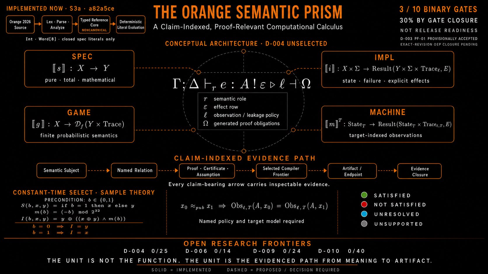

# Orange architecture diagrams

Status: steward-supplied, revision-bound documentation visual

## Orange Semantic Prism — S3a at `a82a5ce`

Label: Orange Semantic Prism — S3a architecture and gate snapshot at `a82a5ce`

- Repository path:
  `docs/images/orange-semantic-prism-s3a-a82a5ce.jpeg`
- Source filename: `HOI_RDNWUAAcD7_.jpeg`
- Import date: 2026-07-26
- Import mode: byte-for-byte
- Media: JPEG, 1672 by 941 pixels, no alpha channel
- SHA-256:
  `41b1806fac78c66542b3b89b14d3bcefa85458321ab8d81719e3aa23730e620b`
- Role: README conceptual-architecture snapshot for the S3a baseline at
  `a82a5ce`

The embedded `D-003 PF-01 provisionally accepted / exact-revision OEP closure
pending` text is historically exact for revision `a82a5ce`. D-003 and OEP-0004
are now Accepted at exact decision revision
`a82a5cec2ee4359dc2fe66171f17c93146747333`. D-004 remains unselected at 0/25,
S3b remains unauthorized, and the displayed 30% is binary gate closure rather
than release readiness.

This visual is explanatory and non-normative. The governing status remains in
the decision register, roadmap, accepted OEPs, and repository policy.

Its inclusion is authorized for the current repository. It does not settle
copyright, trademark, outbound-license, or redistribution terms; those remain
subject to D-017 and D-018 in the [decision register](../DECISIONS.md).
