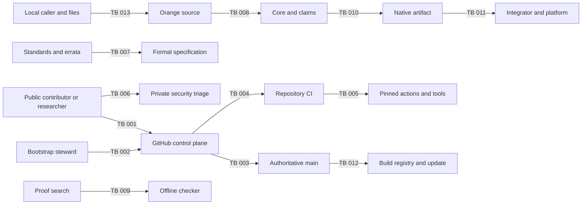

# Solo-bootstrap threat model

Status: living repository and pre-alpha compiler security evidence; not a
product-security certification

Repository-control evidence snapshot: exact `main` revision
`9f458c04542c512a8c04b00cb7ce4ef6bacd1a79`, merged at
`2026-07-11T23:08:36Z`; CodeQL alerts #1-#3 fixed at
`2026-07-11T23:09:26Z`

Compiler-lineage snapshot: S2 merged as exact revision
`52a3460853636f7cbaa27f3e27d86e032e3c82d4`

Hosted-execution refresh: 2026-07-12 at exact S2 `main`; no repository-setting
readback was performed for this refresh

Hosted-control snapshot: `snapshot_date=2026-07-11 review_due_date=2026-10-11 ruleset_id=18810248`

Solo/pre-alpha model amendment: 2026-07-12. The hosted-control settings remain
the original 2026-07-11 observations; later run and alert facts are separately
bound to S2.

Required-check binding: `context="Required CI / docs-policy-workflows" integration_id=15368`

Required-check binding: `context="Dependency Review / policy" integration_id=15368`

Owner: Orange Project Owner (`@chasebryan`)

Next scheduled review: 2026-10-11, or earlier on any mandatory trigger below

## Executive summary

Authoritative S2 `main` includes a local pre-alpha Rust compiler frontend with
source-file, lexer, bounded parser, normative minimal grammar, diagnostic, and
CLI input surfaces. Orange has no type or name analysis, semantic Core,
proof checker, code generator, package client, registry, cryptographic
implementation, third-party Rust crate, or product release. Immediate risks
include hostile source and path input, resource exhaustion, diagnostic/path
disclosure, and compiler-toolchain compromise. The parser also exposes recovery,
tree, and parser-budget risks. Repository and governance risks
include compromise of the sole maintainer,
misconfiguration or privileged weakening of protected-branch controls, unsafe
CI evolution, credential disclosure, and planning text that overstates controls
which do not yet exist. The intended product will add much higher-consequence proof,
compiler, leakage, package, release, and update boundaries. Those future threats
are recorded now as design requirements, not as claims that mitigations have
been implemented.

This document refines, but does not ratify or replace, the proposed security
constitution in [`docs/ASSURANCE.md`](../ASSURANCE.md). A threat marked
`future-blocking` is not currently exploitable through Orange software until its
entry point or asset is introduced. It becomes a release blocker when that
boundary exists.

## Scope and assumptions

### Current in-scope system

- The authoritative public repository is
  [`chasebryan/orange`](https://github.com/chasebryan/orange), with `main` as its
  default branch.
- The S2 `main` tree consists of the pre-alpha Rust compiler workspace and its
  normative Orange 2026 lexical/grammar specification, planning,
  governance, security policy, issue and pull-request templates, historical
  Gate 0 schemas, conformance material, and repository automation. The schemas remain
  provisional solo-bootstrap architecture evidence, not product formats or
  proof evidence.
- GitHub is the hosted identity, repository, issue, private-vulnerability, and
  Actions control plane. Orange assesses its configuration and use; testing or
  threat modeling GitHub's internal implementation is out of scope.
- Repository controls and repository-owned workflows are current on `main`.
  PR #1 merged as exact revision
  `85b60b0f12cc566b199c54d87cc05c4879323e1f`; PR #2 merged as exact revision
  `f6682072ec3149c4301dde25732d2ab4d790aa75`; and PR #3 head
  `8e26785f87c3866cc12915d7037820c608d6708d` was squash-merged by
  `chasebryan` as exact `main` revision
  `9f458c04542c512a8c04b00cb7ce4ef6bacd1a79` at
  `2026-07-11T23:08:36Z`. The PR #3 head and merge revision have identical Git
  trees.
- Active ruleset `18810248` requires the exact app-bound contexts
  `Required CI / docs-policy-workflows` and `Dependency Review / policy`, each
  from GitHub Actions integration `15368`.
- PR #6 head `73416f1ee8b613f0f6244f8dcd2d30281e6e91f2` passed Required CI
  `29188056038`, Dependency Review `29188056060`, and CodeQL `29188055399`
  before squash merge as exact S2 `main` revision
  `52a3460853636f7cbaa27f3e27d86e032e3c82d4`. Its post-merge push runs also
  succeeded: Required CI `29188111313`, Workflow Online Audit `29188111278`,
  External Links `29188111303` attempt 2, OpenSSF Scorecard `29188111302`, and
  CodeQL `29188111040`. External Links attempt 1 encountered a transient
  `slsa.dev` connection failure. Required CI exercised policy `0.2.1` and all 88
  Python tests.
- CodeQL run `29188111040` completed without analysis errors or warnings.
  Actions analysis `1468459678` reported `0/23`, Python analysis `1468459893`
  reported `0/50`, and Rust analysis `1468460793` reported `0/27`. Alerts
  #11-#17 all read back fixed at `2026-07-12T09:51:03Z`, with null dismissal
  time and reason.

These execution observations are operating evidence only for the named
revision, event executions, and analysis rules; they do not refresh the
2026-07-11 hosted-control configuration. A green push-triggered run
does not demonstrate the corresponding `schedule` or `workflow_dispatch` event
path. OpenSSF Scorecard is repository-security-posture evidence, not static
application security testing. Zero CodeQL results do not prove that
vulnerabilities are absent. The review and merge were performed under sole
stewardship and are not independent review, external certification, or
product-security assurance.

- One person, `@chasebryan`, is the repository owner and only current
  collaborator. [`GOVERNANCE.md`](../../GOVERNANCE.md) authorizes solo
  development while barring mature-governance, independent-review,
  external-certification, and product-release claims that have no evidence.

### Future design scope

The following components and flows are in scope as requirements because the
project documents commit the end product to them:

- elaborator, semantic cores, proof search, canonical Proof IR, and the
  authoritative offline checker beyond the current syntax boundary;
- compilation through CT IR and Machine IR to object bytes and generated foreign
  interfaces;
- standards, errata, vectors, cryptographic packages, claims, evidence bundles,
  and independently replayable validation;
- package resolution, immutable local storage, registry, build, signing,
  provenance, release, update, rollback, revocation, and recovery; and
- host, target, ABI, operating-system, CPU, accelerator, entropy, and leakage
  assumptions.

These elements are described in [`docs/ARCHITECTURE.md`](../ARCHITECTURE.md) and
[`docs/ASSURANCE.md`](../ASSURANCE.md). Their existence and controls are not
asserted here.

### Material assumptions and open questions

- GitHub correctly enforces the repository settings returned by its APIs and
  keeps authentication, secret-scanning, and Actions isolation within its
  documented service boundary.
- The owner protects the GitHub account with phishing-resistant MFA and secure
  recovery material. Account-level MFA state was not independently observable
  during this review and remains `unverified`.
- No production credential, signing key, embargoed vulnerability, or private
  cryptographic material belongs in this repository or an untrusted workflow.
- Final naming, licensing, proof-foundation, target, leakage, and release
  decisions remain open. Their resolution can materially change likelihood,
  impact, ownership, and trust boundaries.
- Deployment scale, multi-tenancy, public service topology, package-registry
  operation, supported targets, and data sensitivity are not yet selected.
  Threat ranks for those surfaces are deliberately conditional.

Before the affected capability or claim is released, the project must answer
which services are Internet-facing, which sensitive data each service may
retain, and which exact target and leakage profiles it promises. D-023 records
that the owner holds all roles and that independent ownership is unavailable.

## System model

### Primary components

| Component ID | Component | State | Security role and evidence |
| --- | --- | --- | --- |
| CMP-001 | GitHub repository and control plane | Current, external | Authoritative source, history, issues, reviews, security settings, private reports, and workflow execution. Configuration evidence is maintained in [`OSPS_BASELINE.md`](OSPS_BASELINE.md). |
| CMP-002 | Foundation policy and evidence records | Historical Gate 0 inputs plus current solo-bootstrap records | Planning, decisions, threat/control records, provisional schemas, and conformance fixtures. Historical Gate 0 material is retained as an input under the current capability-local model. See [`README.md`](../../README.md), [`docs/DECISIONS.md`](../DECISIONS.md), and [`schemas/README.md`](../../schemas/README.md). |
| CMP-003 | Repository CI | Current on `main` with exact-revision hosted evidence | Repository-owned policy, dependency-review, link, workflow-metadata-audit, and Scorecard workflows are under [`.github/workflows/`](../../.github/workflows/). At exact S2 `main` revision `52a3460853636f7cbaa27f3e27d86e032e3c82d4`, Required CI `29188111313`, Workflow Online Audit `29188111278`, External Links `29188111303` attempt 2, Scorecard `29188111302`, and CodeQL `29188111040` succeeded. Ruleset `18810248` requires the exact Required CI and Dependency Review app-bound contexts. These push executions do not separately demonstrate scheduled or manual-dispatch event behavior and do not refresh hosted settings. |
| CMP-004 | Orange driver and language services | Current pre-alpha syntax/CLI slice | Rust source map, byte spans, lexer, bounded parser, syntax tree, diagnostics, and `orangec check`/`lex`; no type or name analysis, elaborator, semantic validation, LSP, or code generation exists. |
| CMP-005 | Orange semantic and evidence system | Future | Planned Core family, claims, Proof IR, proof search, and authoritative offline checker. No implementation exists. |
| CMP-006 | Orange compiler and native boundary | Future | Planned CT IR, Machine IR, compiler, object encoding, linker validation, C ABI, and target execution. No implementation exists. |
| CMP-007 | Package, registry, build, and release system | Future | Planned immutable dependency resolution, registry, hermetic builds, provenance, signing, publication, updates, and recovery. No implementation exists. |
| CMP-008 | Standards and cryptography corpus | Future | Planned standards/errata provenance, vectors, packages, proofs, tests, and external-validation records. No implementation exists. |

### Data flows and trust boundaries

Boundary IDs are permanent. A removed boundary keeps its ID and receives a
tombstone rather than being renumbered.

| Boundary ID | Source to destination | Data and channel | Current guarantees and validation | State |
| --- | --- | --- | --- | --- |
| TB-001 | Public user or contributor to CMP-001 | Issues, pull requests, Git refs, comments, titles, branch names, and uploaded text over GitHub HTTPS | Structured issue forms; blank issues disabled; security reports directed to a private channel; contribution scope restricted. GitHub authentication applies to writes. Content remains untrusted. | Current |
| TB-002 | Repository owner to CMP-001 | Credentials and privileged settings through GitHub HTTPS/API/SSH or Git credential transport | GitHub authentication is assumed; account-level phishing-resistant MFA is required by policy but unverified here. One-person custody remains a high residual risk. | Current |
| TB-003 | Proposed Git change to authoritative `main` | Git commits and pull-request metadata | Active ruleset `18810248` requires a branch and pull request, strict `Required CI / docs-policy-workflows` and `Dependency Review / policy` checks from GitHub Actions integration `15368`, resolved conversations, squash-only linear history, and blocks deletion and non-fast-forward updates without a bypass actor. Zero approvals and one administrator still allow unilateral reviewed-PR merge and privileged control-plane weakening or recovery. | Current control with solo-owner residual risk |
| TB-004 | Untrusted pull-request snapshot to CMP-003 | Repository files executed or parsed by hosted Actions runners | Current PR workflows declare no ambient permissions, grant only `contents: read` where needed, avoid privileged secrets and `pull_request_target`, disable persisted checkout credentials, and set timeouts. Active ruleset `18810248` requires exact app-bound Required CI and Dependency Review contexts before merge. PR #6 Required CI `29188056038`, Dependency Review `29188056060`, and CodeQL `29188055399` succeeded before exact S2 merge `52a3460853636f7cbaa27f3e27d86e032e3c82d4`. | Current source and platform-enforced PR boundary; sole-owner review remains non-independent |
| TB-005 | CMP-003 to action/tool publishers and network services | Pinned Actions, digest-selected containers, downloaded tools, release archives, checksums, SARIF, and HTTPS requests | The 2026-07-11 settings snapshot requires full action SHAs and restricts sources to the exact six admitted Action repositories; broad GitHub-owned and verified-publisher allowances were disabled. Scorecard executes at the separately enforced OCI digest, and downloaded binaries use pinned versions and SHA-256 checks. Exact S2 `main` runs `29188111278`, `29188111303` attempt 2, and `29188111302` succeeded. Publisher, selected-action, selected-image, registry, hosted-runner, and provenance compromise remain possible. | 2026-07-11 settings plus 2026-07-12 exact-revision hosted execution; scheduled-event paths are not separately demonstrated and settings were not refreshed |
| TB-006 | Researcher to private security triage | Vulnerability report and attachments through GitHub private vulnerability reporting | Private reporting is enabled and [`SECURITY.md`](../../SECURITY.md) defines handling targets and disclosure constraints. Only one bootstrap steward receives and triages reports; no independent PSIRT exists. | Current |
| TB-007 | Human standards intent to CMP-008 formal specification | Standards, errata, clauses, vectors, interpretations, and transcription records | Exact provenance, explicit transcription-review status, and separate owner cross-checks are required for admission. External independent review is unavailable; any claim that requires it remains unsupported. No admitted standard package or transcription exists. | Future-blocking only for standards-dependent packages and claims |
| TB-008 | Surface source through CMP-004 to future CMP-005 Core and claims | File or standard-input UTF-8 bytes, paths, tokens, syntax trees, diagnostics, later types, assumptions, and canonical serialization | The S2 frontend validates UTF-8, assigns checked byte spans, lexes and parses the normative minimal Orange 2026 grammar, emits structured diagnostics, and has positive, malformed, Unicode, line-ending, resource, and repeatability tests. Name/type analysis, normative semantics, checked formats, and Core do not exist. Owner review is not independent. | Current through syntax boundary; future-blocking beyond it |
| TB-009 | Proof search and automation to authoritative proof checking | Candidate proof objects, solver certificates, limits, and errors | Planned untrusted search with deterministic, resource-bounded, implementation-diverse machine checking and fail-closed outcomes. No checker exists. | Future-blocking |
| TB-010 | Each CMP-006 compiler stage to the next stage and final bytes | IR, certificates, transformations, target model, relocations, objects, and link results | Planned verified passes or checked per-artifact certificates, executable semantics, differential tests, and final-byte validation. No lowering, code-generation, target, or final-byte stage exists. | Future-blocking |
| TB-011 | Generated artifact or foreign interface to its integrator, OS, CPU, accelerator, and entropy provider | ABI calls, buffers, errors, target features, entropy, runtime observations, and leakage | Planned explicit contracts, target profiles, named leakage models, misuse-resistant APIs, and empirical defense in depth. Exact platforms and profiles remain undecided. | Future-blocking |
| TB-012 | Authoritative source to CMP-007 builders, registry, and update client | Source, dependencies, build inputs, packages, provenance, keys, artifacts, and update metadata | Planned hermetic inputs, separately provisioned owner rebuilds with explicit `not independently rebuilt` status, scoped credentials, signed provenance, transparency evidence, and TUF-style recovery. Independent rebuild and role-separation evidence are unavailable; no release system or keys exist. | Future-blocking only for release/distribution |
| TB-013 | Local caller and filesystem to CMP-004 | Command-line arguments, file names, file bytes, standard input, output streams, and operating-system errors | The CLI uses no network or third-party crate, normalizes exposed I/O errors, escapes displayed path and control text, validates UTF-8, caps each source at 16 MiB, and returns stable success/compilation/usage status classes. Platform behavior remains security-sensitive. | Current pre-alpha |

#### Diagram

## Assets and security objectives

| Asset ID | Asset | Why it matters | Objective |
| --- | --- | --- | --- |
| AS-001 | Authoritative repository, history, settings, and `main` | Unauthorized or erased changes can corrupt every downstream decision and future release. | Integrity, availability |
| AS-002 | Historical Gate 0 and current solo-bootstrap decisions, policies, source provenance, and research evidence | Hidden edits or fabricated evidence can silently choose architecture, licensing, or assurance boundaries. | Integrity, authenticity, availability |
| AS-003 | Maintainer identity, credentials, recovery factors, and privileged settings | The sole current principal can change source, settings, reports, and future publication paths. | Confidentiality, integrity, availability |
| AS-004 | Workflow definitions, Actions tokens, runner isolation, and security results | CI can become an execution and credential boundary and can create false evidence if compromised. | Confidentiality, integrity, availability |
| AS-005 | Private vulnerability reports and incident records | Premature disclosure can enable exploitation and harm reporters or downstream users. | Confidentiality, integrity, availability |
| AS-006 | Future semantic truth, axioms, Core formats, claims, proofs, and checker | Unsound acceptance defeats the central assurance promise. | Integrity, authenticity, availability |
| AS-007 | Future standards, errata, vectors, and cryptographic source intent | Wrong or stale intent can yield internally consistent but unsafe cryptography. | Integrity, authenticity, availability |
| AS-008 | Future compiler stages, target models, objects, ABIs, and leakage evidence | A last-mile mismatch can invalidate functional, safety, or confidentiality claims. | Integrity, confidentiality, availability |
| AS-009 | Future packages, dependency graph, build inputs, release artifacts, and provenance | Substitution or rollback can deliver bytes different from reviewed source and evidence. | Integrity, authenticity, availability |
| AS-010 | Future signing, registry, update, revocation, and recovery keys | Key compromise can authorize malicious artifacts or prevent safe recovery. | Confidentiality, integrity, availability |
| AS-011 | Public assurance language and project trust | Overclaiming can cause unsafe adoption even when repository bytes are unchanged. | Integrity, authenticity |
| AS-012 | Official working emblem, wordmark, lockups, and their provenance record | Substitution, malformed bytes, or false rights/provenance claims can misrepresent project identity and expose image consumers. | Integrity, authenticity, availability |
| AS-013 | Compiler source identities, token stream, byte spans, diagnostics, and CLI status | Malformed or ambiguous behavior can mislead later stages, tools, and users or exhaust the host. | Integrity, availability |

## Attacker model

| Adversary ID | Capabilities | Important non-capabilities in the current stage |
| --- | --- | --- |
| ADV-001 | A public contributor controls fork content, PR/issue text, branch names, commits, and other public metadata; may submit pathological files or social-engineering content. | Has no repository write/admin permission and receives no repository secrets from an ordinary fork PR by design. |
| ADV-002 | An attacker compromises the sole owner or a future collaborator account, Git credential, session, recovery path, or local workstation. | Does not automatically compromise an offline key or independent reviewer; neither exists for a product today. |
| ADV-003 | A dependency, Action, tool, publisher, release archive, registry, mirror, runner, or network path is malicious or compromised. | Cannot change a referenced full commit SHA without changing workflow source, but can compromise the content already at that identity or a downloaded artifact whose digest was incorrectly admitted. |
| ADV-004 | A privileged insider or captured governance authority intentionally bypasses review, weakens a model, conceals an assumption, or publishes a misleading claim. | Cannot produce valid independent evidence merely by changing a status word if authoritative checking and threshold controls are implemented as planned. Those controls do not exist yet. |
| ADV-005 | A malicious source, proof, certificate, package, object, or evidence author targets lexers, parsers, semantics, resource limits, claim binding, and compiler transitions. | Can reach the current lexer/parser/CLI locally; no checker, package client, or code generator exists yet. |
| ADV-006 | A future remote, local co-resident, physical-profile, or well-intentioned integrating party chooses inputs, observes outputs/leakage, violates API preconditions, or runs outside the declared target model. | Physical resistance and behavior outside a named target/leakage profile are not implied claims. |
| ADV-007 | The hosting platform, operating system, compiler, linker, CPU, firmware, accelerator, or entropy provider behaves maliciously or outside its model. | Is not made trustworthy by an Orange proof; impact must remain an explicit assumption or be reduced by independent checking and diversity. |
| ADV-008 | A well-intentioned maintainer makes a review, configuration, transcription, release, or recovery mistake. | Cannot waive a documented assurance stop-ship condition by labeling the mistake operational. |

## Control register

Control IDs are stable and state exactly what exists. `Target` controls are not
compliance evidence.

| Control ID | Control and evidence | Enforcement state | Known gap or residual risk |
| --- | --- | --- | --- |
| CTL-001 | Public Git history, structured issue forms, pull-request template, CODEOWNERS in [`.github/`](../../.github/), and active `Protect main` ruleset `18810248` | Current and platform-enforced | Rules require pull requests, strict checks, resolved conversations, squash-only linear history, and no bypass actor, but zero approvals and sole ownership cannot provide independent review. |
| CTL-002 | Private vulnerability reporting plus triage and disclosure policy in [`SECURITY.md`](../../SECURITY.md) | Current, platform-enabled and documented | One steward; no staffed independent PSIRT, encrypted alternative channel, or tested continuity path. |
| CTL-003 | GitHub secret scanning and push protection; credential exclusions in [`.gitignore`](../../.gitignore) | Platform state observed on 2026-07-11 plus current repository exclusions; the 2026-07-12 execution refresh did not re-read this setting | Non-provider patterns and validity checks were disabled at the snapshot; scanners cannot guarantee absence and cannot undo exposure. |
| CTL-004 | Full-commit-SHA and selected-source requirements in repository settings and [`DEPENDENCY_POLICY.md`](../../DEPENDENCY_POLICY.md); current workflows pin repository Actions to 40-character SHAs and execute Scorecard directly at `sha256:2dd6a6d60100f78ef24e14a47941d0087a524b4d3642041558239b1c6097c941` | 2026-07-11 platform settings plus current S2 policy and `main` source; Required CI `29188111313`, Workflow Online Audit `29188111278`, External Links `29188111303` attempt 2, and Scorecard `29188111302` succeeded at exact S2 | The six Action repositories and separately admitted Scorecard image remain upstream trust. Content addressing does not make their code trustworthy, mirror it, or eliminate publisher, registry, provenance, runner, and host compromise. The execution refresh did not re-read settings. |
| CTL-005 | Repository workflow token default is read-only; each current workflow begins with `permissions: {}` and grants per-job minimums | Current platform default and `main` source; exact-revision hosted execution is green | Scorecard grants only `security-events: write` for SARIF upload; public publication and OIDC are disabled, and the write-capable job remains off untrusted events. Green push execution does not separately demonstrate its scheduled event path. |
| CTL-006 | PR workflows use `pull_request`, no `pull_request_target`, no configured repository or environment secrets, only a job-scoped `GITHUB_TOKEN` limited to `contents: read`, bounded timeouts, concurrency, and checkout with `persist-credentials: false` | Current `main` source; exact Required CI and Dependency Review contexts are enforced by ruleset `18810248`; PR #6 runs `29188056038` and `29188056060` succeeded before S2 merged | PR content includes executable repository scripts; runner and Action compromise remain external assumptions, and sole-owner merge is not independent review. |
| CTL-007 | [`GOVERNANCE.md`](../../GOVERNANCE.md) and D-019/D-023 establish sole-owner authority and forbid unsupported independent or mature claims | Current directed solo governance | No second maintainer, non-author review, separation of duties, or organizational continuity; these are disclosed limitations and not manufactured controls. |
| CTL-008 | [`CONTRIBUTING.md`](../../CONTRIBUTING.md) and Required CI block third-party merge until licensing terms close; ruleset `18810248` requires a branch, pull request, checks, and resolved conversations | Current documented and platform-enforced constraint | Legal decision D-018 remains blocked, and zero approvals cannot supply independent review. |
| CTL-009 | [`docs/ASSURANCE.md`](../ASSURANCE.md) defines fail-closed claim outcomes, explicit assumptions/non-claims, and non-waivable stop-ship conditions | Proposed constitution, not ratified implementation | No checker, claim registry, release gate, or independent assurance authority exists. |
| CTL-010 | [`DEPENDENCY_POLICY.md`](../../DEPENDENCY_POLICY.md), current Dependabot/dependency-review configuration, and current Scorecard workflow define admission and surveillance | Current policy and `main` source; D-024 admits the pinned Rust toolchain and standard library but no third-party crates | The toolchain and host remain bootstrap dependencies; future manifests, SCA exceptions, VEX, and additional admission records remain unimplemented. A green Scorecard run is not compiler SAST or proof of a Dependabot cycle. |
| CTL-011 | [`RELEASE_POLICY.md`](../../RELEASE_POLICY.md) forbids current product release and defines an explicit solo-preview identity, repeatability, provenance, limitation, and recovery boundary | Current documented prohibition; future solo target | No release decision, keys, artifacts, signatures, registry, or drills exist; independent rebuild and role separation are unavailable. |
| CTL-012 | Provisional schemas and negative/positive conformance fixtures keep historical Gate 0 claims, trust, provenance, and repository-control observations explicit | Historical/provisional inputs retained under solo bootstrap | Passing schema checks proves shape only, not truth, soundness, provenance, or control operation. |
| CTL-013 | Planned authoritative checker, implementation-diverse checker, canonical formats, resource limits, and adversarial corpora | Target only | No implementation, proof, fuzzing result, or independent review exists. Same-owner implementation diversity will not be labeled independent. |
| CTL-014 | Planned verified/certificate-checked compiler transitions and final-object validation | Target only | No semantic IR, lowering or code-generation stage, target model, generated artifact, or preservation evidence exists. |
| CTL-015 | Planned hermetic builds, separately provisioned owner rebuilds, signed provenance, SBOM/CBOM, immutable publication, and recovery drills | Target only | No build/release infrastructure exists; independent principals and multi-role controls are unavailable and will not be claimed. |
| CTL-016 | Planned secrecy typing, named target leakage profiles, binary inspection, and differential testing | Target only | No leakage semantics, implementation, target choice, or measurement evidence exists; laboratory evidence is unavailable and stronger physical claims remain unsupported. |
| CTL-017 | [`SECRETS_AND_INCIDENTS.md`](SECRETS_AND_INCIDENTS.md) inventories current/future credential classes and defines least-scope custody, rotation, revocation, containment, recovery, evidence, communication, and synthetic exercises | Current documented control | Account factors are unverified; exercises, independent PSIRT continuity, and future key stores/roles do not yet exist. |
| CTL-018 | The exact [`assets/brand/`](../../assets/brand/) inventory, owner-specific CODEOWNERS route, byte-level manifest, binary Git attributes, and repository-policy SHA-256 admissions protect the steward-designated working identity assets | Current S2 `main`; policy `0.2.1` and all 88 Python tests passed in Required CI `29188111313` at exact revision `52a3460853636f7cbaa27f3e27d86e032e3c82d4` | D-017 authorizes the working identity but does not provide public-name clearance, and D-018 outbound terms remain open; C2PA claims are preserved but not independently verified, content addressing does not prove rights or safe decoder behavior, and sole stewardship supplies no independent visual or rights review. |
| CTL-019 | GitHub CodeQL default setup analyzes the current Actions, Python, and Rust surfaces and preserves alert lifecycle state | At exact S2 `main`, run `29188111040` completed without analysis errors or warnings; Actions `1468459678`=`0/23`, Python `1468459893`=`0/50`, and Rust `1468460793`=`0/27`. Alerts #11-#17 were fixed at `2026-07-12T09:51:03Z`, with no dismissal. No CodeQL alerts remained open at readback; open code-scanning alerts #4-#10 were Scorecard posture results. | Coverage is limited to the named revision, languages, configured rules, queries, and platform execution. Zero CodeQL results and fixed findings do not mean all code-scanning alerts are closed or prove vulnerability absence. No CodeQL threshold or independent analysis exists. |
| CTL-020 | The dependency-free Rust compiler frontend forbids unsafe code; caps source bytes, tokens, syntax nodes, parser events, emitted diagnostics, and recovery depth; sanitizes diagnostic control text; and exercises source, span, lexer, parser, diagnostic, and CLI behavior with malformed-input, Unicode, line-ending, resource, and repeatability tests. | Policy `0.2.1`, 88 tests, parser source, and exact budget bindings are merged at revision `52a3460853636f7cbaa27f3e27d86e032e3c82d4`; Required CI `29188111313` succeeded | Tests do not establish parser correctness, name/type or semantic correctness, proof, code-generation, cryptographic, leakage, or production correctness; the Rust toolchain, host, algorithmic behavior inside the budgets, and sole-owner review remain trusted or residual risks. |

## Entry points and attack surfaces

| Surface | How reached | Boundary | Notes and evidence |
| --- | --- | --- | --- |
| Public issues and PR metadata | GitHub web/API | TB-001 | Untrusted text and links reach maintainers and some automation. Forms live in [`.github/ISSUE_TEMPLATE/`](../../.github/ISSUE_TEMPLATE/). |
| Git commits and repository files | Fork/branch/PR or privileged push | TB-001, TB-003 | Repository scripts and workflow definitions are security-sensitive even before product code. |
| Tracked brand images | Git checkout, GitHub rendering, README clients, or downstream reuse | TB-001, TB-003 | Eight PNG/JPEG files are inert to repository tooling but reach external image decoders; exact digest admission and provenance records do not make every decoder safe. |
| GitHub administration and owner recovery | Authenticated GitHub UI/API/credential transport | TB-002 | Sole-owner compromise has broad blast radius; current access is recorded in [`OSPS_BASELINE.md`](OSPS_BASELINE.md). |
| GitHub Actions PR runs | `pull_request` and `merge_group` events | TB-004 | Treat fork content, repository scripts, and parsed documents as attacker controlled. |
| Trusted Actions runs | Push, schedule, or manual dispatch | TB-005 | Scorecard can upload SARIF but cannot request OIDC; event restrictions and minimum permissions remain critical. |
| Private vulnerability intake | GitHub security advisory form | TB-006 | Reports may contain embargoed exploit information. See [`SECURITY.md`](../../SECURITY.md). |
| Current lexer, parser, and CLI | File paths, file bytes, standard input, command arguments, tokens, trees, and output streams | TB-008, TB-013 | Must reject invalid UTF-8, malformed tokens or grammar, Unicode-confusable syntax, oversized input, ambiguous options, recovery stalls, and resource exhaustion with bounded stable diagnostics. |
| Future package client, checker, and LSP | Files, packages, proof objects, editor input | TB-008, TB-009 | Must reject malformed, cyclic, oversized, ambiguous, and resource-exhausting inputs. |
| Future compiler, linker, and foreign ABI | Source/Core/IR/object input and caller buffers | TB-010, TB-011 | Must bind claims to exact bytes, targets, ABI contracts, and failure behavior. |
| Future registry and update client | Package publication/resolution and update metadata | TB-012 | Must resist namespace takeover, downgrade, freeze, rollback, key compromise, and malicious packages. |

## Top abuse paths

1. **TM-001 — corrupt the authoritative plan:** ADV-002 compromises the sole
   owner, crosses TB-002, and uses administrator authority to weaken TB-003 or
   merge a zero-approval pull request that changes a decision or security rule
   without independent review. Consumers mistake the altered repository for
   authorized project direction.
2. **TM-002 — turn validation into privileged code execution:** ADV-001 changes a
   workflow or repository script in a PR. A future configuration accidentally
   exposes a secret or write token on TB-004. The attacker executes the changed
   code on a runner and exfiltrates the credential or modifies project state.
3. **TM-003 — compromise an admitted tool:** ADV-003 compromises an Action or
   downloadable release already pinned by CTL-004. CI executes the malicious
   bytes across TB-005, falsifying a check or stealing the narrowly scoped token.
4. **TM-004 — disclose a credential:** ADV-008 commits a credential or prints it
   in a log. CTL-003 misses an unsupported pattern or is bypassed. ADV-001 uses
   the credential before revocation and history/log cleanup.
5. **TM-005 — substitute evidence for another subject:** ADV-005 supplies a valid
   proof, test, or certificate for one source/target tuple but binds it to
   different artifact bytes across TB-008 through TB-010. A release makes a
   false assurance claim without forging the original evidence.
6. **TM-006 — forge or disable proof checking:** ADV-005 triggers parser
   disagreement, an unsound axiom, cyclic expansion, resource exhaustion, or a
   checker bug across TB-009. A false claim is accepted or verification is made
   unavailable at scale.
7. **TM-007 — exploit the last mile:** ADV-003 or ADV-007 changes a compiler pass,
   assembler/linker result, target model, or object after a valid source proof.
   TB-010 emits bytes whose functional or leakage behavior is not covered by the
   advertised claim.
8. **TM-008 — corrupt standards intent:** ADV-004 or ADV-008 omits an erratum,
   misreads a clause, substitutes vectors, or suppresses dissent at TB-007. The
   internally verified implementation is nevertheless nonconformant or unsafe.
9. **TM-009 — publish a forged or rollback release:** ADV-002 or ADV-003 controls
   source acceptance, a builder, signing identity, registry, or update role at
   TB-012. Users receive malicious or old bytes with misleading provenance.
10. **TM-010 — manufacture maturity:** ADV-004 uses sole-owner authority to label
    proposed controls, schema-valid fixtures, or green but incomplete CI as a
    certification. AS-011 is damaged and adopters rely on guarantees Orange has
    not established.
11. **TM-011 — expose an embargoed report:** ADV-008 routes a vulnerability into
    a public issue, PR, commit, or CI log instead of TB-006, or sole-steward
    unavailability prevents timely triage. Exploit detail becomes public before
    containment.
12. **TM-012 — violate the cryptographic deployment model:** ADV-006 supplies
    overlapping buffers, reuses a nonce, selects an unsupported target, observes
    unmodeled leakage, or receives ambiguous authentication failure at TB-011.
    Correct primitive mathematics fails to protect real users.
13. **TM-014 — exhaust or confuse the compiler frontend:** ADV-005 supplies an
    oversized, malformed, deeply commented, Unicode, pathologically tokenized,
    or misleadingly named source across TB-013. CMP-004 consumes excessive
    memory or time, panics, emits wrong spans, leaks host path details, or returns
    success despite a lexical error.

## Threat register

Likelihood assesses the named stage. `Future` means the entry point is absent
today; the impact rank describes the intended product if introduced without the
required control. Reviews must replace conditional ranks with deployment facts.

| Threat ID | Source, boundaries, assets | Threat action and impact | Existing controls and evidence | Required treatment | Likelihood | Impact | Priority | Residual risk | Owner, review, status |
| --- | --- | --- | --- | --- | --- | --- | --- | --- | --- |
| TM-001 | ADV-002/004/008; TB-002/003; AS-001/002/003/011 | Compromise or unilateral authority changes or erases authoritative decisions, settings, or history. | CTL-001, CTL-007, CTL-008; ruleset `18810248` constrains ordinary Git updates, and public history aids detection. | Preserve the active no-bypass ruleset and exact required checks; test safe direct-update rejection; maintain recovery material and periodic owner access review; never claim independent governance. | Medium-high: one administrator and zero required approvals, despite protected Git updates | High | High | Owner or platform compromise can weaken settings or abuse admin recovery; zero approvals do not create independent review. | Project owner; each rules/access change and quarterly; `open-current` |
| TM-002 | ADV-001/002; TB-001/004; AS-003/004 | Attacker-controlled workflow, script, or metadata reaches a privileged runner and steals credentials or changes state. | CTL-005/006/019; current PR jobs declare read-only source access, no configured repository or environment secrets, only a job-scoped read-only `GITHUB_TOKEN`, timeouts, and no `pull_request_target`. Ruleset `18810248` requires the exact app-bound Required CI and Dependency Review contexts. PR #6 runs `29188056038` and `29188056060` succeeded; post-merge Required CI `29188111313` passed policy `0.2.1` and all 88 tests. CodeQL `29188111040` completed without analysis errors/warnings or results, and alerts #11-#17 were fixed rather than dismissed. | Policy-check every workflow diff; keep privileged jobs off PR events; validate metadata before shell use; require CI and security review on workflow paths. | Low now: demonstrated PR jobs have read-only permissions; reassess every permission or event change | High | Medium | Actions/runner isolation, sole-owner review, query coverage, open Scorecard posture alerts, and future permission edits remain trusted or residual risks. | CI/Release authority, currently Bootstrap Steward; every workflow change; `open-current` |
| TM-003 | ADV-003; TB-005/012/013; AS-004/009/013 | Compromised action, tool, image, Rust toolchain, registry, archive, or dependency falsifies results or executes malicious code. | CTL-004/010/020; current full-SHA settings, pinned tool identities, no third-party Rust crates, exact required PR contexts, and green exact-revision hosted evidence. | Preserve the minimum allowlist and exact admission records; archive dependencies; verify signatures where available; use locked offline checks and separately provisioned owner rebuilds. | Medium: admitted third-party CI and the Rust toolchain execute code | High | High | A pinned identity can identify malicious bytes; publisher, registry, runner, host, and solo-admission judgment remain trusted or residual risks. | Project owner; each admission/update and surveillance run; `open-current` |
| TM-004 | ADV-001/002/008; TB-001/002/004/005; AS-003/004/005/010 | Secret enters source, artifact, log, cache, or untrusted job and is used before revocation. | CTL-003/005/006/017; secret scanning and push protection enabled, minimal workflow permissions, no product keys, and a fail-closed lifecycle/playbook is documented. | Exercise synthetic leak/revocation paths; enable broader scanning if available; keep release/root keys out of GitHub; rotate immediately and treat history deletion as insufficient. | Medium: humans and tooling can leak unsupported patterns | High | High | Detection is not prevention for every secret; account custody and incident execution are not independently verified. | Security authority, currently Bootstrap Steward; every alert/credential event and quarterly; `open-current` |
| TM-005 | ADV-004/005; TB-008/009/010/012; AS-006/008/009/011 | Valid evidence is rebound, omitted, downgraded, or confused across source, target, artifact, or claim context. | CTL-009/012 specify explicit subjects, digests, contexts, assumptions, and fail-closed outcomes. | Ratify canonical schemas; bind complete claim closure to exact bytes and versions; check bundle traversal through separate owner-executable paths; add substitution, omission, downgrade, and cross-target negative tests. | Future | High | High | Schema validity cannot prove truthful binding; human standards intent remains an assumption. | Project owner; every schema/claim change and release; `future-blocking` |
| TM-006 | ADV-005/007; TB-008/009; AS-006 | Malformed or adversarial proofs exploit unsoundness, parser differential, resource exhaustion, or hidden axioms. | CTL-009/013 target a small deterministic checker, axiom ledger, resource bounds, implementation diversity, and adversarial corpus. | Prove the checked relation sound; fuzz and mutate accepted objects; test malformed/cyclic/oversized inputs; enforce canonical decoding and budgets; record external audit as unavailable. | Future | High | Critical | A shared solo-authored semantic error can survive multiple implementations; the missing independent audit remains explicit. | Project owner; every checker/format/axiom change and release; `future-stop-ship` |
| TM-007 | ADV-003/004/007/008; TB-010/011; AS-006/008/009 | Compiler, encoder, linker, ABI, or target behavior diverges from proved source or promised leakage behavior. | CTL-009/014/016 require checked transitions, target-indexed claims, differential testing, and final-byte inspection. | Give each stable IR executable semantics; verify or certificate-check each pass; bind object bytes and ABI; test real hardware and emulators; forbid silent target fallback. | Future | High | Critical | OS, firmware, CPU, toolchain, and unmodeled microarchitecture remain explicit assumptions. | Compiler and Assurance authorities; every pass/target/profile change and release; `future-stop-ship` |
| TM-008 | ADV-004/008; TB-007; AS-002/007/011 | Wrong, stale, or selectively interpreted standard/erratum/vector becomes authoritative source intent. | CTL-009/012 require exact provenance, rights, clause links, errata, vectors, and explicit transcription-review status. | Pin publication/errata/vector digests; archive permitted inputs; cross-check clauses through separate owner passes; run official vectors and mature reference implementations as separate evidence; record independent review as unavailable. | Medium now for planning; High once packages exist | High | High | Formal proof can preserve a human transcription mistake perfectly. | Project owner; each upstream change and package admission; `open-design` |
| TM-009 | ADV-002/003/004/007; TB-003/005/012; AS-003/004/009/010 | Source, builder, signer, registry, or update role is compromised, enabling forgery, rollback, freeze, or unrecoverable loss. | CTL-007/011/015 prohibit current release and require solo-produced provenance, clean rebuilds, immutable identities, and drills. | Use hermetic inputs, signed provenance where selected, release/tag rules, immutable publication, monitoring, revocation, and rehearsed owner recovery; disclose that one principal controls the path. | Future | High | Critical | Owner or platform compromise can span every role; independent transparency and role separation are unavailable. | Project owner; every release/key/registry change and drill; `future-stop-ship` |
| TM-010 | ADV-004/008; TB-002/003; AS-002/011 | Proposed, partial, or synthetic evidence is presented as mature assurance or compliance. | CTL-007/009/012; repository explicitly distinguishes proposed, target, current, solo-reviewed, and unsupported states. | Require machine-readable claim status and evidence; owner review of every release-facing assertion; block words such as independent, certified, or validated unless exact evidence exists. | High: sole owner and public planning | High | High | Readers can ignore qualifications; governance independence is unavailable. | Project owner; every public claim and release; `open-current` |
| TM-011 | ADV-001/002/008; TB-001/006; AS-005/011 | Vulnerability details are disclosed publicly, mishandled, or left untriaged. | CTL-002/017; private reporting enabled, public issue redirection, response targets, evidence handling, containment, and notification are documented. | Exercise owner intake with synthetic data; minimize attachments and access; preserve recovery instructions; publish advisories only after remediation is ready. | Medium: private path exists but one-person availability | Medium | Medium | Reporter error, GitHub outage, owner unavailability, or an unexercised playbook can still expose or delay a case. | Project owner; each report and quarterly drill; `open-current` |
| TM-012 | ADV-006/007/008; TB-011; AS-007/008/011 | Misuse, target mismatch, unmodeled leakage, entropy failure, or ambiguous failure behavior defeats real cryptographic security. | CTL-009/016 define separate claim dimensions, non-claims, explicit contracts, named leakage models, and layered evidence. | Ratify finite profiles; design misuse-resistant APIs; type and test buffer/nonce/state rules; bind entropy and platform contracts; keep specialist-lab-dependent claims unsupported. | Future | High | Critical | Cryptographic hardness, foreign callers, hardware, and behavior outside named profiles remain assumptions/non-claims. | Project owner; each API/target/profile/standard change and release; `future-stop-ship` |
| TM-013 | ADV-001/002/004/008; TB-001/003; AS-011/012 | A substituted, malformed, deceptively derived, or falsely attributed image corrupts project identity, strips provenance, overstates rights, or targets a viewer's decoder. | CTL-001/018 close the official binary inventory to exact paths and digests, route ownership, preserve supplied bytes, and state the D-017/D-018 boundary. | Keep originals immutable; review decoded content and metadata; verify C2PA independently before making a signed-provenance claim; add derived assets rather than overwriting sources; reassess every image format or rendering path. | Low: only the steward can merge and the bytes are digest-bound | Medium | Low | A trusted admitted file can still be legally encumbered, misleading, or dangerous to a vulnerable external decoder; sole stewardship provides no independent visual or rights review. | Bootstrap Steward; every brand-asset or identity change; `open-current` |
| TM-014 | ADV-005/007/008; TB-008/013; AS-003/013 | Hostile source or path input exhausts resources, stalls parser recovery, panics, produces incorrect tokens/spans/trees, leaks host details, or is accepted with hidden lexical or syntax errors. | CTL-019/020; S2 has UTF-8 validation, checked source IDs/spans, exact ASCII rules, a 16 MiB source cap, token/node/event/diagnostic/recovery caps, sanitized output, normalized I/O errors, no unsafe code or third-party crates, and positive/malformed/Unicode/line-ending/resource/repeatability tests. Exact-main CodeQL reported zero results, and prior path-injection alerts #11-#17 are fixed rather than dismissed. | Retain every frontend budget; extend mutation, fuzz/property, broken-output, and cross-implementation cases as the grammar grows; bind any semantic consumer to the exact accepted tree rather than reparsing. | Medium: the local CLI intentionally accepts attacker-controlled files | Medium | Medium | Rust allocation failure within a cap, algorithmic complexity, shared specification/implementation mistakes, toolchain defects, host filesystem behavior, and untested platform differences remain. | Project owner; every frontend/input-boundary change; `open-current` |

## Criticality calibration

- **Critical:** a condition that can make Orange accept false proofs, ship
  incorrect cryptography, violate a promised confidentiality profile, or
  authorize malicious/rollback release bytes with broad downstream trust.
  Examples: exploitable checker unsoundness (TM-006), unchecked native
  miscompilation (TM-007), or release-root compromise without recovery (TM-009).
- **High:** compromise of a central integrity or confidentiality asset with a
  plausible path, even if no product release exists yet. Examples: direct
  unauthorized change to `main` (TM-001), CI supply-chain compromise (TM-003),
  or a misleading assurance claim that drives unsafe adoption (TM-010).
- **Medium:** bounded compromise, delay, or exposure with available containment
  and no demonstrated product-wide false assurance. Examples: an unprivileged
  PR runner attack under current permissions (TM-002), delayed private-report
  triage (TM-011), or a security result that fails closed without release impact.
- **Low:** low-sensitivity disclosure or transient availability loss with no
  claim, release, credential, or durable-record impact. Examples: spam blocked
  by issue templates, a scheduled external-link audit delay, or loss of a
  regenerable non-authoritative CI artifact.

No current issue is downgraded merely because the project is young. Conversely,
a future critical impact is not evidence that an exploitable Orange product
exists today.

## Assurance stop-ship linkage

The following links the stable threats to the non-waivable conditions in
[`docs/ASSURANCE.md`](../ASSURANCE.md#8-stop-ship-conditions). It does not change
those conditions.

| Assurance condition | Principal threat IDs | Required disposition before release |
| --- | --- | --- |
| Proof-soundness flaw | TM-005, TM-006 | Fix and revalidate the checker, formats, affected proof closure, and every dependent claim through separately exercised owner-executable paths; record independent review as unavailable unless it actually occurs. |
| Incorrect cryptographic output | TM-007, TM-008, TM-012 | Correct source/semantics/compiler/package as coupled artifacts and rerun the complete affected evidence set. |
| Secret-dependent behavior within a promised profile | TM-007, TM-012 | Withdraw or narrow the profile, fix the source-to-binary path, and repeat formal, binary, hardware, and review evidence. |
| Undocumented axiom, TCB expansion, foreign boundary, or claim downgrade | TM-005, TM-006, TM-007, TM-010 | Restore explicit closure and review; a wording change alone cannot cure missing evidence. |
| Meaning-changing semantic ambiguity | TM-005, TM-006, TM-007 | Resolve normatively, add separate parsing and semantics evidence plus migration analysis, then recheck dependents; do not label same-owner evidence independent. |
| Failed reproducibility, signature, provenance, update, or rollback protection | TM-003, TM-009 | Stop publication, repair the complete release path, rehearse recovery, and issue new immutable identities. |
| Unresolved critical/high security or assurance finding | Any applicable threat | Understand scope and impact, remediate, and retest; keep any claim requiring unavailable independent review blocked. No risk acceptance can waive the finding. |
| Relevant unreviewed standards erratum | TM-008, TM-012 | Complete provenance and cryptographer review, update affected packages/claims, and notify downstreams. |
| Audit finding whose impact is unknown | Any applicable threat | Keep release blocked until impact and claim closure are known. |

No release is currently authorized. A green threat table does not override the
release policy or any capability-specific gate.

## Mandatory update and review protocol

### Update triggers

The same pull request must update this document when it:

1. adds or changes any workflow, Action permission, secret, runner, environment,
   deployment, release, registry, webhook, or external service;
2. changes repository visibility, ownership, collaborators, MFA policy, branch
   or tag rules, merge policy, security feature, or recovery arrangement;
3. adds or changes product code, an executable parser, schema consumer, dependency or
   package manifest, network endpoint, stored data, package namespace, or
   user-controlled file format;
4. ratifies or changes a semantic Core, proof/checker boundary, axiom, TCB
   component, compiler pass, object format, target, ABI, leakage model, entropy
   contract, foreign boundary, or public claim;
5. admits a standard, erratum, vector, cryptographic package, toolchain,
   dependency, or externally validated artifact;
6. creates a tag, package, build, artifact, provenance record, signing/update
   key, release candidate, withdrawal, revocation, or support commitment;
7. discovers an incident, vulnerability, new abuse path, control failure,
   critical/high finding, standards change, or invalidated assumption; or
8. changes the applicable OSPS Baseline, NIST SSDF, SLSA, disclosure, or other
   pinned external security baseline.

### Review mechanics

- Never renumber an existing AS, ADV, TB, CTL, or TM identifier. Retire it with
  a dated tombstone and replacement link.
- For each changed boundary, update entry points, abuse paths, threat rank,
  current evidence, owner, residual risk, status, and stop-ship mapping.
- Evidence must identify the repository revision or API observation date. A
  policy, planned workflow, schema-valid fixture, or passing unrelated check is
  not operating evidence.
- The pull-request threat-impact row must name affected IDs. `No change` needs a
  reason tied to inspected boundaries.
- The project owner records review but must not label it independent. TCB,
  cryptography, release, and assurance-critical changes follow the solo claim
  boundary in [`GOVERNANCE.md`](../../GOVERNANCE.md).
- Perform a complete review at least quarterly, at every program gate, before
  any release candidate, and after every incident or recovery exercise.

## Focus paths for security review

| Path | Why it matters | Related threats |
| --- | --- | --- |
| `.github/workflows/` | Defines untrusted/trusted event separation, executable dependencies, token permissions, and security result uploads. | TM-002, TM-003, TM-004, TM-009 |
| `.github/CODEOWNERS` | Routes critical review but currently demonstrates the solo-owner independence gap. | TM-001, TM-010 |
| `SECURITY.md` | Controls private intake, response, disclosure, and explicit lack of a staffed PSIRT. | TM-004, TM-011 |
| `GOVERNANCE.md` | Defines authority, separation, succession, and non-waivable assurance gates. | TM-001, TM-009, TM-010 |
| `DEPENDENCY_POLICY.md` | Governs action, tool, product dependency, provenance, and exception admission. | TM-003, TM-009 |
| `RELEASE_POLICY.md` | Prohibits current product release and defines future source/build/sign/update separation. | TM-009, TM-010 |
| `docs/ASSURANCE.md` | Defines adversaries, claim dimensions, TCB, stop-ship conditions, and non-claims. | TM-005 through TM-012 |
| `docs/ARCHITECTURE.md` | Defines the current parser and future checker, compiler, ABI, package, registry, and evidence boundaries. | TM-005 through TM-012, TM-014 |
| `docs/DECISIONS.md` | Records unresolved choices whose resolution changes the attack surface and authority model. | TM-001, TM-008, TM-009, TM-010, TM-012 |
| `schemas/gate0/` | Encodes provisional claim, evidence, trust, standards, and repository-control record shapes; shape must not be confused with truth. | TM-005, TM-008, TM-010 |
| `scripts/` and `tools/` | Repository-owned code executes in CI and validates evidence/policy; changes can weaken or bypass controls. | TM-002, TM-003, TM-010 |
| `compiler/` | Processes attacker-controlled source and paths through the current Rust CLI and will hold future semantic and code-generation boundaries. | TM-003, TM-005, TM-006, TM-007, TM-014 |

## Quality check

- Current and future runtime, CI/development, and release surfaces are separated.
- Every discovered current entry point maps to at least one trust boundary and
  threat.
- Every TB identifier appears in the system model and at least one threat or
  explicit future abuse path.
- Attacker-controlled, operator-controlled, and platform-controlled inputs are
  distinguished.
- Existing controls cite repository or observed platform evidence; target
  controls are labeled as targets.
- Open service context, ownership, licensing, and deployment assumptions are
  explicit rather than silently resolved.
- Stop-ship conditions and update triggers are mechanically reviewable by
  stable IDs.
