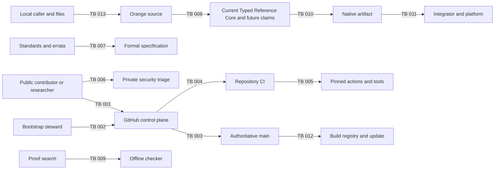

# Solo-bootstrap threat model

Status: living repository and pre-alpha compiler security evidence; not a
product-security certification

Repository-control evidence snapshot: exact `main` revision
`9f458c04542c512a8c04b00cb7ce4ef6bacd1a79`, merged at
`2026-07-11T23:08:36Z`; CodeQL alerts #1-#3 fixed at
`2026-07-11T23:09:26Z`

Compiler-lineage snapshot: S3a merged from PR #9 as exact `main` revision
`6c0bd3021cf2df603e08808e4660724ca1e2b2a5` on 2026-07-12

Post-acceptance conformance/control snapshot: PR #11 merged as exact `main`
revision `23352bcde976b86890db28ea4d375a31e6354bca` on 2026-07-13; the accepted
S3a implementation revision remains `6c0bd3021cf2df603e08808e4660724ca1e2b2a5`

Accepted implementation amendment: S3a typed-literal semantics, Typed Reference
Core, and evaluation are merged. PR #9 passed Required CI `29215790064`,
Dependency Review `29215790110`, and CodeQL `29215789258` before merge.

Hosted-execution refresh: 2026-07-12 through 2026-07-13, covering the PR #9
acceptance path and PR #11 post-acceptance conformance/control path through each
exact post-merge `main`; no repository-setting readback was performed for these
refreshes

Evidence-recording boundary: "latest recorded" names the exact subject revision
captured by this document, not necessarily the later commit that contains the
document. Merging an evidence-only document or protected-digest update does not,
by itself, require another recursive evidence update. A material source or
control change, or any mandatory review trigger below, must roll the subject
revision forward. Unrecorded later executions receive no evidence credit.

Hosted-control snapshot: `snapshot_date=2026-07-11 review_due_date=2026-10-11 ruleset_id=18810248`

Solo/pre-alpha model amendment: 2026-07-12 through 2026-07-13. The hosted-control
settings remain the original 2026-07-11 observations; later run and alert facts
are separately bound to their named revision and event.

Required-check binding: `context="Required CI / docs-policy-workflows" integration_id=15368`

Required-check binding: `context="Dependency Review / policy" integration_id=15368`

Owner: Orange Project Owner (`@chasebryan`)

Next scheduled review: 2026-10-11, or earlier on any mandatory trigger below

## Executive summary

The exact authoritative compiler snapshot is S3a `main`, with its local
pre-alpha Rust source, lexer, bounded parser, normative minimal grammar,
diagnostic, and CLI input surfaces. The merged S3a implementation adds
typed-`spec` literal parsing, separate declaration-kind namespace checks, exact
contextual `Int` and `Word[8]` validation, a bounded noncanonical Typed Reference
Core, semantic `orangec check`, and deterministic `orangec eval` output. It has
no parameters, operators, calls, typed implementations, refinement, canonical
encoding, proof checker, code generator, ABI, package client, registry,
cryptographic implementation, third-party Rust crate, or product release.

Immediate risks include hostile source and path input, resource exhaustion,
wrong normalized values or output, diagnostic/path disclosure, and
compiler-toolchain compromise. The frontend exposes recovery, tree, namespace,
integer-decoding, Core-construction, output, and budget risks. Repository and
governance risks
include compromise of the sole maintainer,
misconfiguration or privileged weakening of protected-branch controls, unsafe
CI evolution, credential disclosure, and planning text that overstates controls
which do not yet exist. The intended product will add much higher-consequence proof,
compiler, leakage, package, release, and update boundaries. Those future threats
are recorded now as design requirements, not as claims that mitigations have
been implemented.

The immutable D-004 v0.5 review subject byte-materializes exactly 73 candidate-
neutral suite-only subjects and binds the exact historical semantic-strata suite
bytes. Its `draft_unreviewed_input_only` fields remain unchanged. Bounded
integrity parsing and structural oracles do not execute a candidate or ratify
Orange semantics. On 2026-07-26 the owner accepted D004-PRE-01 as
`solo-reviewed` at exact review-subject revision
`7d09a27369649855ce987c76315271b0d34a20ef`.

That acceptance covers the immutable review subjects. The resulting v0.6
implementation closure remains `provisional_pending_exact_merged_revision`
until the validated overlay is available at an exact merged revision.

The `d004-v0.6-reviewed-protocol` overlay finds the five fixture classes
sufficient only for bounded suite coverage (5 ambiguity, 14 missing-edge, 13
identity-substitution, 5 unsupported, and 5 resource-exhaustion). Its five
candidate graphs and 70 SR mappings are reviewed only as symmetric, falsifiable
test hypotheses, not accepted Orange semantics or capability evidence. The
reviewed replay plan assigns three deterministic repetitions to each of 25
candidate-case units, for 75 planned executions. The v0.7 tranche built the
adapter, closed payload schemas, executable manifests, enforcing isolation and
result parsers, and replaced the separate owner freeze record with a
content-addressed epoch identity. Epoch `d004-e-4aaf8a83a01693d543c4` ran all
75 executions on 2026-09-28. ST-REL, ST-UNI, ST-DUAL, and ST-MIRROR each passed
all five cases with byte-identical repetitions; ST-HOST failed all five because
six relationships it delegates to hosts owned by the open D-006 and D-011
decisions are unsupported. Evidence is 20 closed of 25 required units and 75 of
75 result records, contributor-produced and unreviewed. The suite cannot
separate the four passing candidates, so selection and conclusion remain null.
The v0.8 suite adds SC-06 (semantic evolution) and SC-07 (within-authority
relabeling) with five cost measures, and the owner chose the isolation-first
distinguishing rule knowing which candidate each rule was predicted to select.
Epoch `d004-e-633e0aa831615cda3e06` ran all 105 executions on 2026-09-28: the
same four candidates closed all seven cases and ST-HOST closed none, for 28
closed of 35 required units and 105 of 105 result records. Isolation first
leaves only ST-REL, which ties ST-MIRROR at zero isolation obligations and
re-identifies six subject classes to its seven. That result is
contributor-produced and unreviewed, and it is not a D-004 recommendation until
the owner disposes every candidate and hard gate. The adapter runs only under
user, mount, IPC, UTS, PID and network namespaces, `setpriv`, the Landlock
sandbox and per-execution cgroups. D-004 remains proposed, S3b through S3g are
implemented and await owner review under OEP-0005 through OEP-0010, and Orange's
binary gate-closure score remains 3 of 10 (30%); that mechanical score is not
release readiness.

The D-010 laboratory currently binds only five candidate identities and eight
zero-fixture case blockers, for 0/40 execution. It executes no compiler or tool,
selects no strategy, mitigates no compiler threat, and creates no S5 or readiness
evidence.

This document refines, but does not ratify or replace, the proposed security
constitution in [`docs/ASSURANCE.md`](../ASSURANCE.md). A threat marked
`future-blocking` is not currently exploitable through Orange software until its
entry point or asset is introduced. It becomes a release blocker when that
boundary exists.

## Scope and assumptions

### Current in-scope system

- The authoritative public repository is
  [`chasebryan/orange`](https://github.com/chasebryan/orange), with `main` as its
  default branch.
- The current `main` tree contains the accepted S3a pre-alpha Rust compiler
  workspace and its
  normative Orange 2026 lexical/grammar specification, planning,
  governance, security policy, issue and pull-request templates, historical
  Gate 0 schemas, conformance material, and repository automation. The schemas remain
  provisional solo-bootstrap architecture evidence, not product formats or
  proof evidence.
- This review covers the merged S3a implementation governed by D-026,
  [`OEP-0003`](../governance/oeps/OEP-0003-orange-2026-typed-literals.md), and
  [`SEMANTICS_2026.md`](../SEMANTICS_2026.md), at exact `main` revision
  `6c0bd3021cf2df603e08808e4660724ca1e2b2a5`. Its accepted implementation
  status records a merged, tested language slice; it is not semantic proof,
  independent review, external certification, or product-release evidence.
- GitHub is the hosted identity, repository, issue, private-vulnerability, and
  Actions control plane. Orange assesses its configuration and use; testing or
  threat modeling GitHub's internal implementation is out of scope.
- Repository controls and repository-owned workflows are current on `main`.
  PR #1 merged as exact revision
  `85b60b0f12cc566b199c54d87cc05c4879323e1f`; PR #2 merged as exact revision
  `f6682072ec3149c4301dde25732d2ab4d790aa75`; and PR #3 head
  `8e26785f87c3866cc12915d7037820c608d6708d` was squash-merged by
  `chasebryan` as exact `main` revision
  `9f458c04542c512a8c04b00cb7ce4ef6bacd1a79` at
  `2026-07-11T23:08:36Z`. The PR #3 head and merge revision have identical Git
  trees.
- Active ruleset `18810248` requires the exact app-bound contexts
  `Required CI / docs-policy-workflows` and `Dependency Review / policy`, each
  from GitHub Actions integration `15368`.
- PR #6 head `73416f1ee8b613f0f6244f8dcd2d30281e6e91f2` passed Required CI
  `29188056038`, Dependency Review `29188056060`, and CodeQL `29188055399`
  before squash merge as exact S2 `main` revision
  `52a3460853636f7cbaa27f3e27d86e032e3c82d4`. Its post-merge push runs also
  succeeded: Required CI `29188111313`, Workflow Online Audit `29188111278`,
  External Links `29188111303` attempt 2, OpenSSF Scorecard `29188111302`, and
  CodeQL `29188111040`. External Links attempt 1 encountered a transient
  `slsa.dev` connection failure. Required CI exercised policy `0.2.1` and all 88
  Python tests.
- CodeQL run `29188111040` completed without analysis errors or warnings.
  Actions analysis `1468459678` reported `0/23`, Python analysis `1468459893`
  reported `0/50`, and Rust analysis `1468460793` reported `0/27`. Alerts
  #11-#17 all read back fixed at `2026-07-12T09:51:03Z`, with null dismissal
  time and reason.
- PR #9's S3a acceptance path passed Required CI `29215790064`, Dependency
  Review `29215790110`, and CodeQL `29215789258` before squash merge as exact
  `main` revision `6c0bd3021cf2df603e08808e4660724ca1e2b2a5`. Required CI
  exercised repository policy `0.2.3`, 89 Rust tests including the documentation
  test, 95 Python tests, and the foundation validator with zero findings.
- The post-merge push at exact S3a `main` revision
  `6c0bd3021cf2df603e08808e4660724ca1e2b2a5` also succeeded: Required CI
  `29215877872`, Workflow Online Audit `29215877891`, External Links
  `29215877874`, OpenSSF Scorecard `29215877875`, and dynamic CodeQL
  `29215877437`.
- PR #11 head `7d54594349cc7afe0cacf60ebc9f1d8f5e913fee` passed Required CI
  `29292600483`, Dependency Review `29292600471`, and CodeQL `29292598799`
  before squash merge as exact `main` revision
  `23352bcde976b86890db28ea4d375a31e6354bca` at `2026-07-13T23:20:22Z`.
  Required CI exercised repository policy `0.2.6`, 92 Rust tests including the
  documentation test, 103 Python tests, and the foundation validator with zero
  findings. The post-merge push then passed Required CI `29292740885`, Workflow
  Online Audit `29292740874`, External Links `29292740884`, OpenSSF Scorecard
  `29292740941`, and dynamic CodeQL `29292740478`.
- At exact revision `23352bcde976b86890db28ea4d375a31e6354bca`, dynamic
  CodeQL recorded Actions analysis `1474500928`=`0/23`, Python analysis
  `1474500920`=`0/50`, and Rust analysis `1474500915`=`0/27`, all without
  analysis warnings. Open code-scanning alerts #4-#10 were Scorecard posture
  findings; there were no open CodeQL alerts. This is a bounded execution and
  alert-state readback, not vulnerability-absence proof or a settings refresh.
- The post-acceptance revision adds a permanent external S3a black-box corpus
  plus draft D-003/D-004 research protocols. It does not change the accepted
  S3a revision, accept either draft decision, authorize S3b, or establish
  semantic proof.

These execution observations are operating evidence only for the named
revision, event executions, and analysis rules; they do not refresh the
2026-07-11 hosted-control configuration. A green push-triggered run
does not demonstrate the corresponding `schedule` or `workflow_dispatch` event
path. OpenSSF Scorecard is repository-security-posture evidence, not static
application security testing. Zero CodeQL results do not prove that
vulnerabilities are absent. The review and merge were performed under sole
stewardship and are not independent review, external certification, or
product-security assurance.

- One person, `@chasebryan`, is the repository owner and only current
  collaborator. [`GOVERNANCE.md`](../../GOVERNANCE.md) authorizes solo
  development while barring mature-governance, independent-review,
  external-certification, and product-release claims that have no evidence.

### Future design scope

The following components and flows are in scope as requirements because the
project documents commit the end product to them:

- the complete elaborator and semantic Core family beyond the current
  typed-literal Core, proof search, canonical Proof IR, and the authoritative
  offline checker;
- compilation through an accepted D-010 strategy to an explicitly bounded
  claim frontier, including downstream target and final-byte boundaries only
  where the accepted strategy and exact claim include them;
- standards, errata, vectors, cryptographic packages, claims, evidence bundles,
  and independently replayable validation;
- package resolution, immutable local storage, registry, build, signing,
  provenance, release, update, rollback, revocation, and recovery; and
- host, target, ABI, operating-system, CPU, accelerator, entropy, and leakage
  assumptions.

These elements are described in [`docs/ARCHITECTURE.md`](../ARCHITECTURE.md) and
[`docs/ASSURANCE.md`](../ASSURANCE.md). Their existence and controls are not
asserted here.

### Material assumptions and open questions

- GitHub correctly enforces the repository settings returned by its APIs and
  keeps authentication, secret-scanning, and Actions isolation within its
  documented service boundary.
- The owner protects the GitHub account with phishing-resistant MFA and secure
  recovery material. Account-level MFA state was not independently observable
  during this review and remains `unverified`.
- No production credential, signing key, embargoed vulnerability, or private
  cryptographic material belongs in this repository or an untrusted workflow.
- Final naming, licensing, proof-foundation, compiler-strategy, target, leakage,
  and release decisions remain open. Their resolution can materially change
  likelihood, impact, ownership, and trust boundaries.
- Deployment scale, multi-tenancy, public service topology, package-registry
  operation, supported targets, and data sensitivity are not yet selected.
  Threat ranks for those surfaces are deliberately conditional.

Before the affected capability or claim is released, the project must answer
which services are Internet-facing, which sensitive data each service may
retain, and which exact target and leakage profiles it promises. D-023 records
that the owner holds all roles and that independent ownership is unavailable.

## System model

### Primary components

| Component ID | Component | State | Security role and evidence |
| --- | --- | --- | --- |
| CMP-001 | GitHub repository and control plane | Current, external | Authoritative source, history, issues, reviews, security settings, private reports, and workflow execution. Configuration evidence is maintained in [`OSPS_BASELINE.md`](OSPS_BASELINE.md). |
| CMP-002 | Foundation policy and evidence records | Historical Gate 0 inputs plus current solo-bootstrap records | Planning, decisions, threat/control records, provisional schemas, and conformance fixtures. Historical Gate 0 material is retained as an input under the current capability-local model. See [`README.md`](../../README.md), [`docs/DECISIONS.md`](../DECISIONS.md), and [`schemas/README.md`](../../schemas/README.md). |
| CMP-003 | Repository CI | Current on `main` with exact acceptance and post-acceptance evidence | Repository-owned policy, dependency-review, link, workflow-metadata-audit, and Scorecard workflows are under [`.github/workflows/`](../../.github/workflows/). PR #9 and exact merged revision `6c0bd3021cf2df603e08808e4660724ca1e2b2a5` retain the accepted S3a evidence. The later PR #11 head passed Required CI `29292600483`, Dependency Review `29292600471`, and CodeQL `29292598799`; exact merged revision `23352bcde976b86890db28ea4d375a31e6354bca` passed push Required CI `29292740885`, Workflow Online Audit `29292740874`, External Links `29292740884`, Scorecard `29292740941`, and dynamic CodeQL `29292740478`. Required CI covered policy `0.2.6`, 92 Rust tests including the documentation test, 103 Python tests, and zero foundation-validator findings. Ruleset `18810248` requires the exact Required CI and Dependency Review app-bound contexts. These executions do not demonstrate semantic soundness, vulnerability absence, independent review, scheduled or manual-dispatch event behavior, or refreshed hosted settings. |
| CMP-004 | Orange driver and language services | S3a accepted and S3b through S3g proposed, all implemented on `main` | Rust source map, byte spans, lexer, bounded parser, syntax tree, diagnostics, and `orangec check`/`eval`/`lex`. The implementation includes declaration-kind namespace checks, exact `Int`/`Word[8]` typed literals, and the S3b slice proposed under OEP-0005: typed `spec` parameters and calls, `Word[16]`/`Word[32]`/`Word[64]`, exact integer and modular word operators, literal shift and rotation amounts, an acyclic call graph, noncanonical Typed Reference Core construction, and bounded deterministic evaluation. The S3c slice proposed under OEP-0006 adds typed `let` bindings without shadowing and explicit `as` conversions among the five types. The S3d slice proposed under OEP-0007 adds fixed-length arrays `T^n` of those types, array literals, and literal indices checked in range. The S3e slice proposed under OEP-0008 adds loops over literal ranges, indices built from literals and loop indices and proved in range before evaluation, updates of one element, and fill literals. The S3f slice proposed under OEP-0009 adds `Bool`, comparisons, strict logical operators, total Euclidean division and remainder, and conditionals with both branches, of which only the chosen one is evaluated. The S3g slice proposed under OEP-0010 adds indices keyed by data: an index whose first typed leaf is a word ranges over that type, narrowed by its operators, an `Int` index may also convert words with `as Int` and choose with conditionals, every index is still proved in range before evaluation, and an update or fill costs one step per 64 elements. No unbounded loop, typed `impl`, LSP, proof, refinement, or code generation exists. |
| CMP-005 | Orange semantic and evidence system | Future beyond current S3a, with D-004 research inputs and contributor-produced v0.7 and v0.8 runs | Planned canonical Core family, claims, Proof IR, proof search, and authoritative offline checker. The Typed Reference Core in CMP-004 has no canonical encoding, proof identity, or relationship to this future family. D004-PRE-01 reviews the immutable 73-subject v0.5 corpus as sufficient only for bounded suite coverage and the five graphs/70 mappings only as symmetric, falsifiable test hypotheses. The v0.7 epoch ran all 75 executions under the enforcing launcher and closed 20/25 units with 75/75 contributor-produced, unreviewed result records, and the v0.8 epoch `d004-e-633e0aa831615cda3e06` ran all 105 executions and closed 28/35 units with 105/105 such records; neither supplies accepted semantics, selection, or readiness evidence. |
| CMP-006 | Orange compiler and output boundary | Future | Five D-010 candidates are under input-only comparison: two direct-native paths, versioned Jasmin, portable C11, and versioned LLVM IR. No strategy, lowering, code-generation stage, external compiler, target, artifact, or evidence exists. |
| CMP-007 | Package, registry, build, and release system | Future | Planned immutable dependency resolution, registry, hermetic builds, provenance, signing, publication, updates, and recovery. No implementation exists. |
| CMP-008 | Standards and cryptography corpus | Future | Planned standards/errata provenance, vectors, packages, proofs, tests, and external-validation records. No implementation exists. |
| CMP-009 | Tabula workbench | Current in [`tabula/`](../../tabula/README.md), separate from the language and compiler | A local browser workbench that runs `orangec check`, `eval`, and `lex` on the file being edited and shows the Library's documents beside it. It adds no language behavior and reports only what `orangec` reports. Its HTTP server listens only on `127.0.0.1` and answers only requests addressed to its own loopback host and port, which defeats DNS rebinding; every data request carries a 128-bit per-session key compared in constant time; cross-origin requests are refused and the page runs under a strict Content Security Policy; writes are confined to `.or` files in the workspace and notes under `.tabula/notes/`, refuse hidden paths and paths that leave their folder (symbolic links included), and replace files atomically; documents and notes are rendered by building page elements, never markup; and `orangec` runs with an empty environment, a 20-second limit, and an output cap. Residual risk: other users and processes on the same host, browser extensions, and a launch link leaked during its session. See [`tabula/README.md`](../../tabula/README.md#security). |
| CMP-010 | File sealing commands | Current in [`compiler/crates/orangec/src/crypt.rs`](../../compiler/crates/orangec/src/crypt.rs) and [`compiler/schemes/`](../../compiler/schemes/README.md), as reference code | `orangec keygen`, `enc`, `dec`, and `schemes` seal files with authenticated ciphers written in Orange (XChaCha20-Poly1305 by default, ChaCha20-Poly1305, Ascon-AEAD128, or any program with the sealing interface) and run every cryptographic operation on the reference evaluator. Format 1 binds a 64-byte header, as associated data, to every chunk and gives each chunk a nonce made of a random per-file prefix, a counter, and a final-chunk flag, so altered, reordered, dropped, appended, or spliced chunks fail authentication; `dec` publishes its output only after every chunk authenticates and never replaces a file. Keys come from `/dev/urandom` and are stored as mode-0600 text files, which `enc` and `dec` refuse when other users can access them. Non-claims: the evaluator is not constant-time; the schemes and the Rust around them are tested against published vectors and independent implementations, not verified; keys are unencrypted at rest; a ChaCha20-Poly1305 key's 56-bit random prefix limits how many files it may seal; and a sealed file's size reveals its plaintext's length. See [`compiler/schemes/README.md`](../../compiler/schemes/README.md#security-notes). |

### Data flows and trust boundaries

Boundary IDs are permanent. A removed boundary keeps its ID and receives a
tombstone rather than being renumbered.

| Boundary ID | Source to destination | Data and channel | Current guarantees and validation | State |
| --- | --- | --- | --- | --- |
| TB-001 | Public user or contributor to CMP-001 | Issues, pull requests, Git refs, comments, titles, branch names, and uploaded text over GitHub HTTPS | Structured issue forms; blank issues disabled; security reports directed to a private channel; contribution scope restricted. GitHub authentication applies to writes. Content remains untrusted. | Current |
| TB-002 | Repository owner to CMP-001 | Credentials and privileged settings through GitHub HTTPS/API/SSH or Git credential transport | GitHub authentication is assumed; account-level phishing-resistant MFA is required by policy but unverified here. One-person custody remains a high residual risk. | Current |
| TB-003 | Proposed Git change to authoritative `main` | Git commits and pull-request metadata | Active ruleset `18810248` requires a branch and pull request, strict `Required CI / docs-policy-workflows` and `Dependency Review / policy` checks from GitHub Actions integration `15368`, resolved conversations, squash-only linear history, and blocks deletion and non-fast-forward updates without a bypass actor. Zero approvals and one administrator still allow unilateral reviewed-PR merge and privileged control-plane weakening or recovery. | Current control with solo-owner residual risk |
| TB-004 | Untrusted pull-request snapshot to CMP-003 | Repository files executed or parsed by hosted Actions runners | Current PR workflows declare no ambient permissions, grant only `contents: read` where needed, avoid privileged secrets and `pull_request_target`, disable persisted checkout credentials, and set timeouts. Active ruleset `18810248` requires exact app-bound Required CI and Dependency Review contexts before merge. PR #11 Required CI `29292600483`, Dependency Review `29292600471`, and CodeQL `29292598799` succeeded before exact merge `23352bcde976b86890db28ea4d375a31e6354bca`. | Current source and platform-enforced PR boundary; sole-owner review remains non-independent |
| TB-005 | CMP-003 to action/tool publishers and network services | Pinned Actions, digest-selected containers, downloaded tools, release archives, checksums, SARIF, and HTTPS requests | The 2026-07-11 settings snapshot requires full action SHAs and restricts sources to the exact six admitted Action repositories; broad GitHub-owned and verified-publisher allowances were disabled. Scorecard executes at the separately enforced OCI digest, and downloaded binaries use pinned versions and SHA-256 checks. At latest recorded subject revision `23352bcde976b86890db28ea4d375a31e6354bca`, Workflow Online Audit `29292740874`, External Links `29292740884`, Scorecard `29292740941`, Required CI `29292740885`, and dynamic CodeQL `29292740478` succeeded. Publisher, selected-action, selected-image, registry, hosted-runner, and provenance compromise remain possible. | 2026-07-11 settings plus 2026-07-13 exact-revision hosted execution; scheduled-event paths are not separately demonstrated, settings were not refreshed, and green runs do not prove vulnerability absence |
| TB-006 | Researcher to private security triage | Vulnerability report and attachments through GitHub private vulnerability reporting | Private reporting is enabled and [`SECURITY.md`](../../SECURITY.md) defines handling targets and disclosure constraints. Only one bootstrap steward receives and triages reports; no independent PSIRT exists. | Current |
| TB-007 | Human standards intent to CMP-008 formal specification | Standards, errata, clauses, vectors, interpretations, and transcription records | Exact provenance, explicit transcription-review status, and separate owner cross-checks are required for admission. External independent review is unavailable; any claim that requires it remains unsupported. No admitted standard package or transcription exists. | Future-blocking only for standards-dependent packages and claims |
| TB-008 | Surface source through CMP-004 to current Typed Reference Core, then future CMP-005 Core and claims | File or standard-input UTF-8 bytes, paths, tokens, syntax trees, names, contextual types, signed literals, diagnostics, Typed Reference Core values, and later assumptions/canonical serialization | Exact merged S3a evidence covers bounded same-kind namespace rejection, exact `Int`/`Word[8]` validation, source-ordered Core construction, semantic checks, and deterministic evaluation with compiler-phase transactional output: compiler-phase errors precede value emission. A detected output-transport failure returns failure; any prefix already accepted by the stream cannot be retracted and is not an accepted evaluation result. PR #9 passed the named Required CI, Dependency Review, and CodeQL runs before merge at `6c0bd3021cf2df603e08808e4660724ca1e2b2a5`. The Core remains noncanonical; passing tests are not semantic proof, and owner review is not independent. | Current through typed-literal Core; future-blocking beyond it |
| TB-009 | Proof search and automation to authoritative proof checking | Candidate proof objects, solver certificates, limits, and errors | Planned untrusted search with deterministic, resource-bounded, implementation-diverse machine checking and fail-closed outcomes. No checker exists. | Future-blocking |
| TB-010 | Each selected CMP-006 stage or external compiler boundary to the next in-claim boundary | IR or exported source, theorem or certificate, versioned contract, transformation, target model, and—only when claimed—relocations, objects, and link results | Planned exact authority and identity binding plus a checked relation for every in-frontier crossing. Direct-native candidates add final-byte validation; Jasmin, C11, and LLVM IR candidates stop at their declared boundary unless a checked downstream relation is separately frozen and accepted to extend the claim. No stage exists. | Future-blocking |
| TB-011 | Generated artifact or foreign interface to its integrator, OS, CPU, accelerator, and entropy provider | ABI calls, buffers, errors, target features, entropy, runtime observations, and leakage | Planned explicit contracts, target profiles, named leakage models, misuse-resistant APIs, and empirical defense in depth. Exact platforms and profiles remain undecided. | Future-blocking |
| TB-012 | Authoritative source to CMP-007 builders, registry, and update client | Source, dependencies, build inputs, packages, provenance, keys, artifacts, and update metadata | Planned hermetic inputs, separately provisioned owner rebuilds with explicit `not independently rebuilt` status, scoped credentials, signed provenance, transparency evidence, and TUF-style recovery. Independent rebuild and role-separation evidence are unavailable; no release system or keys exist. | Future-blocking only for release/distribution |
| TB-013 | Local caller and filesystem to CMP-004 | Command-line arguments, file names, file bytes, standard input, output streams, and operating-system errors | The CLI uses no network or third-party crate, normalizes exposed I/O errors, escapes displayed path and control text, validates UTF-8, caps inspected encoded command-line arguments at 4 MiB and each source at 16 MiB, caps aggregate buffered source bytes, standard output, and standard error at 64 MiB per invocation, and fails closed after 1,024 consecutive interrupted attempts for one stream operation. Buffered bytes consume the aggregate allowance even when the source is later rejected. The CLI returns stable success/compilation/usage status classes. Its portable metadata/open/descriptor-metadata sequence rejects observed non-regular files, rereads the opened descriptor from offset zero, requires the second byte stream and EOF to match the retained snapshot exactly, and compares descriptor metadata again after verification; the second read allocates no duplicate snapshot and does not recharge the buffered-source allowance. Linux x86-64 and AArch64 additionally request both `O_NOFOLLOW` and `O_NONBLOCK` at open so final symlink swaps fail and swapped FIFOs do not wait for a peer. Unix also requires stable device, inode, mode, owner, group, link count, length, modification time, and change time, while other hosts compare length and modification time. This does not provide race-free path confinement: portable-host opens may still block on a swapped special file, parent components remain unconstrained, and coordinated mutation or unusual filesystem semantics that reproduce the same bytes and metadata across both reads can evade the comparison. A detected output-limit failure can leave an unretractable prefix; an exhausted diagnostic channel cannot guarantee a final limit notice. Platform behavior remains security-sensitive. | Current pre-alpha |
| TB-014 | Local browser page to the CMP-009 server | Loopback HTTP requests carrying the session key, workspace paths, source text, notes, and Library paths | Loopback-only listening, a Host-header check, a constant-time session-key check, cross-origin refusal, a strict Content Security Policy, path confinement without hidden or escaping paths, atomic writes, and bounded `orangec` runs, as recorded in CMP-009. Any process that obtains the launch link during its session can act as the page. | Current |
| TB-015 | Local user, key files, operating-system randomness, and sealed files to CMP-010 | Key files, files to seal, sealed files, scheme programs, `/dev/urandom` bytes, and output paths | The key line and the sealed-file header are parsed strictly before any evaluation; a key belongs to one scheme and is refused when group or others can access it; randomness comes only from a character device at `/dev/urandom`; inputs must be regular files and, on Linux x86-64 and AArch64, are opened without following a final symbolic link; outputs are written to `OUTPUT.partial` and published by hard link or, where links are unsupported, by copying into a file created only if none exists, never replacing a file; each scheme call is limited to 16,777,216 evaluation steps. A process that can read the key file, observe `orangec`'s timing or memory while it runs, or read an abandoned `.partial` file is outside what these controls address. | Current pre-alpha |

#### Diagram

```mermaid
flowchart LR
  Public["Public contributor or researcher"] -->|TB 001| GitHub["GitHub control plane"]
  Owner["Bootstrap steward"] -->|TB 002| GitHub
  GitHub -->|TB 003| Main["Authoritative main"]
  GitHub -->|TB 004| CI["Repository CI"]
  CI -->|TB 005| Tools["Pinned actions and tools"]
  Public -->|TB 006| Triage["Private security triage"]
  Standards["Standards and errata"] -->|TB 007| Spec["Formal specification"]
  Source["Orange source"] -->|TB 008| Core["Current Typed Reference Core and future claims"]
  Search["Proof search"] -->|TB 009| Checker["Offline checker"]
  Core -->|TB 010| Native["Native artifact"]
  Native -->|TB 011| Platform["Integrator and platform"]
  Main -->|TB 012| Release["Build registry and update"]
  Local["Local caller and files"] -->|TB 013| Source
```

## Assets and security objectives

| Asset ID | Asset | Why it matters | Objective |
| --- | --- | --- | --- |
| AS-001 | Authoritative repository, history, settings, and `main` | Unauthorized or erased changes can corrupt every downstream decision and future release. | Integrity, availability |
| AS-002 | Historical Gate 0 and current solo-bootstrap decisions, policies, source provenance, and research evidence | Hidden edits or fabricated evidence can silently choose architecture, licensing, or assurance boundaries. | Integrity, authenticity, availability |
| AS-003 | Maintainer identity, credentials, recovery factors, and privileged settings | The sole current principal can change source, settings, reports, and future publication paths. | Confidentiality, integrity, availability |
| AS-004 | Workflow definitions, Actions tokens, runner isolation, and security results | CI can become an execution and credential boundary and can create false evidence if compromised. | Confidentiality, integrity, availability |
| AS-005 | Private vulnerability reports and incident records | Premature disclosure can enable exploitation and harm reporters or downstream users. | Confidentiality, integrity, availability |
| AS-006 | Current typed-literal semantic truth plus future axioms, canonical Core formats, claims, proofs, and checker | A wrong accepted value, misleading Core identity, or unsound future acceptance defeats the applicable assurance promise. | Integrity, authenticity, availability |
| AS-007 | Future standards, errata, vectors, and cryptographic source intent | Wrong or stale intent can yield internally consistent but unsafe cryptography. | Integrity, authenticity, availability |
| AS-008 | Future compiler stages, target models, objects, ABIs, and leakage evidence | A last-mile mismatch can invalidate functional, safety, or confidentiality claims. | Integrity, confidentiality, availability |
| AS-009 | Future packages, dependency graph, build inputs, release artifacts, and provenance | Substitution or rollback can deliver bytes different from reviewed source and evidence. | Integrity, authenticity, availability |
| AS-010 | Future signing, registry, update, revocation, and recovery keys | Key compromise can authorize malicious artifacts or prevent safe recovery. | Confidentiality, integrity, availability |
| AS-011 | Public assurance language and project trust | Overclaiming can cause unsafe adoption even when repository bytes are unchanged. | Integrity, authenticity |
| AS-012 | Official working emblem, wordmark, lockups, and their provenance record | Substitution, malformed bytes, or false rights/provenance claims can misrepresent project identity and expose image consumers. | Integrity, authenticity, availability |
| AS-013 | Compiler source identities, token stream, byte spans, diagnostics, and CLI status | Malformed or ambiguous behavior can mislead later stages, tools, and users or exhaust the host. | Integrity, availability |

## Attacker model

| Adversary ID | Capabilities | Important non-capabilities in the current stage |
| --- | --- | --- |
| ADV-001 | A public contributor controls fork content, PR/issue text, branch names, commits, and other public metadata; may submit pathological files or social-engineering content. | Has no repository write/admin permission and receives no repository secrets from an ordinary fork PR by design. |
| ADV-002 | An attacker compromises the sole owner or a future collaborator account, Git credential, session, recovery path, or local workstation. | Does not automatically compromise an offline key or independent reviewer; neither exists for a product today. |
| ADV-003 | A dependency, Action, tool, publisher, release archive, registry, mirror, runner, or network path is malicious or compromised. | Cannot change a referenced full commit SHA without changing workflow source, but can compromise the content already at that identity or a downloaded artifact whose digest was incorrectly admitted. |
| ADV-004 | A privileged insider or captured governance authority intentionally bypasses review, weakens a model, conceals an assumption, or publishes a misleading claim. | Cannot produce valid independent evidence merely by changing a status word if authoritative checking and threshold controls are implemented as planned. Those controls do not exist yet. |
| ADV-005 | A malicious source, proof, certificate, package, object, or evidence author targets lexers, parsers, semantics, resource limits, claim binding, and compiler transitions. | Can reach the merged lexer/parser/CLI, semantic analyzer, Core constructor, and evaluator locally; no proof checker, package client, or code generator exists yet. |
| ADV-006 | A future remote, local co-resident, physical-profile, or well-intentioned integrating party chooses inputs, observes outputs/leakage, violates API preconditions, or runs outside the declared target model. | Physical resistance and behavior outside a named target/leakage profile are not implied claims. |
| ADV-007 | The hosting platform, operating system, compiler, linker, CPU, firmware, accelerator, or entropy provider behaves maliciously or outside its model. | Is not made trustworthy by an Orange proof; impact must remain an explicit assumption or be reduced by independent checking and diversity. |
| ADV-008 | A well-intentioned maintainer makes a review, configuration, transcription, release, or recovery mistake. | Cannot waive a documented assurance stop-ship condition by labeling the mistake operational. |

## Control register

Control IDs are stable and state exactly what exists. `Target` controls are not
compliance evidence.

| Control ID | Control and evidence | Enforcement state | Known gap or residual risk |
| --- | --- | --- | --- |
| CTL-001 | Public Git history, structured issue forms, pull-request template, CODEOWNERS in [`.github/`](../../.github/), and active `Protect main` ruleset `18810248` | Current and platform-enforced | Rules require pull requests, strict checks, resolved conversations, squash-only linear history, and no bypass actor, but zero approvals and sole ownership cannot provide independent review. |
| CTL-002 | Private vulnerability reporting plus triage and disclosure policy in [`SECURITY.md`](../../SECURITY.md) | Current, platform-enabled and documented | One steward; no staffed independent PSIRT, encrypted alternative channel, or tested continuity path. |
| CTL-003 | GitHub secret scanning and push protection; credential exclusions in [`.gitignore`](../../.gitignore) | Platform state observed on 2026-07-11 plus current repository exclusions; the 2026-07-12 execution refresh did not re-read this setting | Non-provider patterns and validity checks were disabled at the snapshot; scanners cannot guarantee absence and cannot undo exposure. |
| CTL-004 | Full-commit-SHA and selected-source requirements in repository settings and [`DEPENDENCY_POLICY.md`](../../DEPENDENCY_POLICY.md); current workflows pin repository Actions to 40-character SHAs and execute Scorecard directly at `sha256:2dd6a6d60100f78ef24e14a47941d0087a524b4d3642041558239b1c6097c941` | 2026-07-11 platform settings plus recorded policy and source evidence; Required CI `29292740885`, Workflow Online Audit `29292740874`, External Links `29292740884`, and Scorecard `29292740941` succeeded at exact subject revision `23352bcde976b86890db28ea4d375a31e6354bca` | The six Action repositories and separately admitted Scorecard image remain upstream trust. Content addressing does not make their code trustworthy, mirror it, or eliminate publisher, registry, provenance, runner, and host compromise. The execution refresh did not re-read settings. |
| CTL-005 | Repository workflow token default is read-only; each current workflow begins with `permissions: {}` and grants per-job minimums | Current platform default and `main` source; exact-revision hosted execution is green | Scorecard grants only `security-events: write` for SARIF upload; public publication and OIDC are disabled, and the write-capable job remains off untrusted events. Green push execution does not separately demonstrate its scheduled event path. |
| CTL-006 | PR workflows use `pull_request`, no `pull_request_target`, no configured repository or environment secrets, only a job-scoped `GITHUB_TOKEN` limited to `contents: read`, bounded timeouts, concurrency, and checkout with `persist-credentials: false` | Current `main` source; exact Required CI and Dependency Review contexts are enforced by ruleset `18810248`; PR #11 runs `29292600483` and `29292600471` succeeded before exact merge `23352bcde976b86890db28ea4d375a31e6354bca` | PR content includes executable repository scripts; runner and Action compromise remain external assumptions, and sole-owner merge is not independent review. |
| CTL-007 | [`GOVERNANCE.md`](../../GOVERNANCE.md) and D-019/D-023 establish sole-owner authority and forbid unsupported independent or mature claims | Current directed solo governance | No second maintainer, non-author review, separation of duties, or organizational continuity; these are disclosed limitations and not manufactured controls. |
| CTL-008 | [`CONTRIBUTING.md`](../../CONTRIBUTING.md) and Required CI block third-party merge until licensing terms close; ruleset `18810248` requires a branch, pull request, checks, and resolved conversations | Current documented and platform-enforced constraint | Legal decision D-018 remains blocked, and zero approvals cannot supply independent review. |
| CTL-009 | [`docs/ASSURANCE.md`](../ASSURANCE.md) defines fail-closed claim outcomes, explicit assumptions/non-claims, and non-waivable stop-ship conditions | Proposed constitution, not ratified implementation | No checker, claim registry, release gate, or independent assurance authority exists. |
| CTL-010 | [`DEPENDENCY_POLICY.md`](../../DEPENDENCY_POLICY.md), current Dependabot/dependency-review configuration, and current Scorecard workflow define admission and surveillance | Current policy and `main` source; D-024 admits the pinned Rust toolchain and standard library but no third-party crates | The toolchain and host remain bootstrap dependencies; future manifests, SCA exceptions, VEX, and additional admission records remain unimplemented. A green Scorecard run is not compiler SAST or proof of a Dependabot cycle. |
| CTL-011 | [`RELEASE_POLICY.md`](../../RELEASE_POLICY.md) forbids current product release and defines an explicit solo-preview identity, repeatability, provenance, limitation, and recovery boundary | Current documented prohibition; future solo target | No release decision, keys, artifacts, signatures, registry, or drills exist; independent rebuild and role separation are unavailable. |
| CTL-012 | Provisional schemas and negative/positive conformance fixtures keep historical Gate 0 claims, trust, provenance, and repository-control observations explicit | Historical/provisional inputs retained under solo bootstrap | Passing schema checks proves shape only, not truth, soundness, provenance, or control operation. |
| CTL-013 | Planned authoritative checker, implementation-diverse checker, canonical formats, resource limits, and adversarial corpora | Target only | No implementation, proof, fuzzing result, or independent review exists. Same-owner implementation diversity will not be labeled independent. |
| CTL-014 | Planned candidate-neutral compiler-boundary checking: exact semantics or contracts, in-frontier theorem/certificate evidence, fail-closed substitution and fallback handling, and final-object validation only for a claim that reaches final bytes | Target only; D-010 input-only laboratory is 0/40 and selects nothing | No selected strategy, semantic IR, lowering, external backend admission, code generation, target model, artifact, or preservation evidence exists. |
| CTL-015 | Planned hermetic builds, separately provisioned owner rebuilds, signed provenance, SBOM/CBOM, immutable publication, and recovery drills | Target only | No build/release infrastructure exists; independent principals and multi-role controls are unavailable and will not be claimed. |
| CTL-016 | Planned secrecy typing, named target leakage profiles, binary inspection, and differential testing | Target only | No leakage semantics, implementation, target choice, or measurement evidence exists; laboratory evidence is unavailable and stronger physical claims remain unsupported. |
| CTL-017 | [`SECRETS_AND_INCIDENTS.md`](SECRETS_AND_INCIDENTS.md) inventories current/future credential classes and defines least-scope custody, rotation, revocation, containment, recovery, evidence, communication, and synthetic exercises | Current documented control | Account factors are unverified; exercises, independent PSIRT continuity, and future key stores/roles do not yet exist. |
| CTL-018 | The exact [`assets/brand/`](../../assets/brand/) inventory, owner-specific CODEOWNERS route, byte-level manifest, binary Git attributes, and repository-policy SHA-256 admissions protect the steward-designated working identity assets | Current S2 `main`; policy `0.2.1` and all 88 Python tests passed in Required CI `29188111313` at exact revision `52a3460853636f7cbaa27f3e27d86e032e3c82d4` | D-017 authorizes the working identity but does not provide public-name clearance, and D-018 outbound terms remain open; C2PA claims are preserved but not independently verified, content addressing does not prove rights or safe decoder behavior, and sole stewardship supplies no independent visual or rights review. |
| CTL-019 | GitHub CodeQL default setup analyzes the current Actions, Python, and Rust surfaces and preserves alert lifecycle state | PR #11 CodeQL `29292598799` succeeded before merge, and dynamic CodeQL `29292740478` succeeded at exact revision `23352bcde976b86890db28ea4d375a31e6354bca`. Actions `1474500928`=`0/23`, Python `1474500920`=`0/50`, and Rust `1474500915`=`0/27`, all without analysis warnings. The open alert readback contained only Scorecard posture alerts #4-#10 and no open CodeQL alerts. | Coverage is limited to the named revision, languages, configured rules, queries, and platform executions. Zero configured-query results and no open CodeQL alerts do not prove vulnerability absence. No CodeQL threshold or independent analysis exists. |
| CTL-020 | The dependency-free Rust compiler frontend forbids unsafe code; caps source bytes, tokens, syntax nodes, parser events, emitted diagnostics, and recovery depth; sanitizes diagnostic control text; and exercises source, span, lexer, parser, diagnostic, and CLI behavior with malformed-input, Unicode, line-ending, resource, repeatability, and exact external black-box conformance tests. | Policy `0.2.6`, 92 Rust tests including the documentation test, 103 Python tests, parser source, exact budget bindings, and the external corpus were recorded at subject revision `23352bcde976b86890db28ea4d375a31e6354bca`; PR Required CI `29292600483` and post-merge Required CI `29292740885` succeeded with zero foundation-validator findings | Tests do not establish parser correctness, semantic soundness, proof, code-generation, cryptographic, leakage, or production correctness; the Rust toolchain, host, algorithmic behavior inside the budgets, and sole-owner review remain trusted or residual risks. |
| CTL-021 | D-026, Accepted OEP-0003, and [`SEMANTICS_2026.md`](../SEMANTICS_2026.md) constrain S3a to same-kind namespace uniqueness, exact contextual `Int`/`Word[8]` typed literals, fail-closed semantic/Core/integer/evaluation budgets, a noncanonical source-ordered Typed Reference Core, and deterministic compiler-phase-transactional evaluation output. Compiler-phase errors precede emission, while detected transport failures return failure; an unretractable prefix already accepted by the output stream is a failed, nonaccepted result. | Accepted implementation evidence remains bound to exact merged revision `6c0bd3021cf2df603e08808e4660724ca1e2b2a5`. Later exact revision `23352bcde976b86890db28ea4d375a31e6354bca` adds the external black-box corpus and draft D-003/D-004 research protocols; policy `0.2.6`, 92 Rust tests including the documentation test, 103 Python tests, and zero foundation-validator findings passed PR Required CI `29292600483`, followed by post-merge Required CI `29292740885`. | Shared specification/implementation mistakes, integer decoding and formatting defects, allocation or host failure within budgets, and sole-owner review remain. The later evidence does not alter S3a acceptance, accept D-003/D-004, authorize S3b, or establish semantic proof, independent review, refinement, code generation, leakage, ABI, cryptographic correctness, external certification, or product-release readiness. |
| CTL-022 | The D-004 laboratory preserves the immutable v0.5 review subject and overlays the D004-PRE-01 `solo-reviewed` fixture, mapping-hypothesis, and three-repetition policy without changing historical bytes. It permits bounded canonical parsing, digest checks, structural integrity-oracle evaluation, reviewed schedule construction, and v0.7 and v0.8 adapter execution only under namespaces, `setpriv`, Landlock, and per-execution cgroups that fail closed. | Owner direction bound to review-subject revision `7d09a27369649855ce987c76315271b0d34a20ef`; v0.6 implementation closure remains provisional pending an exact merged revision; content-addressed epoch `d004-e-4aaf8a83a01693d543c4` with 20/25 closed units and 75/75 contributor-produced result records; v0.8 epoch `d004-e-633e0aa831615cda3e06` with 28/35 closed units and 105/105 contributor-produced result records | Integrity checks and protocol review can establish input identity, bounded suite-coverage sufficiency, and symmetric test intent, but not semantic correctness or candidate capability. Shared modeling mistakes in the one candidate-neutral adapter, parser/oracle defects, sole-owner bias, host-kernel isolation defects, a v0.7 suite that cannot separate the four passing candidates, and v0.8 cost measures whose result depends on the rule (three of the four rules the v0.8 bundle offers each leave a different candidate, and the owner chose knowing which, on the contributor's recommendation) remain; no observation, evidence, selection, S3 closure, or readiness credit follows. |
| CTL-023 | [`EXPRESSIONS_2026.md`](../EXPRESSIONS_2026.md), proposed under OEP-0005, constrains S3b to pure typed `spec` functions over `Int` and `Word[8]`/`Word[16]`/`Word[32]`/`Word[64]`, with no inference or coercion, literal-only shift and rotation amounts, and an acyclic call graph. Parsing bounds expression nesting at 64 levels, tree height at 256, parameters at 64, and arguments at 256; semantic events and Core nodes keep the S3a budgets; evaluation shares 1,048,576 cost-weighted steps per source, allows 256 call frames, and limits `Int` results to 16,384 significant bits. The deepest admitted sources parse, analyze, and evaluate within 1 MiB of native stack. | Implemented; OEP-0005 in owner review and not accepted. `crates/orangec/tests/s3b_conformance.rs` binds a 28-rule index to a fourteen-fixture corpus and generated exact-boundary cases for every limit; exact-revision evidence is recorded when the slice merges. | An acyclic program can still request work exponential in its size, which only the step budget bounds; step costs model the evaluator's arithmetic and could diverge from its real cost. Shared specification/implementation mistakes and sole-owner review remain. Fixtures that reproduce published SHA-256 and ChaCha20 values test the compiler; they are not verified transcriptions or cryptographic evidence. |
| CTL-024 | [`BINDINGS_2026.md`](../BINDINGS_2026.md), proposed under OEP-0006, constrains S3c to immutable, explicitly typed `let` bindings at the start of a typed `spec` body, in scope after their own `;`, with no shadowing of parameters or other bindings, and to explicit `as` conversions among `Int` and the four word types whose meaning is the integer value and then the residue modulo 2^n. A conversion's operand takes its type from its first name, call, or conversion and may share a level with no operator. A body declares at most 256 bindings; each binding's value keeps the S3b nesting and height limits; each binding-name check and conversion costs one semantic event, each binding read and conversion one evaluation step. The deepest admitted sources, including nested conversions and a full set of deeply nested bindings, parse, analyze, and evaluate within 1 MiB of native stack. | Implemented; OEP-0006 in owner review and not accepted. `crates/orangec/tests/s3c_conformance.rs` binds a 17-rule index to a ten-fixture corpus and a generated exact-boundary case for the binding limit; every conversion pair is tested against an independent 128-bit reference; exact-revision evidence is recorded when the slice merges. | Conversion arithmetic is new trusted code, and a wrong residue would silently change every byte-order transcription. Shared specification/implementation mistakes and sole-owner review remain. Fixtures that reproduce published ChaCha20 and SHA-256 values test the compiler; they are not verified transcriptions or cryptographic evidence. |
| CTL-025 | [`ARRAYS_2026.md`](../ARRAYS_2026.md), proposed under OEP-0007, constrains S3d to fixed-length arrays `T^n` of `Int` or a word type with a decimal length from 1 through 256, array literals that list exactly their type's length of elements, and indices that are unsigned integer literals on a name or call, checked below the array's length before evaluation. Arrays of arrays, empty arrays, variable indices, and operators or conversions on whole arrays are rejected. A literal holds at most 256 elements and opens one level of the shared 64-level nesting budget; each array literal, index, and length token costs one semantic event; an array of n elements costs n evaluation steps and an index one. The evaluator carries each array's type and fails closed on inconsistent Core. The deepest admitted sources, including 64 levels of arrays and indexed calls and 64 nested array literals, parse and analyze within 1 MiB of native stack. | Implemented; OEP-0007 in owner review and not accepted. `crates/orangec/tests/s3d_conformance.rs` binds a 17-rule index to an eight-fixture corpus and generated exact-boundary cases for the element and length limits; the whole ChaCha20 block and the first SHA-256 rounds reproduce the RFC 8439 and FIPS 180-4 example values; exact-revision evidence is recorded when the slice merges. | Array construction and selection are new trusted code; a wrong element order would silently permute a cipher state. Shared specification/implementation mistakes and sole-owner review remain. Fixtures that reproduce published ChaCha20 and SHA-256 values test the compiler; they are not verified transcriptions or cryptographic evidence. |
| CTL-026 | [`LOOPS_2026.md`](../LOOPS_2026.md), proposed under OEP-0008, constrains S3e to loops `for i in a..b with s: T = e { f }` whose bounds are integer literals with 0 ≤ a < b ≤ 65536, whose index and accumulator repeat no name in scope and are visible only in the step, and whose type is the accumulator's; to indices that are integer literals or expressions of literals and enclosing loop indices with `+`, `-`, and `*`, whose least and greatest values over every loop range, computed by interval arithmetic, select an element; and to functional updates and fill literals of the required array type. In S3e, data-dependent indices, computed or unbounded loop ranges, early exit, and mutation are not expressible; CTL-028 later admits indices keyed by data. Loops, updates, and computed indices share the 64-level nesting budget; a loop costs one evaluation step plus one per iteration, an update or fill of n elements n steps (⌈n/64⌉ under CTL-028); the per-source step budget bounds nested loops; loop frames live on the evaluator's explicit stack and add no call depth. The evaluator rechecks every position and fails closed on inconsistent Core. The deepest admitted sources, including 64 loops nested in steps and in first values, parse, analyze, and evaluate within 1 MiB of native stack. | Implemented; OEP-0008 in owner review and not accepted. `crates/orangec/tests/s3e_conformance.rs` binds an 18-rule index to a seven-fixture corpus and generated exact-boundary cases for the loop bound and the step budget; the whole SHA-256 hash of both FIPS 180-4 examples and the ChaCha20 encryption of RFC 8439 section 2.4.2 reproduce the published values; exact-revision evidence is recorded when the slice merges. | The interval range proof is new trusted code; a defect could admit an index the evaluator then refuses, which fails closed but is a false acceptance by the analyzer. The static-index rule made data-dependent indexing inexpressible in the S3e source language only; it was never a constant-time claim about any compiled code, and CTL-028 lifts it. Shared specification/implementation mistakes and sole-owner review remain. Fixtures that reproduce published SHA-256 and ChaCha20 values test the compiler; they are not verified transcriptions or cryptographic evidence. |
| CTL-027 | [`CONDITIONS_2026.md`](../CONDITIONS_2026.md), proposed under OEP-0009, constrains S3f to the type `Bool` with the values `true` and `false`, which are names that resolve as literals only where no parameter, binding, loop index, or accumulator of that spelling is in scope; to comparisons of two scalar operands of one type, with integers compared by value and words as unsigned numbers; to strict `!`, `&&`, and `\|\|` on `Bool`; to Euclidean `/` and `%` on `Int` and unsigned `/` and `%` on words, total with `x / 0 = 0` and `x % 0 = x`; and to conditionals `if c { a } else { b }` whose branches have one type and of which only the chosen branch is evaluated. No operator or conversion joins `Bool` to a number, arrays do not compare, an `if` without `else` is rejected, and the nine operator groups do not mix without parentheses. Static indices may divide loop indices, and their ranges follow Euclidean division, including its rule for zero. A conditional opens one level of the shared 64-level nesting budget for its whole `else if` chain, which is parsed and checked by iteration; the look-ahead that decides whether an `if` starts a conditional costs one parse event per token examined. Each arm costs one semantic event and two Core nodes; `Int` comparison and division cost steps in proportion to the limbs of their operands; branches add no call depth. The evaluator rechecks every operand type and conditional reference and fails closed on inconsistent Core. The deepest admitted sources, including 64 conditionals nested in values, `else` values, and conditions and an `else if` chain of 4096 taken arms, parse, analyze, and evaluate within 1 MiB of native stack. | Implemented; OEP-0009 in owner review and not accepted. `crates/orangec/tests/s3f_conformance.rs` binds an 18-rule index to an eight-fixture corpus and generated cases for a 4096-arm chain and for taken and untaken branches under the step budget; X25519 reproduces the first test vector of RFC 7748 section 5.2, Poly1305 the tag of RFC 8439 section 2.5.2, and ChaCha20-Poly1305 the ciphertext and tag of section 2.8.2; exact-revision evidence is recorded when the slice merges. | Euclidean division and the range proof over `/` and `%` are new trusted code; a defect could produce a wrong value or admit an index the evaluator then refuses. A conditional is a choice of value, not a machine branch, and nothing here is a constant-time claim: RFC 7748's constant-time swap is a property of an implementation, which this slice does not describe. Shared specification/implementation mistakes and sole-owner review remain. Fixtures that reproduce published X25519, Poly1305, and AEAD values test the compiler; they are not verified transcriptions or cryptographic evidence. |
| CTL-028 | [`LOOKUPS_2026.md`](../LOOKUPS_2026.md), proposed under OEP-0010, constrains S3g indices that are not one literal to two kinds. An index whose first typed leaf is a word type is checked as that type, and its range is computed bottom up from the syntax: `&`, `\|`, `^`, `~`, shifts by literals, and `/` and `%` by their total rules narrow it, `+`, `-`, `*`, and `<<` narrow it only where they cannot wrap, a conditional joins its values, a conversion from a narrower word keeps its range, and anything else ranges over the whole type. Any other index is an `Int` built from integer literals, loop indices, `a as Int` of a word or `Int` operand, and conditionals, joined by `+`, `-`, `*`, `/`, and `%`; an unbounded `Int` part is `ORC0226`. Every index's greatest and least values must select an element, or it is `ORC0223` naming the range. A word index lowers to one `Convert` node to `Int`, so Core gains no node kind and the evaluator's positions stay `Int`. Range computation is 128-bit arithmetic over words of at most 64 bits, walks an index once within the parser's height bound, and consumes no events; the conversion costs one node, one event, and one step. An update or fill of n elements costs ⌈n/64⌉ steps, never more than S3e charged. The evaluator does not rely on the rules: every selection and update rechecks its position and fails closed on inconsistent Core. | Implemented; OEP-0010 in owner review and not accepted. `crates/orangec/tests/s3g_conformance.rs` binds a 10-rule index to a four-fixture corpus and generated cases that spend the step budget exactly and invert a 256-byte permutation by updates keyed by its values; AES-128 derives its S-box by FIPS 197 section 5.1.1 and reproduces the examples of Appendices B and C.1 and their inverse, and a table-driven CRC-32 reproduces its check value; unit tests cover every word-range row and operators that could wrap; exact-revision evidence is recorded when the slice merges. | The word-range rules are new trusted code; a defect could admit an index the evaluator then refuses, which fails closed but is a false acceptance by the analyzer. This is the first slice in which a source can state a lookup keyed by data, and so by a secret: no secrecy label, leakage property, or constant-time claim exists, and a later code-generation decision must reject such lookups under a constant-time profile or compile them to whole-table scans. Every index not built from literals and loop indices is a lookup, so a reviewer can find them. Cheaper updates let a source perform more of them within the unchanged step budget. Shared specification/implementation mistakes and sole-owner review remain. Fixtures that reproduce published AES and CRC-32 values test the compiler; they are not verified transcriptions or cryptographic evidence. |

## Entry points and attack surfaces

| Surface | How reached | Boundary | Notes and evidence |
| --- | --- | --- | --- |
| Public issues and PR metadata | GitHub web/API | TB-001 | Untrusted text and links reach maintainers and some automation. Forms live in [`.github/ISSUE_TEMPLATE/`](../../.github/ISSUE_TEMPLATE/). |
| Git commits and repository files | Fork/branch/PR or privileged push | TB-001, TB-003 | Repository scripts, workflow definitions, and the 73 byte-materialized D-004 v0.5 suite-only subjects and the 9 v0.8 case subjects are security-sensitive even before product code. The v0.7 and v0.8 adapters execute case subjects only under the enforcing launcher, and neither integrity parsing nor those executions is semantic evidence. |
| Tracked brand images | Git checkout, GitHub rendering, README clients, or downstream reuse | TB-001, TB-003 | Ten PNG/JPEG files are inert to repository tooling but reach external image decoders; exact digest admission and provenance records do not make every decoder safe. |
| GitHub administration and owner recovery | Authenticated GitHub UI/API/credential transport | TB-002 | Sole-owner compromise has broad blast radius; current access is recorded in [`OSPS_BASELINE.md`](OSPS_BASELINE.md). |
| GitHub Actions PR runs | `pull_request` and `merge_group` events | TB-004 | Treat fork content, repository scripts, and parsed documents as attacker controlled. |
| Trusted Actions runs | Push, schedule, or manual dispatch | TB-005 | Scorecard can upload SARIF but cannot request OIDC; event restrictions and minimum permissions remain critical. |
| Private vulnerability intake | GitHub security advisory form | TB-006 | Reports may contain embargoed exploit information. See [`SECURITY.md`](../../SECURITY.md). |
| Current frontend and CLI | File paths, file bytes, standard input, command arguments, tokens, trees, names, parameters, calls, operators, types, literals, call graphs, Typed Reference Core values, diagnostics, and evaluation output | TB-008, TB-013 | Must reject invalid UTF-8, malformed tokens or grammar, Unicode-confusable syntax, ungrouped operators, duplicate same-kind names or parameters, unknown names or callees, argument-count and type mismatches, undefined operators, invalid shift amounts, call cycles, unsupported contextual types, invalid/range-limited literals, ambiguous options, recovery stalls, and resource exhaustion, including nesting, height, list, evaluation-step, call-depth, and `Int`-magnitude limits, with bounded stable diagnostics. Compiler-phase errors must precede value emission; detected output-transport failures must return failure even when the stream has accepted an unretractable prefix, which is not an accepted evaluation result. |
| Tabula local server | A browser on the same machine, with the launch link | TB-014, TB-013 | Request bodies, workspace paths, notes, and Library paths are untrusted; controls are listed in CMP-009 and [`tabula/README.md`](../../tabula/README.md#security). |
| Sealing commands | Key files, files to seal, sealed files, and scheme programs named on the command line | TB-015, TB-013 | Sealed files and scheme programs are untrusted; controls and non-claims are listed in CMP-010 and [`compiler/schemes/README.md`](../../compiler/schemes/README.md#security-notes). |
| Future package client, checker, and LSP | Files, packages, proof objects, editor input | TB-008, TB-009 | Must reject malformed, cyclic, oversized, ambiguous, and resource-exhausting inputs. |
| Future compiler, linker, and foreign ABI | Source/Core/IR/object input and caller buffers | TB-010, TB-011 | Must bind claims to exact bytes, targets, ABI contracts, and failure behavior. |
| Future registry and update client | Package publication/resolution and update metadata | TB-012 | Must resist namespace takeover, downgrade, freeze, rollback, key compromise, and malicious packages. |

## Top abuse paths

1. **TM-001 — corrupt the authoritative plan:** ADV-002 compromises the sole
   owner, crosses TB-002, and uses administrator authority to weaken TB-003 or
   merge a zero-approval pull request that changes a decision or security rule
   without independent review. Consumers mistake the altered repository for
   authorized project direction.
2. **TM-002 — turn validation into privileged code execution:** ADV-001 changes a
   workflow or repository script in a PR. A future configuration accidentally
   exposes a secret or write token on TB-004. The attacker executes the changed
   code on a runner and exfiltrates the credential or modifies project state.
3. **TM-003 — compromise an admitted tool:** ADV-003 compromises an Action or
   downloadable release already pinned by CTL-004. CI executes the malicious
   bytes across TB-005, falsifying a check or stealing the narrowly scoped token.
4. **TM-004 — disclose a credential:** ADV-008 commits a credential or prints it
   in a log. CTL-003 misses an unsupported pattern or is bypassed. ADV-001 uses
   the credential before revocation and history/log cleanup.
5. **TM-005 — substitute evidence for another subject:** ADV-005 supplies a valid
   proof, test, or certificate for one source/target tuple but binds it to
   different artifact bytes across TB-008 through TB-010. A release makes a
   false assurance claim without forging the original evidence.
6. **TM-006 — forge or disable proof checking:** ADV-005 triggers parser
   disagreement, an unsound axiom, cyclic expansion, resource exhaustion, or a
   checker bug across TB-009. A false claim is accepted or verification is made
   unavailable at scale.
7. **TM-007 — exploit the last mile:** ADV-003 or ADV-007 changes a compiler pass,
   assembler/linker result, target model, or object after a valid source proof.
   TB-010 emits bytes whose functional or leakage behavior is not covered by the
   advertised claim.
8. **TM-008 — corrupt standards intent:** ADV-004 or ADV-008 omits an erratum,
   misreads a clause, substitutes vectors, or suppresses dissent at TB-007. The
   internally verified implementation is nevertheless nonconformant or unsafe.
9. **TM-009 — publish a forged or rollback release:** ADV-002 or ADV-003 controls
   source acceptance, a builder, signing identity, registry, or update role at
   TB-012. Users receive malicious or old bytes with misleading provenance.
10. **TM-010 — manufacture maturity:** ADV-004 uses sole-owner authority to label
    proposed controls, schema-valid fixtures, or green but incomplete CI as a
    certification. AS-011 is damaged and adopters rely on guarantees Orange has
    not established.
11. **TM-011 — expose an embargoed report:** ADV-008 routes a vulnerability into
    a public issue, PR, commit, or CI log instead of TB-006, or sole-steward
    unavailability prevents timely triage. Exploit detail becomes public before
    containment.
12. **TM-012 — violate the cryptographic deployment model:** ADV-006 supplies
    overlapping buffers, reuses a nonce, selects an unsupported target, observes
    unmodeled leakage, or receives ambiguous authentication failure at TB-011.
    Correct primitive mathematics fails to protect real users.
13. **TM-014 — exhaust or confuse the compiler frontend:** ADV-005 supplies an
    oversized, malformed, deeply commented, Unicode, pathologically tokenized,
    duplicate-named, unsupported-type, enormous-literal, deeply nested,
    exponentially calling, cyclic, or otherwise misleading source across TB-013. CMP-004 consumes excessive memory or time, panics,
    emits wrong spans, constructs a wrong typed value/Core, leaks host path
    details, emits values despite a compiler-phase error, treats a truncated
    output transport as accepted, or returns success despite an earlier error.

## Threat register

Likelihood assesses the named stage. `Future` means the entry point is absent
today; the impact rank describes the intended product if introduced without the
required control. Reviews must replace conditional ranks with deployment facts.

| Threat ID | Source, boundaries, assets | Threat action and impact | Existing controls and evidence | Required treatment | Likelihood | Impact | Priority | Residual risk | Owner, review, status |
| --- | --- | --- | --- | --- | --- | --- | --- | --- | --- |
| TM-001 | ADV-002/004/008; TB-002/003; AS-001/002/003/011 | Compromise or unilateral authority changes or erases authoritative decisions, settings, or history. | CTL-001, CTL-007, CTL-008; ruleset `18810248` constrains ordinary Git updates, and public history aids detection. | Preserve the active no-bypass ruleset and exact required checks; test safe direct-update rejection; maintain recovery material and periodic owner access review; never claim independent governance. | Medium-high: one administrator and zero required approvals, despite protected Git updates | High | High | Owner or platform compromise can weaken settings or abuse admin recovery; zero approvals do not create independent review. | Project owner; each rules/access change and quarterly; `open-current` |
| TM-002 | ADV-001/002; TB-001/004; AS-003/004 | Attacker-controlled workflow, script, or metadata reaches a privileged runner and steals credentials or changes state. | CTL-005/006/019; current PR jobs declare read-only source access, no configured repository or environment secrets, only a job-scoped read-only `GITHUB_TOKEN`, timeouts, and no `pull_request_target`. Ruleset `18810248` requires the exact app-bound Required CI and Dependency Review contexts. PR #11 Required CI `29292600483`, Dependency Review `29292600471`, and CodeQL `29292598799` succeeded; post-merge Required CI `29292740885`, Workflow Online Audit `29292740874`, External Links `29292740884`, Scorecard `29292740941`, and dynamic CodeQL `29292740478` succeeded at latest recorded subject revision `23352bcde976b86890db28ea4d375a31e6354bca`. | Policy-check every workflow diff; keep privileged jobs off PR events; validate metadata before shell use; require CI and security review on workflow paths. | Low now: demonstrated PR jobs have read-only permissions; reassess every permission or event change | High | Medium | Actions/runner isolation, sole-owner review, query coverage, open Scorecard posture alerts, and future permission edits remain trusted or residual risks. Green runs do not prove vulnerability absence. | CI/Release authority, currently Bootstrap Steward; every workflow change; `open-current` |
| TM-003 | ADV-003; TB-005/012/013; AS-004/009/013 | Compromised action, tool, image, Rust toolchain, registry, archive, or dependency falsifies results or executes malicious code. | CTL-004/010/020; current full-SHA settings, pinned tool identities, no third-party Rust crates, exact required PR contexts, green exact-revision hosted evidence, and a local hardened gate that discards the caller environment, restricts tool resolution, disables system Git configuration, binds global Git configuration to `/dev/null`, validates the captured tree before copied test modules run, revalidates it after them before Rust executes and after Rust checks, and compares NUL-safe non-directory membership plus every tracked file's type, mode, and bytes in all three compiler input roots with a fresh extraction of the identity-checked capture. After initial consistency checks, the authoritative archive and inventory are unlinked behind read-only descriptors that copied Python and Rust processes do not inherit. Every copied command runs with private mount, PID, `/proc`, network, IPC, and UTS namespaces; the latter two remove inherited System V IPC objects and replace the host name with a fixed gate identity. The namespace supervisor bind-mounts the selected toolchain read-only, hides `/home`, drops to the invoking identity with all five capability sets empty and `no_new_privs`, then invokes a protected Landlock launcher that limits file contents to admitted roots, admits only the gate launcher's `/proc/1` metadata and private `/proc/sysvipc` tables from procfs, excludes `/etc` host account/configuration files and `/sys` kernel/device state, resets ordinary catchable signal dispositions and the ordinary signal mask, closes all nonstandard descriptors, and fixes hard ceilings for core files, per-process address space and CPU time, per-file growth, open files, and real-user processes. Copied standard input is read-only `/dev/null`, while copied standard output and error share one write-only anonymous pipe relayed by trusted outer `/usr/bin/cat`. | Preserve the minimum allowlist and exact admission records; archive dependencies; verify signatures where available; use locked offline checks and separately provisioned owner rebuilds. | Medium: admitted third-party CI and the Rust toolchain execute code | High | High | Environment, namespace, Landlock, signal-state reset, descriptor-confined capture, standard-stream confinement, resource ceilings, and final exact comparison prevent caller-selected wrappers and system/global Git configuration, inherited blocked `SIGTERM` or ignored `SIGPIPE`, copied-code parent-descriptor traversal, inherited host System V IPC access, host-name observation, `/etc` and `/sys` file-content reads, global procfs kernel/CPU and dynamic self-process reads, caller-supplied standard-input bytes, direct access to caller output descriptors, new copied-code network connections, unbounded single-process address-space reservation, unbounded single-process CPU time, unbounded single-file growth, ordinary named-file capture replacement, live-tree drift, added source entries, and unrestored Python-, Rust-test-, or reproducibility-build source drift from silently replacing a passing check. Directory names, gate-launcher PID-1 metadata, private System V IPC tables, unmediated metadata operations, other host identity and IPC mechanisms, libc-reserved signal state, copied-code changes to its own signal state, the caller-controlled final relay sink, aggregate process-tree CPU/storage/resident-memory use, and the invoking account's own process limit, which also counts the gate's processes because that account owns the gate's private user namespace on both paths, remain visible or residual; empty-directory additions are immaterial; the caller can close or truncate the final sink; and an admitted child can restore modified extracted state before comparison. The C compiler, protected launcher, output relay, kernel enforcement, the `sudo` policy and cached credential that authorize namespace setup, selected account-owned proxy, `cat`, `hostname`, `mount`, `sudo`, `unshare`, `setpriv`, other system tools, copied validator/tests, archive implementation, publisher, registry, runner, host, and solo-admission judgment remain trusted or residual risks. | Project owner; each admission/update and surveillance run; `open-current` |
| TM-004 | ADV-001/002/008; TB-001/002/004/005; AS-003/004/005/010 | Secret enters source, artifact, log, cache, or untrusted job and is used before revocation. | CTL-003/005/006/017; secret scanning and push protection enabled, minimal workflow permissions, no product keys, and a fail-closed lifecycle/playbook is documented. | Exercise synthetic leak/revocation paths; enable broader scanning if available; keep release/root keys out of GitHub; rotate immediately and treat history deletion as insufficient. | Medium: humans and tooling can leak unsupported patterns | High | High | Detection is not prevention for every secret; account custody and incident execution are not independently verified. | Security authority, currently Bootstrap Steward; every alert/credential event and quarterly; `open-current` |
| TM-005 | ADV-004/005; TB-008/009/010/012; AS-006/008/009/011 | Valid evidence is rebound, omitted, downgraded, or confused across source, target, artifact, or claim context. | CTL-009/012 specify explicit subjects, digests, contexts, assumptions, and fail-closed outcomes. | Ratify canonical schemas; bind complete claim closure to exact bytes and versions; check bundle traversal through separate owner-executable paths; add substitution, omission, downgrade, and cross-target negative tests. | Future | High | High | Schema validity cannot prove truthful binding; human standards intent remains an assumption. | Project owner; every schema/claim change and release; `future-blocking` |
| TM-006 | ADV-005/007; TB-008/009; AS-006 | Malformed or adversarial proofs exploit unsoundness, parser differential, resource exhaustion, or hidden axioms. | CTL-009/013 target a small deterministic checker, axiom ledger, resource bounds, implementation diversity, and adversarial corpus. | Prove the checked relation sound; fuzz and mutate accepted objects; test malformed/cyclic/oversized inputs; enforce canonical decoding and budgets; record external audit as unavailable. | Future | High | Critical | A shared solo-authored semantic error can survive multiple implementations; the missing independent audit remains explicit. | Project owner; every checker/format/axiom change and release; `future-stop-ship` |
| TM-007 | ADV-003/004/007/008; TB-010/011; AS-006/008/009 | Compiler, encoder, linker, ABI, or target behavior diverges from proved source or promised leakage behavior. | CTL-009/014/016 require checked transitions, target-indexed claims, differential testing, and final-byte inspection when those bytes are claimed. | Give every in-claim stage executable semantics or an accepted checked relation; bind the declared claim frontier and all authorities; when the claim reaches native output, bind object bytes and ABI; forbid silent fallback or inherited post-boundary claims. | Future | High | Critical | OS, firmware, CPU, toolchain, and unmodeled microarchitecture remain explicit assumptions. | Compiler and Assurance authorities; every pass/target/profile change and release; `future-stop-ship` |
| TM-008 | ADV-004/008; TB-007; AS-002/007/011 | Wrong, stale, or selectively interpreted standard/erratum/vector becomes authoritative source intent. | CTL-009/012 require exact provenance, rights, clause links, errata, vectors, and explicit transcription-review status. | Pin publication/errata/vector digests; archive permitted inputs; cross-check clauses through separate owner passes; run official vectors and mature reference implementations as separate evidence; record independent review as unavailable. | Medium now for planning; High once packages exist | High | High | Formal proof can preserve a human transcription mistake perfectly. | Project owner; each upstream change and package admission; `open-design` |
| TM-009 | ADV-002/003/004/007; TB-003/005/012; AS-003/004/009/010 | Source, builder, signer, registry, or update role is compromised, enabling forgery, rollback, freeze, or unrecoverable loss. | CTL-007/011/015 prohibit current release and require solo-produced provenance, clean rebuilds, immutable identities, and drills. | Use hermetic inputs, signed provenance where selected, release/tag rules, immutable publication, monitoring, revocation, and rehearsed owner recovery; disclose that one principal controls the path. | Future | High | Critical | Owner or platform compromise can span every role; independent transparency and role separation are unavailable. | Project owner; every release/key/registry change and drill; `future-stop-ship` |
| TM-010 | ADV-004/008; TB-002/003; AS-002/011 | Proposed, partial, or synthetic evidence is presented as mature assurance or compliance. | CTL-007/009/012; repository explicitly distinguishes proposed, target, current, solo-reviewed, and unsupported states. | Require machine-readable claim status and evidence; owner review of every release-facing assertion; block words such as independent, certified, or validated unless exact evidence exists. | High: sole owner and public planning | High | High | Readers can ignore qualifications; governance independence is unavailable. | Project owner; every public claim and release; `open-current` |
| TM-011 | ADV-001/002/008; TB-001/006; AS-005/011 | Vulnerability details are disclosed publicly, mishandled, or left untriaged. | CTL-002/017; private reporting enabled, public issue redirection, response targets, evidence handling, containment, and notification are documented. | Exercise owner intake with synthetic data; minimize attachments and access; preserve recovery instructions; publish advisories only after remediation is ready. | Medium: private path exists but one-person availability | Medium | Medium | Reporter error, GitHub outage, owner unavailability, or an unexercised playbook can still expose or delay a case. | Project owner; each report and quarterly drill; `open-current` |
| TM-012 | ADV-006/007/008; TB-011/015; AS-007/008/011 | Misuse, target mismatch, unmodeled leakage, entropy failure, or ambiguous failure behavior defeats real cryptographic security. | CTL-009/016 define separate claim dimensions, non-claims, explicit contracts, named leakage models, and layered evidence. | Ratify finite profiles; design misuse-resistant APIs; type and test buffer/nonce/state rules; bind entropy and platform contracts; keep specialist-lab-dependent claims unsupported. | Future | High | Critical | Cryptographic hardness, foreign callers, hardware, and behavior outside named profiles remain assumptions/non-claims. | Project owner; each API/target/profile/standard change and release; `future-stop-ship` |
| TM-013 | ADV-001/002/004/008; TB-001/003; AS-011/012 | A substituted, malformed, deceptively derived, or falsely attributed image corrupts project identity, strips provenance, overstates rights, or targets a viewer's decoder. | CTL-001/018 close the official binary inventory to exact paths and digests, route ownership, preserve supplied bytes, and state the D-017/D-018 boundary. | Keep originals immutable; review decoded content and metadata; verify C2PA independently before making a signed-provenance claim; add derived assets rather than overwriting sources; reassess every image format or rendering path. | Low: only the steward can merge and the bytes are digest-bound | Medium | Low | A trusted admitted file can still be legally encumbered, misleading, or dangerous to a vulnerable external decoder; sole stewardship provides no independent visual or rights review. | Bootstrap Steward; every brand-asset or identity change; `open-current` |
| TM-014 | ADV-005/007/008; TB-008/013; AS-003/006/013 | Hostile source or path input exhausts resources, stalls recovery, panics, produces incorrect tokens/spans/trees/names/types/values/Core/output, leaks host details, emits values despite a compiler-phase error, treats a truncated output transport as accepted, or is accepted despite an earlier error. | CTL-019/020/021 cover exact merged S3a namespace, type, integer, Core, semantic-event, diagnostic, evaluation, determinism, compiler-phase transactional output, and detected transport-failure controls, CTL-023 covers the proposed S3b expression, call-graph, and evaluation-budget controls, CTL-024 covers the proposed S3c binding, scope, conversion, and binding-limit controls, CTL-025 covers the proposed S3d array, index, and element-limit controls, CTL-026 covers the proposed S3e loop-bound, static-index, and update controls, CTL-027 covers the proposed S3f comparison, division, and conditional controls, and CTL-028 covers the proposed S3g index-type, word-range, and update-cost controls. Accepted implementation evidence remains bound to revision `6c0bd3021cf2df603e08808e4660724ca1e2b2a5`; the later PR and exact-`main` hosted runs named in CTL-021 exercise the permanent external S3a black-box corpus at revision `23352bcde976b86890db28ea4d375a31e6354bca`. | Retain every frontend budget; test duplicate, unsupported-type, signed/range, enormous-literal, suppression, Core-order, output, broken-output, mutation, fuzz/property, and cross-implementation cases; bind semantic consumers to the accepted tree rather than reparsing. | Medium: the local CLI intentionally accepts attacker-controlled files | Medium | Medium | Rust allocation failure within a cap, algorithmic complexity, integer normalization/formatting defects, shared specification/implementation mistakes, toolchain defects, host filesystem/output behavior, and untested platforms remain. Passing tests are neither semantic proof nor independent review. | Project owner; every frontend/input-boundary change; `open-current` |

## Criticality calibration

- **Critical:** a condition that can make Orange accept false proofs, ship
  incorrect cryptography, violate a promised confidentiality profile, or
  authorize malicious/rollback release bytes with broad downstream trust.
  Examples: exploitable checker unsoundness (TM-006), unchecked native
  miscompilation (TM-007), or release-root compromise without recovery (TM-009).
- **High:** compromise of a central integrity or confidentiality asset with a
  plausible path, even if no product release exists yet. Examples: direct
  unauthorized change to `main` (TM-001), CI supply-chain compromise (TM-003),
  or a misleading assurance claim that drives unsafe adoption (TM-010).
- **Medium:** bounded compromise, delay, or exposure with available containment
  and no demonstrated product-wide false assurance. Examples: an unprivileged
  PR runner attack under current permissions (TM-002), delayed private-report
  triage (TM-011), or a security result that fails closed without release impact.
- **Low:** low-sensitivity disclosure or transient availability loss with no
  claim, release, credential, or durable-record impact. Examples: spam blocked
  by issue templates, a scheduled external-link audit delay, or loss of a
  regenerable non-authoritative CI artifact.

No current issue is downgraded merely because the project is young. Conversely,
a future critical impact is not evidence that an exploitable Orange product
exists today.

## Assurance stop-ship linkage

The following links the stable threats to the non-waivable conditions in
[`docs/ASSURANCE.md`](../ASSURANCE.md#8-stop-ship-conditions). It does not change
those conditions.

| Assurance condition | Principal threat IDs | Required disposition before release |
| --- | --- | --- |
| Proof-soundness flaw | TM-005, TM-006 | Fix and revalidate the checker, formats, affected proof closure, and every dependent claim through separately exercised owner-executable paths; record independent review as unavailable unless it actually occurs. |
| Incorrect cryptographic output | TM-007, TM-008, TM-012 | Correct source/semantics/compiler/package as coupled artifacts and rerun the complete affected evidence set. |
| Secret-dependent behavior within a promised profile | TM-007, TM-012 | Withdraw or narrow the profile, fix the source-to-binary path, and repeat formal, binary, hardware, and review evidence. |
| Undocumented axiom, TCB expansion, foreign boundary, or claim downgrade | TM-005, TM-006, TM-007, TM-010 | Restore explicit closure and review; a wording change alone cannot cure missing evidence. |
| Meaning-changing semantic ambiguity | TM-005, TM-006, TM-007 | Resolve normatively, add separate parsing and semantics evidence plus migration analysis, then recheck dependents; do not label same-owner evidence independent. |
| Failed reproducibility, signature, provenance, update, or rollback protection | TM-003, TM-009 | Stop publication, repair the complete release path, rehearse recovery, and issue new immutable identities. |
| Unresolved critical/high security or assurance finding | Any applicable threat | Understand scope and impact, remediate, and retest; keep any claim requiring unavailable independent review blocked. No risk acceptance can waive the finding. |
| Relevant unreviewed standards erratum | TM-008, TM-012 | Complete provenance and cryptographer review, update affected packages/claims, and notify downstreams. |
| Audit finding whose impact is unknown | Any applicable threat | Keep release blocked until impact and claim closure are known. |

No release is currently authorized. A green threat table does not override the
release policy or any capability-specific gate.

## Mandatory update and review protocol

### Update triggers

The same pull request must update this document when it:

1. adds or changes any workflow, Action permission, secret, runner, environment,
   deployment, release, registry, webhook, or external service;
2. changes repository visibility, ownership, collaborators, MFA policy, branch
   or tag rules, merge policy, security feature, or recovery arrangement;
3. adds or changes product code, an executable parser, schema consumer, dependency or
   package manifest, network endpoint, stored data, package namespace, or
   user-controlled file format;
4. ratifies or changes a semantic Core, proof/checker boundary, axiom, TCB
   component, compiler pass, object format, target, ABI, leakage model, entropy
   contract, foreign boundary, or public claim;
5. admits a standard, erratum, vector, cryptographic package, toolchain,
   dependency, or externally validated artifact;
6. creates a tag, package, build, artifact, provenance record, signing/update
   key, release candidate, withdrawal, revocation, or support commitment;
7. discovers an incident, vulnerability, new abuse path, control failure,
   critical/high finding, standards change, or invalidated assumption; or
8. changes the applicable OSPS Baseline, NIST SSDF, SLSA, disclosure, or other
   pinned external security baseline.

### Review mechanics

- Never renumber an existing AS, ADV, TB, CTL, or TM identifier. Retire it with
  a dated tombstone and replacement link.
- For each changed boundary, update entry points, abuse paths, threat rank,
  current evidence, owner, residual risk, status, and stop-ship mapping.
- Evidence must identify the repository revision or API observation date. A
  policy, planned workflow, schema-valid fixture, or passing unrelated check is
  not operating evidence.
- The pull-request threat-impact row must name affected IDs. `No change` needs a
  reason tied to inspected boundaries.
- The project owner records review but must not label it independent. TCB,
  cryptography, release, and assurance-critical changes follow the solo claim
  boundary in [`GOVERNANCE.md`](../../GOVERNANCE.md).
- Perform a complete review at least quarterly, at every program gate, before
  any release candidate, and after every incident or recovery exercise.

## Focus paths for security review

| Path | Why it matters | Related threats |
| --- | --- | --- |
| `.github/workflows/` | Defines untrusted/trusted event separation, executable dependencies, token permissions, and security result uploads. | TM-002, TM-003, TM-004, TM-009 |
| `.github/CODEOWNERS` | Routes critical review but currently demonstrates the solo-owner independence gap. | TM-001, TM-010 |
| `SECURITY.md` | Controls private intake, response, disclosure, and explicit lack of a staffed PSIRT. | TM-004, TM-011 |
| `GOVERNANCE.md` | Defines authority, separation, succession, and non-waivable assurance gates. | TM-001, TM-009, TM-010 |
| `DEPENDENCY_POLICY.md` | Governs action, tool, product dependency, provenance, and exception admission. | TM-003, TM-009 |
| `RELEASE_POLICY.md` | Prohibits current product release and defines future source/build/sign/update separation. | TM-009, TM-010 |
| `docs/ASSURANCE.md` | Defines adversaries, claim dimensions, TCB, stop-ship conditions, and non-claims. | TM-005 through TM-012 |
| `docs/ARCHITECTURE.md` | Defines the current parser, Typed Reference Core/evaluator, and future checker, compiler, ABI, package, registry, and evidence boundaries. | TM-005 through TM-012, TM-014 |
| `docs/DECISIONS.md` | Records unresolved choices whose resolution changes the attack surface and authority model. | TM-001, TM-008, TM-009, TM-010, TM-012 |
| `schemas/gate0/` | Encodes provisional claim, evidence, trust, standards, and repository-control record shapes; shape must not be confused with truth. | TM-005, TM-008, TM-010 |
| `scripts/` and `tools/` | Repository-owned code executes in CI and validates evidence/policy; changes can weaken or bypass controls. | TM-002, TM-003, TM-010 |
| `compiler/` | Processes attacker-controlled source and paths through the current Rust CLI and will hold future semantic and code-generation boundaries. | TM-003, TM-005, TM-006, TM-007, TM-014 |
| `tabula/` | Serves a loopback HTTP interface that reads and writes workspace files and runs `orangec`; its host, session-key, origin, and path checks are the TB-014 boundary. | TM-014 |
| `compiler/schemes/` and `compiler/crates/orangec/src/crypt.rs` | Hold the built-in sealing schemes and the sealed-file format; their key handling, nonce layout, header parsing, and fail-closed publishing are the TB-015 boundary. | TM-012 |

## Quality check

- Current and future runtime, CI/development, and release surfaces are separated.
- Every discovered current entry point maps to at least one trust boundary and
  threat.
- Every TB identifier appears in the system model and at least one threat or
  explicit future abuse path.
- Attacker-controlled, operator-controlled, and platform-controlled inputs are
  distinguished.
- Existing controls cite repository or observed platform evidence; target
  controls are labeled as targets.
- Open service context, ownership, licensing, and deployment assumptions are
  explicit rather than silently resolved.
- Stop-ship conditions and update triggers are mechanically reviewable by
  stable IDs.
